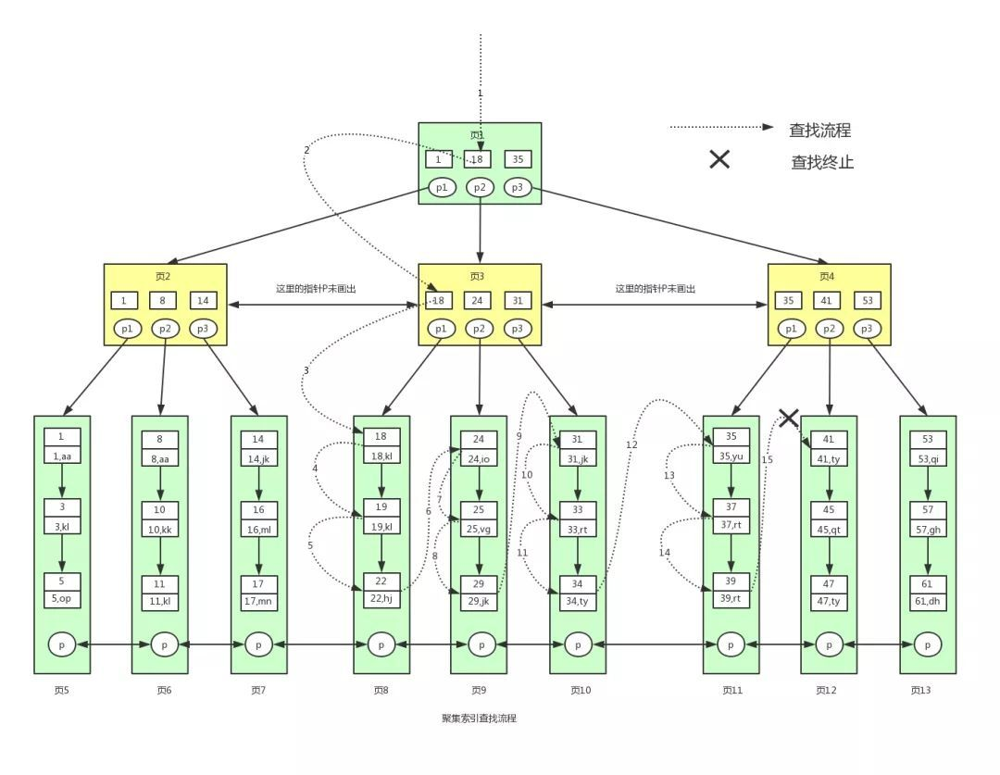

## 前言

索引是使用MySQL是一个很重要的知识点,正确的使用索引能够极大地提高MySQL的运行效率。那么关于索引,我产生了如下问题:

- 索引是什么
- 有哪些索引
- 索引的原理是什么
- 如何正确地使用索引

下面我将一一对问题进行解答。

## 1.索引是什么

索引是一种专门用于数据库的结构,其目的也非常明显,就是用来优化数据库的执行效率。首先我们来看看官方是如何描述索引的用处:
>Indexes are used to find rows with specific column values quickly.

简单来说,索引就是用来加速我们查找特定的行。不同类型的索引具体实现的原理不同,当然适用场景也不同。

## 2. 索引分类

根据不同的角度,索引的分类也不同。下面将从实现索引的数据结构、索引的物理存储结构、逻辑结构三个方面对索引进行分类。

### 2.1 数据结构角度

**(1). B树索引**
    在B树中,一个节点可以有多组key-value,如[下图所示](https://zsr.github.io/images/B-%E6%A0%91.jpg):
那么如果使用B树实现索引,每个节点中存在多组key-value,每组key-value中：key就是索引值,value就是对应的具体一行。所以使用B树索引时,查找某一特定行的效率是不定的,因为不一定每一次查找都查到了叶子节点。当然**B树的中序遍历是有序的**。

**(2). B+树索引**
B+树是B树的改进，B+树中每个节点不再存储多个key-value组合，而是只存储多组key，对应的data全部存储在最底层的叶子节点,并且叶子节点中的key都是有序的。如[下图所示](https://zsr.github.io/images/B+%E6%A0%91.jpg):
同时每层的节点又组成了一个双向链表,方便横向遍历。当然,**B+树横向遍历和中序遍历也都是有序的**。

**(3). hash索引**
hash索引与HashMap类似,key为每个索引值对应的hash值,而对应的value就是索引值对应的data。

#### 2.1.1 hash索引的适用场景

因为hash索引只是对单个key做hash，并且各个hash之间是无序的，所以hash索引比较适用精确查询，在进行范围查询、排序查询时效率非常差。当然只有**memory存储引擎显示地支持hash索引**,并且hash索引也没有进行持久化保存。

#### 2.1.2 MySQL为什么要适用B+树实现索引

在回答这个问题之前,还需要回答一个问题,为什么不用平衡二叉树、红黑树等查找效率高的结构来实现索引?

**为什么不采用AVL树或者RB树？**

在一般情况下，索引文件是非常大的，所以不可能一次性把表中所有记录加载进内存。所以使用基本都会产生IO操作。又因为IO操作代价较高,cpu一般会按照**局部性原理**按**页**读取。然而因为RB树是逻辑上有序，物理存储上可能相隔很远，逻辑上相邻的节点物理上根本不在同一页。所以如果使用AVL树或红黑树，查询节点时产生的IO操作必然非常多。尽管查询复杂度为logN，仍旧是非常不划算的。

**为什么不采用B树？**

为了解决AVL树IO操作代价高昂的原理，科学家们提出了B树，将相邻的值保存在同一个节点中(应该是在物理存储上的相邻)。这样就能顺利地利用上局部性原理。并且由于一个节点中储存了多个值，树的高度必然会比RB树、AVL树的高度低。

虽然B树在查询上的性能不如它们，但是由于规避了大量的IO操作，带来的收益已经远远超过了AVL树微不足道的查询性能。

但是使用B树做索引仍然存在一个问题,B+树就是为了解决这个问题。

**为什么采用B+树？**

虽然B树规避了大量的IO操作，但是由于B树不能满足对数据库做范围查询、扫库等操作的性能要求，提出了B+树。

因为B+树的节点不再储存data，只存储key。这样B+树的一个节点中可以B树的一个节点存储更多的key，所以B+树的高度会比B+树还低。并且B+树会将所有的叶子节点串联起来做成一个双向链表。因为叶子节点存储的是表中真正的数据。所以范围查询只需要找到目标范围的起点与终点，随后遍历双向链表就可以很方便的完成范围查找操作。扫库操作同理。

---
Extension:为什么需要限制表中每一行的大小？

因为如果一行的数据大小超过了系统一页的一半，那么一页(即B+树的一个节点)只能存储一条数据，可以想象完成扫库操作的代价是巨大的。所以最好一条数据的大小不要超过一个**innodb_page_size**的一半。

在大于5.7.6的版本中，innodb_page_size的大小**默认为16KB**。可以选择的大小包括4KB、8KB、16KB、32KB、64KB。

---

#### 2.1.3 B树索引和B+树索引有什么区别

基本上就有三点不同：

- B+树的IO操作代价较低
- B+树查询效率更稳定，因为每次查询都必然会查找到叶节点
- B+树能够更方便地完成扫库操作

#### 2.1.4 innodb和myiasm的索引有什么不同

虽有这二者都采用B+树作为索引的底层数据结构，但是innodb的叶子节点中，存储的是表中一行具体的数据；而myiasm的叶子节点中存储的是表中一行数据的地址(当然一个节点中会存储多组值)。

### 2.2 物理存储角度

**(1) 聚簇索引**

所谓的聚簇索引其实非常简单,索引的基本组成包括一组key-value。如果key是表中的主键，那么基于该主键构建的索引就是聚簇索引。

因为聚簇索引的value就是表中某一行正真的数据。所以使用聚簇索引查找某一行的过程如[下图所示](https://cloud.tencent.com/developer/article/1543335)：

就跟正常使用AVL树一样，如果我们想要查询id>=18 && id<40的数据，

（一）：那么我们首先加载页1，发现id=18的数据存于页3，那么将页3加载至内存。
（二）：发现id=18的数据存于页8，那么将页8加载至内存
（三）：从页8开始依次加载页8、页9、页10、页11的数据至内存

至此完成了一次范围查询。

**(2) 非聚簇索引**

与聚簇索引相反，如果使用非主键的列作为索引的key，那么基于该列构建的索引就是非聚簇索引。

使用非聚簇索引进行查询时会产生**回表**操作。因为每组key-value中的value不再对应于具体的某一行，而是对应该表的主键。查找到对应的主键后，再使用主键在表中进行查找。

### 2.3 逻辑角度

1.  唯一索引(UNIQUE)：所谓的唯一索引，就是列值必须唯一，但是允许NULL值

2. 主键索引(PRIMARY KEY)：一种特殊的**唯一索引**，要求索引列值唯一，并且不允许NULL值

3. 单列索引(INDEX)：普通的选取某一列作为索引，没有任何限制

4. 复合索引(multiple-column index)：选取多列作为索引，遵循最左匹配原则

5. 全文索引(FULLTEXT)：一般不使用，用于对全文进行搜索，可与基于B树实现的索引共同使用

## 3. 索引的使用技巧

所谓的最左前缀原则与复合索引的建立息息相关，单列索引比较简单，就是以选定的列作为key来建立索引。那么复合索引选取哪列作为key呢？

答案是建立符合索引时**排在第一位的列**，这里以复合索引(A、B、C)为例，建立B树索引时就是将`A`作为key。那么这里又会产生新的问题，那么复合索引中的`B`和`C`有什么用？以[下图为例](https://houbb.github.io/2019/01/02/combine-index):

图片中以(年龄、姓、名)三列建立复合索引，在叶子节点中，当年龄相同时，行按照姓排序，当姓再次相同时，按照名排序。当然我对于原作者这样的理解并没有完全认同，因为我还没找到具体的出处，但是这样理解我认为能够很好地解释最左前缀原则。

是时候介绍最左前缀原则了，如果建立的复合索引是(A,B,C)。那么在查询时只使用`B`、`C`作为条件，那么是无法使用这个复合索引的，因为索引是根据`A`建立的，都不以`A`作为条件，怎么使用到这颗B树？同理，查询时只要先查询`A`，那么就能使用这个复合索引，只是完全使用索引还是部分使用索引的区别。

最重要的一点，复合索引非叶子节点都是以第一列为key来决定树分支的走向，后面的索引列只会在叶子节点用到，**如果上面这样图片正确**的话。

### 3.1 复合索引使用技巧

有了上面复合索引的理论基础，在使用索引我们还需要使用以下七点：

+ 精准匹配时
在所有的索引列都是精准匹配时，虽然MySQL可以帮我们调整where语句中的条件顺序，以帮助我们能够使用索引，但是建议还是按照复合索引中列的顺序书写where语句中的条件
+ 匹配某列的前缀字符串时
如果条件语句中`%`**不出现**在待匹配字符串的**开头**，那么还是能够使用索引，当然还是要遵循最左前缀原则

## 参考文献

1.[为什么要对一行的大小进行限制](https://zhuanlan.zhihu.com/p/79987871)

2.[innodb为什么要采用B+树作为索引的底层数据结构](https://www.cnblogs.com/aspirant/p/9214485.html)

3.[B+树索引](https://zsr.github.io/2016/08/18/B+%E6%A0%91%E7%B4%A2%E5%BC%95/)