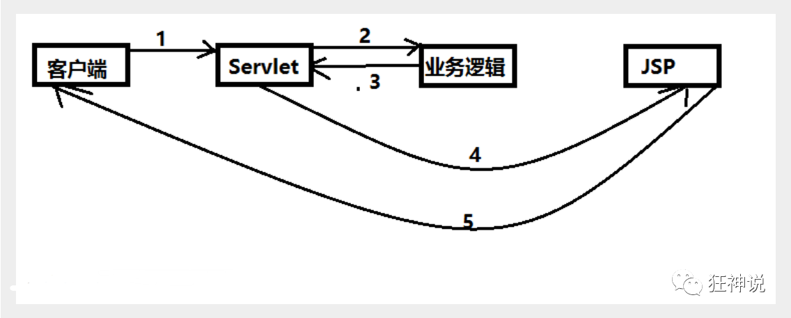
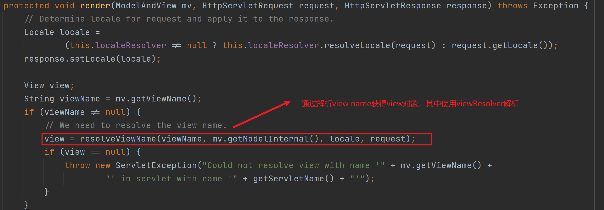
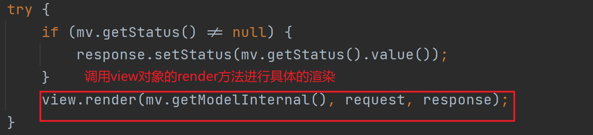
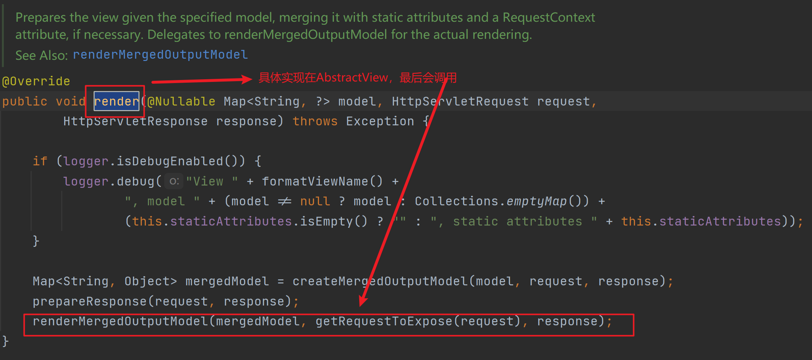
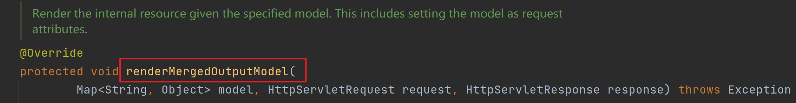
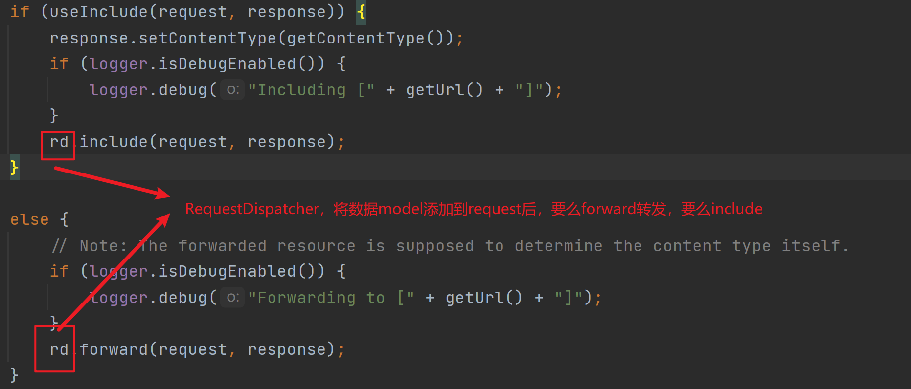

## 1. MVC是什么？

MVC是一种设计规范，并不是一种设计模式。该规范将一个web分割成3部分来处理：请求首先经过控制器Controller；经过业务处理得到数据模型Model；最后通过model渲染视图View并响应给客户端。

我们完全利用Servlet自己实现MVC规范，如下图所示：


基本流程为：

1. 用户发请求
2. Servlet（作为Controller）接收请求数据，解析数据模型model，并调用对应的业务逻辑方法
3. 业务处理完毕，返回更新后的model给Controller
4. Controller将model转向到JSP，由JSP来渲染页面
5. 响应给前端更新后的页面

当然，上述模型存在的严重缺陷[<sup>[1]</sup>](#refer-anchor-1)，包括：

1. 控制器出现的问题：随着web应用的复杂，**控制器的添加**一般需要将将映射配置在web文件中，可能不同的页面就要对应于一个Controller，难于维护；请求参数到模型的**封装麻烦**，需要根据具体的参数选择不同的业务逻辑；**视图的选择**严重依赖于Servlet API，因为最后获得数据数据后，最后会调用getDispatcherServlet将请求内部转发到tomcat内置的JspServlet进行处理，局限于JSP视图技术

2. 此处数据模型使用JavaBean，可能造成JavaBean组件类很庞大，一般现在项目都是采用三层架构（Service、DAO、Entity）而不采用JavaBean

3. 视图层出现的问题：被绑定在JSP，很难更换视图，比如Velocity、FreeMarker；比如我要支持Excel、PDF视图等等,同样严重依赖Servlet API。

## 2. SpringMVC解决了什么问题？

SpringMVC基于Servlet容器，主要解决的是Web层的编码问题以及视图层的显示问题。

1. 在WebMVC中，根据请求路径配置Controller是一件很难维护的事情，SpringMVC相当于提供了一个Controller分发器，能够自动地根据不同的请求路径选择不同的Controller。并且能够自动将请求参数参数封装成数据模型提供给业务层处理。

2. 视图的渲染并不由开发者实际控制，仅需要给SpringMVC提供视图的名字，具体的视图渲染交给SpringMVC提供的渲染器或者我们自己的渲染器解决，方便了视图技术的切换，不再严重依赖Servlet API。

在SpringMVC中，`DispatcherServlet`的角色就相当于Controller分发器，官方名称**前端控制器**，其工作流程图如下所示：


从图中可以看出`DispatcherServlet`、`HandlerMapping`、`HandlerAdapter`、`ViewResolver`是维持SpringMVC正常工作的核心组件。

按道理来说，使用HandlerMapping就足够了，为什么还要个适配器？经网上查阅，这是由于Spring的handler多样化，采用了适配器模式，具体原因仍待研究。`DispatcherServlet`工作流程如下：

1. HTTP请求：客户端向应用程序发起Http请求，tomcat将请求转到DispatchServlet(Spring提供的前端控制器 ) ，所有的请求通过DispatchServlet进行分发
2. 寻找处理器： 在DiispatchServlet在将请求分发给Controller之前， 通过HandlerMapping，根据请求url查找Handler。HandlerExecution表示具体的Handler,其主要作用是根据url查找控制器，HandlerExecution将解析后的信息传递给DispatcherServlet,如解析控制器映射等。

3. HandlerAdapter表示处理器适配器，其按照特定的规则去执行Handler，也就是Controller。将请求提交给Controller，Controller需要为并发用户处理，需要Controller实现Controller接口，必须保证是线程安全的
4. 调用业务处理服务：Controller会调用 业务处理 Service， 并返回ModelAndView，给到前端控制器，ModelAndView包含应用程序所需要的数据信息（Model）以及视图讯息（View）
5. 得到处理信息：DispatchServlet得到ModelAndView对象，会调用Viewresolver视图解析器。也就是找到ModelAndView所对应的视图，对Model数据进行渲染

---
**注意：** 实际的视图渲染工作是通过**具体的渲染器**完成的，而不是SpringMVC完成的，SpringMVC只负责找到视图并将渲染请求发送到渲染器。

例如在渲染jsp时，SpringMVC实际上是将数据model封装到Response对象，然后进行内部转发，随后tomcat调用内部Servlet来处理渲染工作。

---

## 3. SpringMVC基本使用

基于tomcat使用SpringMVC时，首先我们需要配置前端控制器`DispatcherServlet`，然后配置`DispatcherServlet`的三大件：handler映射器，handler适配器，视图解析器。最原始的方式就是使用Spring配置文件来硬编码这三项的配置。

第一步在web应用的`web.xml`文件配置`DispatcherServlet`,就像配置Servlet那样：

``` xml
<!--注册DispatcherServlet-->
    <servlet>
        <servlet-name>springmvc</servlet-name>
        <servlet-class>org.springframework.web.servlet.DispatcherServlet</servlet-class>
        <init-param>
            
            <!--配置SpringMVC使用的配置文件
            默认配置文件名称:[servlet name]-servlet.xml-->
            <param-name>contextConfigLocation</param-name>
            <param-value>classpath:springmvc-servlet.xml</param-value>
        </init-param>
        <!--设置servlet的启动级别-->
        <load-on-startup>1</load-on-startup>
    </servlet>
    
    <servlet-mapping>

        <servlet-name>springmvc</servlet-name>
        <!--将任意uri交给DispatcherServlet来处理-->
        <url-pattern>/</url-pattern>
    </servlet-mapping>

    <servlet-mapping>
        <servlet-name>default</servlet-name>
        <url-pattern>*.html</url-pattern>
    </servlet-mapping>
```

其中`DispatcherServlet`的`url pattern`配置会存在一点小问题，这个后面来讲。然后在SpringMVC需要使用的配置文件中配置三大件：

``` xml
<beans xmlns="http://www.springframework.org/schema/beans"
       xmlns:xsi="http://www.w3.org/2001/XMLSchema-instance"
       xsi:schemaLocation="http://www.springframework.org/schema/beans http://www.springframework.org/schema/beans/spring-beans.xsd">

    <!--配置HandlerMapping-->
    <bean class="org.springframework.web.servlet.handler.BeanNameUrlHandlerMapping"/>
    <!--配置HandlerAdapter-->
    <bean class="org.springframework.web.servlet.mvc.SimpleControllerHandlerAdapter"/>

    <!--视图解析器，DispatcherServlet将HandlerAdapter返回的ModelAndView传递给viewResolver

    viewResolver做了3件事：

    1. 提取MV对象中的数据
    2. 根据规定的前缀与后缀 拼接视图的名字并找到对应的视图，例如视图的名字是hello，最后拼接的是/WEB-INF/jsp/hello.jsp
    3. 使用数据对视图进行渲染

    最后DispatcherServlet根据视图的名字返回渲染好的视图
    -->
    <!--配置视图解析器-->
    <bean class="org.springframework.web.servlet.view.InternalResourceViewResolver" id="InternalResourceViewResolver">
        <!--前缀-->
        <property name="prefix" value="/WEB-INF/jsp/"/>
        <!--后缀-->
        <property name="suffix" value=".jsp"/>
    </bean>
    <bean id="/index" class="com.g.HelloController" />

</beans>
```

4. ## `DispatcherServlet`的url-pattern为什么要配置为`/`?

在配置`DispatcherServlet`时，建议将`url-pattern`配置成`/`而不是`*/`。这跟tomcat路径映射的优先级有关。在tomcat中，路径匹配分成四个模式[<sup>[2]</sup>](#refer-anchor-2)：

1. 以`/*`开头的前缀匹配
2. 以`*.`开头的后缀匹配
3. `/`表示默认匹配
4. 其他情况，表示精确匹配

这四种模式是有优先级的，我们从上到下以优先级的高低进行说明：

1. 规则1：精确匹配，

2. 规则2：前缀匹配，也就是url-pattern是`/*`

3. 规则3：扩展名匹配，也是就url-pattern是`*.`

4. 规则4：使用资源文件来处理servlet，

...

7. 规则7：使用默认的servlet，也就是url-pattern为`/`

也就是说，如果把`DispatcherServlet`的`url-pattern`配置为或者`/`或者`/*`，所有的请求都会由`DispatcherServlet`处理，那么为什么建立采用`/`？我对此进行了进行了调研与简单的实验。

实验准备：

Controller代码如下：

``` java
public class HelloController implements Controller {
    @Override
    public ModelAndView handleRequest(HttpServletRequest httpServletRequest, HttpServletResponse httpServletResponse) throws Exception {
        ModelAndView mv = new ModelAndView();
        mv.addObject("msg", "hello mvc");
        System.out.println("run in controller");
        mv.setViewName("index");
        return mv;
    }
}
```

视图解析器的配置文件如下：

``` xml
<bean class="org.springframework.web.servlet.view.InternalResourceViewResolver" id="InternalResourceViewResolver">
        <!--前缀-->
        <property name="prefix" value="/WEB-INF/jsp/"/>
        <!--后缀-->
        <property name="suffix" value=".jsp"/>
    </bean>
    <bean id="/index" class="com.g.HelloController" />
```

DispatcherServlet的路径映射配置如下：

``` xml
<servlet-mapping>

    <servlet-name>springmvc</servlet-name>
    <!--将任意uri交给DispatcherServlet来处理-->
    <url-pattern>/</url-pattern>
</servlet-mapping>
```

根据解析器后缀与路径映射的组合产生了四种情况：

1. 把路径映射设置为`/`，解析器后缀为`.jsp`时，能够处理请求
2. 把路径映射设置为`/`，解析器后缀为`.html`时，无法处理请求，错误原因：`noHandlerFound No mapping for GET /WEB-INF/jsp/index.html`
3. 把路径映射设置为`/*`，解析器后缀为`.jsp`时，无法处理请求，错误原因：`noHandlerFound No mapping for GET /WEB-INF/jsp/index.jsp`
4. 把路径映射设置为`/*`，解析器后缀为`.html`时，无法处理请求，错误原因：`noHandlerFound No mapping for GET /WEB-INF/jsp/index.html`

对于这四种情况，目前已知Controller都能够成功打印`run in controller`，说明`DispatcherServlet`能够成功分发请求，那么为什么只有第一种情况能够正确响应？

我怀疑是视图解析的过程出现了问题，[参考文章.[3]](#refer-anchor-3)也验证了我的猜想，但是文章只告诉了我DispatcherServlet会循环处理请求,并没有说它为什么会循环处理。我产生了一个猜想：既然能够循环处理，那岂不是又经过了一次tomcat处理路径映射？

带着这个问题，我去研究了`DispatcherServlet`的视图解析过程，尝试寻找解析过程的转发请求流程，根据[参考文章.[4]](#refer-anchor-4)，渲染的调用链如下：

>doService()--->doDispatch()--->processDispatchResult()--->render()

`processDispatcherResult`主要处理异常、请求状态及触发请求完成事件,最后把视图的渲染工作交给了render()。针对JSP提供的InternalResourceViewResolver与InternalResourceView。

render首先需要借助InternalResourceViewResolver通过view的名称解析并获得view对象，



然后调用view对象的render方法进行渲染，如下图所示：



这里的render具体实现在`AbstractView`，如下所示：


该方法最后又会调用`renderMergedOutputModel`，具体实现在`InternalResourcecView`，代码如下所示：


下面是进行重复请求的重点，首先将数据model存入request，通过RequestDispatcher调用forward或者include方法，如下所示：


了解了渲染流程之后，根据[参考文章.[3]](#refer-anchor-3)可知，tomcat的配置文件`conf/web.xml`配置了一个内部处理jsp的servlet，如下所示：

``` xml
<!-- The mappings for the JSP servlet -->
<servlet-mapping>
    <servlet-name>jsp</servlet-name>
    <url-pattern>*.jsp</url-pattern>
    <url-pattern>*.jspx</url-pattern>
</servlet-mapping>

<servlet>
    <servlet-name>jsp</servlet-name>
    <servlet-class>org.apache.jasper.servlet.JspServlet</servlet-class>
    <init-param>
        <param-name>fork</param-name>
        <param-value>false</param-value>
    </init-param>
    <init-param>
        <param-name>xpoweredBy</param-name>
        <param-value>false</param-value>
    </init-param>
    <load-on-startup>3</load-on-startup>
</servlet>
```

所以我们配置的视图后缀为`.jsp`时，url的名称为`/WEB-INF/jsp/index.jsp`，SpringMVC进行forward之后，tomcat又会进行一次url-pattern匹配，寻找具体的渲染器来渲染视图

1. 如果DispatcherServlet的pattern为`/`，内部jsp servlet的url-pattern`*.jsp`比`/`优先级高，这个请求会交给内部jsp的servlet来处理，不会导致DispatcherServlet循环处理
2. 如果DispatcherServlet的pattern为`/*`，内部servlet的url-pattern`*.jsp`比`/*`优先级低，这个请求会交给DispatcherServlet处理，而我们又没有配置该url的Controller进行处理，所以报错 no handler mapping

当视图后置配置为`.html`时，解析后的url全称为`/WEB-INF/jsp/index.html`，SpringMVC进行forward之后，tomcat又会进行一次url-pattern匹配：

1. 如果DispatcherServlet的pattern为`/`，内部jsp servlet的url-pattern无法匹配该url，所以最后还是交给DispatcherServlet处理，而我们又配置该url的Controller进行处理，所以报错 no handler mapping
2. 如果DispatcherServlet的pattern为`/*`，这个请求会直接交给DispatcherServlet处理，而我们又配置该url的Controller进行处理，所以报错 no handler mapping

那么我们难道只能把视图后缀配置为jsp吗？当然不是的，解决办法就是使用就是名为`default`的servlet，它的作用和jsp的大概一样，大家知道它是拿来配置静态资源的，却很少了解它怎么来的。这个Servlet也是存在与`conf/web.xml`，如下所示：

``` xml
<servlet>
    <servlet-name>default</servlet-name>
    <servlet-class>org.apache.catalina.servlets.DefaultServlet</servlet-class>
    <init-param>
        <param-name>debug</param-name>
        <param-value>0</param-value>
    </init-param>
    <init-param>
        <param-name>listings</param-name>
        <param-value>false</param-value>
    </init-param>
    <load-on-startup>1</load-on-startup>
</servlet>
    
<!-- The mapping for the default servlet -->
<servlet-mapping>
    <servlet-name>default</servlet-name>
    <url-pattern>/</url-pattern>
</servlet-mapping>
```

注意它的url-pattern为 **/**。，如果我们在自己的`web.xml`中配置`default`servlet，就会覆盖tomcat中的`default`，如下所示：

``` xml
<servlet-mapping>
    <servlet-name>default</servlet-name>
    <url-pattern>*.html</url-pattern>
</servlet-mapping>
```

这样当我们的url为`/WEB-INF/jsp/index.html`时：

1. 如果`DispatcherServlet`的url-pattern为`/`时，`*.html`的优先级比`/`高，tomcat就会把请求匹配到`default` servlet而不是`DispatcherServlet`
如果`DispatcherServlet`的url-pattern为`/*`时，`/*`的优先级比`*.html`高，tomcat就会把请求匹配到`DispatcherServlet` servlet而不是`default`，而我们又没有配置该url的Controller进行处理，所以报错 no handler mapping

这里又有一个问题出现了，为什么tomcat配置文件的`conf/web.xml`的`jsp`servlet在我们不配置的情况下能够默认生效，而`default`servlet却需要我们手动配置呢？答案是因为`default`servlet的url-pattern为`/`，我们配置的`DispatcherServet`的url-pattern也为`/`，这里我猜测是因为配置的`/`覆盖的了`default`servlet的`/`。

## 4. 总结

对于tomcat配置文件`conf/web.xml`中的servlet，是供**所有**已经部署的webapp使用的，如果我们在自己的配置文件中覆盖了tomcat的同名servlet或者同名url-pattern，则以我们自己编写的`web.xml`为准。

## 参考文章

<div id="refer-anchor-1"></div>

1. [webMVC模型存在的问题](https://blog.csdn.net/u012881904/article/details/51291387)

2. [Servlet容器Tomcat中web.xml中url-pattern的配置详解[附带源码分析]](https://www.cnblogs.com/fangjian0423/p/servletcontainer-tomcat-urlpattern.html)

3. [我是如何一步步解决问题 让Spring MVC返回HTML类型的视图](https://ddnd.cn/2018/12/24/springmvc-view-webxml/)

4. [SpringMVC DispatcherServlet-------视图渲染过程](https://www.cnblogs.com/wdpnodecodes/p/7820295.html)