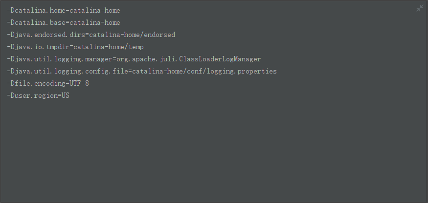
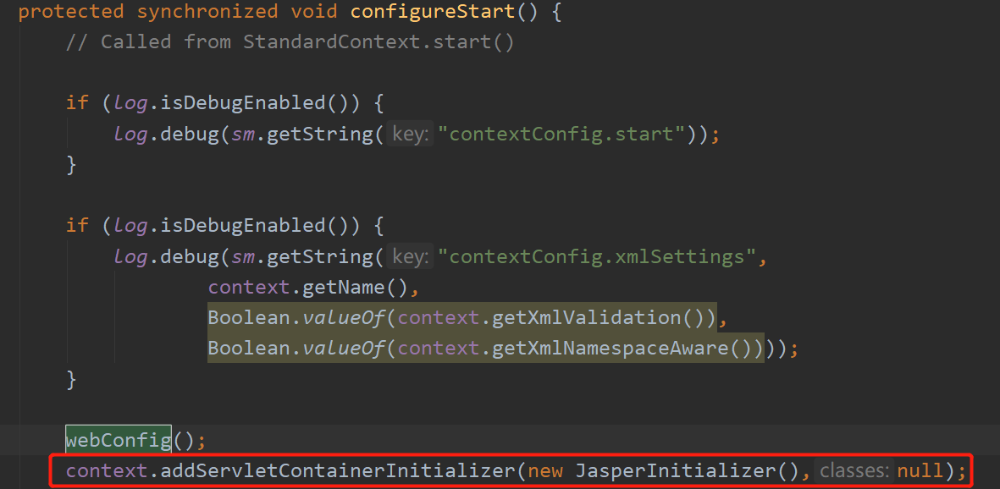

重点是配置好`CATALINA_HOME`，该目录用于存放tomcat的配置信息。

我们要将源码作为一个module放入整个项目中，即整个项目的结构如下所示：

- \<project path>
    - \<source code path>
        - (source code)pom.xml
    - <CATALINA_HOME>
    - (project)pom.xml

所以我们不仅要为整个项目配置`pom.xml`，同时也要为源码配置`pom.xml`。

项目的配置文件如下所示：

``` xml
<?xml version="1.0" encoding="UTF-8"?>    
<project xmlns="http://maven.apache.org/POM/4.0.0" xmlns:xsi="http://www.w3.org/2001/XMLSchema-instance"    
         xsi:schemaLocation="http://maven.apache.org/POM/4.0.0 http://maven.apache.org/maven-v4_0_0.xsd">    
    
    <modelVersion>4.0.0</modelVersion>    
    <groupId>gxf</groupId>    
    <artifactId>apache-tomcat-8</artifactId>    
    <name>apache-tomcat-8-source</name>    
    <version>1.0</version>    
    <packaging>pom</packaging>    
    
    <modules>    
        <module>apache-tomcat-8.5.23-src</module>    
    </modules>    
</project>
```

源码module的配置文件如下所示：

``` xml
<?xml version="1.0" encoding="UTF-8"?>    
<project xmlns="http://maven.apache.org/POM/4.0.0"    
         xmlns:xsi="http://www.w3.org/2001/XMLSchema-instance"    
         xsi:schemaLocation="http://maven.apache.org/POM/4.0.0 http://maven.apache.org/xsd/maven-4.0.0.xsd">    
    
    
    <modelVersion>4.0.0</modelVersion>    
    <groupId>org.apache.tomcat</groupId>    
    <artifactId>Tomcat8.0</artifactId>    
    <name>Tomcat8.0</name>    
    <version>8.0</version>    
    
    <build>    
        <finalName>Tomcat8.0</finalName>    
        <sourceDirectory>java</sourceDirectory>    
        <testSourceDirectory>test</testSourceDirectory>    
        <resources>    
            <resource>    
                <directory>java</directory>    
            </resource>    
        </resources>    
        <testResources>    
            <testResource>    
                <directory>test</directory>    
            </testResource>    
        </testResources>    
        <plugins>    
            <plugin>    
                <groupId>org.apache.maven.plugins</groupId>    
                <artifactId>maven-compiler-plugin</artifactId>    
                <version>2.0.2</version>    
    
                <configuration>    
                    <encoding>UTF-8</encoding>    
                    <source>1.8</source>    
                    <target>1.8</target>    
                </configuration>    
            </plugin>    
        </plugins>    
    </build>    
    
    <dependencies>  
        <dependency>  
            <groupId>org.easymock</groupId>  
            <artifactId>easymock</artifactId>  
            <version>3.5</version>  
            <scope>test</scope>  
        </dependency>  
  
        <dependency>    
            <groupId>junit</groupId>    
            <artifactId>junit</artifactId>    
            <version>4.12</version>  
            <scope>test</scope>    
        </dependency>    
        <dependency>    
            <groupId>ant</groupId>    
            <artifactId>ant</artifactId>    
            <version>1.7.0</version>    
        </dependency>    
        <dependency>    
            <groupId>wsdl4j</groupId>    
            <artifactId>wsdl4j</artifactId>    
            <version>1.6.2</version>    
        </dependency>    
        <dependency>    
            <groupId>javax.xml</groupId>    
            <artifactId>jaxrpc</artifactId>    
            <version>1.1</version>    
        </dependency>    
        <dependency>    
            <groupId>org.eclipse.jdt.core.compiler</groupId>    
            <artifactId>ecj</artifactId>    
            <version>4.6.1</version>  
        </dependency>    
    </dependencies>    
    
</project>
```

最后配置 VM options：

>-Dcatalina.home=catalina-home -Dcatalina.base=catalina-home
-Djava.endorsed.dirs=catalina-home/endorsed
-Djava.io.tmpdir=catalina-home/temp
-Djava.util.logging.manager=org.apache.juli.ClassLoaderLogManager
-Djava.util.logging.config.file=catalina-home/conf/logging.properties

处理乱码问题：

暴力解决，直接将所在区域设置为US，即：

>-DUser.region=US

所以最后的虚拟机配置如下所示：


处理JSP解析问题：

在`org.apache.catalina.startup.ContextConfig.configStart`手动初始化jsp，添加如下代码：

>context.addServletContainerInitializer(new JasperInitializer(),null)

添加位置如下所示：


## 参考文献

1. [基于IntelliJ IDEA环境】Tomcat8源码的调试和项目部署](https://gongxufan.github.io/2017/10/20/tomcat-source-debug/)

2. [编译Tomcat9源码及tomcat乱码问题解决](https://www.cnblogs.com/davidwang456/p/11224923.html)

3. [🐈🐈🐈Tomcat源码分析、理解Tomcat的架构及如何优化](https://github.com/gqzdev/tomcat-start)

4. [Java IntelLiJ IDEA中Tomcat控制台乱码解决方法](https://maven.apache.org/guides/introduction/introduction-to-dependency-mechanism.html)