## 前言

这里将`ArrayQueue`与`ArrayDeque`放在一起分析是因为二者都是基于数组实现的队列。

## 0x0 小试牛刀-ArrayQueue源码分析

在进入主题之前我们思考一个问题,如果我们用数组实现一个传统的FIFO队列,是有可能出现数组未满,但是队列已满的假象的。这是因为我们在不断弹出元素的同时,队列的头指针就会不断朝着队列尾部的方向移动,那么头指针之前的空间就被浪费了,而采用链表实现的队列就不会出现这种情况。

为了解决上述的问题,我们采用循环数组的方式实现单项队列。所谓的循环数组,就是逻辑上数组的头和尾是连接在一起的,我们维护一个头指针和一个尾指针。那么为了我们能够知道什么时候数组被填充满了,我们需要使用额外的一个元素空间来标记队列是否真的满了。如果队列真的满了,那么头指针和尾指针就会重合。否则头指针和尾指针之间至少会有一个元素的空闲空间大小,如下图所示:



接下来进入主题,简要分析以下它的源码。

下面是`ArrayQueue`的构造函数:

``` java
public class ArrayQueue<T> extends AbstractList<T> {
    private int capacity;
    private T[] queue;
    private int head;
    private int tail;

    public ArrayQueue(int capacity) {
        this.capacity = capacity + 1;//把额外用作标记的空间加上
        this.queue = newArray(capacity + 1);
        this.head = 0;
        this.tail = 0;
    }
    ...
}
```

可以看到,`ArrayQueue`是通过数组`queue`保存内容的。其中维持了两个指针`head`和`tail`。capacity表示队列的容量。在构造函数中,可以看到会对`capacity`加1,这是为什么?还记得上面说过的循环队列需要使用的额外的一个元素空间来标记队列是否满了?没错,这个加1就是把那个额外空间加上了。

接下来看看它的`add`函数。

``` java
public boolean add(T o) {
    queue[tail] = o;
    int newtail = (tail + 1) % capacity;
    if (newtail == head)
        throw new IndexOutOfBoundsException("Queue full");
    tail = newtail;
    return true; // we did add something
}
```
`ArrayQueue`因为是单项队列,所以只能从队尾进元素,然后tail指针取模向后移动一个。很可惜,`add`方法并不会自动扩容,在队列满后,会抛出指针异常,但是我们可以手动调用`resize()`方法进行扩容,很麻烦。所以没人用是正常的。接下来看看`resize()`方法。

``` java
public void resize(int newcapacity) {
    //获取当前队列内的元素个数
    int size = size();
    if (newcapacity < size)
        throw new IndexOutOfBoundsException("Resizing would lose data");
    //仍然需要把标记空间加上
    newcapacity++;
    if (newcapacity == this.capacity)
        return;
    T[] newqueue = newArray(newcapacity);
    //将原始队列中的元素复制到新队列中,从新队列的0位置开始复制
    for (int i = 0; i < size; i++)
        newqueue[i] = get(i);
    this.capacity = newcapacity;
    this.queue = newqueue;
    this.head = 0;
    this.tail = size;
}

public int size() {
    // Can't use % here because it's not mod: -3 % 2 is -1, not +1.
    //在java中负数取模的结果符号与被取模的数符号相同
    int diff = tail - head;
    if (diff < 0)
        diff += capacity;
    return diff;
}

public T get(int i) {
    int size = size();
    if (i < 0 || i >= size) {
        final String msg = "Index " + i + ", queue size " + size;
        throw new IndexOutOfBoundsException(msg);
    }
    //加上偏移量head,就能准确定位老队列中的元素了
    int index = (head + i) % capacity;
    return queue[index];
}
```
单项队列`ArrayQueue`的源码还是比较简单的,下面才是这篇文章的核心。

## 0x1  主菜-ArrayDeque源码分析

### 0x1-1 重要字段与构造函数

双向队列`ArraDeque`底层也是数组实现的,当然与`ArrayQueue`一样,采用循环数组。下面是`ArrayDeque`的字段与构造方法。

``` java
public class ArrayDeque<E> extends AbstractCollection<E>
                           implements Deque<E>, Cloneable, Serializable
{

     //底层采用object类型数组保存元素,双向队列的容量就是该数组的长度,并且总是2的倍数
     //数组永远都不会填满,并且没有用于储存队列元素的数组元素都必定为null
    transient Object[] elements; // non-private to simplify nested class access

    //双端队列的头指针,只有队列中没有存储元素时head才会与tail相遇
    transient int head;

    //双端队列的尾指针,指向下一个元素的存储位置
    transient int tail;

    //默认最小容量为8
    private static final int MIN_INITIAL_CAPACITY = 8;

    //无参构造方法
    //队列为空,那么就将队列扩充为16
    public ArrayDeque() {
        elements = new Object[16];
    }

    //指定初始容量的构造方法,但是都会把容量升级为最小的2的倍数
    //allocateElements用于升级容量至最小的2的倍数,这将在后面详解
    public ArrayDeque(int numElements) {
        allocateElements(numElements);
    }

    //使用一个集合初始化队列,但是还是首先会把容量扩充至最最近的2的倍数,
    //然后再将原集合中的左右元素拷贝至队列中
    public ArrayDeque(Collection<? extends E> c) {
        allocateElements(c.size());
        addAll(c);
    }

```

可以看到,最重要的就是扩充容量函数`allocateElements`,这个函数比较复杂,有点难理解。

``` java

    //该函数内部调用了calculateSize计算新的容量(计算最近的2的倍数)
    //然后分配数组
    private void allocateElements(int numElements) {
        elements = new Object[calculateSize(numElements)];
    }


    private static int calculateSize(int numElements) {
        int initialCapacity = MIN_INITIAL_CAPACITY;
        // Find the best power of two to hold elements.
        // Tests "<=" because arrays aren't kept full即可.
        //如果目标容量还小于规定的最小容量8,那么直接返回即可
        if (numElements >= initialCapacity) {
            initialCapacity = numElements;
            initialCapacity |= (initialCapacity >>>  1);
            initialCapacity |= (initialCapacity >>>  2);
            initialCapacity |= (initialCapacity >>>  4);
            initialCapacity |= (initialCapacity >>>  8);
            initialCapacity |= (initialCapacity >>> 16);
            initialCapacity++;

            if (initialCapacity < 0)   // Too many elements, must back off
                initialCapacity >>>= 1;// Good luck allocating 2 ^ 30 elements
        }
        return initialCapacity;
    }
```

可以看到`calculateSize()`的代码很魔性,很有必要好好解释一哈。以下面32bit的数(作为初始容量newElements)为例:

> 0000 0010 1101 0011 0000 0000 0000 0000

**目标数据**为离newElements最近的2的整数:

> 0000 0100 0000 0000 0000 0000 0000 0000

操作步骤如下:

1. 先执行`initialCapacity |= (initialCapacity >>>  1)`,即将`initialCapacity`无符号向右移动1位:

> 0000 0001 0110 1001 1000 0000 0000 0000

然后与自身进行或操作更新`initialCapacity`,这样就保证了左边第1位和第2位都为1。

> 0000 0011 1111 1011 1000 0000 0000 0000

2. 再执行`initialCapacity |= (initialCapacity >>>  2)`,将`initialCapacity`无符号向右移动2位:

> 0000 0000 1111 1110 1110 0000 0000 0000

然后与自身进行或操作更新`initialCapacity`,这样就保证了从左侧第一个1开始,后四位都是1。

> 0000 0011 1111 1111 1110 0000 0000 0000

3. 执行`initialCapacity |= (initialCapacity >>>  4)`,将`initialCapacity`无符号向右移动4位:

> 0000 0000 0011 1111 1111 1110 0000 0000

然后与自身进行或操作更新`initialCapacity`,这样就保证了从左侧第一个1开始,后八位都是1。

> 0000 0011 1111 1111 1111 1110 0000 0000

4. 执行`initialCapacity |= (initialCapacity >>>  8)`,将`initialCapacity`无符号向右移动8位:

> 0000 0000 0000 0011 1111 1111 1111 1110

然后与自身进行或操作更新`initialCapacity`,这样就保证了从左侧第一个1开始,后十六位都是1。

> 0000 0011 1111 1111 1111 1111 1111 1110

5. 执行`initialCapacity |= (initialCapacity >>>  16)`,将`initialCapacity`无符号向右移动16位:

> 0000 0000 0000 0000 0000 0011 1111 1111 

然后与自身进行或操作更新`initialCapacity`,这样就保证了从左侧第一个1开始,后三十二位都是1(当然最右边会有些bit丢失,但是这并没有关系。)

> 0000 0011 1111 1111 1111 1111 1111 1111

6.最后将自身加1,就得到了目标数据:

> 0000 0100 0000 0000 0000 0000 0000 0000

是离`0000 0010 1101 0011 0000 0000 0000 0000`最近的2的整数倍容量。我只能说,这段代码是真的妙,太妙了。

然后如果传进来的目标容易第31为1,那么求得的新容量第32位就会变为1,变成了负数2^31,所以还需要处理以下,如果新容量发生溢出,那么就将2\^32向右移一位,返回
2\^30,这已经是`ArrayDeque`的极限容量。

### 0x1-2 ArrayDeque的增删查

对于`ArrayDeque`的增删查方法也值得我们关注,下面我们先来看看add方法。

#### 增

`ArrayDeque`是直接继承`AbstractCllecetion`的,所以并没由在add中调用offer类方法。相反,在add类中调用了offer类。在`ArrayDeque`中,add类和offer类并没有差别。因为`ArrayDeque`会自动扩容,永远也不会出现插入失败的情况。这里就以add类的方法为例,代码如下所示:

``` java
public void addFirst(E e) {
        if (e == null)
            throw new NullPointerException();
        elements[head = (head - 1) & (elements.length - 1)] = e;
        if (head == tail)
            doubleCapacity();
    }

    
    public void addLast(E e) {
        if (e == null)
            throw new NullPointerException();
        elements[tail] = e;
        if ( (tail = (tail + 1) & (elements.length - 1)) == head)
            doubleCapacity();
    }


    public boolean offerFirst(E e) {
        addFirst(e);
        return true;
    }

    public boolean offerLast(E e) {
        addLast(e);
        return true;
    }
```
`addFirst()`首先会判断元素是否为`null`,`ArrayDeque`中是允许存在null元素的,但是不允许我们存储`null`。注意下面真正进行存储的代码:

> elements[head = (head - 1) & (elements.length - 1)] = e;

这里首先会将head减1,为什么要减呢?因为我们是采用循环数组存储的,如果当前head指向0,调用`addFirst`是将元素往头部存的,自然需要将head往前移动。指针移动如下图所示:



但是减1有可能会将head变为负数。所以需要与`elements.length - 1`进行与操作。这里举个例子好理解:

以32位计算机为例,如果当前我们的队列容量为`128`,也就是`1 0000 0000`，减1后会变为`1111 1111`:

- 如果head移动后为负数:假设为-1,也就是`1000,...,000 0000`(最高位符号位为1,中间有许多1就不写了),与`1111 1111`相与,那么结果就还是127,刚好是队列中的最后一个位置。

- 如果head减1后仍为正数:那么就是对head取模,结果仍然是head,非常巧妙。

最后,如果再添加新元素完成后,队列容量已满(头指针head与尾指针tail相遇),那么就调用`doubleCapacity`使容量翻倍。

``` java
private void doubleCapacity() {
    assert head == tail;
    int p = head;
    int n = elements.length;
    //r就是尾指针到数组最后一个位置之间的元素数量
    int r = n - p; // number of elements to the right of p
    int newCapacity = n << 1;
    //容量无法扩充,已到达2^31,抛出状态异常
    if (newCapacity < 0)
        throw new IllegalStateException("Sorry, deque too big");
    //否则就申请新数组并将元素拷贝至此
    Object[] a = new Object[newCapacity];
    
    System.arraycopy(elements, p, a, 0, r);
    //最后一位为长度
    System.arraycopy(elements, 0, a, r, p);
    elements = a;
    head = 0;
    tail = n;
}
```

这里仍然以下图为例(队列容量为8):



首先从新队列的头开始复制r个元素,然后接着再r后面复制p个元素,完成扩容。

### 删

从下面的代码可以得知:remove系列在底层是调用了poll系列的方法,所以还是直接调用remove系列方法方便。调用poll系列是如果队列为空时则返回null,否则返回弹出的元素。没有什么特别的。查头尾元素也非常普通,这里就不单列出来了。

``` java

    public E removeFirst() {
        E x = pollFirst();
        if (x == null)
            throw new NoSuchElementException();
        return x;
    }

    public E removeLast() {
        E x = pollLast();
        if (x == null)
            throw new NoSuchElementException();
        return x;
    }

    public E pollFirst() {
        int h = head;
        @SuppressWarnings("unchecked")
        E result = (E) elements[h];
        // Element is null if deque empty
        //如果队列为空,那么还是可以查到null的
        if (result == null)
            return null;
        elements[h] = null;     // Must null out slot
        head = (h + 1) & (elements.length - 1);
        return result;
    }

    public E pollLast() {
        int t = (tail - 1) & (elements.length - 1);
        @SuppressWarnings("unchecked")
        E result = (E) elements[t];
        if (result == null)
            return null;
        elements[t] = null;
        tail = t;
        return result;
    }

```

### occurrence方法

occurrence系列有两个方法,`removeFirstOccurrence`是删除第一次出现的指定元素,对应的`removeLastOccurrence`就是删除最后一次出现的元素。具体的删除操作由`delete`完成,为了在删除时移动最少的元素,所以`delete`还是有点小复杂。

``` java

    public boolean removeFirstOccurrence(Object o) {
        if (o == null)
            return false;
        int mask = elements.length - 1;
        int i = head;
        Object x;
        while ( (x = elements[i]) != null) {
            if (o.equals(x)) {
                delete(i);
                return true;
            }
            //从head开始,往tail方向遍历
            i = (i + 1) & mask;
        }
        return false;
    }


    public boolean removeLastOccurrence(Object o) {
        if (o == null)
            return false;
        int mask = elements.length - 1;
        int i = (tail - 1) & mask;
        Object x;
        while ( (x = elements[i]) != null) {
            if (o.equals(x)) {
                delete(i);
                return true;
            }
            //从tail开始,往head方向遍历
            i = (i - 1) & mask;
        }
        return false;
    }
```

下面是delete的源码,为了实现最小次数的移动还真是费心了,具体的解释见注释吧。其中检查函数的作用就是检查还能不能在原数组中进行了移动数据的操作。

``` java

    //如果是移动i后面的那部分数据,就返回true
    private boolean delete(int i) {
        checkInvariants();
        final Object[] elements = this.elements;
        final int mask = elements.length - 1;
        final int h = head;
        final int t = tail;
        final int front = (i - h) & mask;
        final int back  = (t - i) & mask;

        // Invariant: head <= i < tail mod circularity
        if (front >= ((t - h) & mask))
            throw new ConcurrentModificationException();

        //下面这么复杂完全是为了减少移动次数
        //如果前半段少于后半段数据,那么就移动前半段
        if (front < back) {
            //此时h和i之间并没有跨越下标0
            if (h <= i) {
                System.arraycopy(elements, h, elements, h + 1, front);
            } else { // Wrap around
            //h和i之间跨域了下标0
                //先将下标0~i之间的元素从0~i-1移动至1~i
                System.arraycopy(elements, 0, elements, 1, i);
                //把数组中的最后一个元素拷贝至数组下标0位置
                elements[0] = elements[mask];
                //把数组中h~mask-1移动至h+1~mask
                System.arraycopy(elements, h, elements, h + 1, mask - h);
            }
            elements[h] = null;
            //更新head
            head = (h + 1) & mask;
            return false;
        } else {
            //后半段数据少于前半段,那么就移动后半段,并返回true
            if (i < t) { // Copy the null tail as well
                System.arraycopy(elements, i + 1, elements, i, back);
                tail = t - 1;
            } else { // Wrap around
                System.arraycopy(elements, i + 1, elements, i, mask - i);
                elements[mask] = elements[0];
                System.arraycopy(elements, 1, elements, 0, t);
                tail = (t - 1) & mask;
            }
            return true;
        }
    }

    //就是检查有没有移动数据的空间
    private void checkInvariants() {
        assert elements[tail] == null;
        assert head == tail ? elements[head] == null :
            (elements[head] != null &&
             elements[(tail - 1) & (elements.length - 1)] != null);
        assert elements[(head - 1) & (elements.length - 1)] == null;
    }
```
## 0x3 课后总结

ArrayDeque采用数组实现循环队列,容量始终是2次幂。在单线程中:

- 作为栈,比`Stack`快,因为不需要保证线程安全
- 作为队列比LinkedList快,因为不需要构造节点

不过一般没啥人用吧,就当为分析LinkedList提前开路了。


## 参考文献

https://www.jianshu.com/p/1c1c3f24762e


