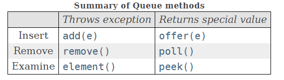

## 0x1 基本概念

`Queue`接口继承自超级接口`Collection`,其不仅实现了`Coolection`中的基本方法,而且额外增加了适用于队列的增、删、差方法。并且对应这三种操作,Queue提供了两套方法,一套在操作失败时抛出异常,另一套在操作失败时返回`null`,不过在文档中说到:
>The latter form of the insert operation is designed specifically for use with capacity-restricted Queue implementations

说是后者是专门为容量有限的队列而设计的,why?这点不是很懂。

更新:2020-07-23 19:12:32

现在懂了,如果对于**容量有限**的队列,比如`ArrayBlockingQueue`,它是继承自抽象类`AbstractQueue`,如果调用其`offer`方法(在`AbstractQueue`中实现),添加元素失败后只会返回true,否则返回false。而调用`add`的话,如果插入失败,就会抛出状态异常。所以说,offer类方法可用于检查队列是否已满,比add类方法优秀点。但是对于`LinkedList`、`ArrayQueue`等带自动扩容属性的队列来说,二者效果差不多,不过offer类可以返回操作是否成功的信息。还是推荐使用offer类。

两组方法如下图所示:



## 0x2 抽象类AbstractQueue

当然,跟`Collection`接口差不多,`Queue`也有一个抽象类用于实现一般的方法:

``` java "AbstractQueue"

public abstract class AbstractQueue<E>
    extends AbstractCollection<E>
    implements Queue<E> {
    ...
    }
```

可以看到,因为`Queue`本身就继承自`Clooection`,所以`AbstractQueue`的实现继承自`AbstractClloection`没有任何异议吧。当然为了实现了Queue的特有方法,也实现了接口`Queue`。下面简单分析一下`offer()`方法。

``` java
public boolean add(E e) {
    if (offer(e))
        return true;
    else
        throw new IllegalStateException("Queue full");
}
```
add在内部调用了offer,所以用谁不用我多说了吧。不过一开始我看到写法还是一愣,这`offer()`方法的实现在哪啊?

后来一想,抽象类不一定要实现嘛,把这个方法留到子类去实现也行奥。


## 0x3 Deque接口

Deque就是`double ended queue`,也就是所谓的双端队列,什么是双端队列我就不说了,来看看其规定的抽象方法:

``` java "Deque"

public interface Deque<E> extends Queue<E> {
    
    //双端队列方法
    void addFirst(E e);
  
    void addLast(E e);

    boolean offerFirst(E e);

    boolean offerLast(E e);

    E removeFirst();

    E removeLast();

    E pollFirst();
 
    E pollLast();
 
    E getFirst();

    E getLast();

    E peekFirst();
 
    E peekLast();

    boolean removeFirstOccurrence(Object o);

    boolean removeLastOccurrence(Object o);

    // 单向队列方法

    boolean add(E e);

    boolean offer(E e);

    E remove();

    E poll();

    E element();

    E peek();


    //栈方法
 
    void push(E e);

    E pop();

    //重写Collection的部分方法
 
    boolean remove(Object o);

    boolean contains(Object o);

    public int size();

    Iterator<E> iterator();

    Iterator<E> descendingIterator();

}

```