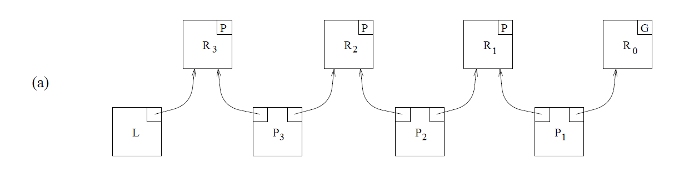

## 预备知识

### #1. 内存架构

比较常见的内存架构有两种：SMP (Symmetric MultiProcessing) 与 NUMA (Non-uniform memory access)。

对称多处理是一种包括软硬件的多核计算机架构，会有两个或以上的相同的核心共享一块主存，这些核心在操作系统中地位相同，可以访问所有 I/O 设备。它的优点是内存等一些组件在核心之间是共享的，一致性可以保证，但也正因为内存一致性和共享对象在扩展性上就受到限制了 。

### #2. 自旋锁与互斥锁

互斥锁就是我们常用的`synchronized`，当产生竞争时，未抢到锁的线程会被阻塞，并且是非公平的，适合临界区长的，因为线程的切换代价不可忽略。而自旋锁在产生竞争时，不会阻塞线程，只会进行忙等待（就是使用死循环无限等待，也就是所谓的自旋），适合临界区较短的，因为自旋时间太长就会一直占用CPU。

### #3. 队列锁

队列锁是一种自旋锁，可以分为公平与非公平的。在公平队列锁中，比较常用有CLH队列锁和MCS队列锁。这二者的区别如下：

- CLH基于隐式的链表，而MCS基于显示的链表
- CLH是在前趋结点的locked域上自旋等待，而MSC是在自己的结点的lock域上自旋等待。正因为如此，它解决了CLH在NUMA系统架构中获取locked域状态内存过远的问题（locked域可以理解为当前节点需要观察的地方，当前节点能不能获得锁就看这个locked域）。
- CLH实现比MCS简单

## CLH队列锁

CLH队列锁是一种公平锁，能够严格按照FIFO分配锁的使用权，其队列基于链表的思想实现。CLH队列由三种基本元素组成：

- 请求锁的线程(process)
- 请求状态(request)：包括PENDING和GRANTED两种状态，由请求锁的线程维护
- 锁(lock)：初始化为GRANTED状态，维护tail指针，指向最后一个请求锁的线程的请求状态

每个请求锁的线程还需要维护一个watch域，watch域用来观察前趋节点的锁使用状态。如下所示：


如果此时P1请求锁，那么lock的tail指针将指向P1的请求状态，但是p1能不能获得锁得看R0，如下所示：


如果此时，P1在使用锁的时候，P2和P3按顺序请求锁，那么P2和P3就要依次进入请求队列，如下所示：



每一个线程的watch域都指向前一个线程的请求状态，只有前趋线程释放锁了，当前线程才能获取使用权，这也就保证FIFO，公平的获取锁。

那么请求状态和watch域是如何保存在各自的线程中的呢？在Java中，可以使用ThreadLocal保存属于每个线程的私有变量，非常巧妙。具体实现分为三个部分：request、lock和CLH。

---

**A. request的实现部分：**
``` java

//两个状态
enum State {
    PENDING,

    GRANTED
}

public class Request {

    private State state;    
    
    Request(State state){
        this.state=state;
    }
}
```
---
**B. lock实现部分：**
lock只需要维护一个tail指针，指向最后一个请求状态。但是tail指针的交换必须是原子的，否则在多线程环境下不能保证每个线程的请求都能顺利进入队列。所以tail的类型为`AtomicReference<Request>`：

``` java
public class Lock {
    private AtomicReference<Request> tail;
    Lock(){
        tail=new AtomicReference<>(new Request(State.GRANTED,null));
    }

    public AtomicReference<Request> getTail() {
        return tail;
    }

    public void setTail(AtomicReference<Request> tail) {
        this.tail = tail;
    }
}
```

---
**C. CLH实现部分：**

CLH提供了加锁`lock`与解锁`unlock`的接口。并且内部维护了锁lock、请求状态Request和观察域watch。lock由全体线程共享，而Request和watch使用ThreadLocal保存，不会造成数据污染。达到了为每个线程维护一个请求状态和观察域的要求。

``` java
public class CLH {
    private Lock lock;
    private ThreadLocal<Request> myReq;
    private ThreadLocal<Request> watch;
    public CLH(){
        lock=new Lock();
        //withInitial的作用就是重写ThreadLocal的初始化函数，在没set就get时自动初始化
        myReq=ThreadLocal.withInitial(()->(new Request(State.PENDING,null)));
        watch=new ThreadLocal<>();
    }
    public void lock(){
        //设置当前线程请求状态
        myReq.get().setState(State.PENDING);
        //入队操作
        Request preTail=lock.getTail().getAndSet(myReq.get());
        //设置watch域
        watch.set(preTail);
    }

    public void unlock(){
        myReq.get().setState(State.GRANTED);
        //这一步有必要吗？防止内存泄露？不是很懂
        myReq.remove();
        
        /**********************************/
        //将当前线程的Request对象设为watch对象
        //因为后面有可能当前线程可能会再次请求锁，这样不会浪费资源重新设置为Request对象
        myReq.set(watch.get());
        /********************************/

        watch.remove();
    }
}
```

---

在CLH的解锁代码中，我们需要注意一个非常致命的点，就是线程P1在释放锁，其请求状态Request的设置。为什么要把请求状态域设置为前一个线程的请求状态R0呢？

因为如果不进行更改，可能会造成死锁的出现。想象如下一个场景：

P1在释放锁后，其请求状态为R1。这个R1被后续线程P2观察着。如果在P2获得锁之前，P1再次请求锁。这就造成P1观察着线程P2的请求状态R2，而P2又在观察着P1的请求状态R1,死锁出现。示意图如下：


那么为什么要设置成R0呢？完全可以新生成一个请求状态啊，但是没必要啊，原来有就接着用呗。


## 参考文献

1. [透彻理解CLH 队列锁原理及其Java实现](https://blog.csdn.net/firebolt100/article/details/82662102)

2. [Building FIFO and Priority-Queuing Spin Locks from Atomic Swap](https://pan.baidu.com/s/1JJYhBEOQS6KlJO7dw3TTHw)，提取码: 8ks9

3. [并发系列（3）之 CLH、MCS 队列锁简介](https://www.cnblogs.com/sanzao/p/10567529.html)