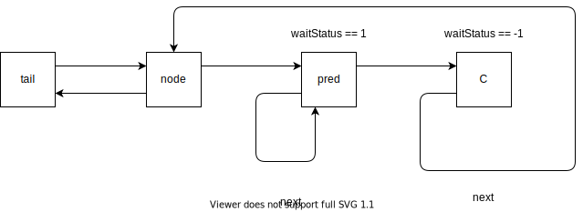

## 1. 预备知识

`ReentrantLock`是基于`AbstractQueueSynchronizer`的可重入锁。分为公平和非公平模式。它的内部类`Sync`继承了`AbstractQueueSynchronizer`。基本结构如下图所示：


其中`NonfairSync`实现了非公平锁的逻辑，`FairSync`实现了公平锁的逻辑。`ReentrantLock`通过内部维护的`Sync`对象实现资源的获取与释放。

## 2. ReentrantLock的加锁流程

这里以非公平模式为例，当调用`ReentrantLock.lock()`时，根据多态最终会调用`NonfairSync.lock()`。代码如下所示：

``` java

static final class NonfairSync extends Sync {
    private static final long serialVersionUID = 7316153563782823691L;

    /**
        * Performs lock.  Try immediate barge, backing up to normal
        * acquire on failure.
        */
    final void lock() {
        //这一步体现了非公平，有可能队列里的第一个线程唤醒了，但是没抢到锁，被这个新来的抢到了
        //也就是说不管同步队列里到底有没有内容，先加个塞

        //这里设置锁的状态需要为CAS操作
        //因为如果此时有两个线程都先后读取了State=0，threadA和threadB都能够将state设置为1，违背了锁的互斥性
        
        if (compareAndSetState(0, 1))
            setExclusiveOwnerThread(Thread.currentThread());
        else
            //加塞失败，乖乖的走后面的正常流程
            acquire(1);
    }
}
```

如果当前线程加塞失败，会调用`AbstractQueueSynchronizer`的`acquire()`方法,代码如下所示：

``` java
public final void acquire(int arg) {
    //因为多态，所以调用ReentrantLock的tryAcquire,这个tryAcquire是不会操作同步队列的
    if (!tryAcquire(arg) &&
        //tryAcquire失败后，会调用addWaiter
        acquireQueued(addWaiter(Node.EXCLUSIVE), arg))
        selfInterrupt();
}
```

`acquire`首先会调用`tryAcquire`再次加塞，根绝多态，最终会调用`NonFairSync.tryAcquire`，而`tryAcquire`又会调用`Sync.nonfairTryAcquire`，代码如下所示：

``` java
//Sync中的nonfairTryAcquire
final boolean nonfairTryAcquire(int acquires) {
    final Thread current = Thread.currentThread();
    int c = getState();
    if (c == 0) {
        //再次加塞,如果成功，后面的线程就再也不能成功获取锁了
        if (compareAndSetState(0, acquires)) {
            setExclusiveOwnerThread(current);
            return true;
        }
    }
    //是否是锁重入
    else if (current == getExclusiveOwnerThread()) {
        int nextc = c + acquires;
        if (nextc < 0) // overflow
            throw new Error("Maximum lock count exceeded");
        //不许要保证原子性
        //因为这是锁重入，在一个线程内，获取锁、释放锁都是串行的，
        //不会出现在获取c之后，c又再次被当前线程改变，导致nextc的值不正确，
        setState(nextc);
        return true;
    }
    //返回false表示获取锁失败了，可以准备加入同步队列了
    return false;
}
```

如果`tryAcquire`中的加塞操作都失败了，说明当前线程应该进入同步队列了，不然占着CPU又抢不到锁，不是浪费么。那么当前线程是如何入队的呢？请见下文。

### 2.1 线程的入队操作

在入队时，当前线程首先通过`addWaiter`进入同步队列,然后通过`accquireQueued`调整当前节点在队列的位置，这其中存在许多问题：

1. `addWaiter`是怎么实现的？
2. `accquireQueued`是干嘛的？
3. `selfInterrupt`是干嘛的？

#### 2.1.1 `addWaiter`是怎么实现的？

对于这个问题，我们先来看看`addWaiter()`的源码：

``` java "addWaiter"
//返回当前线程的node节点
private Node addWaiter(Node mode) {
    Node node = new Node(Thread.currentThread(), mode);
    // Try the fast path of enq; backup to full enq on failure
    Node pred = tail;
    //如果此时同步队列还未创建（tail和head都为空），那么就会直接调用enq
    //否则尝试直接入队
    if (pred != null) {
        //node节点是线程私有的，所以下面一句无需保证原子性
        node.prev = pred;

        /**************************************
        * problem1                   
        **************************************/
        if (compareAndSetTail(pred, node)) {
            pred.next = node;
            return node;
        }
    }
    //一旦进入到enq函数，node的prev指针会被重新设置
    //有可能发生code1处的代码执行了，node的前向节点pred失效了
    enq(node);
    return node;
}

//enq只负责将当前node加入队列，并返回tail
private Node enq(final Node node) {
    for (;;) {
        Node t = tail;
        if (t == null) { // Must initialize
            if (compareAndSetHead(new Node()))
                tail = head;
        } else {
            node.prev = t;
            //volatile写禁止重排序
            //enq中使用CAS的原因和addWaiter一样。
            if (compareAndSetTail(t, node)) {
                t.next = node;
                return t;
            }
        }
    }
}
```

在阅读上面的代码中，我产生一个问题：在`addWaiter`中problem1处，设置tail指针时为什么需要使用CAS呢？经过我的分析，我认为原因如下图所示：


可以发现，如果设置tail不是原子操作,最后同步队列中threadA的node就会丢失，因为下一个节点只会接在tail节点的后面。并且pred的next有可能发生混乱，比如tail=nodeB，但是pred.next=nodeA。
试想如下一个场景：threadA只设置了tail，还没设置pred.next时间片就用完了。threadB设置了tail和pred.next后，threadA再设置pred.next。结果如下所示：


那么为什么使用了CAS就会避免上图中的情况发生呢？因为`nodeA`如果CAS失败，后续会进入`enq`重新设置当前`node`的`prev`指针。而CAS成功的`nodeB`能够继续保留先前设置的`prev`指针。

从上面的代码我们得出结论：**一旦一个节点成功的设置了tail指针，那么这个节点就算成功进入同步同列。**

其实是因为`ReentrantLock`在获取锁时是不响应中断的，只会在获取锁后调用补上一个中断操作。如果`accquireQueued`返回true，则表示在获取锁的过程中发生了中断。那么线程是怎么进入同步队列的呢？我们看看`addWaiter`的代码：

#### 2.2.1 `accquireQueued`是干嘛的？

既然当前线程已经进入同步队列了，那么下一步就是将自己挂起，不然白白占着CPU，抢不到锁，什么也不能干。`accquireQueued()`就是用来将目标前程挂起的。但是被挂起之前需要做一些准备工作。准备工作包括：

1. 在准备挂起之前，先尝试获取锁，,如果获取成功，则在**逻辑**上退出当前队列，并返回中断情况。如果获取失败，则执行2
1. 调用`shouldParkAfterFailedAcquire`为当前线程的包装节点`node`找到一个合适的前置节点`pred`用来唤醒`node`。

下面我们具体来分析一下代码：

``` java
//调用该方法之前，节点肯定被放入队列了
final boolean acquireQueued(final Node node, int arg) {
    boolean failed = true;
    try {
        boolean interrupted = false;
        for (;;) {
            //node是当前节点，p是node的前一个节点
            final Node p = node.predecessor();
            //这里p是head的情况下还需要抢锁是因为不公平性，有可能别的线程没入队直接抢
            if (p == head && tryAcquire(arg)) {
                setHead(node);
                //前一个获得锁的node
                p.next = null; // help GC
                failed = false;
                return interrupted;
            }
            //线程在每次进入挂起之前，都会重新安排当前节点的前向节点
            //如果前向节点cancel了的话，则需要重新找爹,只有前向节点pred的waitStatus为-1时，当前线程才会挂起
            if (shouldParkAfterFailedAcquire(p, node) &&
                parkAndCheckInterrupt())
                //如果发生中断，则需要将interrupted设置为true，以便后续能够及时补一个中断操作
                interrupted = true;
        }
    } finally {
        //如果没有获取到锁，并且取消了请求，那么就要执行取消操作
        if (failed)
            cancelAcquire(node);
    }
}
```

通过阅读上面的代码我们可以发现：如果node（当前处理的节点）的前向节点`pred`==`head`时，那么说明node前面没有人了，可以抢锁了。没人了还跟谁抢？当然是跟那些第一次来不遵守规则的人抢了。没抢到的话，就需要准备找爹然后挂起了，找爹是怎么完成的？看看`shouldParkAfterFailedAcquire`的具体代码：

``` java
private static boolean shouldParkAfterFailedAcquire(Node pred, Node node) {
    //如果前向节点的waitStatus为-1，说明可以将当前线程park了
    //否则如果前向节点的waitStatus为0,则在将前向节点状态设为-1后，先不park当前线程，再给一次获取锁的机会
    int ws = pred.waitStatus;
    if (ws == Node.SIGNAL)
        /*
        * This node has already set status asking a release
        * to signal it, so it can safely park.
        */
        return true;
    if (ws > 0) {
        /*
        * Predecessor was cancelled. Skip over predecessors and
        * indicate retry.
        */
        //直系前向节点不可靠，继续在前面的节点中找个好爹
        do {
            node.prev = pred = pred.prev;
        } while (pred.waitStatus > 0);
        pred.next = node;
    } else {
        /*
        * waitStatus must be 0 or PROPAGATE.  Indicate that we
        * need a signal, but don't park yet.  Caller will need to
        * retry to make sure it cannot acquire before parking.
        */
        /***********************************************
        * 为什么设置状态要使用CAS操作？什么情况下会发生竞争？谁会修改pred的status？是pred自己吗？
        * pred的status需要靠后继节点来设置，如果它执行cancel操作后，status>0，但是如果还是执行pred.status=-1，cancel的状态丢失了
        * 所以由于pred.ws==Node.SGNAL，pred会被唤醒获取锁，但是pred却不会执行获取锁的代码了，所以pred后面的节点即使唤醒永远无法跳过pred
        * 所以需要使用CAS操作，避免cancel状态被覆盖
        ***********************************************/
        compareAndSetWaitStatus(pred, ws, Node.SIGNAL);
        /***********************************************
        * 使用CAS后，如果pred.waitStatus==Node.SIGNAL，那么node的直系前向节点pred状态为-1，能够保证node在不取消的前提下，任何情况都能够被唤醒
        * 如果CAS失败，那么就会再走一轮判断ws的代码，如果pred执行cancel，在CAS之后的第一次调用shouldParkAfterFailedAcquire中，
        * node就能够跳过pred，找到一个waitStatus==-1的前向节点
        ***********************************************/
    }
    return false;
}

```

对`shouldParkAfterFailedAcquire`的基本流程总结如下：

1. 如果node的前向节点pred的`waitStatus == -1`，说明爹已经找好了，安心地睡觉了，到时候有人会叫
2. 如果node的前向节点pred的`waitStatus >0 `，说明前面的人不可靠，需要从pred开始向前遍历，找一个可靠的爹
3. 如果node的前向节点pred的`waitStatus <=0 `,如果能成功设置pred.waitStatus==-1,说明爹已经找好了，否则返回false，等待下次进入该函数找爹

`shouldParkAfterFailedAcquire`只有在确保前一个节点状态为-1时，才会返回true挂起当前线程。否则返回false，需要一直继续找个好爹。

上面描述了一个节点从入队到挂起等待的全过程。但是如果有的节点不想等了呢？能直接退出同步队列吗？当前，这个操作由`acquireQueued.cancelAcquire`完成。
这个cancel操作的实现比较复杂，需要认真梳理一下代码：

``` java
//cancel的节点一直存在,直到后面的节点在挂起前，执行了shouldParkAfterFailedAcquire，设置prev后，cancel的节点就会不可达了
private void cancelAcquire(Node node) {
    //该函数只会操作node的next指针，因为
    // Ignore if node doesn't exist
    if (node == null)
        return;

    node.thread = null;

    // Skip cancelled predecessors
    Node pred = node.prev;
    while (pred.waitStatus > 0)
        node.prev = pred = pred.prev;

    // predNext is the apparent node to unsplice. CASes below will
    // fail if not, in which case, we lost race vs another cancel
    // or signal, so no further action is necessary.
    Node predNext = pred.next;

    // Can use unconditional write instead of CAS here.
    // After this atomic step, other Nodes can skip past us.
    // Before, we are free of interference from other threads.
    node.waitStatus = Node.CANCELLED;

    // If we are the tail, remove ourselves.

    /*********************************************
        为什么使用CAS设置tail指针？
    *********************************************/
    //因为有可能在设置tail的时候，有新节点nodeC入队，tail=nodeC，如果此时执行tail=pred，那么nodeC会丢失
    //或者pred也取消了，tail被设置为pred的前向节点，如果此时执行tail=pred，那么tail就会指向已经取消的pred
    // 所以需要使用CAS操作
    if (node == tail && compareAndSetTail(node, pred)) {

        /**********************************************
        *               problem1 begin                *
        **********************************************/
        compareAndSetNext(pred, predNext, null);
        /**********************************************
        *               problem1 begin                *
        **********************************************/
    
    }
    // 如果node为tail，但是更新tail失败，也会走else流程
    // 因为更新失败，表示有新节点入队或者pred节点也cancel了
    // 新节点入队，自然需要看node的前向节点pred是否能够 
    else {
        /***********************************************
        *  如果cancel的是中间节点，那么一定要保证node前面有一个直系节点的status为-1，或者能够被设置为-1，
        *  否则就需要手动唤醒node之后的节点
        ***********************************************/
        // If successor needs signal, try to set pred's next-link
        // so it will get one. Otherwise wake it up to propagate.
        int ws;


        /**********************************************
        *               problem2 begin                *
        **********************************************/
        if (pred != head &&
            ((ws = pred.waitStatus) == Node.SIGNAL ||
                
                // ws>0说明pred已经cancel了或者
                // cas失败说明，pred可能被cancel了
                (ws <= 0 && compareAndSetWaitStatus(pred, ws, Node.SIGNAL))) &&
            pred.thread != null) 
            
        /**********************************************
        *                problem2 end                 *
        **********************************************/
        {
            Node next = node.next;
            if (next != null && next.waitStatus <= 0)

            /**********************************************
            *               problem3 begin                *
            **********************************************/
                compareAndSetNext(pred, predNext, next);
            /**********************************************
            *                problem3 end                 *
            **********************************************/
        }else{
            unparkSuccessor(node);
        }

        node.next = node; // help GC
    }
}
```

阅读源码发现，`cancelAcquire`将取消节点`node`的位置分为三种情况：

1. `node`为尾节点`tail`
2. `node`为头节点`head`的后继节点
3. `node`在中间，既不为`tail`，也不为`head`

对于三种情况的取消操作，只有后两种情形需要执行唤醒后继节点的操作。why？这里先不做解释，具体请看`Q2`的问题答疑。而且我存在三个疑问，具体问题位置，我在代码中进行了标注。但是在解决疑问之前，我们需要知道一个基本事实：

>如果一个节点已经cancel了，那么这个节点表示的线程即使唤醒了，也不会执行获取锁的操作。因为当前执行的代码早就有可能执行到别的地方，而不是停留在获取锁的地方。

了解了基本事实后，我讲讲我对每个问题的答案。

---

**Question 1：既然代码中problem1处，的CAS成功与否并不重要，那么为什么要使用CAS？**

---

我认为使用CAS的原因有两点：

1. 不覆盖其他线程的操作结果
2. 加快查找下一个唤醒的目标线程

假设现在有线程A要取消获取锁，在执行完`compareAndSetTail(node, pred)`后，就切换到了线程B，此时同步队列状态如下图所示:


随后线程B进入同步队列，或者线程C也恰巧进入同步队列，此时同步队列状态如下所示：


然后切换到线程A执行`compareAndSetNext(pred, predNext, null);`，正常情况下这里肯定失败，不会产生错误的后果。**但是如果这里没有使用CAS**，那么就仍会执行`nodeA_pred.next=null`，结果如下所示：


当nodeA_pred释放锁后，它需要唤醒下一个节点，`nodeA_pred.next=null`。所以就需要从尾部`tail`开始向前遍历同步队列。当队列很长时，这种遍历是耗时的，但是这种情况可以通过CAS避免。达到了快速找到下一个唤醒线程的目标。

---
**Question 2：为什么代码中problem2处要设置如此的判断条件？**

---

试想当我们取消一个节点获取锁时，有必要唤醒当前被取消节点的后继节点，因为后继节点的唤醒是由当前被取消的节点负责的，但是并不是所有的情况都需要唤醒的。假设我们当前取消的节点为`node`，其前向节点为`pred`：

1. 当`node`为尾节点tail时，并且在当前线程更新`tail`前，没有新节点入队，那么就不用执行唤醒操作（如果在当前线程更新`tail`后，有新节点A入队，那么A在挂起前会找到一个可靠的前向节点B，A的唤醒由B管理，而不是由`node`管理）。否则执行2或者3。

2. 当`pred`为头节点`head`时，必须唤醒`node`的后继节点。这个逻辑很容易理解。假设当前`pred`释放锁了，它会唤醒`node`，而`node`此时已经取消了，代码早就跑飞了，唤醒了`node`有什么用？`node`不抢锁了，自然不会唤醒`node`的后继节点。

3. 当`node`为非尾节点时，并且`node`的前一个节点状态不为-1并且不能更新为-1时，那么就必须手动唤醒`node`之后的第一个有效节点。这是因为`pred`必须为一个有效节点，否则即使设置了`pred.next`，`node`的后继节点也可能会永远无法被唤醒。可能这个逻辑比较难理解。我试图从以下几张图说说我的理解。

如果没有第3点的条件限制，也就是说实际的代码如下：

``` java
if (pred != head) {
    Node next = node.next;
    if (next != null && next.waitStatus <= 0)
        compareAndSetNext(pred, predNext, next);
}else{
    unparkSuccessor(node);
}
```

那么当取消`node`节点时，刚通过了if条件的检查，切换`pred`执行取消操作：初始状态如下所示（图中所有的next指针都是在CAS操作成功的情况下决定的，下图同理）：


因为`pred`的前向节点状态正常，在`pred`完成取消操作后，状态如下所示：



然后，又切换回`node`，完成剩余设置指针的操作，状态如下所示：


试想如果在`c`释放锁后，会唤醒`node`，但是`node`代表的线程执行的代码早就不会停留在获取锁的地方了，所以唤醒`node`同样会造成`node`之后的节点永远被挂起的状态。

那么为什么有了`((ws = pred.waitStatus) == Node.SIGNAL ||
(ws <= 0 && compareAndSetWaitStatus(pred, ws, Node.SIGNAL))`，就能够避免上述的情况？

试想，如果`node`在取消时，发现其前向节点`pred`也在取消，也就是`ws!=Node.SIGNAL`或者CAS失败，就会直接手动唤醒`node`的后继线程，而后继线程在重新挂起前又会找到一个可靠的前向节点，所以保证了唤醒链不会中断。

那么在`node`取消后，`pred`再取消为什么不会有问题呢？这就很简单了，原理如下图所示：


**小结：**

对于被取消的节点，如果在完成取消操作前，后续有节点需要被唤醒，那么必须保证它前面有一个`waitstatus == -1`的节点。

---

**Question 3：既然代码中problem3处，的CAS成功与否并不重要，那么为什么要使用CAS？**

---

我的理解是：使用CAS能够避免唤醒链的中断。
试想如下一种场景：threadA正在取消节点，正准备执行`compareAndSetNext(pred, predNext, next);`时切换threadB。threadB排在threadA后面。恰巧threadB也在取消节点，并且取消的是尾节点tail，取消完成后状态如下所示：



恰巧此时有新节点入队，入队完成后，又切换到threadA执行`compareAndSetNext(pred, predNext, next);`。如果这不是CAS操作，那么threadA会继续执行`nodeA_pred.next=next(nodeB)`。执行完成后，同步队列如下所示：


那么在`nodeA_pred`释放锁后，唤醒的线程是`nodeB`，但是`nodeB`已经取消了，唤醒它有什么用呢？后面新入队的节点再也不会被唤醒。导致唤醒链中断。

**小结**
如果被取消节点`node`的前向节点`pred`的next指针设置失败时，就说明`node`的直系后继节点`next`可能已经失效了，自然不能执行`pred.next=node.next`（这个操作由CAS来保证）。

#### 2.1.3 `selfInterrupt`是干嘛的？

简单点来说，`selfInterrupt`是用来补偿中断的。为何要补偿？因为`ReentrantLock`在获取锁时，即使产生了中断，也不会退出获取锁的流程。那么中断在哪里产生？

``` java
private final boolean parkAndCheckInterrupt() {
    LockSupport.park(this);
    return Thread.interrupted();
}
```

``` java
final boolean acquireQueued(final Node node, int arg) {
    boolean failed = true;
    try {
        boolean interrupted = false;
        for (;;) {
            
            if (p == head && tryAcquire(arg)) {
                ...
                return interrupted;
            }
            
            if (shouldParkAfterFailedAcquire(p, node) &&
                parkAndCheckInterrupt())
                interrupted = true;
        }
    } finally {
        //如果没有获取到锁，并且取消了请求，那么就要执行取消操作
        if (failed)
            cancelAcquire(node);
    }
}
```


## 3. ReentrantLock的释放操作

锁的释放还是需要借助框架实现，首先会调用`AbstractQueuedSynchronizer.release`,代码如下：

``` java
public final boolean release(int arg) {
    // 上边自定义的tryRelease如果返回true，说明该锁没有被任何线程持有
    if (tryRelease(arg)) {
        // 获取头结点
        Node h = head;
        // 头结点不为空并且头结点的waitStatus不是初始化节点情况，解除线程挂起状态
        if (h != null && h.waitStatus != 0)
            unparkSuccessor(h);
        return true;
    }
    return false;
}
```

当锁没有被线程持有时，就可以唤醒头节点head之后的节点了。但是唤醒的判断条件为什么是h != null && h.waitStatus != 0？

1. h == null Head还没初始化。初始情况下，head == null，第一个节点入队，Head会被初始化一个虚拟节点。所以说，这里如果还没来得及入队，就会出现head == null 的情况。
2. h != null && waitStatus == 0 表明后继节点对应的线程仍在运行中，不需要唤醒。
3. h != null && waitStatus < 0 表明后继节点可能被阻塞了，需要唤醒。

再看一下unparkSuccessor方法：

``` java
// java.util.concurrent.locks.AbstractQueuedSynchronizer

private void unparkSuccessor(Node node) {
    // 获取头结点waitStatus
    int ws = node.waitStatus;
    if (ws < 0)
        compareAndSetWaitStatus(node, ws, 0);
    // 获取当前节点的下一个节点
    Node s = node.next;
    // 如果下个节点是null或者下个节点被cancelled，就找到队列最开始的非cancelled的节点
    if (s == null || s.waitStatus > 0) {
        s = null;
        // 就从尾部节点开始找，到队首，找到队列第一个waitStatus<0的节点。
        for (Node t = tail; t != null && t != node; t = t.prev)
            if (t.waitStatus <= 0)
                s = t;
    }
    // 如果当前节点的下个节点不为空，而且状态<=0，就把当前节点unpark
    if (s != null)
        LockSupport.unpark(s.thread);
}
```

为什么要从后往前找第一个非Cancelled的节点呢？答案在addWaiter方法中：

``` java
// java.util.concurrent.locks.AbstractQueuedSynchronizer

private Node addWaiter(Node mode) {
    Node node = new Node(Thread.currentThread(), mode);
    // Try the fast path of enq; backup to full enq on failure
    Node pred = tail;
    if (pred != null) {
        node.prev = pred;
        if (compareAndSetTail(pred, node)) {
            pred.next = node;
            return node;
        }
    }
    enq(node);
    return node;
}
```

我们从这里可以看到，节点入队并不是原子操作，也就是说，node.prev = pred; compareAndSetTail(pred, node) 这两个地方可以看作Tail入队的原子操作，但是此时pred.next = node;还没执行，如果这个时候执行了unparkSuccessor方法，就没办法从前往后找了，所以需要从后往前找。还有一点原因，在产生CANCELLED状态节点的时候，先断开的是Next指针，Prev指针并未断开，因此也是必须要从后往前遍历才能够遍历完全部的Node。