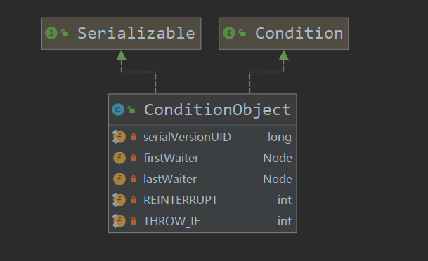

`Condition`接口的功能用来实现类似于`synchronized`的await()/signal()通知机制。但是比`synchronized`的通知机制更丰富、更灵活。我们知道，`synchronized`锁内部维护了一个`waitList`保存调用了`wait()`主动释放锁的线程。AQS的`waitList`功能就是通过`Condition`内部维护的`Condition queue`实现的。

与AQS的同步队列相似，`Condition queue`也是由`Node`类型的节点组成的。但是这里并没有使用`Node`的prev、next指针组成双向队列，而是通过一组额外的指针`firstWaiter`和`lastWaiter`维护了一个**单向队列**。`condition queue`的组成元素如下图所示：



我们发现还有两个没见过的元素：`REINTERRUPT`和`THROW_IE`。这两个元素与线程wait之后发生的中断有关，这放到后面再解释。了解了基本情况，那么我们就来看看AQS的wait/notify机制是如何实现的。

## wait机制

在AQS中，主动挂起是通过`await()`方法实现的，与`synchronized`类似，调用`await()`的线程必须是获得锁的线程。那万一有人故意在没有获得锁的时候调用呢？这种情况如何处理？暂时不清楚。`await()`方法实现如下：

``` java
public final void await() throws InterruptedException {
    //当线程发生中断时，直接抛出异常
    if (Thread.interrupted())
        throw new InterruptedException();
    // 将当前线程加入condition queue
    Node node = addConditionWaiter();
    // 释放当前线程持有的锁
    int savedState = fullyRelease(node);
    int interruptMode = 0;
    // 如果当前线程仍然在condition queue中，那么就主动park，直到被唤醒
    while (!isOnSyncQueue(node)) {
        LockSupport.park(this);
        if ((interruptMode = checkInterruptWhileWaiting(node)) != 0)
            break;
    }
    // 处理park期间发生中断的情况
    if (acquireQueued(node, savedState) && interruptMode != THROW_IE)
        interruptMode = REINTERRUPT;
    if (node.nextWaiter != null) // clean up if cancelled
        unlinkCancelledWaiters();
    if (interruptMode != 0)
        reportInterruptAfterWait(interruptMode);
}
```

线程调用`await()`之后，首先会将当前线程加入`condition queue`，然后完全释放当前线程持有的锁，最后挂起当前线程直到当前线程被中断或者被`signal`唤醒。我们先来分析线程从调用`await()`到被挂起这一阶段所发生的事情。处理park期间发生中断的代码我们在第四部分进行分析。

调用`await`后，要做的操作就是将当前线程的包装节点node加入`condition queue`。加入操作不需要保证线程安全，因为能够调用`await()`的线程，在正确的情况下都已经获得了锁，具体的实现代码如下所示：

``` java
// 将当前线程加入队列
private Node addConditionWaiter() {
    Node t = lastWaiter;
    // If lastWaiter is cancelled, clean out.
    //如果condition queue不为空，并且最后一个节点不在condition queue中
    // 那么就剔除队列中的所有取消节点
    if (t != null && t.waitStatus != Node.CONDITION) {
        unlinkCancelledWaiters();
        t = lastWaiter;
    }
    Node node = new Node(Thread.currentThread(), Node.CONDITION);
    if (t == null)
        firstWaiter = node;
    else
        t.nextWaiter = node;
    lastWaiter = node;
    return node;
}

// 剔除所有的非等待节点
private void unlinkCancelledWaiters() {
    Node t = firstWaiter;
    //trail始终指向队列中最后一个有效节点
    Node trail = null;
    while (t != null) {
        Node next = t.nextWaiter;
        //如果当前节点仍不为Node.CONDITION状态
        if (t.waitStatus != Node.CONDITION) {
            t.nextWaiter = null;
            //如果仍没有找到一个有效节点
            if (trail == null)
                // 那么就假设next是有效节点
                firstWaiter = next;
            // 如果已经找到了有效节点，那么就跳过当前节点
            else
                trail.nextWaiter = next;
            
            if (next == null)
                lastWaiter = trail;
        }
        else
            trail = t;
        t = next;
    }
}
```

节点入队的逻辑比较简单，如果条件队列的最后一个节点失效了，那么就会一次性剔除队列中所有的失效节点。**那么这里就出现了一个问题：`condition queue`中的节点的waitStatus什么时候会被修改成非`Node.CONDITION`？** 有人说是超时、中断会被更改，没找到啊？此问题仍待解决。

当前线程找到最后一个有效节点入队后，就会释放所有持有的锁。这里为什么要指**所有**？因为有可能发生锁重入的情况。这也就是释放锁为什么叫`fullyRelease`。

``` java
//释放目前持有的锁，包括可重入
final int fullyRelease(Node node) {
    boolean failed = true;
    try {
        int savedState = getState();
        //调用AQS框架的释放方法，最终又会调用用户自定的tryRelease
        if (release(savedState)) {
            failed = false;
            return savedState;
        }
        //释放锁失败，则说明当前线程根本就没有持有锁 
        else {
            throw new IllegalMonitorStateException();
        }
    } finally {
        if (failed)
            node.waitStatus = Node.CANCELLED;
    }
}
```

在前面我们曾说到，调用`await()`的线程必须持有锁，但是有可能有人故意在没有持有锁的线程中调用`await()`。在`await()`中并没有对这一特殊情况进行处理，其实AQS是把这个检查交给用户自己去定义了。例如在`reentrantLock`自定义的`tryRelease`中，如果当前线程没有持有锁，则释放失败。

``` java
protected final boolean tryRelease(int releases) {
    int c = getState() - releases;
    //当前线程并没有持有锁，直接抛出异常
    if (Thread.currentThread() != getExclusiveOwnerThread())
        throw new IllegalMonitorStateException();
    boolean free = false;
    if (c == 0) {
        free = true;
        setExclusiveOwnerThread(null);
    }
    setState(c);
    return free;
}
```

如果释放锁时抛出异常，那么会将当前已经进入`condition queue`的节点的waitStatus设为Node.CANCELLED（原来这也是在条件队列中生成取消节点的一种方法）。释放锁之后需要做的就是主动挂起当前线程，直到被中断或者被`signal`。从下面的代码中我们发现，如果当前线程被唤醒之后仍在条件队列中，那么继续会被主动挂起。？？？将被挂起的线程移除条件队列难道不是通过`await()`实现的？是谁？我们想想，正常情况下，是谁把挂起的线程唤醒的？是`signal`或者发生的中断。那么有没有可能就是这二者偷偷做的呢？

``` java
public final void await() throws InterruptedException {
    ...
    //被唤醒之后，如果当前节点不在同步队列中，那么继续park
    while (!isOnSyncQueue(node)) {
        LockSupport.park(this);
        if ((interruptMode = checkInterruptWhileWaiting(node)) != 0)
            break;
    }
    ...
}
```

## signal机制

当某个条件满足时，线程可以通过调用`signal()`方法唤醒`condition queue`中的某个线程或者使用`signalALL()`方法唤醒`condition queue`中的所有线程。注意，调用`await()`的线程和调用`signal()`的线程不是同一个哦。`signal()`和`signalALL()`的具体实现差不多。我先详细一下已下`singal()`吧。具体代码如下所示：

``` java "signal"
public final void signal() {
    // 如果当前锁没有被调用signal的线程独占
    if (!isHeldExclusively())
        throw new IllegalMonitorStateException();
    Node first = firstWaiter;
    // 如果首节点不为空，则调用doSignal唤醒线程
    if (first != null)
        doSignal(first);
}

private void doSignal(Node first) {
    do {
        if ( (firstWaiter = first.nextWaiter) == null)
            lastWaiter = null;
        first.nextWaiter = null;
    } while (!transferForSignal(first) &&
                (first = firstWaiter) != null);
}
```

`signal()`函数首先会检查当前调用`signal()`函数的线程是否独占锁。如果是，那么则调用`doSingal`唤醒条件队列中第一个节点。而在`doSignal`中，又会循环调用`transferForSignal()`。这个方法的名字很有意思，transform，transform什么？我们进入具体的方法瞅瞅。

``` java
final boolean transferForSignal(Node node) {
    /*
    * If cannot change waitStatus, the node has been cancelled.
    */
    if (!compareAndSetWaitStatus(node, Node.CONDITION, 0))
        return false;

    /*
    * Splice onto queue and try to set waitStatus of predecessor to
    * indicate that thread is (probably) waiting. If cancelled or
    * attempt to set waitStatus fails, wake up to resync (in which
    * case the waitStatus can be transiently and harmlessly wrong).
    */
    Node p = enq(node);
    int ws = p.waitStatus;
    if (ws > 0 || !compareAndSetWaitStatus(p, ws, Node.SIGNAL))
        LockSupport.unpark(node.thread);
    return true;
}
```

`transferForSignal`首先尝试使用CAS将node的`waitStatus`从Node.CONDITION更改为0。如果更改失败，则说明当前node已经被cancel了。那么为什么不可能是被中断了呢？node被中断后，waitStatus会被更改为0，这个CAS也会失败啊。这个CAS失败好像没有关系，应该会继续`transforForSignal`条件队列中的下一个节点。所以最坏的局面就是条件队列中的线程全部被唤醒了。

`transferForSignal`如果第一步的CAS成功，则会通过调用`enq`把当前节点node加入同步队列，如果当前node的前向节点`p`不是一个一个可靠的爹，说明当前node的唤醒操作不能依赖`p`，需要手动调用`unpark`唤醒当前node表示的线程。

如果`transferForSignal`返回true，则说明成功`signal`一个线程，可以停止`doSignal`的循环操作了。这样就成功执行了`signal`操作。那么`signalAll`是什么样的操作呢？是将条件队列中的节点依次加入同步队列吗？来瞅瞅。

``` java
public final void signalAll() {
    if (!isHeldExclusively())
        throw new IllegalMonitorStateException();
    Node first = firstWaiter;
    if (first != null)
        doSignalAll(first);
}
private void doSignalAll(Node first) {
    lastWaiter = firstWaiter = null;
    do {
        Node next = first.nextWaiter;
        first.nextWaiter = null;
        transferForSignal(first);
        first = next;
    } while (first != null);
}
```

`signalAll`内部会调用与`doSignal`类似的函数`doSignalAll`。`doSignalAll`的流程与`doSignal`高度类似。其内部也是循环调用`transferForSignal`将条件队列中节点依次加入同步队列。只不过`doSingalAll`的循环操作终止条件不再是`transferForSignal`操作是否成功，而是遍历完条件队列中的所有节点后才会终止循环操作。

## signal机制与中断的交互

通过了解`signal`机制，我们知道，一旦调用`signal`，一般情况下则会将条件队列的首节点加入条件队列争锁。但是如果线程在等待资源期间收到了中断请求怎么办？对于这个问题，我们需要拆分成两个小问题：

1. 中断是谁处理的？
2. 发生中断的情况会有哪几种？

对于第一个问题，我们首先想想线程是如何进入条件队列等待资源的？是通过调用`await`完成。那么在等待期间收到中断请求的处理是不是也应该由`await`完成？我们来看看`await`的我们未分析的后半部分：

``` java
public final void await() throws InterruptedException {
    ...
    while (!isOnSyncQueue(node)) {
        //调用park函数后当前线程被主动挂起
        LockSupport.park(this);
        if ((interruptMode = checkInterruptWhileWaiting(node)) != 0)
            break;
    }
    // 处理park期间发生中断的情况
    if (acquireQueued(node, savedState) && interruptMode != THROW_IE)
        interruptMode = REINTERRUPT;
    if (node.nextWaiter != null) // clean up if cancelled
        unlinkCancelledWaiters();
    if (interruptMode != 0)
        reportInterruptAfterWait(interruptMode);
}
```

在`await`中调用`park`后，如果被唤醒，则会执行`checkInterruptWhileWaiting`判断是否结束循环，如果能够成功跳出循环，则会通过三个`if`处理具体的情况，到底是怎么处理的我们后文再看。我们再来看看第二个问题：可能出现的情况也就两种：

- 中断发生时，线程还没有被`signal`
- 中断发生时，线程已经被别的线程`signal`了

那么中断和`signal`到底谁先发生是怎么判断的呢？这肯定是`checkInterruptWhileWaiting`处理的：

``` java
private int checkInterruptWhileWaiting(Node node) {
    return Thread.interrupted() ?
        (transferAfterCancelledWait(node) ? THROW_IE : REINTERRUPT) :
        0;
}
```

`checkInterruptWhileWaiting`的内容很简单，如果没有发生中断，则返回0。否则继续调用`transferAfterCancelledWait`判断：

``` java
final boolean transferAfterCancelledWait(Node node) {
    //如果是中断先发生，那么CAS会成功，否则就表示当前node已经被signal了
    if (compareAndSetWaitStatus(node, Node.CONDITION, 0)) {
        enq(node);
        return true;
    }
    /*
    * If we lost out to a signal(), then we can't proceed
    * until it finishes its enq().  Cancelling during an
    * incomplete transfer is both rare and transient, so just
    * spin.
    */
    // 为什么一定要保证节点加入了同步队列？
    // 因为如果直接返回false，后续会执行acquireQueued抢锁
    // node都未加入同步队列怎么抢？必然会发生奇怪的不可预期的事情
    while (!isOnSyncQueue(node))
        Thread.yield();
    return false;
}

// 判断node是否已经处于同步队列
final boolean isOnSyncQueue(Node node) {
    //条件队列中的node是不会设置prev与next指针的

    if (node.waitStatus == Node.CONDITION || node.prev == null)
        return false;
    if (node.next != null) // If has successor, it must be on queue
        return true;
    /*
    * node.prev can be non-null, but not yet on queue because
    * the CAS to place it on queue can fail. So we have to
    * traverse from tail to make sure it actually made it.  It
    * will always be near the tail in calls to this method, and
    * unless the CAS failed (which is unlikely), it will be
    * there, so we hardly ever traverse much.
    */
    return findNodeFromTail(node);
}
```

如果中断先于`signal`发生，那么则会调用`enq`将当前node加入同步队列并返回`true`。否则自旋直到当前节点成功加入同步队列，随后返回`false`。这里我存在一个问题：如果`signal`先于中断发生，那么为什么一定要保证当前node加入了同步队列呢？

可以看出，`transferAfterCancelledWait`就是判断中断和`signal`到底谁先发生的关键函数。如果中断先发生，则返回true，否则返回false。在返回之后，我们再次回到`checkInterruptWhileWaiting`。如果中断发生，那么则返回`THROW_IE`，否则返回`REINTERRUPT`。这两个是什么意思？通过下面的注释，我们了解到，`THROW_IE`表示在`wait`退出后，需要抛出一个中断异常，否则只是重新设置中断位。

``` java
/** Mode meaning to reinterrupt on exit from wait */
private static final int REINTERRUPT =  1;
/** Mode meaning to throw InterruptedException on exit from wait */
private static final int THROW_IE    = -1;
```

我们的视角再次回到`await`，在判断中断与`signal`谁先发生后，则会跳出循环（如果中断和`signal`都没有发生，那么则会继续调用park挂起自己）。在跳出循环后，会执行三个`if`条件，基本流程我都以注释的形式写在了代码中，还是比较容易理解的。

``` java
public final void await() throws InterruptedException {
    ...
    while (!isOnSyncQueue(node)) {
        //调用park函数后当前线程被主动挂起
        LockSupport.park(this);
        if ((interruptMode = checkInterruptWhileWaiting(node)) != 0)
            break;
    }
    // 处理park期间发生中断的情况

    /*
    * 需要获得锁savedState次，因为需要与调用await之前线程持有锁的状态一致
    */
    if (acquireQueued(node, savedState) &&
    /*
    * acquireQueueed返回true表示在抢锁过程中发生了中断了，
    * 如果没有后半部分的判断条件，那么原来可能interruptMode=THROW_IE,THROW_IE,在await结束后
    * 需要抛出中断异常，但是interruptMode被覆盖为REINTERRUPT
    * 这样仅仅只会重新设置中断位，丢失了原本需要抛出的中断异常
    */
    interruptMode != THROW_IE)
        interruptMode = REINTERRUPT;
    /*
    * 在node被移出条件队列后，需要设置node的nextWaiter指针
    * 在中断先发生的情况下，node只是被加入了同步队列，而没有设置nextWaiter指针
    * 但是signal先发生的情况下，node的nextWaiter已经被修改了，所以使用if判断
    */
    if (node.nextWaiter != null) // clean up if cancelled
        unlinkCancelledWaiters();
    if (interruptMode != 0)
    // node被移出条件队列后，要根据interruptMode的值来决定是抛出异常还是重新设置中断标志位
        reportInterruptAfterWait(interruptMode);
}

// 根据interruptMode的值来决定是抛出异常还是设置中断标志位
private void reportInterruptAfterWait(int interruptMode)
    throws InterruptedException {
    // 直接抛出中断异常
    if (interruptMode == THROW_IE)
        throw new InterruptedException();
    //重新设置中断位
    else if (interruptMode == REINTERRUPT)
        selfInterrupt();
}
```

## 总结

条件队列还是比较简单的，最复杂的地方就是`signal`与中断如果都发生了，那么情况就比较棘手。条件队列仅通过额外的`nextWaiter`指针维护一个单向队列，如果线程的资源要求达到满足，那么就会将节点从条件队列移步至同步队列抢锁。

## 参考文章

1. [逐行分析AQS源码(4)——Condition接口实现](https://segmentfault.com/a/1190000016462281)