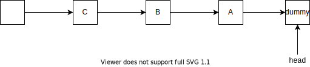
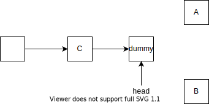

共享锁和独占锁的实现差别不是很大，一个最大的区别就是在共享锁中，当一个线程获取锁后，它会尽可能多地唤醒后继线程

## 1.共享锁的获取

对于共享锁的获取，自定义同步器肯定会首先调用AQS的模板方法`acquireShared`，然后会调用自定义的锁获取方法`tryAcquireShared`。在共享锁模式下，`tryAcquireShared`的返回值有三种含义：

- 返回值小于0表示获取锁失败
- 返回等于0表示当前线程获取锁成功，但是不保证后续的获取会成功
- 返回值大于0表示当前线程获取成功，并且后续的获取会成功，但是必须检查锁的有效性

所以当`tryAcquireShared`返回值小于0时，则调用`doAcquireShared`将当前线程放入同步队列，准备阻塞，`tryAcquireShared`代码如下所示：

``` java
public final void acquireShared(int arg) {
    if (tryAcquireShared(arg) < 0)
        doAcquireShared(arg);
}
```

`doAcuqiredShared`的主要功能就是将同步队列中的线程挂起或者在线程获取锁后移出同步队列，代码如下所示：

``` java
private void doAcquireShared(int arg) {
    final Node node = addWaiter(Node.SHARED);
    boolean failed = true;
    try {
        boolean interrupted = false;
        for (;;) {
            final Node p = node.predecessor();
            //如果node的前向节点为head，说明轮到node抢锁了
            if (p == head) {
                int r = tryAcquireShared(arg);
                //如果tryAcquireShared返回值不小于0，说明可以唤醒node的后继线程来获取共享锁了
                if (r >= 0) {
                    setHeadAndPropagate(node, r);
                    p.next = null; // help GC
                    if (interrupted)
                        selfInterrupt();
                    failed = false;
                    return;
                }
            }
            if (shouldParkAfterFailedAcquire(p, node) &&
                parkAndCheckInterrupt())
                interrupted = true;
        }
    } finally {
        if (failed)
            cancelAcquire(node);
    }
}
```

如果有线程获取共享锁成功，则会调用`setHeadAndPropagate`唤醒`node`的后继线程。我们来看看具体的实现代码：

``` java
private void setHeadAndPropagate(Node node, int propagate) {
    Node h = head; // Record old head for check below
    setHead(node);
    /*
    * Try to signal next queued node if:
    *   Propagation was indicated by caller,
    *     or was recorded (as h.waitStatus either before
    *     or after setHead) by a previous operation
    *     (note: this uses sign-check of waitStatus because
    *      PROPAGATE status may transition to SIGNAL.)
    * and
    *   The next node is waiting in shared mode,
    *     or we don't know, because it appears null
    *
    * The conservatism in both of these checks may cause
    * unnecessary wake-ups, but only when there are multiple
    * racing acquires/releases, so most need signals now or soon
    * anyway.
    */
    if (propagate > 0 || h == null || h.waitStatus < 0 ||
        (h = head) == null || h.waitStatus < 0) {
        Node s = node.next;
        if (s == null || s.isShared())
            doReleaseShared();
    }
}
```

在`setHeadAndPropagate`中首先会重新设置头节点`head`，因为当前线程已经获取了锁，所以不需要保证线程安全。随后要经过一系列检查才会调用`doReleaseShared`执行真正的唤醒后继线程的操作。我们来看看这一系列的检查包括什么：

1. propagate > 0
2. h == null 或者 (h = head) == null
3. h.waitStatus < 0

其中，第一个条件很正常，当`propagate`的返回值大于0时，说明后继线程如果被唤醒，那么它们有概率获得锁。但是第二个条件我实在是无法理解，在进入`setHeadAndPropagate`函数之前，一定会调用`addWaiter`初始化同步队列，所以h不可能为空，这里为什么需要进行多余的判空操作？对于最后一个条件，`h.waitStatus<0`说明存在后继线程被挂起的情况。

假设检查通过，会执行`doReleaseShared`用来唤醒后继线程。这个方法可以说是共享锁的核心，而且它也会在线程释放共享锁时调用，总共会在两个位置被调用。为什么需要这么做？对于释放锁后调用此方法是可以理解的，不然同步队列的线程怎么获取锁呢？但是当线程获取锁后，还调用此方法，是因为**共享锁**希望能够被尽可能多的线程持有。当一个线程获取成功后，它有责任让更多的后继来尝试。`doReleaseShared`会被调用两次的原因解释清楚了，具体的分析请见共享锁的释放一章。

## 2.共享锁的释放

首先当共享锁释放时，会调用AQS的`releaseShared`方法。在`releaseShared`中会首先调用用户自定义的释放锁方法`tryReleaseShared`，`releaseShared`实现代码如下：

``` java
public final boolean releaseShared(int arg) {
    //调用用户自定义的释放锁方法
    if (tryReleaseShared(arg)) {
        doReleaseShared();
        return true;
    }
    return false;
}
```

如果锁释放成功，则会调用`doReleaseShared`唤醒当前节点的后继线程：

``` java
private void doReleaseShared() {
    /*
    * Ensure that a release propagates, even if there are other
    * in-progress acquires/releases.  This proceeds in the usual
    * way of trying to unparkSuccessor of head if it needs
    * signal. But if it does not, status is set to PROPAGATE to
    * ensure that upon release, propagation continues.
    * Additionally, we must loop in case a new node is added
    * while we are doing this. Also, unlike other uses of
    * unparkSuccessor, we need to know if CAS to reset status
    * fails, if so rechecking.
    */
    for (;;) {
        Node h = head;

        if (h != null && h != tail) {
            int ws = h.waitStatus;
            //与独占锁类似，只有头节点的waitStatus == -1，说明后继线程才会被挂起
            if (ws == Node.SIGNAL) {
                if (!compareAndSetWaitStatus(h, Node.SIGNAL, 0))
                    continue;            // loop to recheck cases
                unparkSuccessor(h);
            }
            else if (ws == 0 &&
                        !compareAndSetWaitStatus(h, 0, Node.PROPAGATE))
                continue;                // loop on failed CAS
        }
        if (h == head)                   // loop if head changed
            break;
    }
}
```

`doReleaseShared`这个函数用来唤醒尽可能多的处于同步队列的后继线程，为什么要这么做呢？因为这是共享锁，当一个线程获取锁成功后，不必等到当前线程释放后才让后继线程来抢锁，可以让后继线程和当前线程共同使用锁嘛。那么这个唤醒动作什么时候终止呢？答案是：直到没有线程成功锁为止。这个操作如何实现？就是通过下面的代码：

``` java
for (;;) {
    Node h = head;

    ...
    if (h == head)                   // loop if head changed
        break;
}
```

这个死循环动作的终止条件是：`h==head`。这个条件说明什么？说明head没有被改变，没被改变就等同于没有新线程获取锁，所以唤醒动作可以终止了。那么具体的唤醒动作是怎么实现的？请见如下代码：

``` java
for (;;) {
    Node h = head;

    if (h != null && h != tail) {
        int ws = h.waitStatus;
        //与独占锁类似，只有头节点的waitStatus == -1，说明后继线程才会被挂起
        if (ws == Node.SIGNAL) {
            if (!compareAndSetWaitStatus(h, Node.SIGNAL, 0))
                continue;            // loop to recheck cases
            unparkSuccessor(h);
        }
        else if (ws == 0 &&
                    !compareAndSetWaitStatus(h, 0, Node.PROPAGATE))
            continue;                // loop on failed CAS
    }
    ...
}
```

上面代码中的四处if条件我们需要好好理解一下。

对于代码中的**第一个**`if`条件：`(h != null && h != tail)`，说明需要同步队列中除head之外，必须还存在一个节点。不然唤醒谁呢？

对于**第二个**`if`条件：`(ws == Node.SIGNAL)`，这个条件的含义是只有`head.waitStatus == -1`，才表示后续节点被挂起。具体的挂起操作见`shouldParkAfterFailedAcquire`函数。

对于**第三个**`if`条件：`(!compareAndSetWaitStatus(h, Node.SIGNAL, 0))`，这里使用CAS执行`head.waitStatus=0`是为了防止多个线程多次唤醒同一个head之后的后继节点。这里为什么会有多个线程唤醒同一个head的后继节点？这就跟共享模式的唤醒机制有关了。假设现在同步队列如下：



当节点A出队后，在调用`doReleaseShared`时，发现同步队列中还有节点，那么当A成功执行`!compareAndSetWaitStatus(h, Node.SIGNAL, 0)`后，执行`unparkSuccessor`唤醒节点B，此时节点A开始了下一次循环。

现在假设节点B也成功获取了锁，也进入了`doReleaseShared`,此时同步队列状态如下所示：



此时线程A和线程B操作的可能是同一个head。假设A唤醒B，B成功获得锁，改变了head，A会再次进入`doReleaseShared`，并且B也会因为成功获得锁首次调用`doReleaseShared`，那么A和B操作的就是同一个head，而唤醒C只需要做一次，CAS来保证这个“一次”。

对于**第四个**`if`条件：`(ws == 0 && !compareAndSetWaitStatus(h, 0, Node.PROPAGATE))`，这也可能是为了性能的极致优化。首先我们需要需要知道能够走到这个条件的状态是同步队列中必须有两个节点。

如果`ws==0`为true，则说明此时同步队列中有可能所有的节点都没有挂起。或者原来的尾节点tail成为了新的头节点head。因为`ws == 0`只有可能是这两种情况。而`compareAndSetWaitStatus(h, 0, Node.PROPAGATE)`失败则说明头节点head的状态被另外的线程的改变了。谁有资格改head的`waitStatus`？只有一种情况：那就是后继节点挂起了，才会将前置节点的`waitStatus`设置为-1。所以这个if完全就是为了处理这种极端并发。当后继线程挂起了，而后继线程又有资格获取锁，那么应该当前线程应该继续唤醒后继线程。所以


``` java
public final boolean releaseShared(int arg) {
    if (tryReleaseShared(arg)) {
        doReleaseShared();
        return true;
    }
    return false;
}
```

CountDownLatch

``` java
protected boolean tryReleaseShared(int releases) {
    // Decrement count; signal when transition to zero
    for (;;) {
        int c = getState();
        //这么判断是害怕有傻缺，设置count==5，但是却有6个线程调用countDown
        if (c == 0)
            return false;
        int nextc = c-1;
        if (compareAndSetState(c, nextc))
            return nextc == 0;
    }
}
```