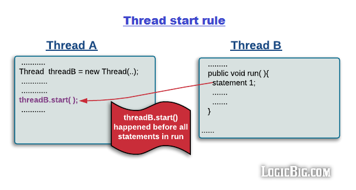
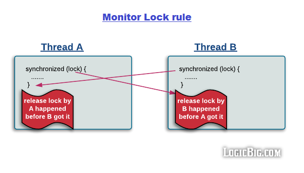
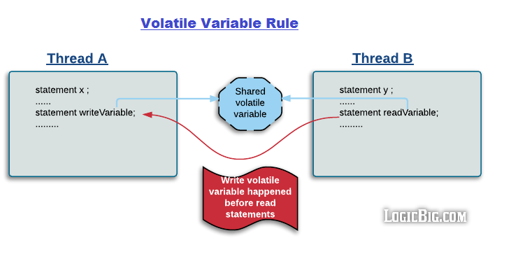
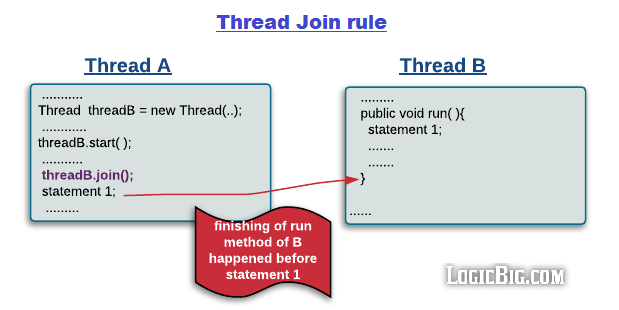

## 1. 内存模型(memory model)

### 1.1. 内存模型是什么

在编译和运行程序时，编译器和CPU都会为了效率而力所能及地对程序进行优化，例如编译器和CPU的指令重排、CPU的流水线执行等操作。但是这种优化不是没有限制的，如果不能及时保证**内存的可见性**，程序就有可能出现错误,这里的可见性是指如果有一个线程A对某个内存地址addr进行了写操作，那么其他线程一定能够看到A对地址addr的操作。

所以内存模型就应运而生了，它能够保证优化后的程序的执行结果仍然与程序串行执行时一样。其实现原理是保证多线程之间的内存可见性，编译器和CPU需要在不违背内存模型的前提下，尽可能地达到优化的最大程度。这里所说的内存模型是一组规则，是抽象的，而不是像jvm的内存布局是具体存在的。

内存模型的实现基于内存屏障（memory barrier）。内存屏障分为四种类型：

1. LoadLoad
2. LoadStore
3. StoreStore
4. StoreLoad

在此我仅解释`LoadLoad`内存屏障的含义，剩余三条可类推：

```
load x1;
LoadLoad memory barrier
load x2
```

LoadLoad表示的内容时load x1的操作必须发生在load x2操作之前。

这四种类型的内存屏障并不是完全需要，这需要根据底层架构的内存模型来决定。内存模型大体可以分为两种：

- 强内存模型：一个CPU核的写操作对剩余的CPU都可见
- 若内存模型：该模型需要使用上面提到的所有内存屏障来确保优化操作的正确性

x86架构采用的就是强内存模型，所以在汇编中最多使用`StoreLoad`这一种屏障就足够了，其对应的具体汇编指令就是`lock`。

## 2. JMM是什么

因为每一个架构都有它自己的内存模型，这就可能带来Java程序的移植性问题。所以为了屏蔽底层架构的内存模型的差异性，Java开发团队为Java在多架构的背景下提出了跨平台的、具有移植性的内存模型，即Java memory model。它同样是靠指令中插入内存屏障（memory barrier）来实现的。我们先不谈JMM内存屏障的插入策略。我们思考一个问题，插入策略是如何制定的。

在JSR-133之后，JMM是一组基于`happens before`关系（后文简称hb）的规则。hb通过保证**部分**指令的有序性达到内存可见性，并且极大地简化了并发编程的难度。如果`操作A hb 操作B`，那么编译器、处理器以及内存系统必须保证操作A的结果对操作B可见。

### 2.1 happens before relation

hb规则总计下面6条（简而言之就是read/write,lock/unlock,start/join threads）：

- 程序次序规则(single thread rule) ：一个线程内，按照原始书写的**没有被重排序**的代码**控制流**顺序，编码在前面的`action` 先行发生于编码在后面的`action`([action的定义](https://docs.oracle.com/javase/specs/jls/se7/html/jls-17.html#jls-17.4.3))；


- 锁定规则(monitor lock rule)：对于一个monitor lock的unLock操作 `happens before` 后面所有的对同一个monitor lock的lock操作；


- volatile变量规则(volatile variable rule)：对一个volatile变量的写操作`happens before`后面所有的对这个变量的读操作；


- 线程启动规则（thread start rule）：Thread对象的start()方法`happens before`当前被启动线程的`run()`方法中的每个一个动作；


- 线程终结规则（thread join rule）：假定线程A在执行的过程中，通过调用ThreadB.join()等待线程B终止，那么在join()返回后，线程B在run()完成的操作在线程A都可见


- 传递规则(thread start rule)：如果操作A`happens before`操作B，而操作B又`happens before`操作C，则可以得出操作A`happens before`操作C；但是如果有 operation1(o1) & operation2(o2) `happens before` operation3，并不能推导出 o1 `happens before` o2。所以o1和o2之间有没有重排序JMM并不关心

通过上面六条规则，可以总结出四个方面的hb关系：

1. 初始化
    - 将字段初始化为默认值（例如将int初始化为0、boolean初始化为false）的操作 `happens before` 任何线程对同一字段地访问操作
    - 对`static final`字段的写操作 `happens before` 任何线程对该字段的读操作
    - 对`non-static final`字段的写操作 `happens before` 该线程后续通过引用访问当前对象同一字段的操作
2. 内存访问
    - 对一个monitor lock的unlock操作或者volatile写操作（volatile就相当于unlock操作，因为完成volatile写后，volatile读能够读到新值，就像unlock时，unlock之前的操作对lock操作来说都是可见的） `happens before` 任意线程对同一个monitor lock的lock操作或者对同一字段的volatile读
    - volatile读或者lock操作 `happens before` 当前线程后续对内存的所有操作
3. 原子操作
    - `java.utl.concurrent.atmoic.get()`方法的效果相当于volatile读，`xxxx.set()`方法的效果相当于volatile写
    - `weakCompareAndSet` `happens before` 当前线程后续所有对原子字段的操作
4. 线程
    - `Thread.start()`方法之前的所有操作 `happens before` 新线程`run()`方法中的所有操作
    - 任何写操作 `happens before` 当前线程的终止操作

上面的规则有点难以理解，但是我们要记住一句话：

>**规则 A hb B，仅表示JMM保证A的操作结果能被B看到，并不保证操作A一定在操作B之前发生。**
那么在JMM保证的基础上，如果（注意是如果）A发生了，那么B一定能看到。我们需要做的就是保证这个“如果”在某些特定情况下变成“必须”，想想如果没有hb规则，那么即使A先于B发生，B也有可能看不到A的操作结果。

---
是否可以等价于：

若有 A hb B，那么如果A先于B发生，A的结果B一定能看到。JMM为了完成“一定能看到”这个操作，会使用内存屏障。至于如果B发生了，A还没发生，这时候的情况JMM根本不关心，它不需要保证任何东西。

---

``` java

int a=1;

int b=2;

```

如果对指令进行重排序后的结果和遵守A hb B的执行是一样的（简而言之就是操作A和B不会发生访问冲突，没有共享内存），那么JVM并不会禁止这样的重排序。

1&2 hb 3，那么1和2之间可以随意重排序


## 参考文献

1. [Java - Understanding Happens-before relationship](https://www.logicbig.com/tutorials/core-java-tutorial/java-multi-threading/happens-before.html#:~:text=Happens%2Dbefore%20relationship%20is%20a,another%20action%20in%20different%20thread.&text=Happens%2Dbefore%20is%20not%20just,read%20and%20write%20to%20memory%20.)

2. [JMM Synopsis](http://gee.cs.oswego.edu/dl/cpj/JMMsynopsis.html)

