因为线程是调度的基本单位，所以线程的状态转换与进程的状态转换是一致的。主要有五个状态：启动、就绪、执行、等待、销毁。这几个状态的转换图如下所示：



可以看到，等待状态只能转换为就绪，再等CPU调度。这是一般的线程状态转换图。

在java中，又多了几个状态。

## java中的线程状态

``` java
public enum State {
    NEW,

    RUNNABLE,

    BLOCKED,

    WAITING,

    TIMED_WAITING,

    TERMINATED;
}
```

在java中，自定义的线程状态有6个。

- `NEW`:表示线程还未启动
- `RUNNABLE`：就绪或者运行状态
- `BLOCKED`：等待锁
- `WAITINTG`：无限时等待
- `TIMED_WAITING`：有限时间等待
- `TERMINATED`：线程终止


### BLOCKED状态

进入BOCKED状态是因为需要请求锁资源，注意请求锁资源不影响线程本身的调度，但是如果一直不停的处于BLOCKED,会浪费资源，应当转为等待状态。

### WAITING状态

进入WAITING状态的方法有三个：

- Object.wait()
- Thread.join():该方法底层就是调用了wait，阻塞了当前线程
- LockSupport.park()：这个方法我也是第一次见，具体含义为：除非获得调用许可，否则禁用当前线程进行线程调度

进入WAITING状态就不参与CPU的线程调度了，直到系统对线程进行唤醒。那么从WAITING进入RUNNABLE有三个方法。

- Object.notify()
- Object.notifyAll()
- LockSupport.uppark(THread)

### TIMED_WAITING状态

进入TIMED_WAITING的方法有四个：

- `Object.wait(long times)`：加入参数后表示我这个线程最多等待times毫秒，时间一到，不管锁能不能用，我都会进入RUNNABLE状态参与进程调度。
- `Thread.join(long time)`: 这个方法同理，在底层会调用wait(time)。
- `Thread。sleep(long time)`:指定睡眠时常
- `LockSupport.parkNanos(long nanos)`： 除非获得调用许可，否则禁用当前线程进行线程调度指定时间；
- `LockSupport.parkUntil(long deadline)`：同上，也是禁止线程进行调度指定时间；

> 在调用上面这些方法前，我们不要想，我们是通过哪些对象来调用的方法，而是要思考在哪个线程中会执行调用方法的代码！这样才不容易搞混到底让谁wait，让谁runnable。

### 状态转换

线程转换图如下([图片来源](http://concurrent.redspider.group/article/01/4.html))：


#### BLOCKED与RUNNABLE的转换

在java中，就绪和运行都属于RUNNABLE，BLOCKED与RUNNABLE之间的转换是非常简单的，只要一个线程先得到锁，然后另一个线程就会不断尝试取获取锁，这个不断尝试的状态就是`BLOCKED`。

``` java
public static void main(String[] args) {

        Thread t1=new Thread(new Runnable() {
            @Override
            public void run() {
                System.out.println("t1 is running");
                lockMethod();

            }
        });

        Thread t2=new Thread(new Runnable() {
            @Override
            public void run() {
                System.out.println("t2 is running");
                lockMethod();
            }
        });
        t1.start();
        t2.start();

        System.out.println("t1 state: "+t1.getState());
        System.out.println("t2 state:"+ t2.getState());
    }

    public static synchronized void lockMethod(){

        try {
            System.out.println(Thread.currentThread().getName()+"in lockMethod");
            Thread.sleep(2000);
        } catch (InterruptedException e) {
            e.printStackTrace();
        }
    }
```

上面的代码不一定会出现BLOCKED状态，因为从线程启动到线程执行还是要花点时间的，并且谁先得到锁还不一定，那么如果我们想让第二个线程出现BLOCKED状态怎么办？那么就需要第一个线程必得到锁。那么只需要让主线程睡一会，调用`sleep(time)`还是`wait(time)`都行。

#### WAITING与RUNNABLE的转换

进入WAITING状态有三个方法，但是最常用的只用两个，就是`wait()`和`join()`方法，wait会释放锁，但是join不会。从WAITING转为RUNNABLE主要有`notify()`、`notifyAll()`，注意这个notify，它只是通知等待当前锁的线程，可以醒了，你们可以参与进程调度了，但是不会释放锁直到离开同步区。

而且如果有多个线程等待的是同一个锁，`notify()`只会唤醒一个等待锁的线程，至于唤醒的是谁，这就不知道了。同理`notifyAll()`唤醒所有等待锁的线程，谁抢得到锁，这个也不一定。

而`join()`方法其实在调用`join(0)`，不会释放当前锁，值到这个锁对象代表的线程terminated。因为调用的方式为`t1.join()`，t1即是Thread对象，也是个锁对象。

#### TIMED_WAITING与RUNNABLE的转换

进入TIMED_WAITING的方法常用的有三个:`join(time)``sleep(time)``wait(time)`。sleep不会释放锁，join应该会，这里不确定。wait一定会释放锁。

#### TERMINATED

进入TERMINATED的方法有三个：

- Thread.interrupt()：中断线程。这里的中断线程并不会立即停止线程，而是设置线程的中断状态为true（默认是flase）；
- Thread.interrupted()：测试当前线程是否被中断。线程的中断状态受这个方法的影响，意思是调用一次使线程中断状态设置为true，连续调用两次会使得这个线程的中断状态重新转为false；
- Thread.isInterrupted()：测试当前线程是否被中断。与上面方法不同的是调用这个方法并不会影响线程的中断状态。

注意java里的中断也是一种建议，跟设置线程的优先级一样，被通知请求中断的线程到底断不断需要由被请求中断的线程自己决定。可以中断、也可以不中断。

**中断机制和设置优先级一样，完全是个建议!!!**

### 参考文献

[RedSpider](http://concurrent.redspider.group/article/01/4.html)