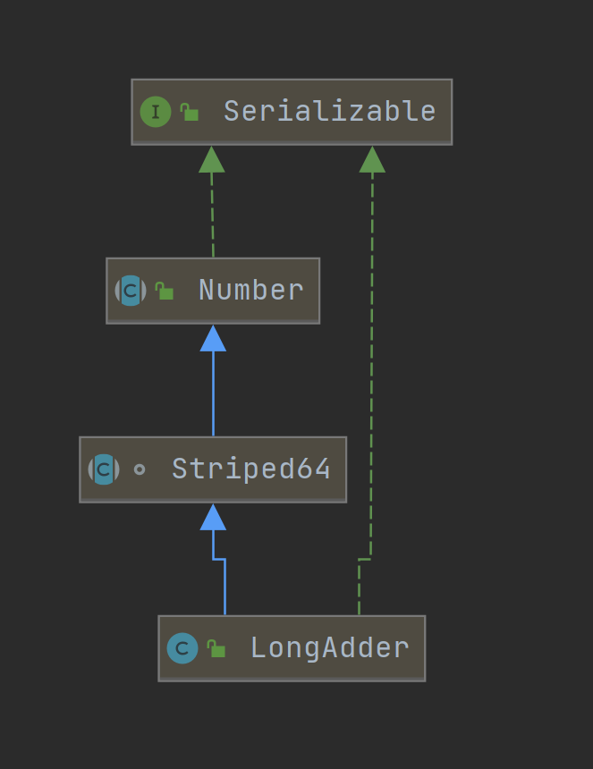

## 1. 预备知识

在Java1.5中，JUC就已经提供了大数原子类`AtomicLong`，但是在Java1.8中，又提供了相同功能的大数原子类`LongAdder`。why？答案是如此的纯粹：为了效率。难道前者的效率就不行了吗？如果在轻微冲突的情况下，二者的效率几乎差不多。但是如果竞争非常激烈，那么因为每次对`AtomicLong`更新时都会使用CAS，激烈竞争导致CAS的成功的概率不大，所以有可能会执行多次无效的CAS操作。那么后者`LongAdder`在更新时采用了分段计数的方法，它在每次更新时不再直接更新具体的数，而是在内部维护了一个基数`base`和增量数组`cells`。在竞争激烈的情况下，每个线程会只会在增量数组中更新自己得到增量。那么如果想要获得最后的结果，只需要将`base`与`sum(cells[i])`相加即可。

那么分段计数的方法就如此完美吗？没有任何缺点吗？在该类的注释中说到：

>This class is usually preferable to AtomicLong when multiple threads update a common sum that is used for purposes such as collecting statistics, not for fine-grained synchronization control.

大意是说该类一般**用于收集一些统计数据**，而不应该用于线程同步，因为增量数组中的值是瞬息万变的，那么是有可能直接略过了我们的目标值，比如我们的目标值是1，但是有可能直接从1增加到3。

## 2. 体系结构

`LongAdder`中采用的分段计数逻辑其实是由`Stripe64`类完成的，`LongAdder`的继承结构如下所示：



实现分段计数的属性增量数组`cells`与基数`base`均由`Stripe64`类维护。

对于增量数组中的一个元素`CounterCell`，它代表的是一个线程更新的增量。所以类似于hashmap，`Stripe64`使用`ThreadLocalRandom`为每个线程维护了一个随机数当作线程的哈希值，熟悉hashmap的同学都知道，hashmap的table长度必须是2的整数幂。类似的，`Stripe64`也规定了增量数组`cells`的长度也必须是2的整数幂。但是长度是有限的，如果达到了最大核心数，那么`cells`不会再扩容。

自旋锁`cellsBusy`则是用来控制数组的初始化及扩容操作。下面罗列了`Stripe64`的重要字段：

``` java
abstract class Striped64 extends Number {
    @sun.misc.Contended static final class Cell {
        volatile long value;
        Cell(long x) { value = x; }
        final boolean cas(long cmp, long val) {
            return UNSAFE.compareAndSwapLong(this, valueOffset, cmp, val);
        }

        // Unsafe mechanics
        private static final sun.misc.Unsafe UNSAFE;
        private static final long valueOffset;
        static {
            try {
                UNSAFE = sun.misc.Unsafe.getUnsafe();
                Class<?> ak = Cell.class;
                valueOffset = UNSAFE.objectFieldOffset
                    (ak.getDeclaredField("value"));
            } catch (Exception e) {
                throw new Error(e);
            }
        }
    }

    //有效的CPU核心数，也就是增量数组cells的容量上限
    static final int NCPU = Runtime.getRuntime().availableProcessors();

    /**
     * Table of cells. When non-null, size is a power of 2.
     */
    //增量数组cells，容量必须为2的倍数，因为跟HashMap类似，需要依靠hash值计算对应的索引
    transient volatile Cell[] cells;

    //基数
    transient volatile long base;

    
    //自旋锁，用于互斥访问增量数组cells
    transient volatile int cellsBusy;
    ...
}
```

## 3. 计算逻辑

整个`longAccumulate()`的逻辑可以划分为三个case（详情见注释）：

1. case1：如果`CounterCell`数组已经初始化好了，那么直接尝试在当前线程对应槽位更新`CounterCell`对象
2. case2：`CounterCell`数组没有初始化，也没有加锁，那么会构建一个长度为2的`CounterCell`数组，因为至少存在两个同时更新的线程才会发生冲突
3. case3：`CounterCell`正在进行初始化或扩容，那么则直接尝试更新`baseCount`

其中我认为`case1`的情况稍微复杂点，我这里展示一下它的流程图：



流程图可能有疏漏，后续再精进吧。下面的代码中添加了详细的注释：

``` java

/**
这个函数作用就是在当前线程对应的槽位更新cell对象，但是并不负责计算map最后的大小

有很多场景能用到这个函数，包括：
1. CounterCell数组未初始化
2. 对应槽位的CounterCell未初始化
3. CounterCell初始化，但是修改value时CAS失败

其中属性cellBusy是专门为该函数准备的自旋锁，在扩容或者构造新cell时使用
wasCounttended表示进入这个函数原因是是否未更新对应CounterCell对象失败，true为不是因为失败
 * @param x the value
 * @param fn the update function, or null for add (this convention
 * avoids the need for an extra field or function in LongAdder).
 * @param wasUncontended false if CAS failed before call
 */
final void longAccumulate(long x, LongBinaryOperator fn,
                            boolean wasUncontended) {
    int h;
    //如果当前线程的hash值还为准备好，那么强制初始化
    if ((h = getProbe()) == 0) {
        ThreadLocalRandom.current(); // force initialization
        h = getProbe();
        wasUncontended = true;
    }
    boolean collide = false;                // True if last slot nonempty
    for (;;) {
        Cell[] as; Cell a; int n; long v;
        //case1:如果CounterCell数组已经初始化好了
        if ((as = cells) != null && (n = as.length) > 0) {
            //对应槽位的CounterCell对象没有初始化，或者正在扩容，那么尝试构造新的Cell
            if ((a = as[(n - 1) & h]) == null) {
                 //如果当前没有线程持有自旋锁
                if (cellsBusy == 0) {       // Try to attach new Cell
                    //先构造好一个cell对象
                    Cell r = new Cell(x);   // Optimistically create
                     //尝试获取自旋锁cellsBusy
                    if (cellsBusy == 0 && casCellsBusy()) {
                        boolean created = false;
                        try {               // Recheck under lock
                            Cell[] rs; int m, j;
                            //再次检查cell数组是否为空
                            if ((rs = cells) != null &&
                                (m = rs.length) > 0 &&
                                rs[j = (m - 1) & h] == null) {
                                 //在cell数组的对应槽位上赋值我们先构造好的cell对象
                                rs[j] = r;
                                //cell对象创建成功，那么可以退出循环了，设置标志位create
                                created = true;
                            }
                        } finally {
                            //释放自旋锁
                            cellsBusy = 0;
                        }
                        //如果创建cell对象成功，那么则退出循环
                        if (created)
                            break;
                        continue;           // Slot is now non-empty
                    }
                }
                //设置扩容标志
                collide = false;
            }
            //走到这说明对应槽位的cell对象已经构造好了
            //那么就判断进入这个函数的原因是不是因为更新对应cell的时候发生冲突
            else if (!wasUncontended)       // CAS already known to fail
                //如果是因为更新时cas发生冲突，那么就尝试进行一次rehash更新线程的hash值，并且只会更新一次
                wasUncontended = true;      // Continue after rehash
            
            //在rehash之后再次尝试使用cas进行更新
            else if (a.cas(v = a.value, ((fn == null) ? v + x :
                                            fn.applyAsLong(v, x))))
                break;
             //如果cell数组扩容了，或者大小已经超过了核心处理器数量，那么对于当前线程来说不会再扩容了
            else if (n >= NCPU || cells != as)
                collide = false;            // At max size or stale
            //设置扩容标志，设为false只会走下面的else-if，不可能到达后面的扩容逻辑
            else if (!collide)
                collide = true;
            //尝试加锁扩容
            else if (cellsBusy == 0 && casCellsBusy()) {
                try {
                    //再次判断cell数组没有被初始化
                    if (cells == as) {      // Expand table unless stale
                        
                        Cell[] rs = new Cell[n << 1];
                        for (int i = 0; i < n; ++i)
                            rs[i] = as[i];
                        cells = rs;
                    }
                } finally {
                    cellsBusy = 0;
                }
                //设置扩容标志
                collide = false;
                continue;                   // Retry with expanded table
            }
            //重新计算当先线程的hash值
            h = advanceProbe(h);
        }
        //case2:CounterCell数组没有被加锁，并且没有初始化
        else if (cellsBusy == 0 && cells == as && casCellsBusy()) {
            boolean init = false;
            try {
                //那么则尝试进行初始化
                if (cells == as) {
                    //构造一个长度为2的cell数组，因为至少有两个线程竞争更改容量，才会进入这个函数
                    Cell[] rs = new Cell[2];
                    //在当前线程的槽位上构造cell对象
                    rs[h & 1] = new Cell(x);
                    cells = rs;
                    init = true;
                }
            } finally {
                //释放自旋锁
                cellsBusy = 0;
            }
            //如果成功初始化，说明cell对象也构造好了，那么则退出循环
            if (init)
                break;
        }
        //case3:CounterCell数组正在初始化，因为获取自旋锁CELLBUSY失败，则尝试直接在原来的baseCount上累加
        else if (casBase(v = base, ((fn == null) ? v + x :
                                    fn.applyAsLong(v, x))))
            break;                          // Fall back on using base
    }
}
```

## 4. 总结

`LongAdder`出现的原因是因为原来的`AtomicLong`在竞争激烈的情况下效率很低，所以`LongAdder`则是将热点数据分散，每个线程只负责自己的部分。`ConcurrentHashMap`计算容量时就采用了这种方法。

而`LongAccumulator`则实现了重载符号的逻辑。`LongAdder`只能实现加法，而`LongAccumulator`允许我们自定义符号功能，类似于cpp中的符号重载。

类似的，`DoubleAdder`和`DoubleAccumulator`实现了`Double`类型的大数原子类，与`long`类型的实现逻辑几乎没有任务区别。