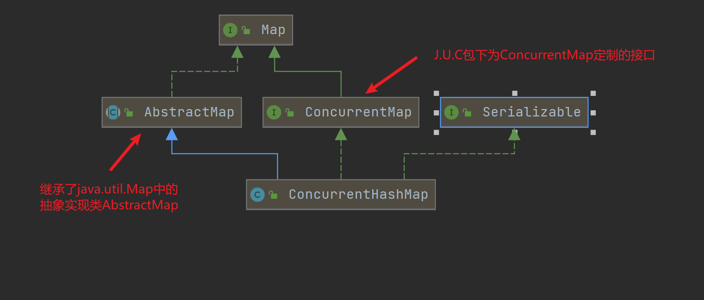
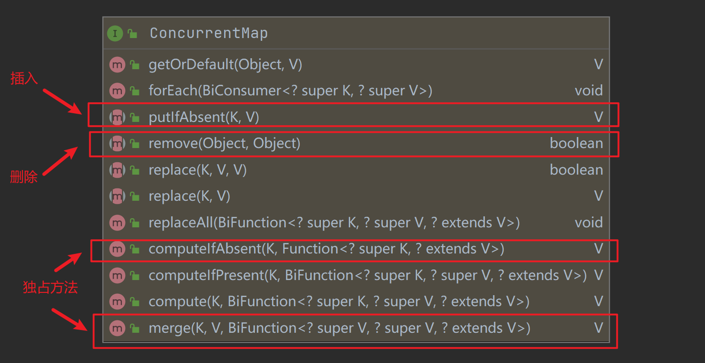
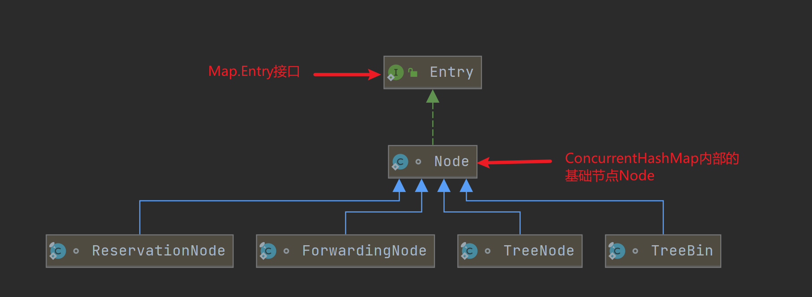
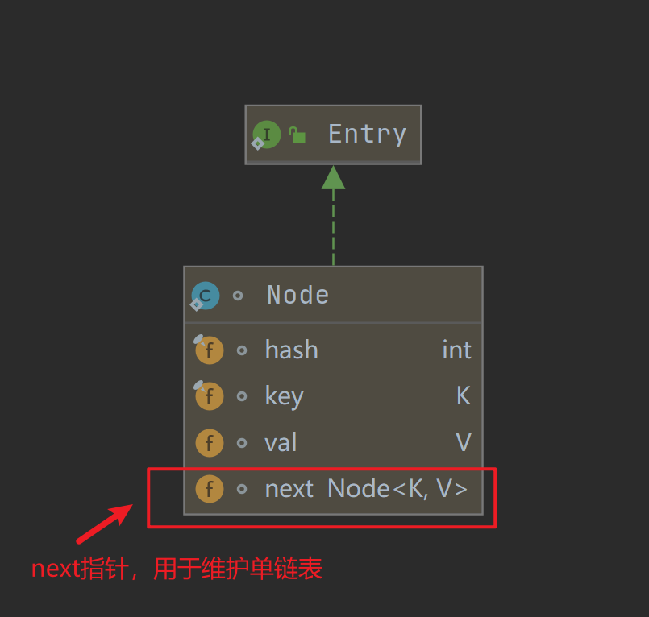
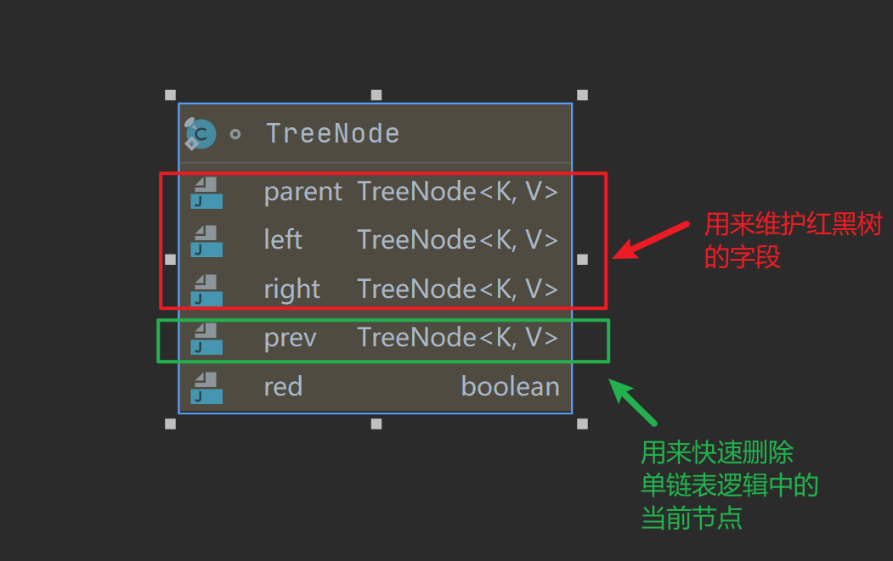

## 前言

本篇主要介绍`ConcurrentHashMap`的基本架构、插入与删除操作的原理，对于它扩容的逻辑，放在第二部分讲解：[ConcurrentHashMap扩容分析](./ConcurrentHashMap-analysis-II.md)。

---

本文旨在介绍J.U.C包下的同步集合`ConcurrentHashMap`。因为Java自带的`HashMap`是线程不安全的，虽然也提供了线程安全的`HashTable`，但是后者是对整个哈希表加锁，势必效率不理想。而`ConcurrentHashMap`细化了锁的粒度，读取、插入、删除操作有可能达到并行的状态。

在具体讲述它的原理之前，我阅读了它相关的注释，非常长，我这里仅摘出我看的内容中比较重要的部分：

>1.More formally, an update operation for a given key bears a happens-before relation with any (non-null) retrieval for that key reporting the updated value

简而言之，`ConcurrentHashMap`的插入操作 happens before 对于同一key的获取操作

>2.Iterators, Spliterators and Enumerations return elements reflecting the state of the hash table at some point at or since the creation of the iterator/enumeration.They do not throw ConcurrentModificationException. However, iterators are designed to be used by only one thread at a time.Bear in mind that the results of aggregate status methods including size, isEmpty, and containsValue are typically useful only when a map is not undergoing concurrent updates in other threads. Otherwise the results of these methods reflect transient states that may be adequate for monitoring or estimation purposes, but not for program control.

对于迭代器、枚举函数之类操作的返回值仅仅是哈希表在某一点的状态，它们不会抛出`ConcurrentModificationException`。并且迭代器应该只用在一个时刻中在一个线程中使用。并且需要注意，当我们想要获取`ConcurrentHashMap`的一些状态时，比如大小，获得的结果仅仅是某一个时刻并且没有其他线程改变的结果，只能用来作为一些监视条件，而**不能用来控制程序的流程**。

>3.Like Hashtable but unlike HashMap, this class does not allow null to be used as a key or value.

`ConcurrentHashMap`和`Hashtable`一样，不支持为null的key或者value。

>4.ConcurrentHashMaps support a set of sequential and parallel bulk operations that, unlike most Stream methods, are designed to be safely, and often sensibly, applied even with maps that are being concurrently updated by other threads; for example, when computing a snapshot summary of the values in a shared registry. There are three kinds of operation, each with four forms, accepting functions with Keys, Values, Entries, and (Key, Value) arguments and/or return values. Because the elements of a ConcurrentHashMap are not ordered in any particular way, and may be processed in different orders in different parallel executions, the correctness of supplied functions should not depend on any ordering, or on any other objects or values that may transiently change while computation is in progress; and except for forEach actions, should ideally be side-effect-free. Bulk operations on Map.Entry objects do not support method setValue.

其实上面这段注释我认为是`ConcurrentHashMap`最有特点的一部分。大致是说`ConcurrentHashMap`可以针对每一个节点开展函数式的批量操作，即使有其他线程在更新map。那么接受函数式操作的方法有三种：

1. forEach
2. search
3. reduce

上述三个方法的函数式操作可以支持四种类型的节点，包括key的类型、value的类型、Entry的类型或者返回值的类型进行操作。并且函数式的操作不应该依赖元素的顺序，也不应该依赖其他元素或者对象。

---

分界线，`ConcurrentHashMap`的注释真是太长了，暂时就先看到这吧。对于本文来说，主要内容分为三个部分：

1. `ConcurrentHashMap`的整体架构
2. `ConcurrentHashMap`的基本操作原理，包括插入、删除、获取等操作
3. `ConcurrentHashMap`的计数操作

## 1. 整体架构

对于`ConcurrentHashMap`，我们可以通过它实现的接口与继承的父类做一个初步的了解，如下所示：



可以看到，`ConcurrentHashMap`与`HashMap`类似，通过继承抽象实现类`AbstractMap`完成了一个map应该有的大部分通用方法。当然，`ConcurrentHashMap`也实现了自定义的接口`ConcurrentMap`来完成一些特有的操作，如下所示：



可以看到，虽然是特有接口，但是很多方法跟`HashMap`的方法重名了。那么它到底是如何保证线程安全的？与`HashMap`到底有什么异同？回答这个问题前，我们应该需要了解一下它的插入与删除操作。

## 2. 插入操作原理

对于插入的操作，我们应该首先应该知道我们插入的是什么，然后再去梳理具体的插入逻辑。`ConcurrentHashMap`中的节点类型比较丰富，总计分为五种，详情请见下一小节。

### 2.1 节点类型

`ConcurrentHashMap`的五种节点类型分别是：Node，TreeNode，TreeBin、ForwardingNode、ReservationNode，它们的关系如下所示：



从上图可以看到，虽然节点类型丰富，但是都是继承自`Node`类，而`Node`类又实现了`Map.Entry`接口。其实我们可以对比`HashMap`中的`Node`类型，基本逻辑差不多。

**I. Node类型**

对于`Node`类型，它是整个`ConcurrentHashMap`中的基础节点，它通过`next`指针将发生哈希冲突的节点维护到一起，该节点字段如下所示：



**II. TreeNode类型**

对于`TreeNode`类型，其实它跟`HashMap`类似，是红黑树中的基础节点。只不过它并没有放弃维护单链表的属性，所以对于每一个节点它维护了一个`prev`指针，方便快速在单链表逻辑中删除对应的节点，字段如下所示：



**III. TreeBin类型**

`TreeBin`节点，是`TreeNode`的代理节点，提供针对红黑树的转换操作和锁控制，哈希值固定为“-2”。也就是说，如果我们在一个桶中使用红黑树存储产生哈希冲突的元素，与`HashMap`不同，红黑树的根节点并不直接存储在table中。而是存储的是一个对应的代理节点`TreeBin`，`TreeBin`实现了关于红黑树的读写锁。具体字段含义如下所示：

``` java
static final class TreeBin<K,V> extends Node<K,V> {
    TreeNode<K,V> root; //红黑树逻辑下的根节点
    volatile TreeNode<K,V> first;//链表逻辑下的头节点
    volatile Thread waiter; // 最近一个设置锁状态的线程（从网上抄的，这个我不确定）
    volatile int lockState;//当前读写锁的状态
    // values for lockState
    static final int WRITER = 1; // set while holding write lock，持有写锁时状态为1
    static final int WAITER = 2; // set when waiting for write lock，等待写锁时状态为2
    static final int READER = 4; // increment value for setting read lock，每当一个线程获取到读锁时，就会将锁状态加4
    ...
}
```

**III. ForwardingNode**

扩容时的标记节点。具体原理在扩容时再分析，哈希值固定为“-1”。

**IV. ReservationNode**

保留结点，ConcurrentHashMap中的一些特殊方法会专门用到该类结点，哈希值固定为“-3”。

### 2.2 具体的插入逻辑

`ConcurrentHashMap`插入操作大体逻辑上与`HashMap`的插入并没有什么太大的区别，只不过前者在Java1.8及以后会使用`synchronized`对哈希表中的某一个桶加锁，从而实现局部加锁的效果，加锁的位置我在代码中已经明显注释为**lock**，如下所示：

``` java
final V putVal(K key, V value, boolean onlyIfAbsent) {
    if (key == null || value == null) throw new NullPointerException();
    int hash = spread(key.hashCode());
    int binCount = 0;
    for (Node<K,V>[] tab = table;;) {
        Node<K,V> f; int n, i, fh;
        //采用懒加载模式，如果table为空，那么则会初始化table
        if (tab == null || (n = tab.length) == 0)
            tab = initTable();
        //走到这表示table不为空，查找当前key对应的桶索引

        //如果对应的桶为空，表示当前是一个插入操作
        else if ((f = tabAt(tab, i = (n - 1) & hash)) == null) {
            //如果cas插入失败，表示当前桶此刻已经有元素了，需要走后面的逻辑重新插入
            if (casTabAt(tab, i, null,
                            new Node<K,V>(hash, key, value, null)))
                break;                   // no lock when adding to empty bin
        }
        //发现ForwardingNode结点，说明此时table正在扩容，则尝试协助数据迁移
        else if ((fh = f.hash) == MOVED)
            tab = helpTransfer(tab, f);
        else {
            V oldVal = null;
            /****************************************************************************
            *                                 lock                                       *
            *对桶中的第一个节点f进行加锁，这样就保证了在不操作同一个桶的情况下，可以实现读写并发*
            *****************************************************************************/
            synchronized (f) {
                if (tabAt(tab, i) == f) {
                    //判断当前桶的存储模式是链表还是红黑树
                    //因为红黑树的代理节点TreeBin的哈希值固定为-1
                    //所以如果桶中的第一个节点哈希值>=0，说明当前存储模式为链表
                    if (fh >= 0) {
                        binCount = 1;
                        for (Node<K,V> e = f;; ++binCount) {
                            K ek;
                            if (e.hash == hash &&
                                ((ek = e.key) == key ||
                                    (ek != null && key.equals(ek)))) {
                                oldVal = e.val;
                                if (!onlyIfAbsent)
                                    e.val = value;
                                break;
                            }
                            Node<K,V> pred = e;
                            if ((e = e.next) == null) {
                                pred.next = new Node<K,V>(hash, key,
                                                            value, null);
                                break;
                            }
                        }
                    }
                    //hash<0，判断桶中第一个元素是否为TreeBin，有可能正在发生扩容
                    else if (f instanceof TreeBin) {
                        Node<K,V> p;
                        binCount = 2;
                        if ((p = ((TreeBin<K,V>)f).putTreeVal(hash, key,
                                                        value)) != null) {
                            oldVal = p.val;
                            if (!onlyIfAbsent)
                                p.val = value;
                        }
                    }
                }
            }
            //当链表过长时，会尝试进行树化，这个hashmap几乎是一样的
            if (binCount != 0) {
                if (binCount >= TREEIFY_THRESHOLD)
                    treeifyBin(tab, i);
                if (oldVal != null)
                    return oldVal;
                break;
            }
        }
    }
    addCount(1L, binCount);
    return null;
}
```

其实除了操作每一个桶的时候会加同步锁，其他与`HashMap`插入键值对的流程几乎一致。但是更新`ConcurrentHashMap`容量的逻辑就完全不同。

`ConcurrentHashMap`统计大小的逻辑类似于原子类`LongAdder`自增方法`longAccumulate(long,LongBinaryOperator,boolean)`的分段计数原理。所谓的分段计数就是说，如果在更新map容量时候发生了冲突，那么`ConcurrentHashMap`提供了一个`baseCount`属性，然后分配一个数组`CounterCell[]`，用来保存多个线程各自新增的增量（所谓的增量就是当前线程往map中添加了几个元素）。那么最后整个map的大小就等于`baseCount`加上每个线程专属的增量。

那么**为什么**要这么做？答案很明显：提高并发效率。思考一个场景：
当多个线程插入操作很频繁，因为只有在更新map大小之后才表示插入完成。如果直接对`size`属性加锁，那么冲突的概率的是比较大的。上面的数组思路就是将`size`的值分散到数组中各线程对应的槽位，那么当需要获得`size`时，只需要将每个槽位求和获得总增量，再与基数`baseCount`相加就获得了真正的容量。将属性`size`这样一个热点数据分散，降低冲突的概率，能够更快的完成插入操作。

当然，`ConcurrentHashMap`仅仅会在万不得已发生冲突的情况下，才会采用分散热点数据的逻辑。不冲突时直接将增量加到基数上即可。`addCount(long,in)`。下面是`ConcurrentHashMap`扩容时的具体逻辑：

``` java "addCount"
/*
调用该方法尝试进行扩容时，首先会计算当前map的最新容量，接着才会尝试进行扩容
*/
private final void addCount(long x, int check) {
    CounterCell[] as; long b, s;
    //如果CounterCell为null，表示计数过程没有发生过冲突，那么直接累加到原始容量就行了
    if ((as = counterCells) != null ||
        //如果counterCells为空，那么直接尝试CAS更新容量
        //下面的cas参数分别为：[对象地址]，[字段偏移]，[期望旧值]，[更新值]
        !U.compareAndSwapLong(this, BASECOUNT, b = baseCount, s = b + x)) {

        //如果cas失败，说明更新容量时发生了冲突，那么则采用类似于分段计算的逻辑
        CounterCell a; long v; int m;
        boolean uncontended = true;
        if (as == null || (m = as.length - 1) < 0 ||
            //如果CounterCells不为空，那么就类似于HashMap，使用(hash&(n-1))计算当前线程的槽索引
            //最后获得对应的cellValue
            (a = as[ThreadLocalRandom.getProbe() & m]) == null ||
            //如果计算槽索引成功，那么就尝试使用CAS更新对应的cellValue，否则表示CounterCell对象还未构造
            //如果更新成功，那么就会将各个CounterCell的值加起来，最后的结果就是整个map的大小
            //如果更新失败，那么就会执行fullAddCount
            !(uncontended =
                U.compareAndSwapLong(a, CELLVALUE, v = a.value, v + x))) {
            
            fullAddCount(x, uncontended);
            return;
        }
        if (check <= 1)
            return;
        //计算一下插入后的最新大小
        s = sumCount();
    }
    //下半部分用来处理扩容的逻辑，可以暂时无视
    if (check >= 0) {
        Node<K,V>[] tab, nt; int n, sc;
        //如果当前table的大小已经超过了扩容阈值
        while (s >= (long)(sc = sizeCtl) && 
        (tab = table) != null &&
        //并且当前table的大小还未超过最大值
        //那么就会走一个扩容的逻辑
        (n = tab.length) < MAXIMUM_CAPACITY) {
            int rs = resizeStamp(n);
            if (sc < 0) {
                if ((sc >>> RESIZE_STAMP_SHIFT) != rs || sc == rs + 1 ||
                    sc == rs + MAX_RESIZERS || (nt = nextTable) == null ||
                    transferIndex <= 0)
                    break;
                if (U.compareAndSwapInt(this, SIZECTL, sc, sc + 1))
                    transfer(tab, nt);
            }
            else if (U.compareAndSwapInt(this, SIZECTL, sc,
                                            (rs << RESIZE_STAMP_SHIFT) + 2))
                transfer(tab, null);
            s = sumCount();
        }
    }
}
```

根据上面的代码我梳理了一下`addCount()`的逻辑，如下所示：


`addCount(long,int)`的逻辑可以划分为三部分：

1. 如果`CounterCell`数组为空，那么会尝试直接更新基数`baseCount`
2. 如果`CounterCell`数组不为空，那么会尝试直接更新对应的`CounterCell`对象
3. 最坏情况下调用`fullAddCount`重新构造`CounterCell`对象

`fullAddCount(long,boolean)`的逻辑还是比较复杂的，它会负责`CounterCell`数组的初始化以及当前线程对应`CounterCell`的更新，代码如下所示：

``` java
/*
这个函数作用就是在当前线程对应的槽位更新cell对象，但是并不负责计算map最后的大小

有很多场景能用到这个函数，包括：
1. CounterCell数组未初始化
2. 对应槽位的CounterCell未初始化
3. CounterCell初始化，但是修改value时CAS失败

其中属性cellBusy是专门为该函数准备的自旋锁，在扩容或者构造新cell时使用
wasCounttended表示进入这个函数原因是是否未更新对应CounterCell对象失败，true为不是因为失败
*/
private final void fullAddCount(long x, boolean wasUncontended) {
    int h;
    //如果当前线程的hash值还为准备好，那么强制初始化
    if ((h = ThreadLocalRandom.getProbe()) == 0) {
        ThreadLocalRandom.localInit();      // force initialization
        h = ThreadLocalRandom.getProbe();
        wasUncontended = true;
    }
    boolean collide = false;                // True if last slot nonempty
    for (;;) {
        CounterCell[] as; CounterCell a; int n; long v;
        //case1:如果CounterCell数组已经初始化好了
        if ((as = counterCells) != null && (n = as.length) > 0) {
            //对应槽位的CounterCell对象没有初始化，或者正在扩容，那么尝试构造新的Cell
            if ((a = as[(n - 1) & h]) == null) {
                //如果当前没有线程持有互斥锁
                if (cellsBusy == 0) {            // Try to attach new Cell
                    //先构造好一个cell对象
                    CounterCell r = new CounterCell(x); // Optimistic create
                    //尝试获取自旋锁cellsBusy
                    if (cellsBusy == 0 &&
                        U.compareAndSwapInt(this, CELLSBUSY, 0, 1)) {
                        boolean created = false;
                        try {               // Recheck under lock
                            CounterCell[] rs; int m, j;
                            //再次检查cell数组是否为空
                            if ((rs = counterCells) != null &&
                                (m = rs.length) > 0 &&
                                rs[j = (m - 1) & h] == null) {
                                //在cell数组的对应槽位上赋值我们先构造好的cell对象
                                rs[j] = r;
                                //cell对象创建成功，那么可以退出循环了
                                created = true;
                            }
                        } finally {
                            //释放自旋锁
                            cellsBusy = 0;
                        }
                        //如果创建cell对象成功，那么则退出循环
                        if (created)
                            break;
                        //对应的槽位已经不为空了
                        continue;           // Slot is now non-empty
                    }
                }
                //设置扩容标志
                collide = false;
            }

            //走到这说明对应槽位的cell对象已经构造好了
            //那么就判断进入这个函数的原因是不是因为更新对应cell的时候发生冲突
            else if (!wasUncontended)       // CAS already known to fail
                //如果是因为更新时cas发生冲突，那么就尝试进行一次rehash更新线程的hash值，并且只会更新一次
                wasUncontended = true;      // Continue after rehash

            //在rehash之后尝试进行cas操作
            else if (U.compareAndSwapLong(a, CELLVALUE, v = a.value, v + x))
                break;
            //如果cell数组扩容了，或者大小已经超过了核心处理器数量，那么对于当前线程来说不会再扩容了
            else if (counterCells != as || n >= NCPU)
                //设置扩容标志，设为false只会走下面的else-if，不可能到达后面的扩容逻辑
                collide = false;            // At max size or stale
            else if (!collide)
                collide = true;
            
            //尝试加锁扩容
            else if (cellsBusy == 0 &&
                        U.compareAndSwapInt(this, CELLSBUSY, 0, 1)) {
                try {
                    //执行CounterCells数组扩容操作
                    if (counterCells == as) {// Expand table unless stale
                        CounterCell[] rs = new CounterCell[n << 1];
                        for (int i = 0; i < n; ++i)
                            rs[i] = as[i];
                        counterCells = rs;
                    }
                } finally {
                    cellsBusy = 0;
                }
                //设置扩容标志
                collide = false;
                continue;                   // Retry with expanded table
            }

            //重新计算当先线程的hash值
            h = ThreadLocalRandom.advanceProbe(h);
        }
        //case2:CounterCell数组没有被加锁，并且没有初始化
        else if (cellsBusy == 0 && counterCells == as &&
                    U.compareAndSwapInt(this, CELLSBUSY, 0, 1)) {
            boolean init = false;
            //那么则尝试进行初始化
            try {                           // Initialize table
                //再次判断cell数组没有被初始化
                if (counterCells == as) {
                    //构造一个长度为2的cell数组，因为至少有两个线程竞争更改容量，才会进入这个函数
                    CounterCell[] rs = new CounterCell[2];
                    //在当前线程的槽位上构造cell对象
                    rs[h & 1] = new CounterCell(x);
                    counterCells = rs;
                    init = true;
                }
            } finally {
                //释放自旋锁
                cellsBusy = 0;
            }
            //如果成功初始化，说明cell对象也构造好了，那么则退出循环
            if (init)
                break;
        }
        //case3:CounterCell数组正在初始化，因为获取自旋锁CELLBUSY失败，则尝试直接在原来的baseCount上累加
        else if (U.compareAndSwapLong(this, BASECOUNT, v = baseCount, v + x))
            break;                          // Fall back on using base
    }
}

```

整个`fullAddCount()`的逻辑可以划分为三个case（详情见注释）：

1. case1：如果`CounterCell`数组已经初始化好了，那么直接尝试在当前线程对应槽位更新`CounterCell`对象
2. case2：`CounterCell`数组没有初始化，也没有加锁，那么会构建一个长度为2的`CounterCell`数组，因为至少存在两个同时更新的线程才会发生冲突
3. case3：`CounterCell`正在进行初始化或扩容，那么则直接尝试更新`baseCount`

其中我认为`case1`的情况稍微复杂点，我这里展示一下它的流程图：



流程图可能有疏漏，后续再精进吧。

### 2.3 计数更新逻辑

上面说了那么多如何更新基数`baseCount`与`CounterCell`数组，那么`ConcurrentHashMap`到底是如何利用这两个属性计算当前table的大小呢？答案就在`size()`函数中，如下所示：

``` java
public int size() {
    long n = sumCount();
    return ((n < 0L) ? 0 :
            (n > (long)Integer.MAX_VALUE) ? Integer.MAX_VALUE :
            (int)n);
}
final long sumCount() {
    CounterCell[] as = counterCells; CounterCell a;
    long sum = baseCount;
    if (as != null) {
        for (int i = 0; i < as.length; ++i) {
            if ((a = as[i]) != null)
                sum += a.value;
        }
    }
    return sum;
}
```

`size()`方法的逻辑很简单，调用`sumCount()`方法。而`sumCount()`的逻辑就是将`counterCells`数组中的每个值累加到`baseCount`上，最后的结果就是`ConcurrentHashMap`在某一时刻的值，因为`size()`方法并不是线程安全的，有可能我们正在计数的时候，其他线程正在更改`counterCells`数组。

### 2.4 扩容逻辑

扩容实际上是靠`addCount()`的后半部分来完成的，如果在`addCount`中，当前线程发现table的大小已经超过了扩容阈值，才会走一个迁移数据的逻辑，这里和`tryPresize()`的中调用`transfer`迁移逻辑完全一样，我在[ConcurrentHashMap扩容分析](./ConcurrentHashMap-analysis-II.md)中已经详细解释了，这里不在赘述。

``` java
private final void addCount(long x, int check){
    ...
    //下半部分用来处理扩容的逻辑，可以暂时无视
    if (check >= 0) {
        Node<K,V>[] tab, nt; int n, sc;
        //如果当前table的大小已经超过了扩容阈值
        while (s >= (long)(sc = sizeCtl) && 
        (tab = table) != null &&
        //并且当前table的大小还未超过最大值
        //那么就会走一个扩容的逻辑
        (n = tab.length) < MAXIMUM_CAPACITY) {
            int rs = resizeStamp(n);
            if (sc < 0) {
                if ((sc >>> RESIZE_STAMP_SHIFT) != rs || sc == rs + 1 ||
                    sc == rs + MAX_RESIZERS || (nt = nextTable) == null ||
                    transferIndex <= 0)
                    break;
                if (U.compareAndSwapInt(this, SIZECTL, sc, sc + 1))
                    transfer(tab, nt);
            }
            else if (U.compareAndSwapInt(this, SIZECTL, sc,
                                            (rs << RESIZE_STAMP_SHIFT) + 2))
                transfer(tab, null);
            s = sumCount();
        }
    }
}
```

## 3. 删除操作原理

删除操作就比较简单了，核心函数是`replaceNode(object,V,Object)`，该函数实现了两种功能：

1. 更新旧值
2. 删除键值对

那么具体采用哪种操作取决于第三个参数`cv`，当不为null时则表示当前操作是更新旧值操作。具体逻辑如下所示：

``` java
public V remove(Object key) {
    return replaceNode(key, null, null);
}

/**
* Implementation for the four public remove/replace methods:
* Replaces node value with v, conditional upon match of cv if
* non-null.  If resulting value is null, delete.
*/
/*该函数实现了替换旧值或者删除节点的操作
如果cv不为空，则表示当前是替换旧值的操作
*/
final V replaceNode(Object key, V value, Object cv) {
    int hash = spread(key.hashCode());
    for (Node<K,V>[] tab = table;;) {
        Node<K,V> f; int n, i, fh;
        //计算当前key对应的桶索引
        if (tab == null || (n = tab.length) == 0 ||
            (f = tabAt(tab, i = (n - 1) & hash)) == null)
            break;
        //如果当前table正在扩容，那么尝试协助
        else if ((fh = f.hash) == MOVED)
            tab = helpTransfer(tab, f);
        else {
            V oldVal = null;
            boolean validated = false;
            //与插入类似，先对当前key所在的桶加锁
            synchronized (f) {
                if (tabAt(tab, i) == f) {
                    //如果当前桶采用链表存储
                    if (fh >= 0) {
                        ...
                    }
                    //如果当前桶采用红黑树存储
                    else if (f instanceof TreeBin) {
                        ...
                    }
                }
            }
            if (validated) {
                if (oldVal != null) {
                    if (value == null)
                        //如果是删除操作，那么需要更新大小
                        addCount(-1L, -1);
                    return oldVal;
                }
                break;
            }
        }
    }
    return null;
}
```

实在没什么好说的，只不过在插入的时候，类似的，如果发现当前处理的桶正在扩容，那么就会调用`helpTransfer()`作为协助者进行数据迁移。并且在删除后会调用`addCount`更新大小。

## 4. 疑问

1. 为什么在Java1.8之后，`ConcurrentHashMap`采用`synchronized`而放弃了分段锁？

通过  JDK 的源码和官方文档看来， 他们认为的弃用分段锁的原因由以下几点：

- 加入多个分段锁浪费内存空间。
- 生产环境中， map 在放入时竞争同一个锁的概率非常小，分段锁反而会造成更新等操作的长时间等待。
- 为了提高 GC 的效率

## 参考文章

1. [Java多线程进阶（二三）—— J.U.C之collections框架：ConcurrentHashMap(1) 原理](https://segmentfault.com/a/1190000016096542)