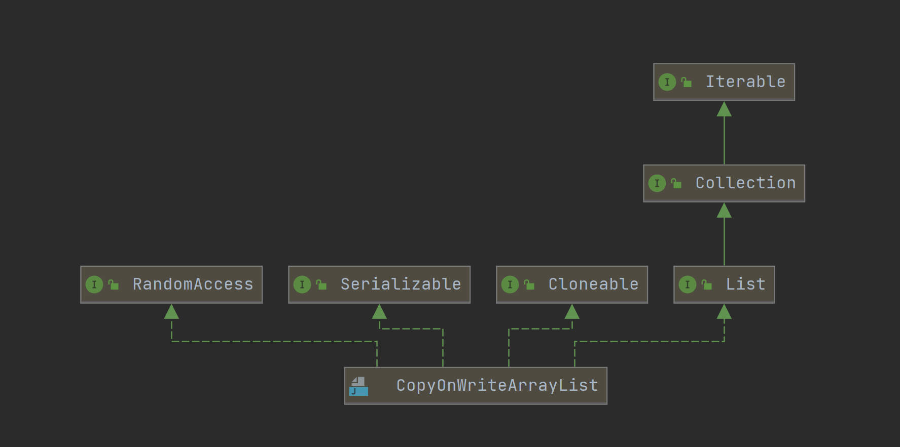
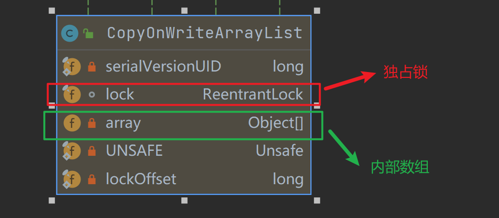

## 1. 预备知识

`J.U.C`包提供了两种copy-on-wirte容器：`CopyOnWriteList`与`CopyOnWriteSet`。不了解copy-on-write技术的，可以去看[理解 Copy On Write 技术](http://wsfdl.com/algorithm/2016/09/29/Copy_on_write.html)。

`CopyOnWriteList`是`ArrayList`线程安全的版本。所有更改`CopyOnWriteList`内容的操作都基于copy-on-write，对于同一个元素，插入操作happens before读取操作。而`CopyOnWriteSet`与我们常见的set不同，它内部不是通过计算hash值找到对应的元素，而是内部维护了一个`CopyOnWriteList`。

本篇文章将分别解析`CopyOnWriteList`和`CopyOnWriteSet`。

## 2. CopyOnWriteList解析

了解一个类，第一步应该是学习它的继承体系。`CopyOnWriteList`的继承体系比较简单，实现了`utils`包下的`List`接口，并支持随机访问、序列化、克隆等功能，继承关系如下所示：



`CopyOnWriteList`本身的属性也比较简单，如下所示：



一般我们关注是独占锁与内部数组。内部数组是真正存储元素的地方，而独占锁保证了各线程互斥地访问。

### 2.1 添加操作

`CopyOnWriteList`的增加逻辑主要由`add`方法完成，对于每次添加，都会上锁，否则会造成多个线程同时添加时复制出多份原数组。我这里就不细说了，下面的代码一看就懂：

``` java
/**
* Appends the specified element to the end of this list.
*
* @param e element to be appended to this list
* @return {@code true} (as specified by {@link Collection#add})
*/
public boolean add(E e) {
    final ReentrantLock lock = this.lock;
    lock.lock();
    try {
        Object[] elements = getArray();
        int len = elements.length;
        Object[] newElements = Arrays.copyOf(elements, len + 1);
        newElements[len] = e;
        setArray(newElements);
        return true;
    } finally {
        lock.unlock();
    }
}
```

### 2.2 删除操作

对于删除逻辑，其实和添加逻辑差不多。第一步先上锁，然后删除目标元素，最后再将剩余元素拷贝到新数组中，代码如下所示：

``` java
/**
* Removes the element at the specified position in this list.
* Shifts any subsequent elements to the left (subtracts one from their
* indices).  Returns the element that was removed from the list.
*
* @throws IndexOutOfBoundsException {@inheritDoc}
*/
public E remove(int index) {
    final ReentrantLock lock = this.lock;
    lock.lock();
    try {
        Object[] elements = getArray();
        int len = elements.length;
        E oldValue = get(elements, index);
        int numMoved = len - index - 1;
        //拷贝数组
        if (numMoved == 0)
            setArray(Arrays.copyOf(elements, len - 1));
        else {
            Object[] newElements = new Object[len - 1];
            System.arraycopy(elements, 0, newElements, 0, index);
            System.arraycopy(elements, index + 1, newElements, index,
                                numMoved);
            setArray(newElements);
        }
        return oldValue;
    } finally {
        lock.unlock();
    }
}
```

### 2.3 查询操作

查询可以通过两种方法：

1. `get(int)`方法
2. 迭代器

第一种方法没什么好说的，不用上锁，直接读取即可，如下所示：

``` java
/**
* {@inheritDoc}
*
* @throws IndexOutOfBoundsException {@inheritDoc}
*/
public E get(int index) {
    return get(getArray(), index);
}
private E get(Object[] a, int index) {
    return (E) a[index];
}
```

迭代器遍历的方式还稍微有趣一点，`CopyOnWriteList`的迭代器会对当前内部数组做一个快照，所谓的快照并不是指真正的复制一份，而是持有一个旧数组的引用，在逻辑上做了一个“snapshot”，所以不会抛出`ConcurrentModificationException`，**但是仍然不支持在迭代器修改**。如下所示：

``` java
public Iterator<E> iterator() {
    return new COWIterator<E>(getArray(), 0);
}

static final class COWIterator<E> implements ListIterator<E> {
    /** Snapshot of the array */
    private final Object[] snapshot;
    //游标
    private int cursor;

    private COWIterator(Object[] elements, int initialCursor) {
        cursor = initialCursor;
        //持有旧数组的引用，迭代器只会遍历旧数组的元素
        snapshot = elements;
    }
    ...
}
```

## 3. CopyOnWriteSet解析

`CopyOnWriteSet`通过内部维护的`CopyOnWriteList`实现了copy-on-write，如下所示：

``` java
public class CopyOnWriteArraySet<E> extends AbstractSet<E>
        implements java.io.Serializable {
    private static final long serialVersionUID = 5457747651344034263L;

    private final CopyOnWriteArrayList<E> al;

    /**
     * Creates an empty set.
     */
    public CopyOnWriteArraySet() {
        al = new CopyOnWriteArrayList<E>();
    }
    ...
}
```

那么`CopyOnWriteSet`的插入、查询、操作完全依赖`CopyOnWriteList`。根本没有用到哈希的概念，所以这里就不再赘述了。

## 4. 总结

CopyOnWriteArrayList的思想和实现整体上还是比较简单，它适用于处理“读多写少”的并发场景。通过上述对CopyOnWriteArrayList的分析，读者也应该可以发现该类存在的一些问题：

1. 内存的使用
由于CopyOnWriteArrayList使用了“写时复制”，所以在进行写操作的时候，内存里会同时存在两个array数组，如果数组内存占用的太大，那么可能会造成频繁GC,所以CopyOnWriteArrayList并不适合大数据量的场景。

2. 数据一致性
CopyOnWriteArrayList只能保证数据的最终一致性，不能保证数据的实时一致性——读操作读到的数据只是一份快照。所以如果希望写入的数据可以立刻被读到，那CopyOnWriteArrayList并不适合。

而CopyOnWriteSet因为内部维护了CopyOnWriteList，所以二者的优缺点差不多。

## 参考文章

1. [JAVA中的COPYONWRITE容器](https://coolshell.cn/articles/11175.html#%E4%BB%80%E4%B9%88%E6%98%AFCopyOnWrite%E5%AE%B9%E5%99%A8)
2. [Java多线程进阶（二七）——J.U.C之collections框架：CopyOnWriteArrayList](https://segmentfault.com/a/1190000016214572)