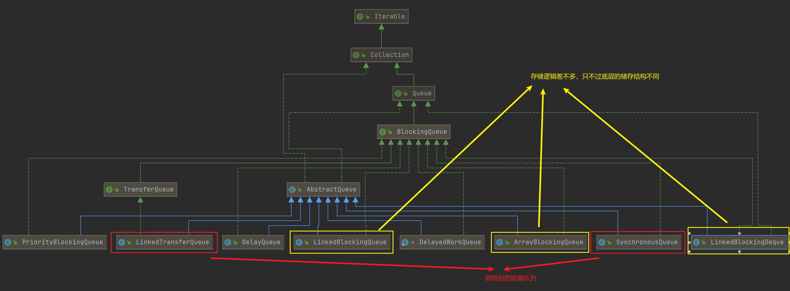
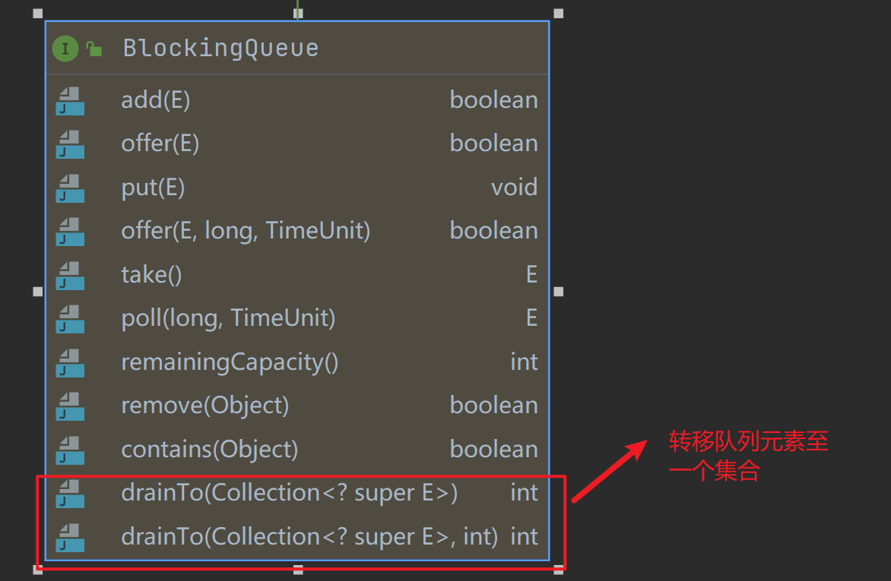

## 1. 基本概念

`BlockingQueue`接口，提供了一组集合，一般用在生产者消费者模式中。它能搞保证在多线程环境下：当队列为空时，消费者线程会等待直到队列不空；当队列满时，生产者会等待直到队列不满。该接口提供了四种存储与删除模式：

|    /    | 操作失败抛出异常 | 操作失败返回特殊值 | 操作失败阻塞线程 | 操作具有时间限制 |
| ---------- | --- | --- | --- | --- |
| 插入操作 |  add(e) |  offer(e) |  put(e) |  offer(e,time,unit) |
| 删除操作 |  remove() |  poll(e) |  take(e) |  poll(time,unit) |
| 查询操作 |  element() |  peek(e) |  / |  / |

并且`BlockingQueue`和`ConcurrentHashMap`一样不允许插入`null`，因为`null`代表着`poll()`方法失败。同时对于同一元素，`BlockingQueue`的插入操作happens before获取操作。

## 2. 体系架构

`BlockingQueue`接口继承自`utils`包下的`Queue`接口，如下所示：

可以看到，所以的阻塞队列都继承了`utils`包下的抽象实现类`AbstracQueue`（负责实现一些队列的核心方法）。阻塞队列的种类非常丰富，我将其按照功能划分为三类：

1. 普通的阻塞队列：所谓的普通阻塞队列，它们的区别只是底层使用的存储结构不同
    - `LinkedBlockingQueue`:底层存储结构为链表
    - `ArrayBlockingQueue`：底层存储为循环数组
    - `PriorityBlockingQueue`：具备阻塞功能的优先级队列
    - `LinkedBlockingDeque`：底层存储结构为链表的双向阻塞队列
2. 转移队列：消费者线程和生产者线程一一匹配，如果还没有消费，那么会将生产者阻塞在队列中，直到有匹配的消费者将节点取出
    - `LinkedTransferQueue`
    - `SynchronousQueue`
3. 延迟队列：队列中的节点只有经过一定延时才能取出、
    - `DelayQueue`
    - `DelayedWorkQueue`

划分标准还有很多，可以按照有锁、无锁、队列有限无限来区分，这里我直接抄个别人的，[分类来源](https://segmentfault.com/a/1190000016460411)：

|   队列特性   | 有界队列  |  似无界队列  |  无界队列  |  特殊队列  |
|  ----  | ----  | ----  | ----  | ----  | ----  |
| 有锁算法  | ArrayBlockingQueue（单锁） | LinkedBlockingQueue（双锁），LinkedBlockingDeque（双锁） | / | PriorityBlockingQueue（单锁），DelayQueue（单锁） |
| 无锁算法  | / | / | / | LinkedTransferQueue | SynchronousQueue |

其中所谓的无锁是指实现中没有显示的使用其他同步锁，只使用了CAS；而有锁则一般都是使用`ReentrantLock`。

## 3. 已声明的方法

`BlockingQueue`与普通队列接口`Queue`所声明的抽象方法大差不差，都规定了一些增删查改的操作，如下所示：

其中一个比较新奇的就是`drainTo()`方法，该方法的主要作用就是将阻塞队列中的节点转移到一个集合中，如果在转移的时候出现错误，那么节点有可能存在于`BlockingQueue`和`Collection`或者都不存在或者仅存在于一处。并且在转移的时候不支持对传入的`Collection`进行修改。

## 4. 总结

BlockingQueue的典型使用场景就是生产者与消费者模式，它的实现种类繁杂，后续我将简要分析各种类型的代表队列，文章列表如下所示：

1. 普通阻塞队列：[LinkedBlockingQueue源码分析](./LinkedBlockingQueue-analysis.md)
2. 转移队列：
    - [LinkedTransferQueue源码分析](./LinkedTransferQueue-analysis.md)
    - [SynchronousQueue源码分析](./SynchronousQueue-analysis.md)
3. 延迟队列：[DelayQueue源码分析](./DelayQueue-analysis.md)