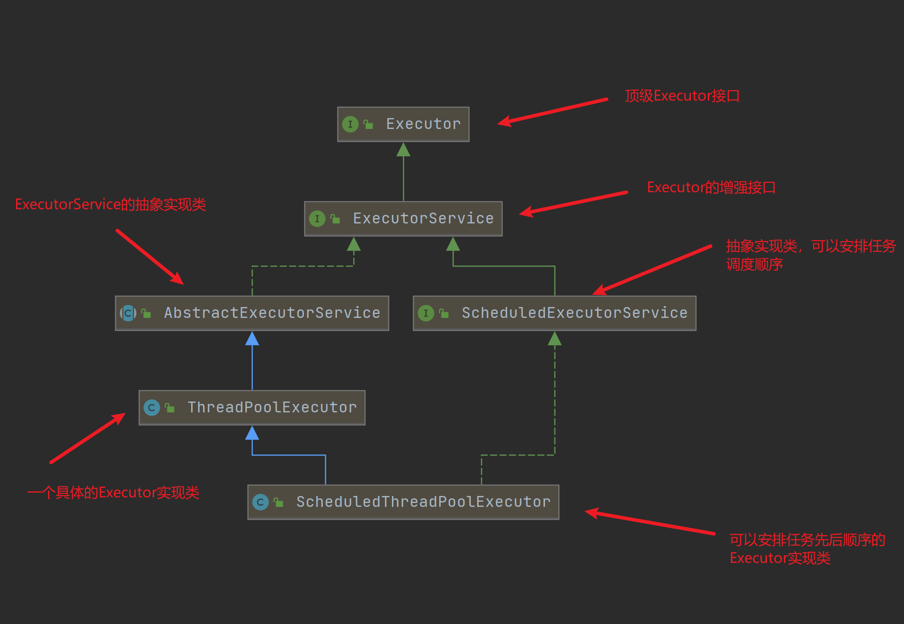
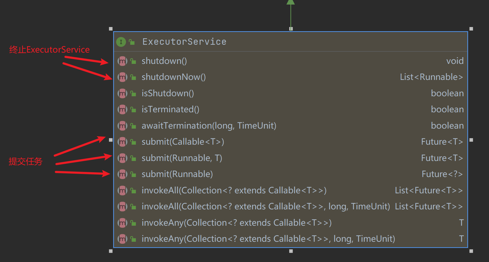
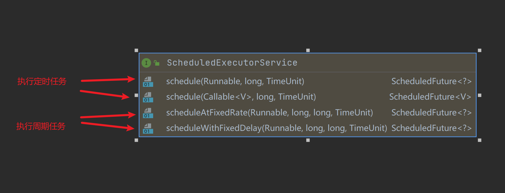
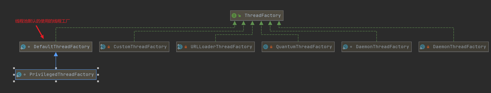

## 1. Executor接口

在JUC包中，还提供了Executor框架用来实现线程池，我们经常使用的线程池都是从Executor派生而来。我们可以看看整个Executor框架的继承结构：



那么在这个框架中，我们第一步应该需要了解它的核心接口`Executor`。这个接口的作用在它的注释中说的很清楚：

>An object that executes submitted Runnable tasks. This interface provides a way of decoupling task submission from the mechanics of how each task will be run, including details of thread use, scheduling, etc. An Executor is normally used instead of explicitly creating threads. For example, rather than invoking new Thread(new(RunnableTask())).start() for each of a set of tasks

这个接口的作用就是让用户专注于线程的任务，至于线程怎么调用的，如何运行的，用户并不需要关心。具体的实现类可以任意实现线程之间的协作。唯一的抽象方法就是`execute`，如下所示：

``` java
public interface Executor {

    /**
     * Executes the given command at some time in the future.  The command
     * may execute in a new thread, in a pooled thread, or in the calling
     * thread, at the discretion of the {@code Executor} implementation.
     *
     * @param command the runnable task
     * @throws RejectedExecutionException if this task cannot be
     * accepted for execution
     * @throws NullPointerException if command is null
     */
    void execute(Runnable command);
}
```

## 2. ExecutorService接口

那么对于Executor的增强类接口`ExecutorService`呢？我们看看它的注释：

>An Executor that provides methods to manage termination and methods that can produce a Future for tracking progress of one or more asynchronous tasks.
An ExecutorService can be shut down, which will cause it to reject new tasks. Two different methods are provided for shutting down an ExecutorService. The shutdown method will allow previously submitted tasks to execute before terminating, while the shutdownNow method prevents waiting tasks from starting and attempts to stop currently executing tasks. Upon termination, an executor has no tasks actively executing, no tasks awaiting execution, and no new tasks can be submitted. An unused ExecutorService should be shut down to allow reclamation of its resources.

上述大致就是ExecutorService作为一个Executor，它提供一些方法用来终止当前对象提供服务以及一些方法用于产生一个**Future**表示异步任务执行的结果。并且一个ExecutorService可以被关闭，但是这可能会导致新任务被迫终止。它提供了两类方法用来终止自身。

- 第一类是`shutdown`方法，这类方法会将停止之前已经提交的任务执行完毕
- 第二类是`shutdownNow`方法，这类方法会将已经提交但未执行的任务直接终止，并且尝试对终止正在执行的任务。

终止后ExecutorService不会存在还在执行的任务，并且也无法提交任务。当我们不再需要ExecutorService时，就应将其关闭，避免资源浪费。

对ExecutorService有了一个初步的认识后，我们看看它提供的一些核心方法：



其实还有一点可以值得关注，就是上述提到的`Future`。这其实也是一个顶级接口，简而言之就是用来保存异步线程执行的结果。后续再详细分析。

### 2.1 AbstractExecuteService

对于ExecutorService接口，JUC提供了一个抽象实现类`AbstractExecutorService`负责实现了一些异步执行任务核心方法的实现，包括`submit`、`invokeAll`、`invokeAny`这三类。并且提供了一个包装函数，能够将提交的任务（callable或者runnable）包装为一个`FutureTask`，如下所示：

``` java
protected <T> RunnableFuture<T> newTaskFor(Callable<T> callable) {
   return new FutureTask<T>(callable);
}
```

所谓的`FutureTask`其实是`Future`接口的实现类，这个我们后续在分析`Future`体系的时候再详细介绍。其实我们应该重点关注提交函数`submit`到底是如何实现的。

``` java
public Future<?> submit(Runnable task) {
   if (task == null) throw new NullPointerException();
   RunnableFuture<Void> ftask = newTaskFor(task, null);
   execute(ftask);
   return ftask;
}
```

从上面得知，`submit`函数的逻辑比较简单，就是将提交后的`Runnable`或者`callable`实现类包装成`FutureTask`后，还是会调用顶级接口的`execute`方法来执行一个具体的任务。这里还是无法得知线程到底是如何调度的。

### 2.2 ScheduledExecutorService

`ScheduledExecutorService`接口的最用其实很简单，正如在它的注释中所写的，用来执行一些定时任务或者周期任务：

>An ExecutorService that can schedule commands to run after a given delay, or to execute periodically.
The schedule methods create tasks with various delays and return a task object that can be used to cancel or check execution. The scheduleAtFixedRate and scheduleWithFixedDelay methods create and execute tasks that run periodically until cancelled.

那么该接口定义四个抽象方法用来提交定时或周期任务：



提交任务后同样会返回一个`Future`接口的实现类`ScheduleFuture`，根据不同的任务安排，`ScheduleFuture`代表的含义不同，具体可以查看API文档。

## 3. 线程池ThreadPoolExecutor

`ThreadPoolExecutor`是一个具体线程池类，它通过继承`AbstractExecutorService`来实现接口`Executor`。该类实现了具体调度线程的方法负责完成提交的任务。并且通过一组参数实现了很强的扩展性，包括：

1. 核心线程数与最大线程数
2. 预先启动核心线程
3. 新线程的生产方式
4. 线程存活时间
5. 阻塞队列
6. 任务的拒绝策略
7. hook方法（在任务执行前后添加代理方法）
8. 线程池的终止策略

### 3.1 核心线程数

因为线程池中的线程数量会根据参数`corePoolSize`和`maximumPoolSize`的大小进行动态调整。当在方法`execute(Runnable)`中提交新任务时：

1. 如果正在运行的线程数量**少于**`corePoolSize`线程时，**即使其他工作线程处于空闲状态**，也会创建一个新线程来处理请求
2. 如果运行的线程数**大于**`corePoolSize`但小于`maximumPoolSize`，则**仅在队列已满时才创建新线程**。

通过将corePoolSize和maximumPoolSize设置为相同的值，可以创建固定大小的线程池。 通过将maximumPoolSize设置为一个本质上不受限制的值（例如Integer.MAX_VALUE），可以允许池容纳任意数量的并发任务。通常，核心和最大池大小仅在构造时设置，但也可以使用setCorePoolSize和setMaximumPoolSize动态更改。

### 3.2 预先启动核心线程

所谓的预先启动核心线程是指：在默认情况下，核心线程的生产条件是有新的任务提交。但是有可能我们在不提交任务的情况下也有启动核心线程的需求。例如假设我们提供的阻塞队列非空，那么在不调用`submit`提交新任务的前提下，需要手动启动核心线程来处理阻塞队列中的任务。

那么手动启动核心线程的操作可以通过`prestartCoreThread`或者`prestartAllCoreThreads`
来完成。

### 3.3 线程的生产模式

所谓的线程的生产模式，也就是当我们存活的线程不足以处理提交的任务，那么我们就需要生产新的线程来处理。那么在`ThreadPoolExecutor`中，维护了一个线程工厂`threadFactory`来生产线程。

在Java中，线程工厂有许多种，如下图所示：



对于`ThreadPoolExecutor`来说，采用的是默认的线程工厂`DefaultThreadFactory`，该线程池创建的所有线程全部都属于同一ThreadGroup中，并且具有相同的NORM_PRIORITY优先级和非守护程序状态。

通过提供不同的ThreadFactory，可以更改线程的名称，线程组，优先级，守护程序状态等。如果ThreadFactory在通过从newThread返回null返回要求时未能创建线程，执行器将继续执行，但可能无法执行 执行任何任务。 线程应具有“ modifyThread” RuntimePermission。 如果线程池的工作线程或其他线程不具有此许可权，则服务可能会降级：配置更改可能不会及时生效，并且关闭池可能保持在可能终止但未完成的状态。

### 3.2 线程的存活时间

一般来说，线程的存活时间一般用来限制非核心线程的数量。

如果池当前具有的核心线程数超过corePoolSize，则多余的线程如果在keepAliveTime的时长内都没有处理任务，那么多余的线程将会被关闭。 我们可以使用`setKeepAliveTime(long，TimeUnit)`方法动态更改此参数。 使用`Long.MAX_VALUE TimeUnit.NANOSECONDS`可以有使空闲线程永远不会在线程池关闭之前终止。

对于线程的存活时间，有一点需要我们注意：**只要keepAliveTime值不为零，调用方法`allowCoreThreadTimeOut(boolean)`可用于将此超时策略应用于核心线程**

### 3.3 阻塞队列

阻塞队列主要用来存储多余的任务，它与线程池交互的逻辑如下：

1. 如果正在运行的线程数量少于`corePoolSize`，则Executor会添加新线程而不是将任务添加到阻塞队列
2. 如果正在运行的线程数量不少于`corePoolSize`，则Executor会选择将新任务添加到阻塞队列而不是创建新线程
3. 如果阻塞队列已满，那么Executor会选择创建一个新线程。如果总的线程数量大于`maximumPoolSize`，那么线程池会执行拒绝策略。

对于阻塞队列如何排队的逻辑，可以细分为三种：

1. **直接交付**。对于工作队列，一个很好的默认选择是SynchronousQueue，它可以将任务移交给线程，而不必另外保留它们。在这里，如果没有立即可用的线程来运行任务，则尝试将其排队的尝试将失败，因此将构造一个新线程。在处理可能具有内部依赖项的请求集时，此策略避免了锁定。直接切换通常需要无限制的maximumPoolSizes以避免拒绝新提交的任务。反过来，当平均而言，命令继续以比其可处理的速度更快到达时，这可能会带来无限线程增长的可能性。

2. **无界队列**。使用无界队列（例如，没有预定义容量的LinkedBlockingQueue）将在所有corePoolSize线程繁忙时使新任务在队列中等待。因此，将仅创建corePoolSize线程。 （因此，maximumPoolSize的值没有任何作用。）当每个任务完全独立于其他任务时，这可能是适当的，因此任务不会影响彼此的执行。例如，在网页服务器中。尽管这种排队方式对于消除短暂的请求突发很有用，但它承认当命令平均继续以比处理速度更快的速度到达时，无限制的工作队列增长是可能的。

3. **有界队列**。与有限的maximumPoolSizes一起使用时，有界队列（例如ArrayBlockingQueue）有助于防止资源耗尽，但调优和控制起来会更加困难。队列大小和最大池大小可能会相互折衷：使用大队列和小容量线程池可以最大程度地减少CPU使用率，操作系统资源和上下文切换开销，但会导致人为地降低吞吐量。如果任务频繁阻塞（例如都是I/O操作），则系统在完成任务时因为阻塞会花费更多的时间。使用小队列大容量线程池，CPU频繁切换线程的开销也是不可忽略的，这同样会降低吞吐量。

### 3.4 拒绝任务的策略

线程池拒绝任务的时机有两种：

1. 当线程池关闭后，线程会拒绝执行提交的任务
2. 当线程池的线程数量已经达到最大，并且阻塞队列也没有空间的时候，线程池会拒绝执行提交的任务。

拒绝的操作由线程池中的`RejectedExecutionHandler`属性来完成。那么具体的拒绝逻辑又可以分为四种：

1. **ThreadPoolExecutor.AbortPolicy**：这是线程池的**默认**拒绝策略。该策略在拒绝时会抛出运行时异常RejectedExecutionException。
2. **ThreadPoolExecutor.CallerRunsPolicy**：该策略就是在线程池**未关闭时**直接调用`Runnable`实现类的`run`执行任务。这提供了一种简单的反馈控制机制，该机制将减慢新任务的提交速度。
3. **ThreadPoolExecutor.DiscardPolicy**：直接忽略当前提交的任务
4. **ThreadPoolExecutor.DiscardOldestPolicy**：如果线程池未关闭，则会抛弃阻塞队列头部的任务，然后重新尝试让线程池执行当前任务（该操作可能再次失败，导致重复执行此操作）。

当然我们自己也可以实现自定义拒绝策略，不过需要注意，策略只能在阻塞队列容量一定的情况下才生效。

### 3.5 可hook方法

`ThreadPoolExecutor`内部提供了可以被override的`beforeExecute(Thread,Runnable)`和`afterExecute(Runnable,Throwable)`，这两个方法会在每个任务执行前后调用。这两个hook函数可以用来执行一些特殊操作。 例如，重新初始化ThreadLocals，收集统计信息或添加日志。 另外，一旦执行程序完全终止，可以终止方法终止以执行需要执行的任何特殊处理。

并且`ThreadPoolExecutor`也提供了可被override的`terminated()`方法。这个方法一般用来进行一些特殊操作（当然只能一次），当Executor被完全关闭的时候。
如果钩子或回调方法引发异常，内部工作线程可能进而失败并突然终止。

**当然如果这些hook函数内部抛出了异常，那么工作线程可能会出现不可预知的错误。**

Queue maintenance
Method getQueue() allows access to the work queue for purposes of monitoring and debugging. Use of this method for any other purpose is strongly discouraged. Two supplied methods, remove(Runnable) and purge are available to assist in storage reclamation when large numbers of queued tasks become cancelled.

### 3.6 线程池的回收

如果一个线程池没有被引用，并且池内**没有存活线程**的情况下，线程池会自动关闭。那么如何保证在不使用线程池的情况下，池内没有存活线程才是关键。那么这个问题有两种解决方法：

1. 不设置线程池的核心线程数量，那么对于临时申请的工作线程会自动关闭。
2. 调用`allowCoreThreadTimeOut(boolean)`，允许核心线程存在过期机制

## 4. 系统提供的线程池

可以看到，前文提到线程池的参数是多样化的，那么为了适用于不同的生产环境，JUC提供了一个`Executor`工厂：`Exexutors`类，这个类通过预定义不同的参数生产一些适用于不同场景的线程池，包括：

1. `Executors.newCachedThreadPool`：无限制线程池，并且可以自动回收
2. `Executors.newFixedThreadPool`：线程数量固定
3. `Executors.newSingleThreadExecutor`：只有一个线程的线程池

## 5. 小结

本篇简要叙述了JUC中的Executor框架，以及两个核心接口`Executor`、`ExecutorService`。并且简单介绍了线程池实现类`ThreadPoolExecutor`的一部分配置参数以及一些内置的线程池。后续我们就需要详细研究`ThreadPoolExecutor`到底是如何工作的。
