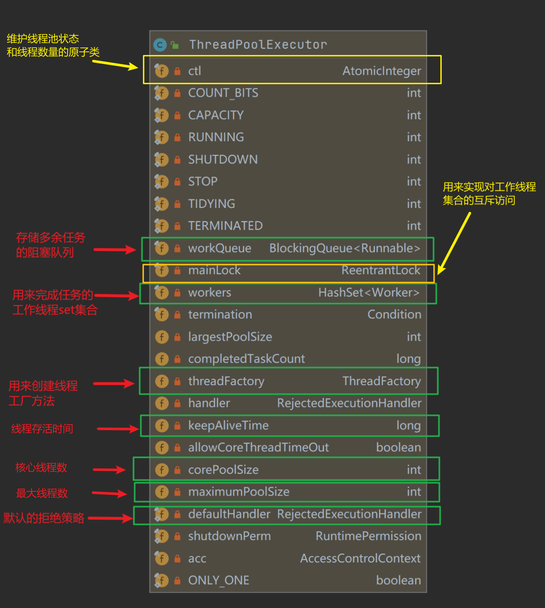

## 0. 预备知识

在了解`ThreadPoolExecutor`之前，我们首先需要了解一些基本概念，下图是`ThreadPoolExecutor`的部分核心字段。我先依次对其进行解释。



### #0.1 线程池状态

JUC为线程池规定了5种状态，如下图所示：


对于每种状态，含义如下：

1. RUNNING: 线程池能够接受任务并处理阻塞队列中的任务
2. SHUTDOWN: 不再接受新的任务，但是会把阻塞队列中的任务全部执行完毕
3. STOP: 不再接受新的任务，不再处理阻塞队列中的任务，并且会中断正在执行的任务
4. TIDYING:  所有的任务都被终止，工作线程的数量为0，并且在转化为该状态时，线程池会执行`terminated()`方法
5. TERMINATED: `terminated()`方法执行完毕

了解了线程池的五种状态后，那么它底层到底是如何实现的呢？其实也不复杂。`ThreadPoolExecutor`通过一个`AtomicInterger`维护了这五种状态。实现如下所示：

``` java
private final AtomicInteger ctl = new AtomicInteger(ctlOf(RUNNING, 0));
private static final int COUNT_BITS = Integer.SIZE - 3;
private static final int CAPACITY   = (1 << COUNT_BITS) - 1;

// runState is stored in the high-order bits
private static final int RUNNING    = -1 << COUNT_BITS;
private static final int SHUTDOWN   =  0 << COUNT_BITS;
private static final int STOP       =  1 << COUNT_BITS;
private static final int TIDYING    =  2 << COUNT_BITS;
private static final int TERMINATED =  3 << COUNT_BITS;
```

对于一个32为的`AtomicInteger`来说，它的信息分为两部分：

- 第30~32位：线程池的状态
- 第1~29位，线程池中的线程数量

从上面的定义中我们得知：`ctl`属性维护上述的两组信息，并且在初始化时会将线程数量设为0。获取状态时只需要通过`runStateOf(int)`方法获取`ctl`属性的高3位即可，对于线程数量的获取同理。

### #0.2 线程池互斥锁

`ThreadPoolExecutor`内部维护了一个`ReentrantLock`用来实现对工作线程集合的互斥访问，如下所示：

``` java
private final ReentrantLock mainLock = new ReentrantLock();
```

因为在多线程环境，操作一个hashSet可能会出现线程不安全的问题。至于为什么不适用一个线程安全的set，是因为使用锁可以对`interruptIdleWorkers()`的操作进行序列化，从而避免了不必要的中断风暴，尤其是在关闭线程池期间。并且还能够简化一些数据的统计。

### #0.3 线程包装类Worker

在`ThreadPoolExecutors`中，定义了一个不可变对象`Worker`作为线程的wrapper，如下所示：

``` java

private final class Worker
    extends AbstractQueuedSynchronizer
    implements Runnable
{
    /**
    * This class will never be serialized, but we provide a
    * serialVersionUID to suppress a javac warning.
    */
    private static final long serialVersionUID = 6138294804551838833L;

    //具体执行任务的线程，为null表示出现错误
    final Thread thread;
    //worker执行的第一个任务，可能为null
    Runnable firstTask;

    volatile long completedTasks;

    Worker(Runnable firstTask) {
        //防止在当前线程执行runWorker之前，就收到中断
        setState(-1); // inhibit interrupts until runWorker
        this.firstTask = firstTask;
        this.thread = getThreadFactory().newThread(this);
    }

    public void run() {
        runWorker(this);
    }

    // Lock methods
    //
    // The value 0 represents the unlocked state.
    // The value 1 represents the locked state.

    protected boolean isHeldExclusively() {
        return getState() != 0;
    }

    protected boolean tryAcquire(int unused) {
        if (compareAndSetState(0, 1)) {
            setExclusiveOwnerThread(Thread.currentThread());
            return true;
        }
        return false;
    }

    protected boolean tryRelease(int unused) {
        setExclusiveOwnerThread(null);
        setState(0);
        return true;
    }

    public void lock()        { acquire(1); }
    public boolean tryLock()  { return tryAcquire(1); }
    public void unlock()      { release(1); }
    public boolean isLocked() { return isHeldExclusively(); }

    void interruptIfStarted() {
        Thread t;
        if (getState() >= 0 && (t = thread) != null && !t.isInterrupted()) {
            try {
                t.interrupt();
            } catch (SecurityException ignore) {
            }
        }
    }
}
```

之所以要包装呢，是因为`Worker`可以比`Thread`提供更多的信息。例如当前`worker`累计执行了多少个任务。其实我们还可以注意到`Worker`继承了AQS。那么这里就会出现两个问题：

1. 为什么要继承AQS？一个`Worker`要锁干嘛？一个`Worker`不是自己负责一个任务吗？难道会有多个线程访问同一个`Worker`？
2. 使用线程的锁不行吗？为什么要自己实现一个锁？

那么对于第一个问题，其实这个问题在注释中已经说明了：

>Class Worker mainly **maintains interrupt control state** for threads running tasks, along with other minor bookkeeping. This class opportunistically extends AbstractQueuedSynchronizer to simplify acquiring and releasing a lock **surrounding each task execution**. This protects against interrupts that are intended to wake up a worker thread waiting for a task from instead interrupting a task being run. 

>We implement a simple **non-reentrant mutual exclusion lock** rather than use ReentrantLock because we do not want worker tasks to be able to reacquire the lock when they invoke pool control methods like setCorePoolSize. Additionally, to suppress interrupts until the thread actually starts running tasks, we initialize lock state to a negative value, and clear it upon start (in runWorker).

大致意思是说：
`Worker`类会管理线程在执行任务时的中断状态，以及一些其他的信息。`Worker`继承AQS是为了实现一个简单的不可重入的锁，用来在执行任务前上锁，在任务完毕后后释放锁。**上锁的原因是因为如果有中断发生，那么只希望中断那些正在等待任务的`Worker`，而不是中断那些正在执行任务的`Worker`。**

自己实现一个简单的**不可重入**的锁是因为已有的锁都是可重入的，线程池需要一个不可重入锁的才能达到上面的目的。那么为什么不可重入的就能达到目的呢？考虑下面一个场景：假设主线程调用了`setCorePoolSize(int)`调整线程池的大小，那么`ThreadPoolExecutor`希望这个调整的动作不要影响那些正在执行任务的`Worker`，所以就通过能否获取`Worker`对应的锁来判断当前`Worker`是否处于空闲状态，那么这里的锁只能是独占锁。若是可重入锁，那么，无论是等待任务的，还是正在执行的，都会被中断。`setCorePoolSize(int)`如下所示：

``` java
//调用该函数需要中断那些空闲的线程
public void setCorePoolSize(int corePoolSize) {
    ...
    if (workerCountOf(ctl.get()) > corePoolSize)
        interruptIdleWorkers();
    ...
}

//判断一个线程是否空闲就是看能否获取对应worker的不可重入独占锁
private void interruptIdleWorkers(boolean onlyOne) {
    final ReentrantLock mainLock = this.mainLock;
    mainLock.lock();
    try {
        for (Worker w : workers) {
            Thread t = w.thread;
            //能够成功获取不可重入锁就表示当前Worker没有执行任务，自然可以执行中断
            if (!t.isInterrupted() && w.tryLock()) {
                try {
                    t.interrupt();
                }
                ...
            }
            ...
        }
    }
    ...
```

### #0.4 线程工厂:ThreadFactory

所谓的线程的工厂，JUC提供了一个线程工厂接口`ThreadFactory`：

``` java
public interface ThreadFactory {
    Thread newThread(Runnable r);
}
```

唯一需要重写的方法就是生产新线程的方法`newThread(Runnable)`。对`ThreadPoolExecutor`，它内部实现了两种工厂类：`DefaultThreadFactory`和`PrivilegedThreadFactory`。

区别就是前者生产的线程优先级默认为5，后者对于新生产的线程和调用线程工厂的线程具有相同优先级，并具有相同的线程上下文类加载器。下面只列出默认工厂的代码：

``` java
static class DefaultThreadFactory implements ThreadFactory {
    private static final AtomicInteger poolNumber = new AtomicInteger(1);
    private final ThreadGroup group;
    private final AtomicInteger threadNumber = new AtomicInteger(1);
    private final String namePrefix;

    DefaultThreadFactory() {
        SecurityManager s = System.getSecurityManager();
        group = (s != null) ? s.getThreadGroup() :
                                Thread.currentThread().getThreadGroup();
        namePrefix = "pool-" +
                        poolNumber.getAndIncrement() +
                        "-thread-";
    }

    public Thread newThread(Runnable r) {
        Thread t = new Thread(group, r,
                                namePrefix + threadNumber.getAndIncrement(),
                                0);
        if (t.isDaemon())
            t.setDaemon(false);
        //设置新线程的默认优先级为5
        if (t.getPriority() != Thread.NORM_PRIORITY)
            t.setPriority(Thread.NORM_PRIORITY);
        return t;
    }
}
```

### #0.5 拒绝策略:defaultHandler

对于拒绝策略，我在讲解[Executor框架](executor-interface.md)时曾说过，自带的拒绝策略有四种，而`ThreadPoolExecutor`默认采用的是AbortPolicy，直接拒绝提交的任务，如下所示：

``` java

public static class AbortPolicy implements RejectedExecutionHandler {

    public AbortPolicy() { }

    public void rejectedExecution(Runnable r, ThreadPoolExecutor e) {
        throw new RejectedExecutionException("Task " + r.toString() +
                                                " rejected from " +
                                                e.toString());
    }
}
```

### #0.6 阻塞队列:workQueue


## 1. 任务添加流程

阅读过源码的同学都知道，`ThreadPoolExecutor`并没有重写`ExecutorService`的`submit(Runnable)`的方法。当我们调用`submit`时实际调用的是`AbstractExecutorService`重写的`submit`，如下所示：

``` java
public Future<?> submit(Runnable task) {
    if (task == null) throw new NullPointerException();
    RunnableFuture<Void> ftask = newTaskFor(task, null);
    execute(ftask);
    return ftask;
}
```

在`submit`中又会调用`ThreadPoolExecutor`重写的`execute(Runnable)`方法，如下所示：

``` java
public void execute(Runnable command) {
    if (command == null)
        throw new NullPointerException();
    
    int c = ctl.get();
    //如果当前线程池的线程数量小于核心线程数
    if (workerCountOf(c) < corePoolSize) {
        //尝试设置线程的第一个任务，因为通过execute调用addWorker，那么一定是
        //因为有新任务进来了
        if (addWorker(command, true))
            return;
        c = ctl.get();
    }
    //走到这说明线程数已经不小于核心线程数了
    
    //如果线程池处于running状态，但是无法向阻塞队列中添加任务
    //那么尝试添加新的worker
    if (isRunning(c) && workQueue.offer(command)) {
        int recheck = ctl.get();
        if (! isRunning(recheck) && remove(command))
            reject(command);
        else if (workerCountOf(recheck) == 0)
            addWorker(null, false);
    }
    //
    else if (!addWorker(command, false))
        reject(command);
}
```

主要的流程分为三步：

1. 如果当前活跃的线程的数量小于核心线程数，那么就尝试调用`addWaiter(Runnable,boolean)`增加一个线程，如果成功直接返回，否则执行2
2. 走到这里说明线程数至少不小于核心线程数，那么尝试向阻塞队列中添加任务，如果添加成功，我们仍然需要通过双重检查是否应该增加线程（因为有可能在上次检查之后，线程池中的线程全部死亡），如果线程全部死亡，那么则尝试添加一个Worker。
3. 如果无法向阻塞队列中添加任务，说明阻塞队列已满，如果此时无法增加worker，那么则会根据拒绝策略拒绝当前任务

添加`worker`的方法`addWaiter(Runnable,boolean)`如下所示：

``` java
/*
返回true表示成功添加了工作线程并启动

但是返回false的情况有很多，但是都会进行回滚操作：
1. 表示线程池已经stop或者即将关闭
2. 线程创建失败，要么是因为线程工厂返回null，或者在启动线程的时候内存溢出，
*/

//第一个参数表示当前worker是否有第一个任务
//第二个参数core表示当前线程数量的上限是选核心线程数还是最大线程数
private boolean addWorker(Runnable firstTask, boolean core) {
    retry:
    for (;;) {
        int c = ctl.get();
        //获取线程池状态
        int rs = runStateOf(c);

        // Check if queue empty only if necessary.
        //如果当前线程池已经shutdown及之后的状态
        if (rs >= SHUTDOWN &&
            //线程不是shutdown状态，表示已经进入stop或tidying
            //线程池是shutdown状态，并且firstTask不为空，但是shutdown状态不再接受任务，所以返回false
            //线程池是shutdown状态，并且firstTask为空，并且阻塞队列为空，没有任务要执行，自然返回false

            ! (rs == SHUTDOWN && firstTask == null && ! workQueue.isEmpty()))
            return false;

        for (;;) {
            int wc = workerCountOf(c);
            //如果线程池的线程数量已经超过了最大容量，返回false
            if (wc >= CAPACITY ||
                //如果以核心线程数作界限，那么就看当前线程数是否超过了核心线程数
                //只有在队列满之后core才会为false
                wc >= (core ? corePoolSize : maximumPoolSize))
                return false;
            //线程数没超标，那么添加线程
            if (compareAndIncrementWorkerCount(c))
                break retry;
            //cas失败说明有多个线程在同时添加任务
            c = ctl.get();  // Re-read ctl
            //如果线程池的状态发生改变，那么retry
            if (runStateOf(c) != rs)
                continue retry;
            // else CAS failed due to workerCount change; retry inner loop
        }
    }

    boolean workerStarted = false;
    boolean workerAdded = false;
    Worker w = null;
    try {
        //生成一个Worker
        w = new Worker(firstTask);
        final Thread t = w.thread;
        if (t != null) {
            final ReentrantLock mainLock = this.mainLock;
            mainLock.lock();
            try {
                // Recheck while holding lock.
                // Back out on ThreadFactory failure or if
                // shut down before lock acquired.
                int rs = runStateOf(ctl.get());
                //检查线程池是否已经关闭
                if (rs < SHUTDOWN ||
                    (rs == SHUTDOWN && firstTask == null)) {
                    //判断线程工厂创建线程是否成功
                    if (t.isAlive())
                        //预先检查新worker的状态
                        //如果在我们没有启动线程的情况，线程就alive肯定要抛出异常
                        throw new IllegalThreadStateException();
                    //将新生成的worker添加到线程池中，其实就是一个HashSet
                    workers.add(w);
                    int s = workers.size();
                    if (s > largestPoolSize)
                        largestPoolSize = s;
                    workerAdded = true;
                }
            } finally {
                mainLock.unlock();
            }
            if (workerAdded) {
                //启动线程
                t.start();
                workerStarted = true;
            }
        }
    } finally {
        if (! workerStarted)
            addWorkerFailed(w);
    }
    return workerStarted;
}
```

其中逻辑还是比较清晰的，在生成线程后如果能成功启动，那么则返回true，否则会调用`addWorkerFailed`进行回滚操作。

值得注意的是在访问`worker`集合`workers`的时候，需要保证互斥访问。具体原理在预备知识中已经介绍过。

## 2. 线程工作流程

在启动`worker`之后，最后在`worker`的`run()`方法中会调用`runWorker(Worker)`实现不断的从阻塞队列中获取任务，并调用任务的`run()`执行。

值得注意的是：在当前`worker`获取到新任务时，会使用自身的不可重入独占锁进行一个加锁操作，这个操作标志着当前`worker`已经开始执行具体的任务了，暂时屏蔽线程池发出的中断。

`runWorker(Worker)`代码如下所示：

``` java
final void runWorker(Worker w) {
    Thread wt = Thread.currentThread();
    Runnable task = w.firstTask;
    w.firstTask = null;
    //需要首先解锁一次，因为一个worker最初始的状态为-1，这么做是为了防止
    //worker在执行runWorker之前就收到了中断，例如在主函数关闭了线程池，
    w.unlock(); // allow interrupts
    boolean completedAbruptly = true;
    try {
        //如果获取不到新的任务，那么就会退出循环
        //getTask在线程池至少处于shutdown时，会返回null
        while (task != null || (task = getTask()) != null) {
            //使用worker的锁，表示当前worker已经获得新任务，暂时屏蔽中断
            w.lock();

            //如果线程池进入stopping状态，那么必须保证当前worker被中断
            //否则，必须保证当前worker不能被中断
            // If pool is stopping, ensure thread is interrupted;
            // if not, ensure thread is not interrupted.  This
            // requires a recheck in second case to deal with
            // shutdownNow race while clearing interrupt
            if ((runStateAtLeast(ctl.get(), STOP) ||
                    //这里做的是二次检查，有可能用户突然调用了shutdownNow
                    (Thread.interrupted() &&
                    runStateAtLeast(ctl.get(), STOP))) &&
                !wt.isInterrupted())
                wt.interrupt();
            try {
                beforeExecute(wt, task);
                Throwable thrown = null;
                try {
                    //执行任务自己的run方法
                    task.run();
                //捕捉任务可能抛出的异常，然后从线程池抛出
                } catch (RuntimeException x) {
                    thrown = x; throw x;
                } catch (Error x) {
                    thrown = x; throw x;
                } catch (Throwable x) {
                    thrown = x; throw new Error(x);
                } finally {
                    afterExecute(task, thrown);
                }
            } finally {
                task = null;
                w.completedTasks++;
                w.unlock();
            }
        }
        completedAbruptly = false;
    } finally {
        //如果一个线程无法再获取新的任务，那么就会将当前线程销毁
        processWorkerExit(w, completedAbruptly);
    }
}
```

### 2.1 获取新任务的流程

每当`worker`完成一个任务后，会尝试调用`getTask()`从我们提供的阻塞队列中获取新的任务。当阻塞队列为空时，该函数可以无限时等待或者有限等待，这需要根据是否允许核心线程过期来抉择。

如果该函数返回null就表示当前worker已经结束使命了，可以终结了。返回null的情况很多：

1. 线程池已经处于STOPING状态
2. 线程池已经处于SHUTDOWN状态并且阻塞队列为空
3. 线程数已经超过最大值
4. 当前worker等待新任务的时间过长，也就是说等待的时长超过了一个核心线程的存活时长

否则返回一个新的任务具体代码如下所示：

``` java
private Runnable getTask() {
    boolean timedOut = false; // Did the last poll() time out?

    for (;;) {
        int c = ctl.get();
        int rs = runStateOf(c);

        // Check if queue empty only if necessary.
        //如果线程已经至少处于SHUTDOWN状态并且empty为空，因为后续都不可能有新任务提交，那么直接返回null
        //表示当前worker的工作可以结束了
        if (rs >= SHUTDOWN && (rs >= STOP || workQueue.isEmpty())) {
            //将线程数减1
            decrementWorkerCount();
            return null;
        }

        int wc = workerCountOf(c);

        // Are workers subject to culling?
        boolean timed = allowCoreThreadTimeOut || wc > corePoolSize;

        if ((wc > maximumPoolSize || (timed && timedOut))
            && (wc > 1 || workQueue.isEmpty())) {
            if (compareAndDecrementWorkerCount(c))
                return null;
            continue;
        }

        try {
            Runnable r = timed ?
                //收到中断时take会抛出InterruptException
                workQueue.poll(keepAliveTime, TimeUnit.NANOSECONDS) :
                workQueue.take();
            if (r != null)
                return r;
            timedOut = true;
        } catch (InterruptedException retry) {
            timedOut = false;
        }
    }
}
```

### 2.2 worker退出流程

从上面`runWorker(Worker)`的处理流程可以看到，当一个`Worker`无法获得新任务时，那么就会调用`processWorkerExit(Worker,boolean)`将当前`Worker`移出线程集合，并根据当前池内的线程数量来决定是否要添加新的`Worker`，实现逻辑如下所示：

``` java
private void processWorkerExit(Worker w, boolean completedAbruptly) {
    //如果工作线程的结束是因为用户的代码产生了异常
    if (completedAbruptly) // If abrupt, then workerCount wasn't adjusted
        decrementWorkerCount();

    final ReentrantLock mainLock = this.mainLock;
    //对线程集合进行互斥访问
    mainLock.lock();
    try {
        completedTaskCount += w.completedTasks;
        //将当前线程移出工作队列
        workers.remove(w);
    } finally {
        mainLock.unlock();
    }

    //尝试关闭线程池
    tryTerminate();

    int c = ctl.get();
    //如果当前线程池处于RUNNING/SHUTDOWN状态
    /*
    * 那么这里可能会产生一个问题：如果处于SHUTDOWN状态，我们应该将所有的Worker移出集合
    * 但是SHUTDOWN是可以通过下面的if条件，那么最后又会执行addWorker()，又往集合中添加一个新的worker
    * 那岂不是集合内的worker永远都无法彻底移出？
    * 其实这种担心是多虑的，因为addWorker()会首先检查当前线程池的状态，如果为SHUTDOWN，直接返回false
    * 并不会构造新的worker
    */
    if (runStateLessThan(c, STOP)) {
        //如果工作线程是正常地结束
        if (!completedAbruptly) {
            int min = allowCoreThreadTimeOut ? 0 : corePoolSize;
            //如果核心线程有失效时间限制并且阻塞队列不为空
            //那么线程池中至少要保留一个线程
            if (min == 0 && ! workQueue.isEmpty())
                min = 1;
            if (workerCountOf(c) >= min)
                return; // replacement not needed
        }
        //如果线程数量小于min，那么需要补上一个新的worker
        addWorker(null, false);
    }
}
```

在将无法获得任务的线程移出集合后，会根据当前是否允许核心线程过期获得线程池的最低线程数量：

1. 如果当前线程数量仍然不小于最低限度，直接返回即可，不需要重新补充`Worker`
2. 如果当前线程数小于最低限度，那么需要最后调用`addWorker()`重新补充一个`Worker`

## 3. 线程池终止流程

**对于线程池来说，关闭线程池（shutdown）和终止线程池（terminate）完全是两码事**。所谓的关闭，是指线程池不再接受新的任务，而终止则是线程池中的所有工作线程都已经正确地关闭。

### 3.1 shutdown()的执行逻辑

`ThreadPoolExectuor`提供了两种方法`shutdown`和`shutdownNow`用来关闭线程池。对于前者，它会保证已经提交到阻塞队列的任务被执行，并不是等到任务都执行完毕才会关闭线程池。在关闭的流程中，一直有一个问题困扰着我：为什么要通过调用`interrupt()`抛出中断当作线程池关闭的信号？带着这个问题，我首先梳理了`shutdown()`的逻辑。首先我们来看看`shutdown()`的实现：

``` java
public void shutdown() {
    final ReentrantLock mainLock = this.mainLock;
    mainLock.lock();
    try {
        //检查是否有权限关闭线程池
        checkShutdownAccess();
        //将当前线程池升级到SHUTDOWN状态
        advanceRunState(SHUTDOWN);
        //中断空闲的线程
        interruptIdleWorkers();
        //为周期任务线程池准备的hook函数
        onShutdown();
    } finally {
        mainLock.unlock();
    }
    //尝试真正地终止线程
    tryTerminate();
}
```

从源码中我们得知：当调用`shutdown()`方法后，首先会将线程池状态转化到SHUTDOWN。然后中断空闲的线程。那么这里就有两个问题：

1. 为什么要中断空闲线程？
2. 为什么关闭线程池需要通过中断这个操作？

对于第一个问题，先说说我的理解：所谓的关闭关闭线程池就是将每个工作线程正确关闭，又因为`shutdown()`不影响正在执行任务的线程，所以就先关闭空闲的线程。那么我们来看看`interruptIdleWorkers()`到底是如何运作的：

``` java
private void interruptIdleWorkers(boolean onlyOne) {
    final ReentrantLock mainLock = this.mainLock;
    mainLock.lock();
    try {
        //遍历工作线程集合，找出空闲的线程并抛出中断
        for (Worker w : workers) {
            Thread t = w.thread;
            //如果线程没有被中断并且能够获取worker的独占锁
            if (!t.isInterrupted() && w.tryLock()) {
                try {
                    t.interrupt();
                } catch (SecurityException ignore) {
                } finally {
                    w.unlock();
                }
            }
            if (onlyOne)
                break;
        }
    } finally {
        mainLock.unlock();
    }
}
```

在分析`Worker`的工作流程时，曾说到，当一个`worker`正在执行任务时，会使用自身的独占不可重入锁上锁。那么在查询空闲`worker`时就利用了这个特点：`w.tryLock()`成功就说当前`worker`没有上锁，那也就是没有执行任务，自然可以关闭了。

那么这里的关闭的操作实际上调用当前`worker`的`interrupt()`函数发出一个中断，why？我们思考如下一个场景：

首先我们中断的都是空闲线程，那么空闲线程都在干嘛？是不是都在等待获取新的任务？那么如何等待？也就是通过调用阻塞队列的`take()`方法（无限等待场景下），当我们发生一个中断时，`take()`方法会抛出一个`InterruptException`，会在`getTask()`方法中被捕获。

捕获之后，也就说明被中断的`worker`已经被唤醒了。那么会重新执行循环，在循环初始部分，会判断当前线程池的状态，如果为SHUTDOWN或者类似的，会返回null。返回null表示什么？表示当前`worker`可以结束使命了，那么会跳出`runWorker()`中的循环，执行`processWorkerExit(Worker,boolean)`。在`processWorkerExit(Worker,boolean)`中，又会调用`tryTerminate()`尝试终止线程池。该函数的任务就是当线程池数量为0，将线程池状态转化为TIDYING状态，并执行hook函数`terminated()`。最后转化为TERMINATED状态。

值得注意的是，`tryTerminate()`中会调用`interruptIdleWorkers(ONLY_ONE)`传播线程池准备终止的信息。那么怎么传播呢？我们观察上述`interruptIdleWorkers()`函数的源码，因为我们传入的参数为true，那么会随机中断一个空闲线程`worker`。而空闲线程在被移出线程集合后，又会调用`processWorkerExit(Worker,boolean)`。周而复始，最后所有的空闲工作线程都会收到中断。`tryTerminate()`逻辑如下所示：

``` java
//这个方法只能在可能需要终止线程池的时候调用，例如剔除无用worker或者在shutdown状态移出队列任务
final void tryTerminate() {
    for (;;) {
        int c = ctl.get();
        //如果线程池处于RUNNING状态
        //如果线程池正在处于终止状态
        //或者线程池处于SHUTDOWN并且阻塞队列不为空
        //那么就不需要再终止了，终止一次就够了
        if (isRunning(c) ||
            runStateAtLeast(c, TIDYING) ||
            (runStateOf(c) == SHUTDOWN && ! workQueue.isEmpty()))
            return;
        //走到这说明线程池没有任务需要执行了，处于需要终止的状态

        //如果线程数量不为0，那么就尝试中断最多一个空闲线程，并传播这个中断状态
        if (workerCountOf(c) != 0) { // Eligible to terminate
            interruptIdleWorkers(ONLY_ONE);
            return;
        }

        //如果池中的线程数量为0，那么尝试将线程池状态转化为TIDYING
        //如果转化成功，则会执行hook函数terminated()，并把线程池状态转化为TERMINATED
        final ReentrantLock mainLock = this.mainLock;
        mainLock.lock();
        try {
            if (ctl.compareAndSet(c, ctlOf(TIDYING, 0))) {
                try {
                    terminated();
                } finally {
                    ctl.set(ctlOf(TERMINATED, 0));
                    //唤醒在awaitTermination条件上等待的线程
                    termination.signalAll();
                }
                return;
            }
        } finally {
            mainLock.unlock();
        }
        // else retry on failed CAS
    }
}
```

那么这里又有一个问题了，上面中断的都是空闲工作线程，如果我们执行`shutdown()`时，没有空闲线程怎么办？正在执行任务的线程如何被回收？岂不是会在`runWorker()`中，因为调用`getTask()`一直被阻塞直到获取新的任务，但是又永远都不会有新任务？我想了很久，最后发现答案竟然在`getTask()`的源码中。当我们的工作线程执行完当前任务后，会再次调用`getTask()`，而`getTask()`在一开始就会判断当前线程池的状态，如果状态为SHUTDOWN并且阻塞队列为空，那么直接返回，不会被阻塞。从而最后也会执行`processWorkerExit(Worker,boolean)`，传播中断状态。

### 3.2 shutdownNow的区别

对于`shutdownNow()`方法，跟`shutdown()`流程差不多。唯一不同的是：`shutdownNow()`不管`worker`有没有执行任务，只要`worker`执行过`runWorker(Worker)`函数，就发出一个中断请求。我们需要注意的是：中断请求对于空闲线程来说是一定有限的；对于正在执行任务的线程，这需要用户任务的配合，也就说用户任务能够处理中断才能结束未完成的任务。后续的流程就跟`shutdown()`几乎一样。调用`tryTerminate()`尝试终止线程池。`shutdownNow()`方法如下所示：

``` java
/**
* Attempts to stop all actively executing tasks, halts the
* processing of waiting tasks, and returns a list of the tasks
* that were awaiting execution. These tasks are drained (removed)
* from the task queue upon return from this method.
*
* <p>This method does not wait for actively executing tasks to
* terminate.  Use {@link #awaitTermination awaitTermination} to
* do that.
*
* <p>There are no guarantees beyond best-effort attempts to stop
* processing actively executing tasks.  This implementation
* cancels tasks via {@link Thread#interrupt}, so any task that
* fails to respond to interrupts may never terminate.
*/
public List<Runnable> shutdownNow() {
List<Runnable> tasks;
final ReentrantLock mainLock = this.mainLock;
mainLock.lock();
try {
    checkShutdownAccess();
    advanceRunState(STOP);
    interruptWorkers();
    tasks = drainQueue();
} finally {
    mainLock.unlock();
}
tryTerminate();
return tasks;
}
```

## 4. 内置线程池

JUC中提供了四种基于`ThreadPoolExecutor`的内置线程池：

1. **newFixedThreadPool**：核心线程数和最大线程数相等的线程，阻塞队列无限长度。也就是说线程池的线程数量固定

2. **newCachedThreadPool**：核心线程数为0的线程池，并且阻塞队列不存储任务。也就是说该线程池只会使用非核心线程来处理任务，如果超过60秒等不到新的任务，那么则会回收当前线程

3. **newSingleThreadExecutor**：线程池的线程数量为1，阻塞队列无限长度。也就是线程数量固定为1的线程池。该线程池能够保证任务串行地完成

4. **newScheduledThreadPool**：核心线程数固定地的周期任务线程池

## 参考文章

1. [Java多线程进阶（三九）—— J.U.C之executors框架：executors框架概述](https://segmentfault.com/a/1190000016586578)

2. [Java并发之ThreadPoolExecutor源码解析（三）](https://javamana.com/2021/02/20210228205934972L.html)