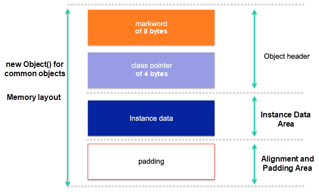
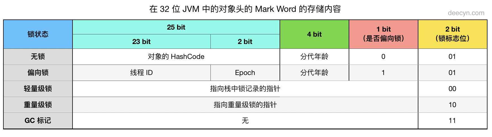
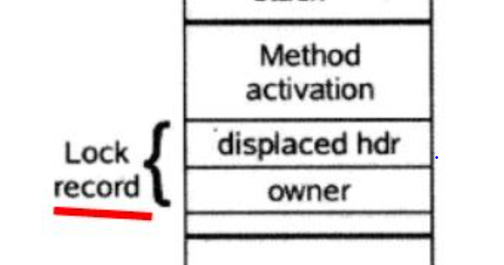
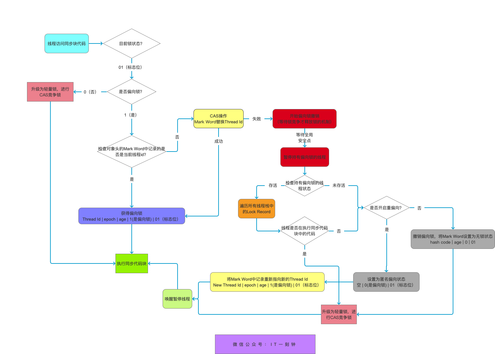
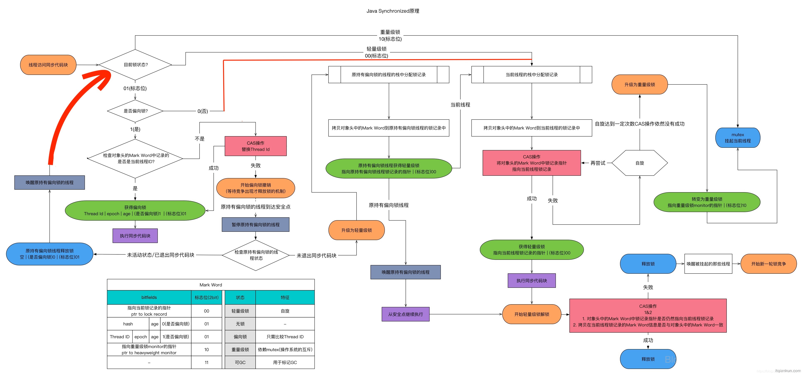

# 预备知识

Java提供的同步机制有许多，`synchronized`是其中最经常使用、最万能的机制之一。
为了学习`synchronized`的实现原理，进而了解到`monior object`模式。在java中`synchronized`辅助实现了该模式。

# 1. monitor机制的起源与定义

在早期，编写并发程序时使用的同步原语是信号量semaphore与互斥量mutex。程序员需要手动操作信号量的数值与线程的唤醒与挂起，想想这也是一个十分麻烦的工作。所以提出了更高层次的同步机制`monitor`封装了信号量的操作。但是值得注意的是`monitor`并未在操作系统层面实现，而是在软件层次完成了这一机制。

下面描述了`monitor`机制之所以会出现的一个应用场景（摘自[探索Java同步机制](https://developer.ibm.com/zh/articles/j-lo-synchronized/)）：

> 我们在开发并发的应用时，经常需要设计这样的对象，该对象的方法会在多线程的环境下被调用，而这些方法的执行都会改变该对象本身的状态。为了防止竞争条件 (race condition，等同于死锁) 的出现，对于这类对象的设计，需要考虑解决以下问题：
1.在任一时间内，只有唯一的公共的成员方法，被唯一的线程所执行。
2.对于**对象的调用者**来说，如果总是需要在调用方法之前进行拿锁，而在调用方法之后进行放锁，这将会使并发应用编程变得更加困难。合理的设计是，该对象本身确保任何针对它的方法请求的会同步并且透明的进行，而**不需要调用者的介入**。
3.如果一个对象的方法执行过程中，由于某些条件不能满足而阻塞，应该允许其它的客户端线程的方法调用可以访问该对象。

我们使用 Monitor Object 设计模式来解决这类问题：**将被客户线程并发访问的对象定义为一个 monitor 对象**。客户线程仅仅通过 monitor 对象的同步方法才能使用 monitor 对象定义的服务。为了防止陷入死锁，在任一时刻只能有一个同步方法被执行。每一个monitor对象包含一个 monitor锁，被同步方法用于串行访问对象的行为和状态。此外，同步方法可以根据一个或多个与monitor对象相关的monitor conditions 来决定在何种情况下挂起或恢复他们的执行。

根据上述定义，monitor object模式分为四个组成部分：

- **监视者对象 (Monitor Object):** 负责定义公共的接口方法，这些公共的接口方法会在多线程的环境下被调用执行。
- **同步方法：** 这些方法是**监视者对象**所定义。为了防止死锁，无论是否同时有多个线程并发调用同步方法，还是监视者对象含有多个同步方法，在任一时间内只有监视者对象的一个同步方法能够被执行（所谓的同步方法也就是我们经常说的临界区）
- **监视锁 (Monitor Lock):** 每一个监视者对象都会拥有一把监视锁。
- **监视条件 (Monitor Condition):** 同步方法使用监视锁和监视条件来决定方法是否需要阻塞或重新执行。这里的监视条件可以来自程序本身也可来自monitor object内部。


这四个部分完成了两个动作：

1. 线程互斥的进入同步方法
2. 完成线程的一些调度动作，例如线程的挂起与唤醒

# 2. Java中的monitor object模式

按照定义，Java下基于`synchronized`的`monitor object`模式也应该由四个部分组成,包括监视者对象、监视锁、监视条件、同步方法（临界区）。那么首先来看看我们一般使用`synchronized`来实现同步的代码：

``` java
class demo{
    Object lock=new Object();
    public void test1(){
        synchronized(lock){
            ...
        }
        ...
    }
    public synchronized void test2(){...}
    public static synchronized void test3(){...}
}
```

在我看到的大部分资料中，都认为上述代码中的`lock`对象是监视者对象，监视条件上面没有展示出来，`synchronized`后跟的代码块就是同步方法。但是这个同步方法并不是在`lock`所在的类`Object`中定义的啊，这如何解释？

>我的理解是这里的“定义”并不是诸如在类`A`中定义一个方法`test`之类的定义，而是规定了某些代码作为同步方法，例如规定字母`A`代表学校，字母`B`代表公司之类的将两个事物联系到一起的定义，就像在上面代码中规定了`{}`中的代码作为`lock`的同步方法

那么监视锁呢？上面完全没有锁的痕迹。原因是基于`monitor object`模式的`synchronized`，监视锁是由监视对象自带的，也被称为`intrinsic lock`。这个锁在java中是由`objectmonitor`实现的。

那么监视者对象、监视锁和线程这三者如何产生联系的呢？这就跟Java中对象的内存布局有关了。在jvm中，任何一个对象都会持有一个对象头用来存储一些对象的信息,下图中是一个对象的内存布局，由对象头、对象数据和填充数据组成。



其中对象头由`markword`和`klass pointer`组成，如果当前对象是数组，那么在`klass pointer`后面还会追加数组的长度。

`klass point`指针指向它的类元数据，用于判断当前对象属于哪个类(Points to another object (a metaobject) which describes the layout and behavior of the original object.)，`markword`在32位和64位的机器上略有不同，32bit长的`markword`布局如下所示（图片出自[Synchronized与锁](https://deecyn.com/java-synchronized-and-lock.html)）：



因为空间有限，所以这32bit是复用的，在不同状态下存储的信息是不同的。对于Java1.6之前的`synchronized`对应于图中的重量级锁状态（其他三种锁状态在Java1.6后出现），该状态下`markword`存储了指向了重量级锁的指针，这个重量级锁就是`monitor object`模式中的监视锁。这个重量级锁是在JVM中通过`ObjectMonitor`类实现的，**而该类本质上又是基于系统的mutex创建的**。其部分代码如下所示：

``` java
class ObjectMonitor {
...
  //省略一些代码
  bool      try_enter (TRAPS) ;
  void      enter(TRAPS);
  void      exit(bool not_suspended, TRAPS);
  void      wait(jlong millis, bool interruptable, TRAPS);
  void      notify(TRAPS);
  void      notifyAll(TRAPS);
  ...

  // WARNING: this must be the very first word of ObjectMonitor
  // This means this class can't use any virtual member functions.

  volatile markOop   _header;       // displaced object header word - mark
  void*     volatile _object;       // backward object pointer - strong root

  // All the following fields must be machine word aligned
  // The VM assumes write ordering wrt these fields, which can be
  // read from other threads.

 protected:                         // protected for jvmtiRawMonitor
  void *  volatile _owner;          // pointer to owning thread OR BasicLock
...
 private:
  int OwnerIsThread ;               // _owner is (Thread *) vs SP/BasicLock
...
 protected:
  ObjectWaiter * volatile _EntryList ;     // Threads blocked on entry or reentry.

 protected:
  ObjectWaiter * volatile _WaitSet; // LL of threads wait()ing on the monitor
 private:
  volatile int _WaitSetLock;        // protects Wait Queue - simple spinlock
  //省略一些代码
}
```
其中：

- `_header`存储了指向属于`monitor object`的`object header`的指针，也就是指向对象头的指针
- `_object`存储了指向`monitor object`的指针
- `_owner`存储了指向获得监视锁的线程
- `_EntryList`存储了访问同一临界区但是被阻塞的线程集合
- `_WaitList`存储了调用`wait()`方法主动释放锁的线程集合

并且`ObjectMonitor`实现了`wait()`、`notify()`、`notifyAll()`等方法。

那么监视对象、监视锁、线程的关系是：监视对象内存存储了监视锁，而监视锁中又存储了获得当前锁的线程。并且由于每个对象都会有对象头，而对象头中自带监视锁，所以Java中任何一个对象都可以用作监视对象，所以`wait()`、`notify()`等方法在顶级父类`Object`中实现。

# 3. Java1.6后的synchronized

因为Java的线程模型采用的是1:1模型，一个Java线程映射到系统的一个线程，所以Java线程的切换、阻塞、唤醒都需要在内核模式中完成，频繁地切换用户模式与内核模式代价非常高（所以`synchronzied`被称为重锁）。那么如果同步区非常短，执行同步区的时间比切换内核模式的时间还短，程序的效率就比较低了。所以在Java1.6之后，`synchronzied`进行了大量优化。对于`synchronized`，不会再一开始就使用`objectMonitor`完成同步。而是根据线程对锁的竞争程度不断升级获取锁的难度。

升级后的`synchronized`分为四个阶段：无锁->偏向锁->轻量级锁->重量级锁。这四个状态通过`markword`中的两位标记来区分，再次搬出32位下的`markword`结构图：


可以看到，偏向锁和无锁状态的锁标志位都是`01`，他们是通过1bit的标志位来区分。

同时JVM会使用`Lock Record`在线程中保存锁的一些信息，其组成如下所示：


其中：

- `displaced hdr(displaced markword)`:一般用来保存`monitor object`对象头中的`markword`信息副本
- `owner`：指向`monitor object`的指针。

在三种锁状态中，都会使用`Lock Record`。但是在偏向锁状态中并不会使用`Lock Record`的`displaced markword`。

## 3.1 偏向锁

偏向锁，将锁的归属权偏向给第一个获得该锁的线程。说人话，就是如果有一个线程threadA第一次成功获得了偏向锁lock，那么lock默认认为以后能够成功获得锁的线程都会是线程A。

>注意：“偏向第一个获得该锁的线程”并不是指在偏向锁的生命周期内只会有一个线程获得锁。
比如在最开始，threadA获得了偏向锁lock，此时lock偏向threadA。使用完毕后，threadB请求lock。虽然lock发现此时请求的线程不是threadA，但是由于此时没有发生竞争，所以lock重新设置其偏向的线程为threadB。**而不是说从头到尾lock都只偏向threadA。**

 偏向锁的使用场景是同步区只被同一个线程访问。那么在使用偏向锁时~~只会在第一次申请时~~，使用CAS将`markword`中的线程ID（默认为0，表示匿名偏向状态）替换为当前获得锁的线程ID（当然如果不停地出现新线程成功获取锁的情况，那么每次新线程都会使用CAS替换ThreadID。但是并不是简单的替换而已，JVM同时也会在当前线程的`Lock Record`列表中插入一个`Lock Record`结构。

### 3.1.1 偏向锁的获取流程

下图中是偏向锁的工作流程：



偏向锁的**开启**需要锁对象头开启以及klass属性头开启才算，单方面无法进入重偏向。其中有几点需要注意，在一个线程每次成功获取偏向锁时，**会在当前线程的`Lock Record`队列中插入一个`Lock Record(LR)`**,并且设置新插入LR中的owner指向当前监视器对象（monitor object），具体的实现代码如下所示：

``` java
//代码分析摘自：Synchronized 源码分析（http://itliusir.com/2019/11-Synchronized/）
//源码地址：http://hg.openjdk.java.net/jdk8u/jdk8u/hotspot/file/9ce27f0a4683/src/share/vm/interpreter/bytecodeInterpreter.cpp#l1816

CASE(_monitorenter): {
  oop lockee = STACK_OBJECT(-1);
  CHECK_NULL(lockee);
  // 寻找空闲的锁记录(Lock Record) 空间
  BasicObjectLock* limit = istate->monitor_base();
  BasicObjectLock* most_recent = (BasicObjectLock*) istate->stack_base();
  BasicObjectLock* entry = NULL;
  while (most_recent != limit ) {
  if (most_recent->obj() == NULL) entry = most_recent;
  else if (most_recent->obj() == lockee) break;
  most_recent++;
  }
  // 存在空闲的Lock Record
  if (entry != NULL) {
    /***********************************/
    // 设置Lock Record 的 obj指针(owner)指向锁对象(monitor object)
    //无论是轻量锁还是偏向锁都会设置这个指针
    //这句代码完成了线程每次获取锁时向LR集合中插入新LR的动作
    entry->set_obj(lockee);
    /***********************************/

    int success = false;
    uintptr_t epoch_mask_in_place = (uintptr_t)markOopDesc::epoch_mask_in_place;
    markOop mark = lockee->mark();
    intptr_t hash = (intptr_t) markOopDesc::no_hash;

    /*****************************************************/
    // 如果锁对象的对象头标志是偏向模式,即判断锁标志为101

    if (mark->has_bias_pattern()) {
      uintptr_t thread_ident;
      uintptr_t anticipated_bias_locking_value;
      thread_ident = (uintptr_t)istate->thread();
      // 通过或运算计算anticipated_bias_locking_value
      anticipated_bias_locking_value =
      // 将线程id与prototype_header(epoch、分代年龄、偏向模式、锁标志)部分相或
      (((uintptr_t)lockee->klass()->prototype_header() | thread_ident) 
      // 与锁对象的markword异或，相等为0
          ^ (uintptr_t)mark) 
      // 将上面结果中的分代年龄忽略掉
      &~((uintptr_t) markOopDesc::age_mask_in_place);
      // ① 为0代表偏向线程是当前线程 且 对象头的epoch与class的epoch相等，什么也不做
      if  (anticipated_bias_locking_value == 0) {
        if (PrintBiasedLockingStatistics) {
          (* BiasedLocking::biased_lock_entry_count_addr())++;
        }
        success = true;
      }
      // ② 代表class的prototype_header或对象的mark word中偏向模式是关闭的
      //又因为能走到这已经通过了mark->has_bias_pattern()判断
      //即对象的mark word中偏向模式是开启的，那也就是说class的prototype_header不是偏向模式。
      else if ((anticipated_bias_locking_value & markOopDesc::biased_lock_mask_in_place) != 0) {
      // try revoke bias
        markOop header = lockee->klass()->prototype_header();
        if (hash != markOopDesc::no_hash) {
            header = header->copy_set_hash(hash);
        }
        if (Atomic::cmpxchg_ptr(header, lockee->mark_addr(), mark) == mark) {
          if (PrintBiasedLockingStatistics)
            (*BiasedLocking::revoked_lock_entry_count_addr())++;
        }
      }

        /*****************************************************/
        // ③ 锁对象头的 epoch 与 class 的 epoch 不相等，尝试重偏向
      else if ((anticipated_bias_locking_value & epoch_mask_in_place) !=0) {
        // try rebias
        markOop new_header = (markOop) ( (intptr_t) lockee->klass()->prototype_header() | thread_ident);
        if (hash != markOopDesc::no_hash) {
          new_header = new_header->copy_set_hash(hash);
        }
        if (Atomic::cmpxchg_ptr((void*)new_header, lockee->mark_addr(), mark) == mark) {
          if (PrintBiasedLockingStatistics)
          (* BiasedLocking::rebiased_lock_entry_count_addr())++;
        }
        else {
          // 有竞争重偏向失败，调用 monitorenter 锁升级
          CALL_VM(InterpreterRuntime::monitorenter(THREAD, entry), handle_exception);
        }
        success = true;
      }

      /*****************************************************/
      // ④ 未偏向任何线程或者偏向的不是当前线程，尝试重新偏向
      else {
        markOop header = (markOop) ((uintptr_t) mark & ((uintptr_t)markOopDesc::biased_lock_mask_in_place |
                                                        (uintptr_t)markOopDesc::age_mask_in_place |
                                                        epoch_mask_in_place));
        if (hash != markOopDesc::no_hash) {
            header = header->copy_set_hash(hash);
        }
        markOop new_header = (markOop) ((uintptr_t) header | thread_ident);
        // debugging hint
        DEBUG_ONLY(entry->lock()->set_displaced_header((markOop) (uintptr_t) 0xdeaddead);)
        // CAS 尝试修改
        if (Atomic::cmpxchg_ptr((void*)new_header, lockee->mark_addr(), header) == header) {
            if (PrintBiasedLockingStatistics)
            (* BiasedLocking::anonymously_biased_lock_entry_count_addr())++;
        }
        // 有竞争偏向失败，调用 monitorenter 锁升级
        else {
            CALL_VM(InterpreterRuntime::monitorenter(THREAD, entry), handle_exception);
        }
        success = true;
      }
    }

    /*****************************************************/
    //能走到这说明当前没有开启偏向模式，而不可能出现偏向的不是当前线程的情况
    //那么就走轻量锁的逻辑
    if (!success) {
      // 轻量级锁逻辑 start
      // 构造无锁状态 Mark Word 的 copy(Displaced Mark Word)

      /**************************************************/
      //如果是第一次获取轻量锁，那么mark()->set_unlocked()
      //lockee中的markword期望值最后两位必是01（无锁或偏向锁），所以一定会CAS成功
      markOop displaced = lockee->mark()->set_unlocked();
      /*************************************************/
      
      // 将锁记录空间(Lock Record)指向Displaced Mark Word
      entry->lock()->set_displaced_header(displaced);
      // 是否禁用偏向锁和轻量级锁
      bool call_vm = UseHeavyMonitors;
      if (call_vm || Atomic::cmpxchg_ptr(entry, lockee->mark_addr(), displaced) != displaced) {
        // 判断是不是锁重入，是的话把Displaced Mark Word设置为null来表示重入
        // 置null的原因是因为要记录重入次数，但是mark word大小有限，所以每次重入都在栈帧中新增一个Displaced Mark Word为null的记录
        if (!call_vm && THREAD->is_lock_owned((address) displaced->clear_lock_bits())) {
          entry->lock()->set_displaced_header(NULL);
        } else {
          // 若禁用则锁升级
          CALL_VM(InterpreterRuntime::monitorenter(THREAD, entry), handle_exception);
        }
      }
    }
    UPDATE_PC_AND_TOS_AND_CONTINUE(1, -1);
  } 
  else {
    istate->set_msg(more_monitors);
    UPDATE_PC_AND_RETURN(0); // Re-execute
  }
}
```

**对偏向锁的获取流程总结如下：**

1. 如果当前线程有空闲的LockRecord（LR），那么设置当前使用的LR的`owner`指针指向当前`monitor object`（也就相当于添加了一个新的LR到当前线程中）

2. 检查monitor object是否处于可偏向状态（在开启偏向锁后，markword中的锁标志默认为可偏向状态，如果存储的线程ID为0，则称其为匿名可偏向状态）

3. 如果处于可偏向状态，检查偏向锁偏向的线程是否为当前线程，如果是，那么则执行（6），否则执行（4）

4. 如果偏向模式被关闭，那么执行（8）

5. 对偏向锁设置重偏向，如果成功，那么则执行（7），否则产生竞争，执行（8）

6. 对偏向锁第一次设置偏向线程，如果成功，那么则执行（7），否则产生竞争，执行（8）

7. 执行临界区代码

8. 进行一系列判断，决定是否能够保留偏向锁，或者升级为轻量级锁

### 3.1.2 偏向锁的撤销流程

对于偏向锁获取流程中第（8）步的判断，其执行的检查十分复杂，调用链如下：

InterpreterRuntime::monitorenter --> ObjectSynchronizer::fast_enter --> BiasedLocking::revoke_and_rebias --> (safepoint调用)BiasedLocking::revoke_bias

我们着重分析`revoke_and_rebias`与`revoke_bias`

`revoke_bias`的部分代码如下：

``` java

//源码链接:http://hg.openjdk.java.net/jdk8u/jdk8u/hotspot/file/9ce27f0a4683/src/share/vm/runtime/biasedLocking.cpp#l146
static BiasedLocking::Condition revoke_bias(oop obj, bool allow_rebias, bool is_bulk, JavaThread* requesting_thread) {
  markOop mark = obj->mark();
  // 如果对象不是偏向锁，直接返回 NOT_BIASED
  if (!mark->has_bias_pattern()) {
    ...
    return BiasedLocking::NOT_BIASED;
  }

  uint age = mark->age();
  // 构建两个 mark word，一个是匿名偏向模式（101），一个是无锁模式（001）
  markOop   biased_prototype = markOopDesc::biased_locking_prototype()->set_age(age);
  markOop unbiased_prototype = markOopDesc::prototype()->set_age(age);

  ...

  JavaThread* biased_thread = mark->biased_locker();
  if (biased_thread == NULL) {
     // 匿名偏向。当调用锁对象原始的 hashcode() 方法会走到这个逻辑
     // 如果不允许重偏向，则将对象的 mark word 设置为无锁模式
    if (!allow_rebias) {
      obj->set_mark(unbiased_prototype);
    }
    ...
    return BiasedLocking::BIAS_REVOKED;
  }

  // 判断偏向线程是否还存活
  bool thread_is_alive = false;
  // 如果当前线程就是偏向线程 
  if (requesting_thread == biased_thread) {
    thread_is_alive = true;
  } else {
     // 遍历当前 jvm 的所有线程，如果能找到，则说明偏向的线程还存活
    for (JavaThread* cur_thread = Threads::first(); cur_thread != NULL; cur_thread = cur_thread->next()) {
      if (cur_thread == biased_thread) {
        thread_is_alive = true;
        break;
      }
    }
  }
  // 如果偏向的线程已经不存活了
  if (!thread_is_alive) {
    // 如果允许重偏向，则将对象 mark word 设置为匿名偏向状态，否则设置为无锁状态
    if (allow_rebias) {
      obj->set_mark(biased_prototype);
    } else {
      obj->set_mark(unbiased_prototype);
    }
    ...
    return BiasedLocking::BIAS_REVOKED;
  }

  // 线程还存活则遍历线程栈中所有的 lock record
  GrowableArray<MonitorInfo*>* cached_monitor_info = get_or_compute_monitor_info(biased_thread);
  BasicLock* highest_lock = NULL;
  for (int i = 0; i < cached_monitor_info->length(); i++) {
    MonitorInfo* mon_info = cached_monitor_info->at(i);
    // 如果能找到对应的 lock record，说明偏向所有者正在持有锁
    if (mon_info->owner() == obj) {
      ...
      // 升级为轻量级锁，修改栈中所有关联该锁的 lock record
      // 先处理所有锁重入的情况，轻量级锁的 displaced mark word 为 NULL，表示锁重入
      markOop mark = markOopDesc::encode((BasicLock*) NULL);
      highest_lock = mon_info->lock();
      highest_lock->set_displaced_header(mark);
    } else {
      ...
    }
  }
  if (highest_lock != NULL) { 
    // highest_lock 如果非空，则它是最早关联该锁的 lock record
    // 这个 lock record 是线程彻底退出该锁的最后一个 lock record
  
    //关闭偏向模式，这样后面的线程再次抢锁时直接走轻量锁流程
    highest_lock->set_displaced_header(unbiased_prototype);
    //设置锁对象的markword指向displaced header
    obj->release_set_mark(markOopDesc::encode(highest_lock));
    ...
  } else {
    // 走到这里说明偏向所有者没有正在持有锁
    ...
    if (allow_rebias) {
       // 设置为匿名偏向状态
      obj->set_mark(biased_prototype);
    } else {
      // 将 mark word 设置为无锁状态
      obj->set_mark(unbiased_prototype);
    }
  }

  return BiasedLocking::BIAS_REVOKED;
}
```

上述代码中只有一点需要注意：在判断线程是否处于同步状态时，遍历的`Lock Record`正是线程在获取锁时添加到线程中的只有`owner`指针的`Lock Record`。

1. 所以当偏向锁产生锁的竞争时，JVM会首先JVM中所有存活的线程中是否存在偏向锁偏向的线程。如果存在，执行（2），否则执行（4）

2. 判断偏向锁偏向的线程当前是否处于同步区，这通过遍历目标线程的`Lock Record`集合实现（为什么能这么做呢？这跟偏向锁的释放有关，见后文）。如果处于同步区，则执行（3），否则执行（4）

3. 将最先关联到线程的`Lock Record`结构中的`Displace markword`设置为无锁模式，然后将monitor object对象头的markdown设置为指向`Displace markword`的指针（处于safepoint，所有线程终止）。至此，完成轻量锁的升级。注意，此时轻量锁的归属权仍然属于原来获得偏向锁的线程

4. 如果开启可重偏向，那么则将monitor object对象的markword设置为匿名偏向模式，否则执行（5）

5. 将将monitor object对象头的markword设置为无锁模式

### 3.1.3 偏向锁的释放流程

偏向锁的释放流程比较简单，只是简单地把添加到线程`LockRecord`列表中的`Lock Record`删除，当然这里仅是逻辑删除，将`Lock Record`的owner指针设为null即可。实现源码如下：
``` java
//代码来自：http://hg.openjdk.java.net/jdk8u/jdk8u/hotspot/file/9ce27f0a4683/src/share/vm/interpreter/bytecodeInterpreter.cpp#l1923
CASE(_monitorexit): {
  oop lockee = STACK_OBJECT(-1);
  CHECK_NULL(lockee);
  // derefing's lockee ought to provoke implicit null check
  // find our monitor slot
  BasicObjectLock* limit = istate->monitor_base();
  BasicObjectLock* most_recent = (BasicObjectLock*) istate->stack_base();
  // 从低往高遍历栈的Lock Record
  while (most_recent != limit ) {
    // 如果Lock Record关联的是该锁对象
    if ((most_recent)->obj() == lockee) {
      BasicLock* lock = most_recent->lock();
      markOop header = lock->displaced_header();
      // 释放Lock Record
      most_recent->set_obj(NULL);
      // 如果是偏向模式，仅仅释放Lock Record就好了。否则要走轻量级锁or重量级锁的释放流程
      if (!lockee->mark()->has_bias_pattern()) {
        bool call_vm = UseHeavyMonitors;
        // header!=NULL说明不是重入，则需要将Displaced Mark Word CAS到对象头的Mark Word
        if (header != NULL || call_vm) {
          if (call_vm || Atomic::cmpxchg_ptr(header, lockee->mark_addr(), lock) != lock) {
            // CAS失败或者是重量级锁则会走到这里，先将obj还原，然后调用monitorexit方法
            most_recent->set_obj(lockee);
            CALL_VM(InterpreterRuntime::monitorexit(THREAD, most_recent), handle_exception);
          }
        }
      }
      //执行下一条命令
      UPDATE_PC_AND_TOS_AND_CONTINUE(1, -1);
    }
    //处理下一条Lock Record
    most_recent++;
  }
  // Need to throw illegal monitor state exception
  CALL_VM(InterpreterRuntime::throw_illegal_monitor_state_exception(THREAD), handle_exception);
  ShouldNotReachHere();
}
```

对于偏向锁，代码从低往高的遍历`Lock Record`，因为加进去的时候就是按照从高往低加入的。它将当前遍历的`Lock Record`中的owner指针都置为null，表示当前线程释放了偏向锁。这也就是为什么在偏向锁撤销的过程中，通过查看线程中的`Lock Record`的owner指针是否指向monitor object就能判断当前持有偏向锁的线程是否处于同步区。因为如果不处于同步区，线程肯定会释放将owner置为null偏向锁。

### 3.1.4 批量重偏向与撤销

批量重偏向是指对于大量来自同一个类的锁对象，如果频繁的对这个类的锁对象进行重偏向操作（**在偏向锁模式下抢锁失败才会对重偏向次数计数**），撤销偏向锁的代价也是不能被忽略的。所以如果对一个类的偏向锁撤销次数达到二十次。那么后续使用这种锁的线程都会直接重偏向到目标线程，略去了恢复到匿名偏向状态的过程，这叫**批量重偏向**。

如果在批量重偏向的基础上，还在对这个这个类的锁对象进行重偏向或者升级锁的操作，重偏向达到40次（20+20）。那么以后这个类生成的锁对象就再也不会有作为偏向锁的机会，直接关闭偏向选项（这叫**批量撤销**，后续新生成的锁对象再不也能作为偏向锁），也就是说批量重偏向只有一次机会。但是如果总的重偏向次数在20次到40次之间，那么经过一段时间，该类的重偏向计数会归为0。之后重复上述的操作。

那么上述两个操作是如何实现的呢？其实它们是基于Class对象和锁对象头中`markword`字段中的`epoch`属性。

批量重偏向操作开启后，对类C的epcho值加1，以后这个类新生成的对象的mark字段里就是这个epoch值了，同时还要对当前已经获得偏向锁的对象的epoch值加1(通过遍历所有线程中的`Lock Record`字段中的`displace markword`并+1)。那么以后有线程再竞争类C的锁对象时，如果有锁对象.epoch!=Class.epoch。说明该锁对象的epoch字段没有更改，也就是说在对epoch+1时，该锁对象没有被使用。竞争这种锁时直接使用CAS替换threadID进行重偏向，，不走撤销这一步。

>所以我个人认为，批量重偏向只适用于那些没有被统一修改epoch字段的锁对象

具体的函数调用链为：InterpreterRuntime::monitorenter --> ObjectSynchronizer::fast_enter --> BiasedLocking::revoke_and_rebias -->update_heuristics。下面代码片段是对批量偏向和批量撤销前的阈值判断。

``` java
static HeuristicsResult update_heuristics(oop o, bool allow_rebias) {
  markOop mark = o->mark();
  // 如果不是偏向模式直接返回
  if (!mark->has_bias_pattern()) {
    return HR_NOT_BIASED;
  }
 
  // 获取锁对象的类元数据
  Klass* k = o->klass();
  // 当前时间
  jlong cur_time = os::javaTimeMillis();
  // 该类上一次批量重偏向的时间
  jlong last_bulk_revocation_time = k->last_biased_lock_bulk_revocation_time();
  // 该类单个偏向撤销的计数
  int revocation_count = k->biased_lock_revocation_count();

  // 按默认参数来说：
  // 如果撤销计数大于等于 20，且小于 40，
  // 且距上次批量撤销的时间大于等于 25 秒，就会重置计数。
  if ((revocation_count >= BiasedLockingBulkRebiasThreshold) &&
      (revocation_count <  BiasedLockingBulkRevokeThreshold) &&
      (last_bulk_revocation_time != 0) &&
      (cur_time - last_bulk_revocation_time >= BiasedLockingDecayTime)) {
    // This is the first revocation we've seen in a while of an
    // object of this type since the last time we performed a bulk
    // rebiasing operation. The application is allocating objects in
    // bulk which are biased toward a thread and then handing them
    // off to another thread. We can cope with this allocation
    // pattern via the bulk rebiasing mechanism so we reset the
    // klass's revocation count rather than allow it to increase
    // monotonically. If we see the need to perform another bulk
    // rebias operation later, we will, and if subsequently we see
    // many more revocation operations in a short period of time we
    // will completely disable biasing for this type.
    k->set_biased_lock_revocation_count(0);
    revocation_count = 0;
  }

  if (revocation_count <= BiasedLockingBulkRevokeThreshold) {
    // 自增计数
    revocation_count = k->atomic_incr_biased_lock_revocation_count();
  }
  // 此时，如果达到批量撤销阈值，则进行批量撤销。
  if (revocation_count == BiasedLockingBulkRevokeThreshold) {
    return HR_BULK_REVOKE;
  }
  // 此时，如果达到批量重偏向阈值，则进行批量重偏向。
  if (revocation_count == BiasedLockingBulkRebiasThreshold) {
    return HR_BULK_REBIAS;
  }
  // 否则，仅进行单个对象的撤销偏向
  return HR_SINGLE_REVOKE;
}

```

## 3.2 轻量锁

轻量锁是代价比偏向锁稍高的轻量级的锁。那么轻量锁和偏向锁的区别在哪呢？我认为有以下两点：

1. 偏向锁只需要在第一次请求锁使用CAS设置ThreadID，而轻量锁需要在每次请求锁时都使用CAS修改markword

2. 偏向锁只适用于一个线程进入临界区，轻量锁适用于多个线程交替地进入临界区（交替是指不会发生争夺锁的冲突）

### 3.2.1 轻量锁的申请流程

轻量锁的获取流程比较简单，假设现在有线程A，监视锁lock。

JVM会在线程A的`Lock Record`列表中添加一个`Lock Record`结构。并将其`displaced hdr`设置为`markword`无锁状态时的内容。同时JVM会将lock对象的`markword`修改为指向刚添加的`Lock Record`的指针。

**并且并且并且，lock的`markword`最后两位为`00`，表示轻量锁状态。** 结构如下所示：


在具体的JVM中，轻量锁的来源有两处：

1. 通过偏向锁升级而来
2. 关闭偏向模式

这二者的实现方式和偏向锁的获取都在同一个源文件中：

``` java
//代码分析摘自：Synchronized 源码分析（http://itliusir.com/2019/11-Synchronized/）
//源码地址：http://hg.openjdk.java.net/jdk8u/jdk8u/hotspot/file/9ce27f0a4683/src/share/vm/interpreter/bytecodeInterpreter.cpp#l1816

CASE(_monitorenter): {
  oop lockee = STACK_OBJECT(-1);
  CHECK_NULL(lockee);
  // 寻找空闲的锁记录(Lock Record) 空间
  BasicObjectLock* limit = istate->monitor_base();
  BasicObjectLock* most_recent = (BasicObjectLock*) istate->stack_base();
  BasicObjectLock* entry = NULL;
  while (most_recent != limit ) {
    if (most_recent->obj() == NULL) entry = most_recent;
    else if (most_recent->obj() == lockee) break;
    most_recent++;
  }
  // 存在空闲的Lock Record
  if (entry != NULL) {
    /***********************************/
    // 设置Lock Record 的 obj指针(owner)指向锁对象(monitor object)
    //这句代码完成了线程每次获取锁时向LR集合中插入新LR的动作
    entry->set_obj(lockee);
    /***********************************/

    int success = false;
    uintptr_t epoch_mask_in_place = (uintptr_t)markOopDesc::epoch_mask_in_place;
    markOop mark = lockee->mark();
    intptr_t hash = (intptr_t) markOopDesc::no_hash;

    /*****************************************************/
    // 如果锁对象的对象头标志是偏向模式(1 01)
    if (mark->has_bias_pattern()) {
      uintptr_t thread_ident;
      uintptr_t anticipated_bias_locking_value;
      thread_ident = (uintptr_t)istate->thread();
      // 通过位运算计算anticipated_bias_locking_value
      anticipated_bias_locking_value =
        // 将线程id与prototype_header(epoch、分代年龄、偏向模式、锁标志)部分相或
        (((uintptr_t)lockee->klass()->prototype_header() | thread_ident) 
        // 与锁对象的markword异或，相等为0
         ^ (uintptr_t)mark) 
        // 将上面结果中的分代年龄忽略掉
        &~((uintptr_t) markOopDesc::age_mask_in_place);
        // ① 为0代表偏向线程是当前线程 且 对象头的epoch与class的epoch相等，什么也不做
        ...
      // ② 偏向模式关闭，则尝试撤销(0 01)
      else if ((anticipated_bias_locking_value & markOopDesc::biased_lock_mask_in_place) != 0) {
        // try revoke bias
        markOop header = lockee->klass()->prototype_header();
        if (hash != markOopDesc::no_hash) {
          header = header->copy_set_hash(hash);
        }
        if (Atomic::cmpxchg_ptr(header, lockee->mark_addr(), mark) == mark) {
          if (PrintBiasedLockingStatistics)
            (*BiasedLocking::revoked_lock_entry_count_addr())++;
        }
      }

      /*****************************************************/
      // ③ 锁对象头的 epoch 与 class 的 epoch 不相等，尝试重偏向
      else if ((anticipated_bias_locking_value & epoch_mask_in_place) !=0) {
        ...
        else {
          // 有竞争重偏向失败，调用 monitorenter 锁升级
          CALL_VM(InterpreterRuntime::monitorenter(THREAD, entry), handle_exception);
        }
        success = true;
      }

      /*****************************************************/
      // ④ 未偏向任何线程，尝试偏向
      else {
        markOop header = (markOop) ((uintptr_t) mark & ((uintptr_t)markOopDesc::biased_lock_mask_in_place |
                                                        (uintptr_t)markOopDesc::age_mask_in_place |
                                                        epoch_mask_in_place));
        ...
        // 有竞争偏向失败，调用 monitorenter 锁升级
        else {
          CALL_VM(InterpreterRuntime::monitorenter(THREAD, entry), handle_exception);
        }
        success = true;
      }
    }

    /*****************************************************/
    // 走到这里说明没有开启偏向锁等原因
    if (!success) {
      // 轻量级锁逻辑 start
      // 构造无锁状态 Mark Word 的 copy(Displaced Mark Word)
      // 注意displaced markword是无锁状态!无锁状态!无锁状态！
      markOop displaced = lockee->mark()->set_unlocked();
      // 将锁记录空间(Lock Record)的Displaced Mark Word设为无锁状态markword
      entry->lock()->set_displaced_header(displaced);
      // 是否禁用偏向锁和轻量级锁
      bool call_vm = UseHeavyMonitors;
      // exchange ,addr,compare
      //return compare value
      if (call_vm || Atomic::cmpxchg_ptr(entry, lockee->mark_addr(), displaced) != displaced) {
        // 判断是不是锁重入，是的话把Displaced Mark Word设置为null来表示重入
        // 置null的原因是因为要记录重入次数，但是mark word大小有限，所以每次重入都在栈帧中新增一个Displaced Mark Word为null的记录
        if (!call_vm && THREAD->is_lock_owned((address) displaced->clear_lock_bits())) {
          entry->lock()->set_displaced_header(NULL);
        } else {
          // 若禁用则锁升级
          CALL_VM(InterpreterRuntime::monitorenter(THREAD, entry), handle_exception);
        }
      }
    }
    UPDATE_PC_AND_TOS_AND_CONTINUE(1, -1);
  } else {
    istate->set_msg(more_monitors);
    UPDATE_PC_AND_RETURN(0); // Re-execute
  }
}

```

通过上面的源码我们能够知道：

如果没有开启偏向模式，JVM会初次构造轻量级锁，也就是执行`if (!success){...}`后的内容第一次申请轻量锁，如果此时的请求是重入，那么则会在当前线程的`Lock Record`列表中插入一个新的`Lock Record`，其中`displaced hdr`指向null，这么做的原因是因为要记录重入次数。如果此时还发生锁竞争，那么则会调用`CALL_VM(InterpreterRuntime::monitorenter(THREAD, entry), handle_exception)`升级成重量锁。

如果偏向锁偏向失败，会调用`CALL_VM(InterpreterRuntime::monitorenter(THREAD, entry), handle_exception)`决定要不要升级成轻量锁。这部分的代码在偏向锁的撤销中都有提及过。

---
**存在的问题：**

**Q1：在代码中，到底在什么时候将lock对象的`markword`最后两位设置为`00`？**

我阅读了很久的源码，都没有发现设置的地方，网上有人说是通过[字节填充对齐来解决的](https://github.com/farmerjohngit/myblog/issues/14)。然而我不是很懂。

也就是说：执行`Atomic::cmpxchg_ptr(entry, lockee->mark_addr(), displaced)`时，entry是一个四字节的指针，由于对齐操作，entry的第31~32bit一定为`00`，如果CAS成功，那么锁对象头的`markword`就指向了栈中的`Lock Record`。

**Q2：在轻量锁状态时，CAS算法如何保证锁互斥的获取？**

首先，我们看看核心代码：

``` java
    //code1
    markOop displaced = lockee->mark()->set_unlocked();
    //
    entry->lock()->set_displaced_header(displaced);
    // 是否禁用偏向锁和轻量级锁
    bool call_vm = UseHeavyMonitors;
    //code2
    if (call_vm || Atomic::cmpxchg_ptr(entry, lockee->mark_addr(), displaced) != displaced) {...}
```

CAS算法需要预期的值和目标修改值。预期值就是上述代码中的`displaced`。而这个`displaced`是如何构造出来的呢？见如下代码：

``` java
enum { 
    locked_value             = 0,
    unlocked_value           = 1,
    monitor_value            = 2,
    marked_value             = 3,
    biased_lock_pattern      = 5
};
markOop set_unlocked() const {
    return markOop(value() | unlocked_value);
}
```

`lock`就是当前的锁对象，调用`set_unlocked()`后，会将当前对象头的`markword`(上述代码中的`value()`)与`unlocked_value`进行**或**操作。这样就能构造出一个无锁状态的`markword`（也就是最后两位为`01`）。所以CAS算法的旧预期值displaced**肯定**是一个无锁状态的`markword`，这跟锁对象的锁状态没有关系。

假设现在有threadA，**第一次**请求轻量锁时，锁对象头的`markword`第31\~32位一定是`01`（因为如果走到这个CAS，锁对象头的markword一定是无锁状态）。`lockee->mark()`(CAS的真实值)与`displaced`(CAS的预期值)1~30位bit一定是相同的，因为`displaced`只改变了`lockee->mark()`的第32位bit。所以CAS算法的预期值和实际值符合，threadA成功获取锁。

在threadA执行同步区的过程中，如果有threadB请求轻量锁，因为`lockee->mark()`最后两位一定为`00`(详情见Q1)，但是我们构建的预期值`displaced`最后两位一定为`01`。所以CAS算法调用失败，保证了轻量锁的互斥获取。

---

### 3.2.2 轻量锁的释放流程

轻量锁的释放只需要使用CAS算法将请求锁时，添加的`Lock Record`的`displaced markword`复制到锁对象头的`markword`即可，复制完成后，锁对象目前的状态是`001`，无锁状态。如果失败，则说明有锁竞争，会调用重锁的退出方法`monitorexit`。

轻量锁的释放代码和偏向锁的释放代码糅合在一起，详情见如下代码：

``` java
CASE(_monitorexit): {
  oop lockee = STACK_OBJECT(-1);
  CHECK_NULL(lockee);
  // derefing's lockee ought to provoke implicit null check
  // find our monitor slot
  BasicObjectLock* limit = istate->monitor_base();
  BasicObjectLock* most_recent = (BasicObjectLock*) istate->stack_base();
  // 从低往高遍历栈的Lock Record
  while (most_recent != limit ) {
    // 如果Lock Record关联的是该锁对象
    if ((most_recent)->obj() == lockee) {
      BasicLock* lock = most_recent->lock();
      markOop header = lock->displaced_header();
      // 释放Lock Record
      most_recent->set_obj(NULL);
      // 如果是偏向模式，仅仅释放Lock Record就好了。否则要走轻量级锁or重量级锁的释放流程
      if (!lockee->mark()->has_bias_pattern()) {
        bool call_vm = UseHeavyMonitors;
        // header!=NULL说明不是重入，则需要将Displaced Mark Word CAS到对象头的Mark Word
        if (header != NULL || call_vm) {
          if (call_vm || Atomic::cmpxchg_ptr(header, lockee->mark_addr(), lock) != lock) {
            // CAS失败或者是重量级锁则会走到这里，先将obj还原，然后调用monitorexit方法
            most_recent->set_obj(lockee);
            CALL_VM(InterpreterRuntime::monitorexit(THREAD, most_recent), handle_exception);
          }
        }
      }
      //执行下一条命令
      UPDATE_PC_AND_TOS_AND_CONTINUE(1, -1);
    }
    //处理下一条Lock Record
    most_recent++;
  }
  // Need to throw illegal monitor state exception
  CALL_VM(InterpreterRuntime::throw_illegal_monitor_state_exception(THREAD), handle_exception);
  ShouldNotReachHere();
}
```

## 3.3 重量锁

重量级锁就是使用`objectmonitor`（使用操作系统的mutex）完成同步的工具。

### 3.3.1 重量锁的获取流程

获取重量锁的地方有两个：

1. 如果在`fast_enter`中偏向锁升级轻量级锁失败，那么会调用`slow_enter`
2. 在不开启偏向模式的情况下，直接调用`slow_enter`。在`slow_enter`中先尝试是否能够使用轻量级锁，如果失败，则直接调用`inflate`方法直接膨胀为重量级锁

我们知道，重锁是需要一个`objectmonitor`维护互斥锁的。这个对象就是`inflate`中构建的。`inflate`主要流程如下：

1. 如果锁已经达到重量级状态，则直接返回
2. 如果是轻量级锁状态，那么则需要膨胀，包括设置一些record
3. 如果锁是膨胀中状态，那么则通过**自旋**操作完成忙等待
4. 如果是无锁状态，那么则需要进行膨胀

锁膨胀完成后，那么各个线程则尝试通过调用`enter`方法获取锁进入临界区，分析如下：

``` java
void ATTR ObjectMonitor::enter(TRAPS) {
   
  Thread * const Self = THREAD ;
  void * cur ;
  // owner为null代表无锁状态，如果能CAS设置成功，则当前线程直接获得锁
  cur = Atomic::cmpxchg_ptr (Self, &_owner, NULL) ;
  if (cur == NULL) {
     ...
     return ;
  }
  // 如果是重入的情况
  if (cur == Self) {
     // TODO-FIXME: check for integer overflow!  BUGID 6557169.
     _recursions ++ ;
     return ;
  }
  // 当前线程是之前持有轻量级锁的线程。由轻量级锁膨胀且第一次调用enter方法，那cur是指向Lock Record的指针
  if (Self->is_lock_owned ((address)cur)) {
    assert (_recursions == 0, "internal state error");
    // 重入计数重置为1
    _recursions = 1 ;
    // 设置owner字段为当前线程（之前owner是指向Lock Record的指针）
    _owner = Self ;
    OwnerIsThread = 1 ;
    return ;
  }

  ...

  // 在调用系统的同步操作之前，先尝试自旋获得锁
  if (Knob_SpinEarly && TrySpin (Self) > 0) {
     ...
     //自旋的过程中获得了锁，则直接返回
     Self->_Stalled = 0 ;
     return ;
  }

  ...

  { 
    ...

    for (;;) {
      jt->set_suspend_equivalent();
      // 在该方法中调用系统同步操作
      EnterI (THREAD) ;
      ...
    }
    Self->set_current_pending_monitor(NULL);
    
  }

  ...
}
```

在`enter()`中，只能完成三种获取锁的动作，包括无锁状态获取锁（即锁没有被占有）、通过轻量级锁升级来获取锁、重入锁这三种情况。超出这三种情况，需要调用`enterI()`完成系统同步的操作。当然在调用系统同步操作之前，会尝试自旋获取锁。

在前面说过，监视锁`objectmonitor`维护了两个队列`_EntryList`、`_WaitList`用来保存被阻塞等待锁的线程和主动调用`wait()`等待锁的线程。其实在源码中， `objectmonitor` 还维护了一个队列`_cxq`,用来给`_EntryList`提供被阻塞的线程。这三者的关系如下图所示：


当一个线程尝试获得锁时，如果该锁已经被占用，则会将该线程封装成一个ObjectWaiter对象插入到cxq队列的队首，然后调用park函数挂起当前线程。在linux系统上，park函数底层调用的是gclib库的pthread_cond_wait。

当线程释放锁时，会从cxq或EntryList中挑选一个线程唤醒，被选中的线程叫做Heir presumptive即假定继承人（即图中的ready thread），假定继承人被唤醒后会尝试获得锁，但synchronized是非公平的，所以假定继承人不一定能获得锁（这也是它叫"假定"继承人的原因）。

如果线程获得锁后调用Object.wait方法，则会将线程加入到WaitSet中，当被Object#notify唤醒后，会将线程从WaitSet移动到cxq或EntryList中去。需要注意的是，**当调用一个锁对象的wait或notify方法时，如当前锁的状态是偏向锁或轻量级锁则会先膨胀成重量级锁。** 源码分析如下：


``` java
void ATTR ObjectMonitor::EnterI (TRAPS) {
    Thread * Self = THREAD ;
    ...
    // 尝试获得锁
    if (TryLock (Self) > 0) {
        ...
        return ;
    }

    DeferredInitialize () ;
 
	// 自旋
    if (TrySpin (Self) > 0) {
        ...
        return ;
    }
    
    ...

    // 将线程封装成node节点中
    ObjectWaiter node(Self) ;
    Self->_ParkEvent->reset() ;
    node._prev   = (ObjectWaiter *) 0xBAD ;
    node.TState  = ObjectWaiter::TS_CXQ ;

    // 将node节点插入到_cxq队列的头部，cxq是一个单向链表
    ObjectWaiter * nxt ;
    for (;;) {
        node._next = nxt = _cxq ;
        if (Atomic::cmpxchg_ptr (&node, &_cxq, nxt) == nxt) break ;

        // CAS失败的话 再尝试获得锁，这样可以降低插入到_cxq队列的频率
        if (TryLock (Self) > 0) {
            ...
            return ;
        }
    }

	// SyncFlags默认为0，如果没有其他等待的线程，则将_Responsible设置为自己
    if ((SyncFlags & 16) == 0 && nxt == NULL && _EntryList == NULL) {
        Atomic::cmpxchg_ptr (Self, &_Responsible, NULL) ;
    }


    TEVENT (Inflated enter - Contention) ;
    int nWakeups = 0 ;
    int RecheckInterval = 1 ;

    for (;;) {

        if (TryLock (Self) > 0) break ;
        assert (_owner != Self, "invariant") ;

        ...

        // park self
        if (_Responsible == Self || (SyncFlags & 1)) {
            // 当前线程是_Responsible时，调用的是带时间参数的park
            TEVENT (Inflated enter - park TIMED) ;
            Self->_ParkEvent->park ((jlong) RecheckInterval) ;
            // Increase the RecheckInterval, but clamp the value.
            RecheckInterval *= 8 ;
            if (RecheckInterval > 1000) RecheckInterval = 1000 ;
        } else {
            //否则直接调用park挂起当前线程
            TEVENT (Inflated enter - park UNTIMED) ;
            Self->_ParkEvent->park() ;
        }

        if (TryLock(Self) > 0) break ;

        ...
        
        if ((Knob_SpinAfterFutile & 1) && TrySpin (Self) > 0) break ;

       	...
        // 在释放锁时，_succ会被设置为EntryList或_cxq中的一个线程
        if (_succ == Self) _succ = NULL ;

        // Invariant: after clearing _succ a thread *must* retry _owner before parking.
        OrderAccess::fence() ;
    }

   // 走到这里说明已经获得锁了

    assert (_owner == Self      , "invariant") ;
    assert (object() != NULL    , "invariant") ;
  
	// 将当前线程的node从cxq或EntryList中移除
    UnlinkAfterAcquire (Self, &node) ;
    if (_succ == Self) _succ = NULL ;
	if (_Responsible == Self) {
        _Responsible = NULL ;
        OrderAccess::fence();
    }
    ...
    return ;
}

```

主要步骤有3步：

1. 将当前线程插入到cxq队列的队首
2. 然后park当前线程
3. 当被唤醒后再尝试获得锁

这里需要特别说明的是_Responsible和_succ两个字段的作用：

当竞争发生时，选取一个线程作为_Responsible，_Responsible线程调用的是有时间限制的park方法，其目的是防止出现搁浅现象。

_succ线程是在线程释放锁是被设置，其含义是Heir presumptive，也就是我们上面说的假定继承人。

### 3.3.2 重量锁的释放流程

重量级锁释放的代码在ObjectMonitor::exit,在释放锁时，JVM需要提供下一个需要准备获取锁的线程（如果有线程需要的话），代码如下：

``` java
void ATTR ObjectMonitor::exit(bool not_suspended, TRAPS) {
   Thread * Self = THREAD ;
   // 如果_owner不是当前线程
   if (THREAD != _owner) {
     // 当前线程是之前持有轻量级锁的线程。由轻量级锁膨胀后还没调用过enter方法，_owner会是指向Lock Record的指针。
     if (THREAD->is_lock_owned((address) _owner)) {
       assert (_recursions == 0, "invariant") ;
       _owner = THREAD ;
       _recursions = 0 ;
       OwnerIsThread = 1 ;
     } else {
       // 异常情况:当前不是持有锁的线程
       TEVENT (Exit - Throw IMSX) ;
       assert(false, "Non-balanced monitor enter/exit!");
       if (false) {
          THROW(vmSymbols::java_lang_IllegalMonitorStateException());
       }
       return;
     }
   }
   // 重入计数器还不为0，则计数器-1后返回
   if (_recursions != 0) {
     _recursions--;        // this is simple recursive enter
     TEVENT (Inflated exit - recursive) ;
     return ;
   }

   // _Responsible设置为null
   if ((SyncFlags & 4) == 0) {
      _Responsible = NULL ;
   }

   ...

   for (;;) {
      assert (THREAD == _owner, "invariant") ;

      // Knob_ExitPolicy默认为0
      if (Knob_ExitPolicy == 0) {
         // code 1：先释放锁，这时如果有其他线程进入同步块则能获得锁
         OrderAccess::release_store_ptr (&_owner, NULL) ;   // drop the lock
         OrderAccess::storeload() ;                         // See if we need to wake a successor
         // code 2：如果没有等待的线程或已经有假定继承人
         //有假定继承人表示可能会选择假定继承人作为唤醒对象，以便争夺锁
         if ((intptr_t(_EntryList)|intptr_t(_cxq)) == 0 || _succ != NULL) {
            TEVENT (Inflated exit - simple egress) ;
            return ;
         }
         TEVENT (Inflated exit - complex egress) ;

         // code 3：要执行之后的操作需要重新获得锁，即设置_owner为当前线程
         if (Atomic::cmpxchg_ptr (THREAD, &_owner, NULL) != NULL) {
            return ;
         }
         TEVENT (Exit - Reacquired) ;
      } 
      ...

      ObjectWaiter * w = NULL ;
      // code 4：根据QMode的不同会有不同的唤醒策略，默认为0
      int QMode = Knob_QMode ;
      if (QMode == 2 && _cxq != NULL) {
          // QMode == 2 : cxq中的线程有更高优先级，直接唤醒cxq的队首线程
          w = _cxq ;
          assert (w != NULL, "invariant") ;
          assert (w->TState == ObjectWaiter::TS_CXQ, "Invariant") ;
          ExitEpilog (Self, w) ;
          return ;
      }

      if (QMode == 3 && _cxq != NULL) {
          // 将cxq中的元素插入到EntryList的末尾
          w = _cxq ;
          for (;;) {
             assert (w != NULL, "Invariant") ;
             ObjectWaiter * u = (ObjectWaiter *) Atomic::cmpxchg_ptr (NULL, &_cxq, w) ;
             if (u == w) break ;
             w = u ;
          }
          assert (w != NULL              , "invariant") ;

          ObjectWaiter * q = NULL ;
          ObjectWaiter * p ;
          for (p = w ; p != NULL ; p = p->_next) {
              guarantee (p->TState == ObjectWaiter::TS_CXQ, "Invariant") ;
              p->TState = ObjectWaiter::TS_ENTER ;
              p->_prev = q ;
              q = p ;
          }

          // Append the RATs to the EntryList
          // TODO: organize EntryList as a CDLL so we can locate the tail in constant-time.
          ObjectWaiter * Tail ;
          for (Tail = _EntryList ; Tail != NULL && Tail->_next != NULL ; Tail = Tail->_next) ;
          if (Tail == NULL) {
              _EntryList = w ;
          } else {
              Tail->_next = w ;
              w->_prev = Tail ;
          }

          // Fall thru into code that tries to wake a successor from EntryList
      }

      if (QMode == 4 && _cxq != NULL) {
          // 将cxq插入到EntryList的队首
          w = _cxq ;
          for (;;) {
             assert (w != NULL, "Invariant") ;
             ObjectWaiter * u = (ObjectWaiter *) Atomic::cmpxchg_ptr (NULL, &_cxq, w) ;
             if (u == w) break ;
             w = u ;
          }
          assert (w != NULL              , "invariant") ;

          ObjectWaiter * q = NULL ;
          ObjectWaiter * p ;
          for (p = w ; p != NULL ; p = p->_next) {
              guarantee (p->TState == ObjectWaiter::TS_CXQ, "Invariant") ;
              p->TState = ObjectWaiter::TS_ENTER ;
              p->_prev = q ;
              q = p ;
          }

          // Prepend the RATs to the EntryList
          if (_EntryList != NULL) {
              q->_next = _EntryList ;
              _EntryList->_prev = q ;
          }
          _EntryList = w ;

          // Fall thru into code that tries to wake a successor from EntryList
      }

      w = _EntryList  ;
      if (w != NULL) {
          // 如果EntryList不为空，则直接唤醒EntryList的队首元素
          assert (w->TState == ObjectWaiter::TS_ENTER, "invariant") ;
          ExitEpilog (Self, w) ;
          return ;
      }

      // EntryList为null，则处理cxq中的元素
      w = _cxq ;
      if (w == NULL) continue ;

      // 因为之后要将cxq的元素移动到EntryList，所以这里将cxq字段设置为null
      for (;;) {
          assert (w != NULL, "Invariant") ;
          ObjectWaiter * u = (ObjectWaiter *) Atomic::cmpxchg_ptr (NULL, &_cxq, w) ;
          if (u == w) break ;
          w = u ;
      }
      TEVENT (Inflated exit - drain cxq into EntryList) ;

      assert (w != NULL              , "invariant") ;
      assert (_EntryList  == NULL    , "invariant") ;


      if (QMode == 1) {
         // QMode == 1 : 将cxq中的元素转移到EntryList，并反转顺序
         ObjectWaiter * s = NULL ;
         ObjectWaiter * t = w ;
         ObjectWaiter * u = NULL ;
         while (t != NULL) {
             guarantee (t->TState == ObjectWaiter::TS_CXQ, "invariant") ;
             t->TState = ObjectWaiter::TS_ENTER ;
             u = t->_next ;
             t->_prev = u ;
             t->_next = s ;
             s = t;
             t = u ;
         }
         _EntryList  = s ;
         assert (s != NULL, "invariant") ;
      } else {
         // QMode == 0 or QMode == 2‘
         // 将cxq中的元素转移到EntryList
         _EntryList = w ;
         ObjectWaiter * q = NULL ;
         ObjectWaiter * p ;
         for (p = w ; p != NULL ; p = p->_next) {
             guarantee (p->TState == ObjectWaiter::TS_CXQ, "Invariant") ;
             p->TState = ObjectWaiter::TS_ENTER ;
             p->_prev = q ;
             q = p ;
         }
      }


      // _succ不为null，说明已经有个继承人了，所以不需要当前线程去唤醒，减少上下文切换的比率
      if (_succ != NULL) continue;

      w = _EntryList  ;
      // 唤醒EntryList第一个元素
      if (w != NULL) {
          guarantee (w->TState == ObjectWaiter::TS_ENTER, "invariant") ;
          ExitEpilog (Self, w) ;
          return ;
      }
   }
}

```

代码中的`QMode`表示唤醒下一个线程的策略。

code 1 设置owner为null，即释放锁，这个时刻其他的线程能获取到锁。这里是一个非公平锁的优化；

code 2 如果当前没有等待的线程则直接返回就好了，因为不需要唤醒其他线程。或者如果说succ不为null，代表当前已经有个"醒着的"继承人线程，那当前线程不需要唤醒任何线程；

code 3 当前线程重新获得锁，因为之后要操作cxq和EntryList队列以及唤醒线程；

code 4根据QMode的不同，会执行不同的唤醒策略。

根据QMode的不同，有不同的处理方式：

QMode = 2且cxq非空：取cxq队列队首的ObjectWaiter对象，调用ExitEpilog方法，该方法会唤醒ObjectWaiter对象的线程（即cxq队列首元素），然后立即返回，后面的代码不会执行了；
QMode = 3且cxq非空：把cxq队列插入到EntryList的尾部；
QMode = 4且cxq非空：把cxq队列插入到EntryList的头部；
QMode = 0：暂时什么都不做，继续往下看；

只有QMode=2的时候会提前返回，等于0、3、4的时候都会继续往下执行：

1. 如果EntryList的首元素非空，就取出来调用ExitEpilog方法，该方法会唤醒ObjectWaiter对象的线程（EntryList首元素），然后立即返回；
2. 如果EntryList的首元素为空，就将cxq的所有元素放入到EntryList中，然后再从EntryList中取出来队首元素执行ExitEpilog方法，然后立即返回；

# 4. synchronized锁的大体流程

偏向锁->轻量锁->重量锁三者转换的大体逻辑如下图：

图片来自[看完这篇恍然大悟，理解Java中的偏向锁，轻量级锁，重量级锁](https://blog.csdn.net/DBC_121/article/details/105453101)



但是图片中存在错误：轻量级锁发生竞争时没有自旋操作，直接膨胀为重量级锁

## 参考文献

1. [Java中的Monitor机制](https://segmentfault.com/a/1190000016417017)

2. [探索Java同步机制](https://developer.ibm.com/zh/articles/j-lo-synchronized/)

3. [Synchronized 源码分析](http://itliusir.com/2019/11-Synchronized/)

4. [死磕Synchronized底层实现--偏向锁](https://juejin.cn/post/6844903726554038280)

5. [死磕Synchronized底层实现--轻量级锁](https://github.com/farmerjohngit/myblog/issues/14)

6. [死磕Synchronized底层实现--重量级锁](https://github.com/farmerjohngit/myblog/issues/15)

7. [源码解析-偏向锁撤销流程解读](https://blog.csdn.net/L__ear/article/details/106369509)

8. [Lock Record--锁记录](https://www.jianshu.com/p/fd780ef7a2e8)

9. [偏向锁到底是怎么回事啊啊啊啊](https://www.mdeditor.tw/pl/2Z1b)

10. [在线看JDK源码的网站](https://blog.weghos.com/openjdk/OpenJDK/src/hotspot/)

11. [源码解析-触发批量撤销或批量重偏向的条件](https://blog.csdn.net/L__ear/article/details/106365869)

12. [关于synchronized批量重偏向和批量撤销的一个小实验](https://zhuanlan.zhihu.com/p/302874340)