顾名思义，`ThreadLocal`就是基于线程粒度的私有变量，跟我们以往认知中基于函数、类粒度的私有变量不同。而且`ThreadLocal`的使用频率非常高，但是如若使用不当，则可能会发生内存泄漏，所以好好研究一下其实现原理是非常有必要的。内容分为三个部分：`ThreadLocalMap`是什么，`ThreadLocal`是如何插入变量的，`ThreadLocal`是如何删除变量的。

## `ThreadLocalMap`是什么

在`ThreadLocal`中，其自己实现了一个名为`ThreadLocalMap`的静态类，从名字就可以看出，其功能类似于map，用于维护形如\<key=`ThreadLocal`弱引用，value='Corresponding value'>的键值对，但是它没有用在`ThreadLocal`中，反而`Thread`类中维护了一个`ThreadLocalMap`对象，我认为这是理解`ThreadLocal`的关键。`ThreadLocal`中维护的`ThreadLocalMap`如下所示：

``` java
public class Thread implements Runnable {
    ...
    
    /* ThreadLocal values pertaining to this thread. This map is maintained
     * by the ThreadLocal class. */
    // 因为ThreadLocal和Thread处于同一个包，可以直接使用
    ThreadLocal.ThreadLocalMap threadLocals = null;

    /*
     * InheritableThreadLocal values pertaining to this thread. This map is
     * maintained by the InheritableThreadLocal class.
     */
    ThreadLocal.ThreadLocalMap inheritableThreadLocals = null;
    ...
```

`ThreadLocal`不像网上大部分文章说的，在`ThreadLocal`中维护了一个HashMap，key为ThreadID，value为对应值。而是通过`Thread`中的`ThreadLocalMap`维护多个`ThreadLocal`对象，每个`ThreadLocal`对象维护其自己对应的值。

如果有多个`ThreadLocal`对象作用于同一个线程A，那么这些`ThreadLocal`共享线程A的`ThreadLocalMap`，或者同一个`ThreadLocal`对象B同时作用于多个线程，例如线程C、D。那么在C、D的`ThreadLocalMap`会维护两组key相同但值不同的键值对，例如<key=B.hashcode,value=C.value>，<key=B.hashcode,value=D.value>，不会相互干扰。所以`ThreadLocalMap`才是`ThreadLocal`的关键，那么`ThreadLocalMap`到底是如何实现的？先来看看其部分实现源码：

``` java "ThreadLocalMap"
/**
* ThreadLocalMap is a customized hash map suitable only for
* maintaining thread local values. No operations are exported
* outside of the ThreadLocal class. The class is package private to
* allow declaration of fields in class Thread.  To help deal with
* very large and long-lived usages, the hash table entries use
* WeakReferences for keys. However, since reference queues are not
* used, stale entries are guaranteed to be removed only when
* the table starts running out of space.
*/
//静态内部类是可以实例化的哦
static class ThreadLocalMap {

/**
* The entries in this hash map extend WeakReference, using
* its main ref field as the key (which is always a
* ThreadLocal object).  Note that null keys (i.e. entry.get()
* == null) mean that the key is no longer referenced, so the
* entry can be expunged from table.  Such entries are referred to
* as "stale entries" in the code that follows.
*/
static class Entry extends WeakReference<ThreadLocal<?>> {
    /** The value associated with this ThreadLocal. */
    Object value;

    Entry(ThreadLocal<?> k, Object v) {
        super(k);
        value = v;
    }
}

/**
* TThreadLocalMap的初始容量，必须是2的指数倍
*/
private static final int INITIAL_CAPACITY = 16;

/**
* 用于存放Entry的table，长度必须是2的指数倍
*/
private Entry[] table;

/**
* table的初始大小
*/
private int size = 0;

/**
* 下一次扩容的阈值
*/
private int threshold; // Default to 0

```

跟HashMap类似，ThreadLocalMap也是通过静态内部类`Entry`来维护键值对，其中key为`WeakReference<ThreadLocal<?>>`，value为具体的值。这里存在一个问题：为何使用要使用弱引用？用意何在？这个问题先留着，后续再讨论。从上面的代码我们可以看出，`ThreadLocalMap`通过数组`table`来维护插入的键值对，并且同样的，数组大小必须是2的次方，这里的理由与hashMap容量必须是2的整数幂一样。

## ThreadLocal的插入操作

我们一般使用`ThreadLocal`的`set(T)`方法进行插入操作：

``` java
public void set(T value) {
    Thread t = Thread.currentThread();
    //首先获取当前线程内部的ThreadLocalMap
    ThreadLocalMap map = getMap(t);
    // 如果map为空，说明当前线程中的ThreadLocalMap还未创建
    if (map != null)
        map.set(this, value);
    else
        createMap(t, value);
}

//getMap的实现原理也非常简单，直接返回线程的内部变量
ThreadLocalMap getMap(Thread t) {
    return t.threadLocals;
}
```

从上面代码我们能够得知：往`ThreadLocal`中插入元素的第一步就是获取当前线程内部的`ThreadLocalMap`。如果map已经存在，则直接调用`set(ThreadLocal<?>, Object)`存储值。否则调用`createMap(Thread, Object)`创建map并存储。我们先来分析`createMap`:

``` java
void createMap(Thread t, T firstValue) {
    t.threadLocals = new ThreadLocalMap(this, firstValue);
}
```

`createMap`的逻辑很简单，就是调用`ThreadLocalMap`的构造函数生成对象后，赋值给当前线程的`threadLocals`变量。

``` java "constructor method"

ThreadLocalMap(ThreadLocal<?> firstKey, Object firstValue) {
    table = new Entry[INITIAL_CAPACITY];
    int i = firstKey.threadLocalHashCode & (INITIAL_CAPACITY - 1);
    //我们先分析前两句，注释的部分先不看
    /*
    table[i] = new Entry(firstKey, firstValue);
    size = 1;
    setThreshold(INITIAL_CAPACITY);
    */
}
```

在这个构造函数，会首先初始化table，然后利用当前`Threadlocal`对象的hash值计算索引。首先这句代码就会产生两个问题：`ThreadLocal`对象的hash值是如何产生的？索引计算为何使用`&`运算符？

对于第一个问题，首先我们需要知道，`ThreadLocal`对象的hash值是在`new`的时候就构造好了。hash值构造方法如下所示：

``` java "ThreadLocal哈希码生成部分"
public class ThreadLocal<T> {
    ...
    
    //每次生成ThreadLocal对象时会自动调用nextHashCode
    private final int threadLocalHashCode = nextHashCode();

    //静态变量，第一次加载该类时threadLocalHashCode会被初始化为0
    //随后每生成一个ThreadLocal对象，nextHashCode的值都为上一个ThreadLocal对象的HashCode
    private static AtomicInteger nextHashCode =
        new AtomicInteger();

    /**
     * The difference between successively generated hash codes - turns
     * implicit sequential thread-local IDs into near-optimally spread
     * multiplicative hash values for power-of-two-sized tables.
     */
    private static final int HASH_INCREMENT = 0x61c88647;

    private static int nextHashCode() {
        return nextHashCode.getAndAdd(HASH_INCREMENT);
    }
    ...
```

`threadLocalHashCode`是通过`nextHashCode()`完成计算的，而在`nextHashCode()`中，它会将`nextHashCode`加上`HASH_INCREMENT`，并返回原始的`nextHashCode`。`nextHashCode`是一个静态变量，被所有`ThreadLocal`对象共享。所以每当有新的`ThreadLocal`对象生成时，就会使用上一个`ThreadLocal`改变的`nextHashCode`。至于为什么`nextHashCode`的增量`HASH_INCREMENT`是魔数`0x61c88647`，理由是计算出的hash值足够离散，能够均匀地分布在`table`数组中。

对于第二个问题：使用`&`计算索引是因为如果n是2的整数次幂，那么则有`hash % n == (n-1)& hash`，这样做是为了加速运算。

了解了如何计算`ThreadLocal`对象的hash值后，我们的视角回到`ThreadLocalMap`的构造方法：

``` java
    ThreadLocalMap(ThreadLocal<?> firstKey, Object firstValue) {
    /*
    table = new Entry[INITIAL_CAPACITY];
    int i = firstKey.threadLocalHashCode & (INITIAL_CAPACITY - 1);
    */
    table[i] = new Entry(firstKey, firstValue);
    size = 1;
    setThreshold(INITIAL_CAPACITY);
}
```

在`table`中安置好新加入的entry后，则会调用`setThreshold`设置扩容阈值，阈值大小为`table`容量的**2/3**，而不是HashMap的3/4。

那么如果线程的`ThreadLocalMap`已经构造好了，添加元素是怎么样一个过程呢？来看看私有的`set(ThreadLocal<?>, Object)`方法：

``` java
private void set(ThreadLocal<?> key, Object value) {

    // We don't use a fast path as with get() because it is at
    // least as common to use set() to create new entries as
    // it is to replace existing ones, in which case, a fast
    // path would fail more often than not.

    Entry[] tab = table;
    int len = tab.length;
    //计算ThreadLocal对象的索引
    int i = key.threadLocalHashCode & (len-1);
    //遍历table，这里一定会找到一个Entry==null的索引
    // 因为有提前扩容机制，不可能把table填满
    for (Entry e = tab[i];
            e != null;
            e = tab[i = nextIndex(i, len)]) {
        ThreadLocal<?> k = e.get();

        if (k == key) {
            e.value = value;
            return;
        }
        //找到一个失效的Entry
        if (k == null) {
            replaceStaleEntry(key, value, i);
            return;
        }
    }

    tab[i] = new Entry(key, value);
    int sz = ++size;
    if (!cleanSomeSlots(i, sz) && sz >= threshold)
        rehash();
}
```

在`set(ThreadLocal<?>, Object)`中，首先会计算当前`ThreadLocal`对象的索引`i`，然后使用`for`循环从`i`之后遍历`table`数组，直到找到一个空的位置，for循环调用了`nextIndex(int,int)`进行变量自增，那么`nextIndex`做了什么？看看它的实现代码：

``` java "nextIndex"
private static int nextIndex(int i, int len) {
    return ((i + 1 < len) ? i + 1 : 0);
}
```

含义很简单，就是从索引`i`开始计算下一个位置，如果已经`i`已经到达尾部，那么循环到头部开始。所以可以把`ThreadLocalMap`中的`table`当作一个环形数组，如下图所示：



`set(ThreadLocal<?>, Object)`的for循环含义很简单：

1. 如果当前`ThreadLocal`对象已经在`table`中，那么就更新其对应的value
2. 如果找到了一个无效Entry，那么就会从当前Entry开始，调用`replaceStaleEntry(ThreadLocal<?>,Object,int)`，尝试在table中找到我们的目标Entry，并将目标Entry和无效Entry交换，然后进行一些清除无效Entry的操作。

``` java
/*
* @param  key the key
* @param  value key对应的value
* @param  staleSlot 当前Entry的key==null的索引，表示这个Entry是需要被清除的
*
*/
private void replaceStaleEntry(ThreadLocal<?> key, Object value,
                                int staleSlot) {
    Entry[] tab = table;
    int len = tab.length;
    Entry e;

    
    // slotToExpunge表示的含义是从当前索引值开始清理无效Entry
    // 做法是从staleSlot开始向前找到最远离staleSlot的，Entry不为空的，并且Entry.weakReference==null的Entry索引
    // 如果在遇到空Entry之前，还未找到失效的Entry，那么slotToExpunge将会等于staleSlot
    int slotToExpunge = staleSlot;
    for (int i = prevIndex(staleSlot, len);
            (e = tab[i]) != null;
            i = prevIndex(i, len))
        if (e.get() == null)
            slotToExpunge = i;

    //从staleSlot开始向后遍历，直到遇到空Entry为止
    for (int i = nextIndex(staleSlot, len);
            (e = tab[i]) != null;
            i = nextIndex(i, len)) {
        ThreadLocal<?> k = e.get();

        //如果找到了我们的目标Entry的索引i
        //那么就将索引staleSlot和i表示的Entry相互相互
        //交换之后，索引i表示的Entry就失效了
        if (k == key) {
            e.value = value;
            //交换Entry
            tab[i] = tab[staleSlot];
            tab[staleSlot] = e;

            //如果在第一个for循环中没有找到失效的Entry，那么下面的if条件就会成立
            //然后就将slotToExpunge设为i，因为i现在表示的失效Entry索引
            if (slotToExpunge == staleSlot)
                slotToExpunge = i;
            //然后开始使用两种方法清理无效Entry
            cleanSomeSlots(expungeStaleEntry(slotToExpunge), len);
            return;
        }

        // 因为我们是从staleSlot开始向后遍历，还是有可能遇到Entry.weakReference==null
        // 如果发生，则表示索引i存储的Entry是无效的
        if (k == null && slotToExpunge == staleSlot)
            slotToExpunge = i;
    }

    // 如果在table根本就不存在key
    // 那么直接在当前失效Entry的槽位上新建Entry
    // 在新建之前，会将原来Entry的value设为null，这是为了防止内存泄漏
    tab[staleSlot].value = null;
    tab[staleSlot] = new Entry(key, value);

    // 如果存在失效Entry但是索引不是staleSlot，那么就从slotToExpunge开始清除无效Entry
    if (slotToExpunge != staleSlot)
        cleanSomeSlots(expungeStaleEntry(slotToExpunge), len);
}
```

## ThreadLocal的获取操作

``` java "get()实现源码"
/**
* Returns the value in the current thread's copy of this
* thread-local variable.  If the variable has no value for the
* current thread, it is first initialized to the value returned
* by an invocation of the {@link #initialValue} method.
*
* @return the current thread's value of this thread-local
*/
public T get() {
    Thread t = Thread.currentThread();
    ThreadLocalMap map = getMap(t);
    if (map != null) {
        ThreadLocalMap.Entry e = map.getEntry(this);
        if (e != null) {
            @SuppressWarnings("unchecked")
            T result = (T)e.value;
            return result;
        }
    }
    return setInitialValue();
}

```

## ThreadLocal的删除操作

``` java
/**
* Removes the current thread's value for this thread-local
* variable.  If this thread-local variable is subsequently
* {@linkplain #get read} by the current thread, its value will be
* reinitialized by invoking its {@link #initialValue} method,
* unless its value is {@linkplain #set set} by the current thread
* in the interim.  This may result in multiple invocations of the
* {@code initialValue} method in the current thread.
*
* @since 1.5
*/
public void remove() {
    ThreadLocalMap m = getMap(Thread.currentThread());
    if (m != null)
        m.remove(this);
}
```

``` java
/**
* Remove the entry for key.
*/
private void remove(ThreadLocal<?> key) {
    Entry[] tab = table;
    int len = tab.length;
    int i = key.threadLocalHashCode & (len-1);
    for (Entry e = tab[i];
            e != null;
            e = tab[i = nextIndex(i, len)]) {
        if (e.get() == key) {
            e.clear();
            expungeStaleEntry(i);
            return;
        }
    }
}

```

``` java
/**
* Expunge a stale entry by rehashing any possibly colliding entries
* lying between staleSlot and the next null slot.  This also expunges
* any other stale entries encountered before the trailing null.  See
* Knuth, Section 6.4
*
* @param staleSlot index of slot known to have null key
* @return the index of the next null slot after staleSlot
* (all between staleSlot and this slot will have been checked
* for expunging).
*/
private int expungeStaleEntry(int staleSlot) {
    Entry[] tab = table;
    int len = tab.length;

    // expunge entry at staleSlot
    tab[staleSlot].value = null;
    tab[staleSlot] = null;
    size--;

    // Rehash until we encounter null
    Entry e;
    int i;
    for (i = nextIndex(staleSlot, len);
            (e = tab[i]) != null;
            i = nextIndex(i, len)) {
        ThreadLocal<?> k = e.get();
        if (k == null) {
            e.value = null;
            tab[i] = null;
            size--;
        } else {
            int h = k.threadLocalHashCode & (len - 1);
            if (h != i) {
                tab[i] = null;

                // Unlike Knuth 6.4 Algorithm R, we must scan until
                // null because multiple entries could have been stale.
                while (tab[h] != null)
                    h = nextIndex(h, len);
                tab[h] = e;
            }
        }
    }
    return i;
}
```

## ThreadLocal的基本使用

## 总结

所以如果想要在每个线程都维护一个线程级的变量，那么只需要一个`ThreadLocal`对象即可，如果想要为一个线程维护多个线程级的私有变量，那么就需要多个`ThreadLocal`对象。

## 参考文章

1. [ThreadLocal源码解读](https://www.cnblogs.com/micrari/p/6790229.html)