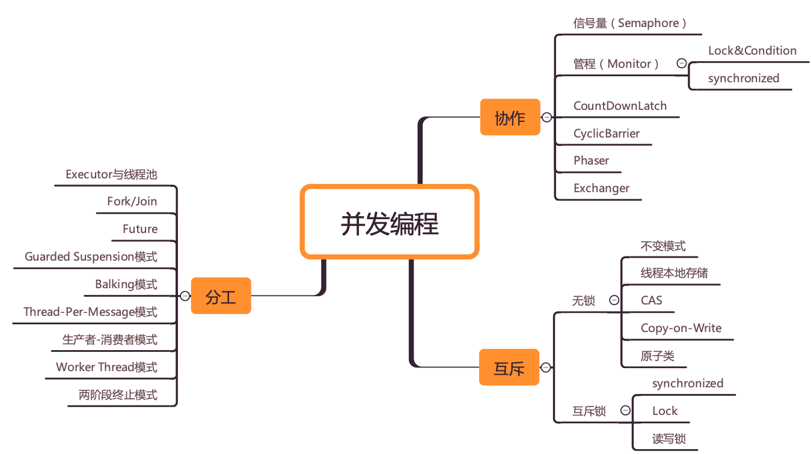

在聊多线程为什么不安全之前，需要说一哈学习多线程编程的路线。多线程说到底就是为了提高效率，而这个效率的提高是有安全风险的，这也是多线程为啥这么难的原因。而编写一个多线程的程序可以分为三个部分：分工、同步、互斥。

分工更偏向于**设计**，这里是提高性能的关键。相当于项目经理分配任务。与现实世界非常相似, **不过是一个线程执行完了一个任务，如何通知执行后续任务的线程开工而已。** 这里多说一句，计算机里的这个模型那个模型我认为都是为了更好的模拟现实世界。

而同步是偏向于**实现**，同步就是为了线程之间的更好的有序协作，这与现实世界的分工合作并无不同。线程之间的协作问题都可以认为时：当某个线程不满足条件时，需要怎么样，满足条件了，又怎么样。**在Java并发编程领域，解决协作问题的核心技术是管程**。

而互斥则是为了**安全**。线程不安全是因为线程之间执行的顺序是不确定的，导致不确定的因素有三点：可见性问题、有序性问题和原子性问题。java引入了JMM(内存模型，一组规则)解决前两个问题，这还不够。还需要解决互斥问题，所谓的互斥就是指**同一时刻，只能有一个线程访问共享变量**。解决互斥的关键还是锁。

下面贴出一张大佬总结并发学习的思路：



ok,我们开始进入正题：并发安全的三大问题是：可见性问题、原子性问题、有序性问题。在普通的计算机模型中，cpu通常采用三级缓存，之后才是内存，所以如果有多个核心，它们的一二级缓存是不共享的，但是它们对变量的操作都会在缓存里进行，显而易见，各个核心在自己缓存里的操作是隔离的，别人看不到的，这也就是所谓的可见性问题。

那么在java中，因为有JMM，堆是共享的，每个线程都有自己的逻辑工作内存，当然这个工作内存也是互不可见的。这就与上面的缓存问题是等价的。那么如果我们想在java中解决可见性，就需要对共享变量加上volatile关键字，注意，**volatile只保证可见性与有序性，不保证原子性**。volatile的工作原理时如果一个线程对共享变量做了改变，那么就会将改变强制刷新到堆中，同理如果有另外的线程想要操作共享变量，只能强制从堆中读取最新的数据。这里还有一点需要注意：**JMM规定，线程的操作只能在自己的工作内存中完成**。

原子性没啥好解释的。

有序性就是汇编指令的执行顺序不定，但是保证结果是一样的。

下面是一个存在线程安全的单例模式：

``` java

public class Singleton {
  static Singleton instance;
  static Singleton getInstance(){
    if (instance == null) {
      synchronized(Singleton.class) {
        if (instance == null)
          instance = new Singleton();
        }
    }
    return instance;
  }
}
```

问题在于 `new Singlrton()`的指令重排问题。可能的步骤是先分配内存，然后设置地址引用，最后初始化。如果线程A在设置完地址引用后，时间到了，此时不会释放锁。如果线程B此时才进入第一个if判断，因为已经设置过引用了，会直接返回。此时的对象还未创建后，会出现非法引用的错误。

在评论区看到一个正确的解答：

``` java
public class MySingleton {

    //内部类
    private static class MySingletonHandler{
        private static MySingleton instance = new MySingleton();
    }

    private MySingleton(){}

    public static MySingleton getInstance() {
        return MySingletonHandler.instance;
    }
}
```
[静态内部类实现的单例模式为什么是线程安全的](https://blog.csdn.net/mnb65482/article/details/80458571)