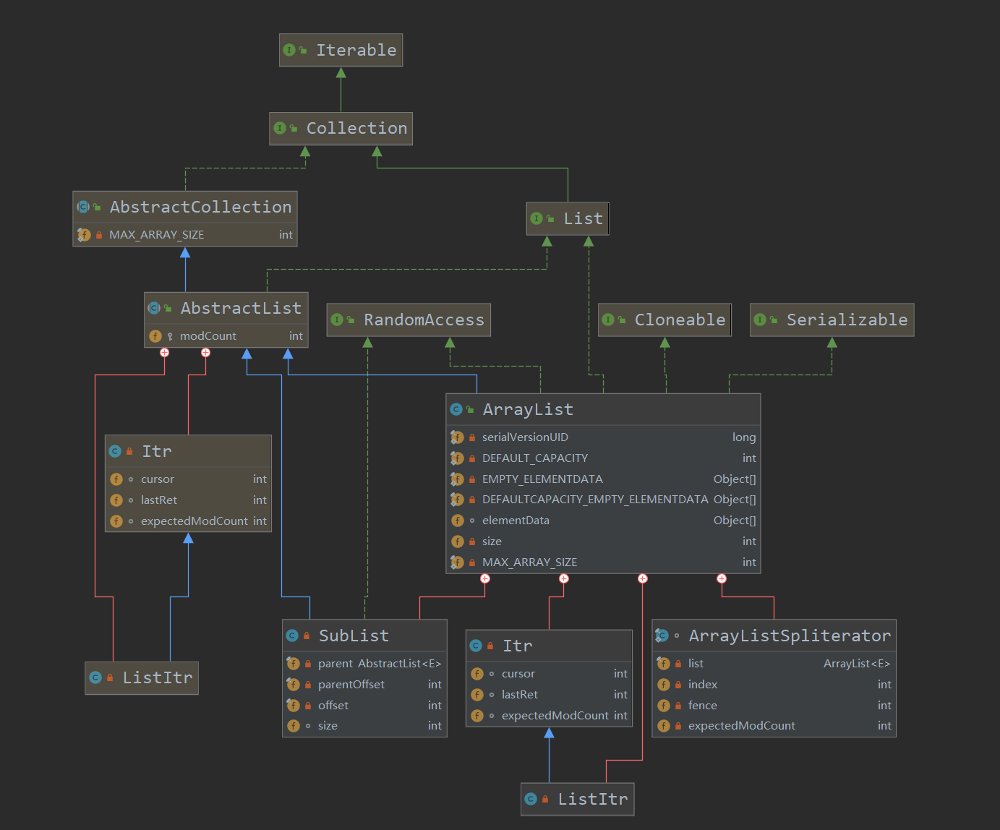

## 前言

分析源码初体验，第一次分析个比较简单的集合类ArrayList。我把重点放在了ArrayList实现的接口、继承的类以及几个主要的类方法上。

## 0x0 ArrayList继承图

我们首先来看看ArrayList中的继承图。



`ArrayList`继承自抽象类`AbstractList`,并且实现了`RandomAccess`、`Cloneable`、`Seriablizable`、`List`接口。

这里我首先有了两个疑惑:

- 接口与ArrayList之间为什么隔了一个抽象类`AbstractList`?
- 抽象类`AbstractList`已经实现了`List`接口，为什么ArrayList又实现了一遍？

对于**第一个**问题可以从设计模式的角度回答，因为接口`List`中的抽象方法是非常多的，如果`ArrayList`直接实现了该接口，那么`ArrayList`必须实现`List`中的所有抽象方法，尽管有些方法用不到。那么为了解决这个问题，JDK在接口与实现类中间添加一个抽象类，虽然抽象类不能生成对象，但是也可以实现接口中的抽象方法的，JDK中的AbstractList实现了一些非常非常通用的方法。ArrayList来继承上述的抽象类，这样ArrayList仅需实现AbstractList中没有实现的抽象方法，对于AbstractList已经实现的抽象方法，ArrayList可以自由选择实现与否。

也就是说抽象类AbstractList给了ArrayList需要实现的抽象方法的选择空间。

对于**第二个**问题,答案获取有些不那么令人信服，经过网上资料查阅，说是JDK的开发人员人为ArrayList实现List接口可能会对后序的开发有帮助，久而久之，就一直延续下来，造成了现在的局面。

ok，这两个问题解决了，我们继续向下探索。

## 0x1 ArrayList实现的接口

ArrayList实现了`RandomAccess`、`List`、`Cloneable`、`Serializable`接口。

**RandomAccess接口:**

这个`RandomAccess`是一个marker interface(该接口内什么都没有实现，仅仅是作为一个标记接口)。简单来说，实现了该接口的类就一定拥有随机访问的能力。所以我们在遍历一个类的时候，建议我们首先使用`instanceOf`判断当前类是否为`RandomAccess`的实现类，如果时，那么采用for循环(普通for循环，而不是增强型for循环，因为增强型内部也是使用迭代器)遍历比采用迭代器的平均性能更好。

**List接口:**

上一小节已经回答了该问题，开发人员的笔误。 :)

**Cloneable接口:**

虽然官方文档没有说明该接口是marker interface,但我感觉作用差不多，实现了该接口的类，那么该类的`clone`方法就是可用的，允许对象的字段复制。

**Serializable接口:**

作用也相当于一个marker interface，标识实现类是可序列化与反序列化的。

## 0x2 ArrayList中的重要属性与方法

### 0x2-1 ArrayList的属性

ArrayList的属性不是很多，但是有一个非常重要的属性`modCount`，继承自抽象类`AbstractList`，这个属性保证了fast-fail机制,这会在后面讲解方法的时候提到。

``` java

    //序列化ID
    @java.io.Serial
    private static final long serialVersionUID = 8683452581122892189L;

    /**
     * Default initial capacity.
     */
    //ArrayList的默认大小为10
    private static final int DEFAULT_CAPACITY = 10;

    /**
     * Shared empty array instance used for empty instances.
     */
    //这个和下面的区别就是采用无参构造函数时使用这个，大小为0的Object数组
    private static final Object[] EMPTY_ELEMENTDATA = {};

    /**
     * Shared empty array instance used for default sized empty instances. We
     * distinguish this from EMPTY_ELEMENTDATA to know how much to inflate when
     * first element is added.
     */
    //下面这个数组是在采用提供大小的构造函数但是提供的参数有误时使用的
    private static final Object[] DEFAULTCAPACITY_EMPTY_ELEMENTDATA = {};

    /**
     * The array buffer into which the elements of the ArrayList are stored.
     * The capacity of the ArrayList is the length of this array buffer. Any
     * empty ArrayList with elementData == DEFAULTCAPACITY_EMPTY_ELEMENTDATA
     * will be expanded to DEFAULT_CAPACITY when the first element is added.
     */

    //这个数组是实际存储元素的数组，不知道为什么不是private的啊，按道理来说即使是private也不影响内部类访问啊。
    //注意这个数组是不参与序列化的
    transient Object[] elementData; // non-private to simplify nested class access

    /**
     * The size of the ArrayList (the number of elements it contains).
     *
     * @serial
     */
     //List的大小是参与序列化的哦

     //存储的是数组实际的元素个数,并不是数组的长度
    private int size;
```

### 0x2-2 ArrayList中的重要方法

#### 构造方法
ArrayList中的构造方法有三个:

- 默认无参构造方法
- 初始化容量的构造方法
- 使用集合初始化的构造方法

第一个构造方法没什么好说的,就是使用`DEFAULTCAPACITY_EMPTY_ELEMENTDATA`初始化一个空的Object数组。数组的默认长度为10.

``` java
public ArrayList() {
        this.elementData = DEFAULTCAPACITY_EMPTY_ELEMENTDATA;
    }
```

第二个构造方法提供了一个容量参数,参数必须>=0,否则会抛出非法参数异常。如果容量大小为0,那么则使用`EMPTY_ELEMENTDATA`初始化数组,容量为0。

``` java
public ArrayList(int initialCapacity) {
        if (initialCapacity > 0) {
            this.elementData = new Object[initialCapacity];
        } else if (initialCapacity == 0) {
            this.elementData = EMPTY_ELEMENTDATA;
        } else {
            throw new IllegalArgumentException("Illegal Capacity: "+
                                               initialCapacity);
        }
    }
```

最后一个构造方法使用一个Collection初始化ArrayList,

``` java
public ArrayList(Collection<? extends E> c) {
        elementData = c.toArray();
        if ((size = elementData.length) != 0) {
            // c.toArray might (incorrectly) not return Object[] (see 6260652)
            if (elementData.getClass() != Object[].class)
                //如果c.toArray返回的不是Object数组,那么则需要使用数组工具类的copy方法一个一个复制元素
                elementData = Arrays.copyOf(elementData, size, Object[].class);
        } else {
            // replace with empty array.
            this.elementData = EMPTY_ELEMENTDATA;
        }
    }
```

这里需要提一嘴Arrays中的`copyOf`方法,其中的一个小问题困扰了我很长时间,下面是Arrays中其中一个的`copyOf`的源码:

``` java
public static <T,U> T[] copyOf(U[] original, int newLength, Class<? extends T[]> newType) {

    @SuppressWarnings("unchecked")
    T[] copy = ((Object)newType == (Object)Object[].class) ?
            (T[]) new Object[newLength] :
            (T[]) Array.newInstance(newType.getComponentType(), newLength);
    System.out.println((Object)newType.toString());
    System.arraycopy(original, 0, copy, 0,
                        Math.min(original.length, newLength));
    return copy;
}
```

我一直不理解为什么需要加上`((Object)newType == (Object)Object[].class)`这一句判断，在stackoverflow上看到了一个[答案](https://stackoverflow.com/questions/29494800/do-not-understand-the-source-code-of-arrays-copyof),回答说这句话的目的就是检查`newType`是否持有一个`Object[]`类型的引用,可是这里的newType只有非基本类型的Class对象传进来才能编译成功,否则就会出现无法推断泛型的准确类型???

我好像又懂了,虽然代码里写的是强转Object,但是在运行时`==`比较的是等号两边指的是否为同一个对象,并不是说,我们在代码里把它转成Object了,在运行时两边比较的就是Object。

所以`((Object)newType == (Object)Object[].class)`之所以要进行强转,是因为由于泛型的原型，两边本身就不是同一个type,所以使用`==`比较编译根本就无法通过(所以说`==`的两侧必须是同一个类型编译才能通过?)。

ok,第二个困惑我的原因就很搞笑了,我原来调试的时候这句代码的执行结果一直是true,尽管我传进来的是`Integer[].class`,这我就纳了闷了,我就寻思那这句代码不是废话?既然只能传对象的Class,那不是恒成立,后来再调试的偶然瞬间发现,在调试copyOf的时候,调用这个api的函数根本就不是我写的,怪不得一直Object,不管传进来的是什么...这个错误着实搞笑,后来我直接从用户代码step into,嗯，结果对了，上述这句代码的结果为false,舒服了。

最后说说为什么要有这句代码,是因为直接new比采用newInstance快,因为newInstance使用了反射,[参考：](https://stackoverflow.com/questions/29494800/do-not-understand-the-source-code-of-arrays-copyof)

> new Object[...] creates an array the normal way, of a type that is statically known. Remember, the code has just checked that T[] is Object[].

> Array.newInstance(...) uses reflection to dynamically create an array of the Class type passed in.

`copyOf`方法是会构建一个新的数组来存放元素的拷贝,当然需要说明:**copyOf是浅拷贝!!!**


#### add方法

ArrayList的add方法挺多的，我将按照我的使用频率依次讲解。

首先是`add (E e)`方法:

``` java "add(E e)"
public boolean add(E e) {
        modCount++;
        add(e, elementData, size);
        return true;
    }
```

该方法首先将modCount加1,因为add方法使ArrayList发生了结构性改变,这会在后面说到,方法内部又调用了add的重载函数,

``` java
private void add(E e, Object[] elementData, int s) {
    if (s == elementData.length)
        elementData = grow();
    elementData[s] = e;
    size = s + 1;
}
```

首先判断ArrayList的属性`size`是否达到了`elementData`的长度,这说明`size`属性并不是实时更新,size是数组实际存储的元素个数，应该会在elemeData扩张的时候更新。如果已经没有空间存放新元素了,就调用`grow`函数。其又会调用grow的带参重载函数。

``` java

//此时size==elementData.length
private Object[] grow() {
    return grow(size + 1);
}

//minCapacity是我们能够允许的最小的新的数组空间,也就是多一个
private Object[] grow(int minCapacity) {
    int oldCapacity = elementData.length;
    //如果数组中已经存在元素或者并不是调用默认构造函数创建对象
    //那么我们可能会扩充至原始的1.5倍,为什么用可能,需要看具体的获取大小的函数
    if (oldCapacity > 0 || elementData != DEFAULTCAPACITY_EMPTY_ELEMENTDATA) {
        int newCapacity = ArraysSupport.newLength(oldCapacity,
                minCapacity - oldCapacity, /* minimum growth */
                oldCapacity >> 1           /* preferred growth */);
        return elementData = Arrays.copyOf(elementData, newCapacity);
    } else {
        //否则如果我们原始大小为0,那么就扩充为10个长度
        return elementData = new Object[Math.max(DEFAULT_CAPACITY, minCapacity)];
    }
}
```

获取数组新容量的函数如下:

``` java
public static int newLength(int oldLength, int minGrowth, int prefGrowth) {
        // assert oldLength >= 0
        // assert minGrowth > 0

        //在最小增长大小和最适应增当大小之间选一个,并加上原来的大小,不出意外就是扩充为原来的1.5倍
        int newLength = Math.max(minGrowth, prefGrowth) + oldLength;
        //如果计算出的新大小没有超过MAX_ARRAY_LENGTH=Integer.MAX_VALUE-8
        //那么就返回新计算出的大小
        //否则就继续扩充,最大扩容至Integer.MAX_VALUE
        if (newLength - MAX_ARRAY_LENGTH <= 0) {
            return newLength;
        }
        return hugeLength(oldLength, minGrowth);
    }

    private static int hugeLength(int oldLength, int minGrowth) {
        int minLength = oldLength + minGrowth;
        if (minLength < 0) { // overflow
            throw new OutOfMemoryError("Required array length too large");
        }
        if (minLength <= MAX_ARRAY_LENGTH) {
            return MAX_ARRAY_LENGTH;
        }
        return Integer.MAX_VALUE;
    }
```

上面的ArrayList源码是JDK14的,和JDK8还是有点区别的,不过差别不大,都是将容量扩充到原来的1.5倍，而size只是简单的记录数组中元素的数量。

#### toArray方法

还有一个我经常使用的方法`toArray`,这下顺便看到了真面目,如果使用无参的`toArray`,那么因为调用的是copyOf,返回了原始数组的浅拷贝副本,~~也是Object数组~~。该方法不一定会返回Object[]。
因为子类对象是可以使用父类引用保持的。具体类型取决于list中的数据类型。如下 代码所示:

``` java
public Object[] toArray() {
    return Arrays.copyOf(elementData, size);
}

public static <T> T[] copyOf(T[] original, int newLength) {
    //这里的original就是elementData
    return (T[]) copyOf(original, newLength, original.getClass());
}
```

如果使用的是带参的`toArray`,那么参数就是我们想要该函数返回的数组类型,比如`toArray(new Integer[0])`,这里的数组长度无所谓了,反正都会创建一个数组,还有这个传入数组的类型,应该必须是非基本类型,不然又会出现类型无法推导的错误。

``` java
public Object[] toArray() {
        return Arrays.copyOf(elementData, size);
    }

public <T> T[] toArray(T[] a) {
        if (a.length < size)
            // Make a new array of a's runtime type, but my contents:
            return (T[]) Arrays.copyOf(elementData, size, a.getClass());
        System.arraycopy(elementData, 0, a, 0, size);
        if (a.length > size)
            a[size] = null;
        return a;
    }

```

## 0x3 ArrayList中的迭代器

为什么要讲迭代器呢?因为我想讲讲不能在使用迭代器遍历list时删除元素的原因。`AbstractList`中有一个叫做`modCount`的属性,在初次构建list对象时初始化为0。

> protected transient int modCount = 0;

在我们对list做出结构性改变时,modCount也会改变。所谓的结构性改变是指list中元素个数发生了变化。

``` java "JDK8"
    //add函数
    public boolean add(E e) {
        //每次增加元素时都需要确保仍然有空间保存元素
        ensureCapacityInternal(size + 1);  // Increments modCount!!
        elementData[size++] = e;
        return true;
    }
    private void ensureCapacityInternal(int minCapacity) {
        ensureExplicitCapacity(calculateCapacity(elementData, minCapacity));
    }

    private void ensureExplicitCapacity(int minCapacity) {
        //添加元素时modCount加1
        modCount++;
        // overflow-conscious code
        if (minCapacity - elementData.length > 0)
            grow(minCapacity);
    }

    //remove函数
    public E remove(int index) {
        rangeCheck(index);
        //list元素减少时,modCount加1
        modCount++;
        E oldValue = elementData(index);

        int numMoved = size - index - 1;
        if (numMoved > 0)
            System.arraycopy(elementData, index+1, elementData, index,
                             numMoved);
        elementData[--size] = null; // clear to let GC do its work

        return oldValue;
    }
```

可以看到只要对list做增删操作,那么就会使modCount发生改变。ok,那我们接下来看看ArrayList内部类实现的迭代器。

``` java "ArrayList内部实现的迭代器"
private class Itr implements Iterator<E> {
    int cursor;       // index of next element to return
    int lastRet = -1; // index of last element returned; -1 if no such
    //使用modCount初始化expectedModCount
    int expectedModCount = modCount;

    Itr() {}

    public boolean hasNext() {
        return cursor != size;
    }

    @SuppressWarnings("unchecked")
    public E next() {
        checkForComodification();
        int i = cursor;
        if (i >= size)
            throw new NoSuchElementException();
        Object[] elementData = ArrayList.this.elementData;
        if (i >= elementData.length)
            throw new ConcurrentModificationException();
        cursor = i + 1;
        return (E) elementData[lastRet = i];
    }

    //检查expectedModCount的值是否发生改变
    final void checkForComodification() {
        if (modCount != expectedModCount)
            throw new ConcurrentModificationException();
    }
...

}
```

可以看到,在使用迭代器的`next()`时,代码会首先检查modCount是否发生改变,那么在什么情况下modCount会发生改变?就是我们在自己额外调用例如`add()`、`remove()`改变list元素个数的方法时会改变modCount,所以如果在使用迭代器遍历的时候如果改变list的元素个数时,会抛出ConcurrentModificationException。**这就是所谓的fail-fast**。

如果在多线程环境下,其他线程有可能在当前线程遍历的同时对list做出结构性改变,所以ArrayList不是线程安全的。也会抛出同样的异常。

在使用迭代器遍历时,注意如果我们仅仅是改变元素的内容,而不改变元素个数的操作是允许的。ok,问题提出来了,那么如何再使用迭代器遍历的时候增删元素?

当然是调用迭代器的自己的`remove`方法了奥。

``` java
//这个单向迭代器只能删除当前获取的元素
public void remove() {
    if (lastRet < 0)
        throw new IllegalStateException();
    checkForComodification();

    try {
        //在检查完modCount之后,再调用remove方法
        ArrayList.this.remove(lastRet);
        cursor = lastRet;
        lastRet = -1;
        expectedModCount = modCount;
    } catch (IndexOutOfBoundsException ex) {
        throw new ConcurrentModificationException();
    }
}
```

下面是一个使用的小栗子👀

``` java
public void testRemove(){
    ArrayList<Integer> t=new ArrayList<>();
    t.add(1);
    t.add(2);
    t.add(3);
    Iterator<Integer> it=t.iterator();
    while(it.hasNext()){
        if(it.next()==2){
            //
            it.remove();
        }
    }
}
```

## 0x4 小结

关于ArrayList的源码就分析到这里了,后续如果有什么没想到的应该会补充的奥。👼