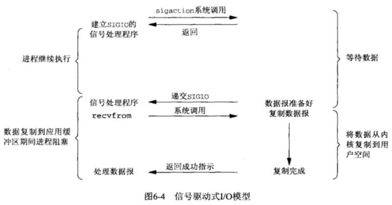

## 前言

相信对于很多新人来说，同步、异步、阻塞、与非阻塞这四个概念非常容易混淆。那是因为我们没有搞清楚我们看待问题的视角。对于这四个概念，站在不同的角度，如何区别是不同的。我在此将所有的资料汇总，总结，并提出我自己的见解。

我将分两种维度讨论这四种概念，分别是广义上的同步与阻塞，以及狭义上的同步与阻塞。

## 1. 广义维度下的区分

相信很多人在编写多线程程序最大的难度就是让各个线程之间同步合作。那么根据<<操作系统概念>>(第九版)一书中关于进程之间通信部分小节的同步异步概念:([怎样理解阻塞非阻塞与同步异步的区别?](https://www.zhihu.com/question/19732473))


其中说到进程之间的消息传递可以分为阻塞或者非阻塞的，也即是同步或者异步的。发送和接受动作分别可以细分为两种情况：

- 阻塞发送：发送进程会被阻塞直到消息被接受
- 非阻塞发送：发送进程发送完毕后可以进行其他操作
- 阻塞接受：接收进程会被阻塞直到消息可用
- 非阻塞接受：接收进程收到消息或返回空

那么站在我们多线程程序的角度，我们可以认为同步即阻塞，异步即非阻塞。无论底层是如何实现的。

## 2. 狭义维度下的区分

所谓的狭义维度即我们进行IO操作的角度。因为IO操作的特殊性，阻塞是可能发生的。那么下面我将通过介绍五种linux平台的IO模型来区分这四种概念：

- 阻塞IO模型
- 非阻塞IO模型
- IO多路复用模型
- 信号通知模型
- 异步IO模型

首先我们肯定是要通过内核与外部设备进行IO交互，那么一次IO操作基本上可以分为三个步骤：

1. 用户进程等待IO设备的数据
2. 通知用户进程所需数据已经准备好
3. 用户进程把IO数据从内核空间拷贝至用户空间

了解这三个步骤后，很自然地会想到第一部分的等待是如何等待，是占用CPU空等还是进行睡眠操作？第二部分的通知什么时候通知？（我们上面的IO操作基于单线程网络IO）下面的四种模型很好地回答了上述这两个问题。

### 2.1 阻塞IO模型

首先阻塞IO模型最符合我们的惯性思维，模型如下图所示(图片应该来自unix网络编程一书，未经本人考证):


在linux的世界里，一切皆文件。那么我们也可以将socket当作一种特殊的文件来进行独写。在默认情况下socket为**阻塞**模式，那么当用户进程调用`recvfrom`后，由于此时IO数据尚未准备完成，用户进程会被阻塞(处于等待阶段)，直到数据准备完成。此时用户进程还是会被阻塞至数据拷贝至用户空间（处于拷贝阶段）。

可以看到，在一次IO操作中用户线程是全程被阻塞的，所以这是最基本的阻塞IO模型。

### 2.2 非阻塞IO模型


上图为非阻塞IO模型的基本示意图。

在进行网络IO时，我们可以将socket设置为**非阻塞**模式。这个设置就是告诉内核对于这个socket，调用`recvfrom`读取该socket时，如果数据尚未准备完成，那么直接返回，不必等待至数据准备好。所以在第一阶段我们不必等待。

那么什么时候用户进程会得知内核完成数据准备呢(即第二阶段)?在这个模型中，用户进程会不断进行轮循操作，即不断调用`recvfrom`来得知数据是否准备完毕，从而完成第二个阶段。

第三个阶段与阻塞IO模型类型，都是从内核空间将数据拷贝出来。可以看到第二阶段的轮循操作是非常浪费资源的，因为大多时候我们在做无用功。从而产生了IO多路复用模型。

### 2.3 IO多路复用模型

所谓的**多路**是指多个socket的读写，**复用**是指所有的IO都可以通过复用一个或几个线程来完成。基本模型如下图所示：


IO多路复用模型的工作场景如下：

假设我们现在有socket A、B需要进行IO操作，有三种方案：

1. 单线程，采用阻塞IO模型：这就是将所有的IO操作串行，当两个socket流量都非常低且不活跃时，效率非常低
2. 单线程，采用非阻塞IO模型，不断对A、B进行轮循操作，当然仍然会浪费大量的时间
3. 采用多线程，阻塞IO模型，将A、B的IO轮循任务分配两个子线程。虽然这样效率比前面两种方案都高，但是线程是非常宝贵的资源，创建与销毁线程代价昂贵

难道我们就不能让socket完成数据准备后自己通知用户线程吗？这样就能避免大量不必要的轮循操作。当然这是可行的。也就是使用linux平台的select、poll、epoll等系统调用。对应于java中的NIO。

这里我首先以`select`作为例子。基本的流程如下：

1. 我们将需要操作的socket注册到`select`函数中，并绑定我们感兴趣的操作，例如是读还是写。然后调用`select`。**注意`select`仍然会阻塞用户进程**。
2. `select`会不断的对注册的socket进行轮循操作，直至有可用的socket出现，此时该函数会返回，但剩余未准备好的socket仍然可以继续准备。
3. 对可用的socket进行感兴趣的操作。然后继续调用`select`

那么我们节省的时间在哪里？很简单，就是在当我们select出一些socket后进行数据处理操作时，剩余的socket仍然可以继续准备。可能当我们下一次调用`select`时又有新的socket已经准备好了。这样就避免对多个socket进行轮循时，已经准备好的socket后轮循，没准备好的先轮循，浪费了不必要的时间。

当然对于`select`,还有更多的细节需要注意。这里只需要记住，对于第一个等待数据的阶段同样会**产生阻塞**，第三阶段拷贝数据时也会**产生阻塞**。

### 2.4 信号通知模型

信号模型如下图所示：



信号IO模型似乎用的不是很多，所以对于其的介绍我引用自[Unix 网络 IO 模型: 同步异步, 傻傻分不清楚?](https://segmentfault.com/a/1190000007355931)：

>当文件描述符就绪时, 我们可以让内核以信号的方式通知我们.
我们首先需要开启套接字的信号驱动式 IO 功能, 并通过 sigaction 系统调用安装一个信号处理函数. sigaction 系统调用是异步的, 它会立即返回. 当有数据时, 内核会给此进程发送一个 SIGIO 信号, 进而我们的信号处理函数就会被执行, 我们就可以在这个函数中调用 recvfrom 读取数据

### 2.5 异步IO模型

所谓的异步IO模型，是在我们进行系统调用后直接返回，但并不像阻塞IO模型返回`EWOULDBLOCK`，具体返回什么有待学习。然后当数据准备完毕并拷贝至用户空间时，内核会发送信号通知用户进程处理数据。模型如下所示：


可以看到，异步IO模型甚至不需要我们拷贝数据，当然异步IO在网络编程中很少用到，可能会用在文件IO中。

### 2.6 IO维度下的同步与异步

根据IEEE针对[POSIX相关规定](https://pubs.opengroup.org/onlinepubs/9699919799/basedefs/V1_chap03.html)中的第3.30条异步I/O操作定义：

>3.30条：Asynchronous I/O Operation
An I/O operation that does not of itself cause the thread requesting the I/O to be blocked from further use of the processor.
This implies that the process and the I/O operation may be running concurrently.

与第3.387条同步I/O操作的定义:

>3.387 Synchronous I/O Operation
An I/O operation that causes the thread requesting the I/O to be blocked from further use of the processor until that I/O operation completes.
Note:
A synchronous I/O operation does not imply synchronized I/O data integrity completion or synchronized I/O file integrity completion.

我们可以得知在I/O视角下：

- 同步IO：由于请求IO而导致当前进程丧失处理器使用权直至操作结束
- 异步IO：请求IO并不会导致当前进程对处理器的使用权

那么我们就可以对上述五种IO模型进程同步与异步的划分了。

- 阻塞IO模型：在第一阶段和第三阶段都会由于系统调用而当值当前线程被阻塞
- 非阻塞IO模型：在第三阶段拷贝数据时会导致当前线程被阻塞
- IO多路复用模型：在第一阶段和第三阶段线程都会被阻塞
- 信号通知模型：在第三阶段拷贝数据时当前线程会被阻塞
- 异步模型：三个阶段线程都不会被阻塞

那么我就可以得知，阻塞IO模型、非阻塞IO模型、多路复用IO模型、信号通知模型都是同步I/O操作。下图很好地进行了总结：


### 2.7 小节

在网络I/O视角下，是否同步与是否采用阻塞模型无关。那么当我们将视角提高至线程之间通信时，此时的同步基本上可以与阻塞划等号。比如我们当前调用了一个异步API，与这个API底层怎么实现的无关。

所以说，要想分清同步异步与阻塞非阻塞这四个概念，不在一定的维度讨论是没有办法分清楚的。

## 3. 详解多路复用IO模型

上面简要描述了linux平台下的五种I/O模型，其中多路复用模型其实才是我们最有可能采用的。在linux下，有三个API可以帮助我们实现这个模型，分别是：`select`、`poll`、`epoll`。这三个API的效率基本上按照从左到右由低到高。

在详细介绍这三种方法前，我们需要了解一个阻塞的socket和一个非阻塞的socket有什么区别：

- 阻塞的socket：读取时如果数据尚未准备好，那么当前线程会一直被阻塞直至数据准备完成
- 未阻塞的socket：读取时如果数据尚未准备好，那么当前线程并不会被阻塞，会执行后续的操作

**并且我们可以将socket当作文件处理，使用文件描述符fd指代向应socket。**

### 3.1 select方法

函数签名如下：

``` c
int select(int nfds, fd_set *rdfds, fd_set *wtfds, fd_set *exfds, struct timeval *timeout)
```

- ndfs：监听的fd(file descriptor)总数
- rdfds：需要监听可读事件的socket集合
- wtfds：需要监听可写事件的socket集合
- exfds：需要监听异常事件的socket集合

那么`select`的工作原理很简单，我们将需要监听的socket集合传入该函数后：

1. `select`会将相应的socket集合**拷贝至内核空间**(注意每每次调用都会拷贝)
2. `select`轮循探测监听的socket，如果有对应的socket完成事件，那么`select`就会返回，否则会保持阻塞状态
3. 那么在函数返回后，我们并不知道是哪个socket的什么事件准备好了，所以我们需要**遍历我们的socket**，依次探测所有类型的事件是否完成，不管这个socket到底对当前探测的事件是否感兴趣，并且又会把相应的socket拷贝至用户空间
4. 在进行新一轮的`select`调用时,又得重新设置socket集合，因为上一轮已经改变了集合


当然`select`存在很多缺点：

1. 在**每次**调用`select`时都会将目标socket集合`fd_set`从用户空间拷贝至内核空间，所以当socket集合很大时，每次拷贝的效率会非常低
2. `select`内部每次使用**轮询操作**探查是否有socket的对应事件准备完毕，因为其使用的`fd_set`由数组组成，大小一般限制为1024(因为操作系统对每个进程可用的最大描述符数限制了上限，可在编译时重新设置)，所以每次轮询都需要完整遍历，这又会使`select`效率变低
3. 在找到准备好的socket集合后，`select`又会将所有的`fd_set`再从内核拷贝至用户空间，再次将`select`效率变低
4. 在每次调用`select`时，之前设置的`fd_set`都会失效，所以每次循环前都需要重新设置`fd_set`.

### 3.2 poll方法

`poll`与`select`并无大的差别，只不过`poll`使用的socket集合`pollfd`没有大小的限制，因为底层是采用链表实现的，所以`select`有的缺点`poll`都会存在

### 3.3 epoll机制

**epoll的基本玩法**

`epoll`是`poll`的升级版，`epoll`的API分为三个部分：

``` c
int epoll_create(int size);
int epoll_ctl(int epfd, int op, int fd, struct epoll_event *event);
int epoll_wait(int epfd, struct epoll_event * events, int maxevents, int timeout);
```

1. epoll_create：首先调用`epoll_create`创建`poll`对象。并且会开辟一个红黑树与就绪队列。红黑树用来保存我们需要监听的socket结合，就绪队列用来保存已经准备就绪的socket集合
2. epoll_ctl：注册要监听的事件类型。在每次注册新的事件到epoll句柄中时，会把对应的socket复制到内核中，注意对于一个socket，在`epoll`中**只会被复制一次**，不像`select`**每次调用**时都会复制。并且同时会向内核注册回调函数，大致功能是当该socket事件完成时将其加入就绪队列。
3. epoll_wait：等待事件的就绪，其只用遍历就绪队列，所以`epoll`的复杂度至于活跃的连接数有关。并且返回就绪socket集合**采用了内存映射**，进一步减少了拷贝fds的操作。但是同时`epoll_wait`返回后，会将就绪socket对应事件清空，如果后续仍想关注当前处理的socket，那么就需要用epoll_ctl(epfd,EPOLL_CTL_MOD,listenfd,&ev)来重新设置socket fd的事件类型，**而不需要重新注册fd**

**epoll解决了什么问题：**

1. epoll通过回调机制实现了知道哪个socket的哪些事件准备完成，这在`select`中需要通过轮询完成(这里并不是指在`epoll_wait`返回后不需要遍历小于返回值的fd，仍然需要循环遍历socket进行处理)
2. epoll只会在fd初次注册使用`epoll_ctl`时拷贝至内核,而`select`每次都需要完整的拷贝所有fd，并且每次都需要重新设置描述符结合，因为每次`select`返回后都会修改描述符集合

**epoll的LT与ET模式：**

epoll有EPOLLLT和EPOLLET两种触发模式。它们主要的区别有两点：

1. LT模式下，只要有socket活跃，那么就会向用户进程发送信号，通知进程对数据进行操作。而ET模式只会在socket无法存放数据时才会通知进程对数据进程操作，例如读时没有内存存储数据
2. LT模式下，如果一个socket的数据未使用完毕，那么下一轮通知中还会包含未处理完毕的socket，ET模式下，一个socket的数据未使用完毕，那么epoll会认为当前socket的状态未发生改变，下轮通知时不会包含当前socket

那么LT模式的缺点是很明显的，因为有可能会有大量的我们并不关心的socket对我们发送通知，所以我们一般都会采用ET模式。

但是ET模式下，如果一个socket的数据不能一次处理完毕，该socket就会被认为状态未发生改变。所以我们一般会采用循环处理socket的所有数据。这又产生了新的问题。如果该socket被设置阻塞模式，在循环进行最后一次读取时，读取到的数据必然为空，当前线程会被阻塞，直到该socket收到数据。
那么LT模式如果有阻塞socket的数据一次不能处理完呢？解决方法就是我们就不需要使用循环读取所有数据，只需调用一次，因为LT模式下该socket还会出现在就绪队列中。

所以我们一般**建议**在使用ET模式将socket设置为阻塞模式。但是这并不说明ET模式下不能将socket设置为阻塞模式。如果socket的数据一次能够读取完毕，那么也不会阻塞当前线程。所以我们说建议，因为ET模式的阻塞socket可能会产生预想不到的问题。**同时也说明是否阻塞socket并不影响多路复用IO模型的使用。**

### 3.4 小结

其实我们可以发现多路复用IO模型其实就是在完成两件事：

- 维护需要监听的fd集合
- 等待目标事件的完成

`select`就是把这两件事放在一起做，每次调用时都要重新注册需要监听的集合，并且每次都会进行阻塞操作。

而`epoll`就将维护操作放在了第二步，只需第一次注册，然后使用`wait`函数完成阻塞的操作。

那么`epoll`比`select`快是理由的：

1. 因为在大部分情况下我们需要监听的fd集合是固定的，`epoll`不会进行重复注册
2. 在每次设置fd的目标事件时，因为`epoll`内部采用的红黑树，查找对应的`socket`都是`o(lgn)`的复杂度。而`select`需要设置所有的fd集合。

**那么在任何时候都应该优选选择`epoll`吗？**

答案当然是否定的。如果当前服务器的连接数较少并且都很活跃，`epoll`不一定会优于`select`，因为`epoll`注册回调函数等操作都需要代价。


## 4. java世界中的多路复用模型

## 参考文献

1. [同步I/O(阻塞I/O，非阻塞I/O)，异步I/O](https://cllc.fun/2019/03/07/synchronous-asynchronous-io/)

2. [Java sockets I/O: blocking, non-blocking and asynchronous](https://medium.com/@liakh.aliaksandr/java-sockets-i-o-blocking-non-blocking-and-asynchronous-fb7f066e4ede)

3. [POSIX的一些相关定义](https://pubs.opengroup.org/onlinepubs/9699919799/basedefs/V1_chap03.html)

4. [怎样理解阻塞非阻塞与同步异步的区别？](https://www.zhihu.com/question/19732473)

5. [I/O 多路复用，select / poll / epoll 详解](https://imageslr.github.io/2020/02/27/select-poll-epoll.html)

<<<<<<< HEAD
6. [Linux编程之select](https://www.cnblogs.com/skyfsm/p/7079458.html)
=======
6. [关于非阻塞I/O、多路复用、epoll的杂谈](https://www.cnblogs.com/upnote/p/12017212.html)

6. [select、poll、epoll之间的区别(搜狗面试)](https://www.cnblogs.com/aspirant/p/9166944.html)

7. [poll原理详解及epoll反应堆模型](https://blog.csdn.net/daaikuaichuan/article/details/83862311)
>>>>>>> 3749c30993bab2a61b72831b09f6b19fe7f18fa2
