## 前言
> 这篇文章是在研究java的Type体系顺带扯出的概念,泛型的使用要说简单也很简单,要说难也可以说难。本文将由浅入深,带你学习java中的"泛型"。

## 1. 泛型的基本概念

泛型的概念始于java1.5,所以在1.5之前所有使用java的地方都没有泛型的影子,那么为了保持向后兼容,java中的泛型被设计成了伪泛型,仅仅存在于编译时期,在实际生成的字节码文件中是没有泛型的,这一动作叫做泛型的**擦除**。

泛型的基本格式为:`class Perosn<T>`,其中定义在`<>`的变量称为`type variable`,这一概念是随着泛型而出生的,并且也跟java的Type子系统息息相关。在jse8文档中,声明`type variable`允许用在四个地方,但是并不限制`type variable`的使用个数。允许的四个地方分别是:

- 泛型类
- 泛型接口
- 泛型方法
- 泛型构造函数

其中泛型构造函数的使用可以归档在泛型方法一类中。

注意:
> 使用泛型构造方法并不要求类是泛型类

### 1.1 泛型使用的简单示例

**泛型类与泛型接口:**

泛型类和泛型接口的声明比较简单,仅需要在类名或者接口名后面使用`<>`声明`type variable`即可。
``` java
//泛型类
class Person<T,E> {
    private T name;
    private E age;

    void func(T name,E id) {
        System.out.println(this.getClass().getSimpleName());
    }
    public void setName(T name){
        this.name=name;
    }
    public T getName(){
        return this.name;
    }

    public E getAge() {
        return this.age;
    }

    public void setAge(E age) {
        this.age = age;
    }
}
//泛型接口

interface People<T>{
    T getName();
}
```

**泛型方法:**

泛型方法又分为普通的泛型方法、静态泛型方法、泛型构造方法。泛型方法的声明麻烦一点,泛型方法需要在权限修饰后面定义所要使用的`type variable`。

下面是一组使用泛型方法和泛型类的代码:

``` java
package generic;

class People<T>{
    private T name;
    private int age;

    public People(T name,int age){
        this.name=name;
        this.age=age;
    }

    public T getName() {
        return name;
    }

    public void setName(T name) {
        this.name = name;
    }

    public int getAge() {
        return age;
    }

    public void setAge(int age) {
        this.age = age;
    }
}
class Test<V>{

    public<T> V getInfo(People<T> p1, People<T> p2, V sum){
        System.out.println("p1:"+p1.getName()+" "+p1.getAge());
        System.out.println("p2:"+p2.getName()+" "+p2.getAge());
        return sum;
    }
}
public class GenericTest {
    public static void main(String[] args) {
        People<String> p1=new People<>("Bob",23);
        People<String> p2=new People<>("Lee",20);
        Test<Integer> t=new Test<>();
        Object result= t.<String>getInfo(p1,p2,23);
        //Object result=t.getInfo(p1,p2,23);

        System.out.println("result is an instance of Integer:"+result instanceof Integer);

    }
}
```
运行结果如下:

``` java
p1:Bob 23
p2:Lee 20
result is an instance of Integer:true
```

其中泛型方法签名为:`public<T> V getInfo(People<T> p1, People<T> p2, V sum)`,`T`是这个泛型方法`getInfo`指定的类型变量,而`V`则是泛型类指定的类型变量。在调用泛型方法时,可以在`.`和方法名之间明确指定泛型方法的具体类型,或者让编译器自己推断。

其实上面这个泛型方法有个明显的缺点,就是返回值的类型也是一个泛型,这就要求调用者必须判断返回值的具体类型,因为接口。那么可能有人会问了,那`ArrayList`的源码中也有很多返回泛型的例子,他们写的也差劲?例如:

``` java
public E get(int index) {
    rangeCheck(index);
    return elementData(index);
}

@SuppressWarnings("unchecked")
E elementData(int index) {
    return (E) elementData[index];
}
```

这样写是因为库编写者已经确定容器中存储的元素的类型就是`E`,强制转换成`E`并不会出错,并且调用者也知道返回的类型到底是什么。而且因为方法的返回值是泛型`E`,编译器会在调用者部分的字节码中自动插入一段强制转换代码将元素类型转为为`E`。这是由于类型擦除导致的,这会在**后文**详细解释。

静态泛型方法与常规的泛型方法唯一区别就是**静态泛型方法中不能使用泛型类的类型变量**,例如在`people`中声明一个方法:

``` java
public static <M> calc(M year,M mouth){...}
```
`calc`中不能使用泛型类`People`中的类型变量`T`。

**泛型构造方法:**

最后泛型构造方法又可以分为两种:类本身就是泛型类,类不是泛型类。下面是一个简单的例子:

``` java
//所在类不是泛型类
class People{
    public <T & Comparable<T>> People(T age){
        ...
    }
}

//所在类是泛型类
class People<T>{
    public People(T age){
        ...
    }
}
```

其中`<T & Comparable<T>>`的含义是要求`T`已经实现了Comparable接口。这部分细节可以查看jse8关于[type variable](https://docs.oracle.com/javase/specs/jls/se8/html/jls-4.html#jls-4.4)的详细规范。

## 2. 泛型通配符

在了解泛型通配符之前,我们需要知道一些基本术语:协变、逆变、不变,这一部分引自[仔细说说Java中的泛型](https://zhuanlan.zhihu.com/p/31137677)。

逆变与协变用来描述类型转换（type transformation）后的继承关系，其定义：如果A、B表示类型，f(X)表示类型转换，≤表示继承关系(比如,A≤B表示A继承于b),那么这里有三个关系

>1. 当A≤B时有f(B)≤f(A)成立，那么说f(X)是逆变（contravariant）的
>2. 当A≤B时有f(A)≤f(B)成立，那么说f(X)是协变(covariant)的
>3. 当上两者都不成立的时候，那么说f(X)是不变（invariant)的

在java中,**数组是支持协变的**,例如下面这句代码可以通过编译,但会产生运行时错误:
> Number[] test=new Integer[];

`Integer`是`Number`的子类,同时变成数组,`Integer[]`还是`Number[]`的子类。

---
**Extension One:在java中数组为什么要设计成协变的?**

答案来源于:[java中，数组为什么要设计为协变？](https://www.zhihu.com/question/21394322),我在这里补充一些我的理解。

在java1.5之前,java是不支持泛型的,因为没时间做。但是又需要泛型的特性,所以就把数组设计成协变的了。例如在比较数组时调用的是`Arrays.equals`方法,其底层调用的是`Object.equals`方法。
``` java
public static boolean equals(Object[] a, Object[] a2) {
        if (a==a2)
            return true;
        if (a==null || a2==null)
            return false;

        int length = a.length;
        if (a2.length != length)
            return false;

        for (int i=0; i<length; i++) {
            Object o1 = a[i];
            Object o2 = a2[i];
            if (!(o1==null ? o2==null : o1.equals(o2)))
                return false;
        }

        return true;
    }

```
**如果**数组是不支持协变的,那么比较`B`时得重写`equals`的代码,比较`A`时又得重写一份`equals`的代码,因为`A[]`不能赋值给`Object[]`,代码重写非常严重,违背了代码复用的宗旨。所以将数组设计成协变的,使得`A[]`能够赋值为`Object[]`,从而调用对象的`equals()`方法时,由于多态的原因,实际上调用的`A`的`equals`方法。实现了代码复用。

那么数组设计成协变会产生大问题吗?答案是不会,因为数组记得它到底保持的是什么类型,这会在运行时检查类型。

但是**并不支持**泛型数组,因为数组能记得它存储的元素类型的前提是在创建时就严格确定了其存储的元素类型(之所以能记住这是靠虚拟机实现的,Array由虚拟机来实现)。

**Extension Two:java中为什么不支持泛型数组?**

参考自[java为什么不支持泛型数组？](https://www.zhihu.com/question/20928981/answer/117521433)

java明确规定了数组的元素类型必须是可靠的.
>It is a compile-time error if the component type of the array being initialized is not reifiable

其中[Reifiable Types](https://docs.oracle.com/javase/specs/jls/se7/html/jls-4.html#jls-4.7)包括且只包括:

- It refers to a non-generic class or interface type declaration.

- It is a parameterized type in which all type arguments are **unbounded** wildcards (§4.5.1).

- It is a raw type (§4.8).

- It is a primitive type (§4.2).

- It is an array type (§10.1) whose element type is reifiable.

- It is a nested type where, for each type T separated by a ".", T itself is reifiable.

下面是每个`Reifiable Type`的示例:

``` java
class A{}
interface E{}
class B<T>{
    class C<X>{}
}
class D<T>{}

//It refers to a non-generic class or interface type declaration.
//是一个分泛型的类或接口的引用
A ref;
E ref;
//It is a parameterized type in which all type arguments are **unbounded** wildcards
//是一个参数化类型,但是所有的类型参数都是无界限定符
B<?> ref;
//raw type
List ref;
//primitive type
int ref;
//array type,并且元素类型都要求是可靠的
int[] ref;
//嵌套类型,要求类型参数参数都是可靠的
B<?>.C<?> ref;
B<A>.C<A> ref;

```

所以想要数组支持泛型的唯一办法就是:

``` java
//本意
ArrayList<String> ref=new ArrayList<String>[];//complie-error
//正确写法
ArrayList<String> ref=(ArrayList<String>[])new ArrayList[];//cast
```

注:

>上述所有言论基于java1.8,似乎在java10中已经开始支持泛型数组,但并未考证
---

回到正题,java中的泛型是不变的。如果泛型是协变的,思考如下代码:

``` java
ArrayList<Number> ref=new ArrayList<Integer>();

ref.add(2.3f);//cast
```
在我们眼里,`ref`是一个存储`Number`的容器,那么就可以往里面存储`Double`、`Float`、`Integer`。取元素的时候到底转换成什么类型?程序不知道,程序员也不知道。并且很可能会产生运行时错误。既然这么,干脆就在编译期将这类错误禁止就完事了,但是仍然可以通过一些操作实现协变的逻辑。

对于泛型不支持逆变,是因为父类的引用赋值给子类就非常危险,所以当然不支持,而且也不可能实现。

**使用协变**

有些时候我们确实需要使用协变这一功能。比如我们有一组类`Dog``Cat``Pig`,需要对这些类实现一个通用的喂食功能,见如下代码:

``` java
package generic;


import java.util.ArrayList;
import java.util.List;

abstract class Animal{
    String name;
    public Animal(String name){
        this.name=name;
    }
    public abstract void eat();

    public String getName() {
        return name;
    }

    public void setName(String name) {
        this.name = name;
    }
}
class Dog extends Animal{
    public Dog(String name){
        super(name);
    }
    @Override
    public void eat() {
        System.out.println(super.getName()+" eat shit.");
    }
}

class Cat extends Animal{
    public Cat(String name){
        super(name);
    }
    @Override
    public void eat() {
        System.out.println(super.getName()+" eat air.");
    }
}

public class CovariantTest {
    public static void feed(List<Animal> animalList){
        if(animalList==null){
            return;
        }
        for(Animal elem:animalList){
            elem.eat();
        }
    }
    public static void main(String[] args) {
        ArrayList<Dog> dogs=new ArrayList<>();
        dogs.add(new Dog("peter"));
        dogs.add(new Dog("tom"));

        ArrayList<Cat> cats=new ArrayList<>();
        cats.add(new Cat("lili"));
        cats.add(new Cat("candy"));
        feed(dogs);//complie-error
        feed(cats);//complie-error
    }
}
```

上面调用`feed`的代码是无法通过编译的,因为`feed`接受的是`List<Animal>`,而提供的是`ArrayList<Dog>`,这是因为泛型不支持协变。那么这个需求是确确实实存在的,怎么办?

这时候泛型通配符`?`该上场了,为了限制泛型的类型,泛型的通配符是可以加边界的,通配符`?`边界分为以下三种:

- 有上界的通配符:例如`? super Animal`,意思是这个泛型只能是`Animal`或者`Animal`的父类
- 有下界的通配符:例如`? extends Animal`,意思是这个泛型只能是`Animal`或者`Animal`的子类
- 无界的通配符:`?`,泛型是可以任意类型

那么为了实现上面的需求,应将`feed`的签名改正为`public static void feed(List<? extends Animal> animalList)`,现在编译运行:

``` java
peter eat shit.
tom eat shit.
lili eat air.
candy eat air.
```
成功实现了我们的需求。

### 存下取上原则

该原则取自[Java中泛型区别以及泛型擦除详解](https://www.cnblogs.com/Xieyang-blog/p/9215934.html)。

**A. 上界通配符:**
但是在使用了泛型通配符的地方,想要对容器增删元素就没有那么简单了。就拿上面的`List<? extends Animal> animals`做例子。传进来的参数有可能是`List<Dog>`,也有可能是`List<Cat>`,假设我们能够向`animals`中存储新元素,那么当我们取出我们存入的新元素时,它到底是什么类型的?编译器不知道。但是我们读取容器中的内容是没问题的,因为里面的元素至少是一个`Animals`,使用`Animals`的引用调用`Animals`的方法是没有任何问题的。这里就体现了**存下取上**的原则。

对于上界通配符`? extends Animal`,泛型的上界是`Animal`,没有下界,那就是`null`。所以所谓存下取上就是存储的时候按照泛型下界的类型存储,这里就是`null`,取出的时候按照泛型上界的类型取出,这里就是`Animal`。注意有一点原文没有说清楚:

> 储存的元素类型**至多**是下界类型,取出时的元素类型**至少**是上界类型

下面的图片很好的解释了这个原则:



所以如果容器中,存在有**上界通配符**的泛型:对其写入的元素是很鸡肋的,相当于这个容器是**只读**的。

**B. 下界通配符:**

相应的,上界通配符实现的简单意义上的只写功能。例如`List<? super Husky> animals`,其中`husky`是`Dog`的子类,这里能存入的元素类型至多是`Husky`类型,没有上界,那么就是`Object`。因为即使传入的参数`List<Animal>`还是`List<Dog>`,将子类对象赋值给父类引用时是没有任何问题(例如`List<Dog>`中存储的都是`Dog`类型的引用,可以使用任意的`Dog`的子类赋值到`List`中)。



当然类似的,这里只能读取`Object`类型的对象,也很鸡肋。

所以如果容器中存在有下界通配符的泛型,那么该容器在非严格意义上是**只写**的。

这里的存下取上原则也叫做`PECS`原则,即`producer-extends,consumer super`。以容器的视角来说,当容器作为作为生产者,往外提供元素时,就使用`extends`;当容器作为消费者,需要使用元素时,就使用`super`。

在`Collections.copy`方法中,就是用PESC原则:

``` java
//src为生产者,dest为消费者
public static <T> void copy(List<? super T> dest, List<? extends T> src) {
    ...
}
```

**注意:**如果**同时有读写的要求呢?**
>就不需要使用泛型了。

**C. 无界通配符:**

对于无界通配符`?`,它对应的下界为`null`,对应的上界为`Object`。

### 3. 泛型的擦除

在最开始曾说到java的泛型是**伪泛型**,仅仅保持在编译层面。在生成字节码文件时会对泛型擦除,将参数类型(parameterized types)转为原始类型(raw types)。所谓的参数类型就是类似于`class Animal<T>`这种,而将它转换为原始类型就是`class Animal`。以下面的代码做一个简单的示范。
泛型下的多态

桥接

泛型的继承

泛型的擦除