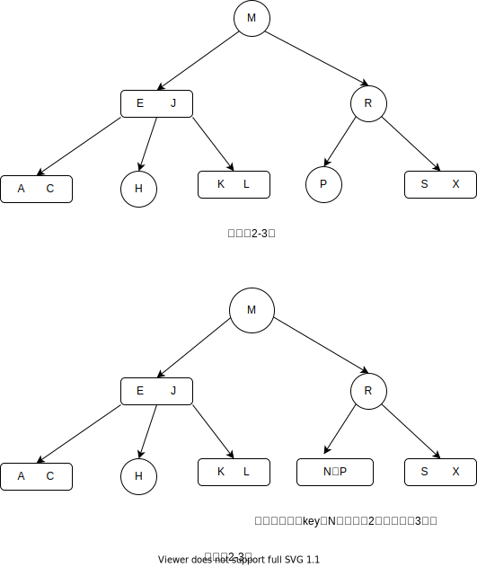
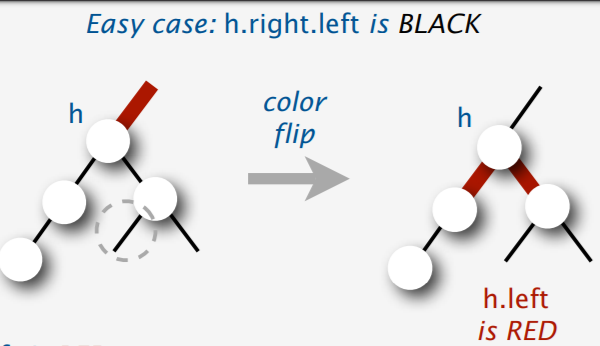

本篇将带你一步一步了解红黑树，当然大部分内容来源于算法(第4版)一书，我仅仅对一点内容总结了自己的心得。

在谈谈红黑树之前，我们先来回顾一下二叉排序树(balanced sort tree),因为红黑树是从BST的概念演化而来的。BST的定义很简单，对于一个节点来说，左树的所有节点的值都小于当前节点的值，右树所有节点的值都大于当前节点的值。但是在最坏情况下BST的高度会达到O(N),效率太差。

我们在这里引入一个抽象的2-3树，所谓的2就是指节点只有两个指针指向子树，相应的3指的是节点中有三个指针指向子树，当然3节点中就会包含2个key。

2-3保证了一点性质：**所有的空节点到达根节点的路径都是一样长的**,这条性质保证了查找的复杂度在O(logN)的水平。

## 1. 2-3树的插入

2-3树的插入还是比较复杂的，分为插入位置在2节点还是3节点。

### 1.1 2节点位置插入

2节点位置的插入比较简单，如果在2节点的左右子树中都找不到插入位置，那么只能插入到当前2节点中，那么是插入当前2节点的左边还是右边？这就需要根据排序规则决定，这里按照自然排序的规则决定。下图演示了在2-3树中插入key为N的节点(按照字典序)。



### 1.2 3节点位置插入

3节点位置的插入比较复杂，分为一下三种情况：

- 没有父节点的3节点
- 父节点为2节点的3节点
- 父节点为3节点的3节点

**没有父节点的3节点:**

如果没有父节点，那么在3节点中再加入一个新值的话3节点就会升级为4节点，这在2-3树中是不允许的，采取的办法是为4节点构造一个父节点，将4节点降级为3节点，那么构造的父节点的值是多少？应该是4节点中3个值的中间数，如下图所示：


**父节点为2节点的3节点:**

思路是一样的，只不过这里不再需要人为构造父节点了，只需要把4节点中三个数中的中间位置数向上传递就行了，并且将当前节点分割为两个2节点，这样父节点就会由2节点升级为3节点。如下图所示：


**父节点为3节点的3节点**

操作与上面完全相同，有一点要记住：**如果3节点是通过4节点降级得到的，那么就必须把这个3节点分割为两个2节点**

经过上面讲解，可以发现有如下规律：

- 在插入节点，不管当前位置是2节点还是3节点，我们先把值加入到这个节点中，然后再慢慢调整
- 如果3节点是通过4节点降级得到的，那么必须要把这个3节点分割为两个2节点

## 2. 左倾红黑树

虽然2-3树的理解非常方便，但是代码实现起来比较困难，所以就产生了红黑树等价代替2-3树。但是红黑树都是2节点，怎么保存3节点呢？很简单，就是通过所谓的红或者黑来代替3节点。

我们通过红链接或者黑链接来表示2-3树。**红链接将两个2节点连接起来构成3节点，黑链接就是普通的链接**。那么这个链接是如何表示？这个颜色到底保存在哪？有如下规定：

如果a是b的子节点，且二者之间的链接是红色的，那么这个红色的信息保存在a中(也就是子节点)，也就是一个节点的颜色等于指向该节点的链接的颜色。

那么红黑树的官方定义是什么？

~~红黑树就是满足以下定义的二叉查找树~~满足下面定义的仅仅是左倾红黑树:

- 根节点总是黑色的
- 红链接均为左连接
- 没有任何一个节点同时和两条红链接相连
- 该树是完美黑色平衡的，就是所有空节点到达根节点所经历的黑链接数量是相同的，也不难理解，因为红链接的两个节点实际在一层，因为表示的是3节点

---
**Extensions:**

红黑树有很多种,左倾、右倾、或者左右倾等等,我一直以为左倾红黑树就是全部的红黑树,实际上只是因为它简单,算法第4版才会选择它进行讲解。实际上只要满足以下定义的都是红黑树:

- 每一个节点不是红就是黑
- 根节点必是黑色
- 所有叶子节点(最底层的空节点)都是黑色
- 红节点的两个直接子节点必须都是黑色
- 从任意一个节点到到它的最底层子空节点所经过的黑节点个数都是一样的,也就是RB树是完美黑平衡的,注意,这个空节点只能是所选定的节点的子节点,而不能是它兄弟节点的空子节点。也就是任意空节点到达根节点经过的黑节点个数是相同的

---

我们如果将红黑树的红链接画平，那么就是一颗2-3树。如下图所示:


那么为了保证左倾红黑树的3条性质，我们还需要熟悉以下几项操作。

**保证红链接均为左链接:**

为了保证以上性质，我们可以采用旋转的操作：


``` java "左旋操作"
//返回旋转后的根节点
Node rotateLeft(Node h){
    Node x=h.right;
    h.right=x.left;
    x.left=h;
    //把原来h节点的颜色赋给新的头节点
    x.color=h.color;
    h.color=red;
    x.size=h.size;
    h.size=1+size(h.left)+size(h.right);
    return x;
}
```

右旋代码是非常类似的。

``` java "右旋操作"
Node rotateRight(Node h){
    Node x=h.left;
    h.left=x.right;
    x.color=h.color;
    h.color=red;
    x.size=h.size;
    h.size=size(h.left)+size(h.right)+1;
    return x;
}
```

**保证不会出现两条连续的红链接**

这个性质的实现也是通过旋转来实现的,额外的操作是可能需要进行颜色转换，因为可能出现4节点降级为两个2节点。我们需要遵守以下三条准则：

- 如果左子链接是黑色而右子链接为红色，那么进行左旋
- 如果左子链接是红色的，并且左子链接的左子链接也是红色的，那么将当前节点进行右旋
- 如果左右链接都是红色的，那么进行颜色颜色转换，将红链接向上传递。

前两条规则如下图所示:

<div align=center></div>

最后一条规则如下所示:

<div align=center></div>

对于第一条规则我认为没有必须要求左子链接为黑色，因为不可能产生三条连续的红链接，因为都是在树底插入，在插入之前就不可能产生两条连续的红色链接，所以插入后最多产生两条连续的红链接。

### 2.1 红黑树的插入操作

红黑树插入新节点时插入的是**红节点**,至于保持平衡那需要在插入之后修正。下面是红黑树的插入节点的代码,与普通的BST差别不是很大,最后需要在回溯修正节点的颜色时遵循上面规则：

``` java "红黑树插入代码"
private Node put(Node x,Key key,Value val){
        if(x==null){
            return new Node(key,val,RED,1);
        }
        int cmp=key.compareTo(x.key);
        if(cmp<0){
            x.left=put(x.left,key,val);
        }else if(cmp>0){
            x.right=put(x.right,key,val);
        }else{
            x.val=val;
        }
        //修正红黑树的颜色
        //感觉第二个条件也不一定需要吧，只是减少了旋转的次数,如果加了左子树为黑的条件，则不会进行下一行的旋转，因为可以直接进行颜色转换
        //如果删去左子树为黑的条件，那么会多余执行一次下一行的转换，再进行颜色转换，本来可以直接转的，上面做了多余一步的操作
        if(isRed(x.right)&& !isRed(x.left)){
            x=rotateLeft(x);
        }
        if(isRed(x.left) && isRed(x.left.left)){
            x=rotateRight(x);
        }
        if(isRed(x.left) && isRed(x.right)){
            flipColor(x);
        }
        x.size=size(x.left)+size(x.right)+1;
        return x;
    }

```

### 2.2 红黑树的删除操作

红黑树的删除比插入还复杂些,因为红黑树是完美黑节点平衡的,所以在删除时我们就不能删除黑节点,只能删除红节点。但是如果我们想要删除的值就是黑的,怎么办？办法就是把它变红。简单来说就是不断变换颜色。直到我们的目标删除节点为红色时。

待删除的节点分两种：一种是在底部，没有子节点，像这样的节点，把它转换成红色的删除就好。另外一种就是有后继节点，为了保持树的有序性，我们采取跟BST的一样的操作，把待删除节点的后继节点找到，然后将待删除节点替换为后继节点。

总的来说：

- 我们只能删除红节点
- 并且待删除节点不能是个2-节点，因为直接将2-节点删除会破坏平衡性

所以在我们向下寻找待删除节点的时候，我们就必须保证当前处理的节点不是2-节点。

**删除最小值:**

这里以删除最小值为例,与BST的删除操作类似，采用递归删除。我们在每一轮递归调用时，都需要将当前节点的左子节点调整为非2-节点。如果处理节点为2-节点,这就需要:

- 从左子节点的父节点(当前节点)借一个



- 或者左子节点的兄弟节点借一个


步骤如下：我们首先从父节点借一个，这里所谓的借一个是将父节点的颜色变黑，两个子节点的颜色变红，也就是改造为4节点，然后我们再看左子节点的兄弟是否为非2-节点。如果是，那么就从兄弟借，把从父节点借的再还回去。然后我们进入下一轮递归调用，这样继续处理左子节点。保证了路径上的每个节点都不是2-节点,**把红链接一层一层传递下去**。最后删除最底层的红节点,然后再层层回溯修复节点颜色。

``` java "删除最小值"
//删除操作的大小修正都在balance中了
    public void deleteMin(){
        if(root==null){
            return;
        }
        //为啥要进行这步操作，仅仅是为了假装根节点为3-节点吗？？？
        //做这步操作可能是因为flipColor的写法
        //因为flipColor的操作是把当前节点和两个子节点的颜色取反，如果不把根节点的颜色设红，后面的子节点没法借
        if(!isRed(root.left)&&!isRed(root.right)){
            root.color=RED;
        }

        root=deleteMin(root);
        if(root!=null){
            root.color=BLACK;
        }
    }
    //能够进入这个函数的当前节点一定不是2节点
    private Node deleteMin(Node h){
        if(h.left==null){
            return null;
        }
        //判断当前节点的左子节点是否为3节点
        if(!isRed(h.left) && !isRed(h.left.left)){
            //左子节点为黑，且它的子节点为黑，表示左子节点是一个2-节点，需要借
            //moveRedLeft就是调整红链接一直往左边走
            h=moveRedLeft(h);
        }
        h.left=deleteMin(h.left);
        //因为前面借节点的时候，有可能只是从父节点借了一个，
        // 这样就会导致存在right-leaning的红链接，需要修正
        return balance(h);
    }
```

**删除最大值:**

删除最大值类似，唯一一点不同的是，我们需要把当前节点的左子节点的红链接先翻转到右边,道理很简单。删除最小值不用这么做是因为红黑树的红链接本身就在左侧。删除最大值就是要把红链接一层一层的向底层传递直到不能传递。并且如果不把红链接翻转到右侧，右树底下的节点如果为2-节点时，他没有办法向上借了。

``` java "删除最大值"
public void deleteMax(){
        if(root==null){
            return;
        }
        if(!isRed(root.left)&& !isRed(root.right)){
            root.color=RED;
        }
        root=deleteMax(root);
        if(root!=null){
            root.color=BLACK;
        }
    }
    private Node deleteMax(Node h){
        //如果左链接是红色，那么就需要翻转到右边，不然右子节点下面的节点没法向它们的父节点借了
        if(isRed(h.left)){
            h=rotateRight(h);
        }

        if(h.right==null){
            return null;
        }
        if(!isRed(h.right) && !isRed(h.right.left)){
            h=moveRedRight(h);
        }
        h.right=deleteMax(h.right);
        return balance(h);
    }

```

**删除任意值:**

删除任意值就是删除最小值与最大值的组合操作。如果想要删除的值比当前节点的值小，那么就向左继续寻找，与删除最小值类似，如果不小于当前节点的值，那么就往右走，类似于删除最大值。

``` java
public void delete(Key key){
        if(root==null){
            return;
        }
        if(!isRed(root.left) && !isRed(root.right)){
            root.color=RED;
        }
        root=delete(root,key);
        if(root!=null) {
            root.color = BLACK;
        }
    }

    private Node delete(Node h,Key key){
        int cmp=key.compareTo(h.key);
        if(cmp<0){
            if(!isRed(h.left) && !isRed(h.left.left)){
                h=moveRedLeft(h);
            }
            h.left=delete(h.left,key);
        }
        else{
            //把红链接转到右边,因为原来的红链接都是左斜的，如果最大键在3-节点中，删除会导致树的不平衡,就是把红链接往右边传递
            if(isRed(h.left)){
                h=rotateRight(h);
            }
            //目标节点在底部
            //这里只看右子节点是因为如果右子节点不为空，就说明我们找当前节点的后继节点来替换，
            //如果为空，又因为当前节点必不是2-节点，所以可以放心删除
            if(h.key.compareTo(key)==0 && h.right==null){
                return null;
            }
            //走到这里有两种情况，要么我们需要找后继节点替换，要么目标节点在当前节点的右边
            //总之都需要向右边的子节点走，所以必须提前右子节点为非2-节点
            //保证要删除的值所在节点必须不能是2-节点,
            if(!isRed(h.right) && !isRed(h.right.left)){
                h=moveRedRight(h);
            }
            //如果删除的节点不是在底部，那么就拿后继节点替换
            if(key.compareTo(h.key)==0){
                h.val=get(root,min(h.right).key);
                h.key=min(h.right).key;
                h.right=deleteMin(h.right);
            }else{
                //否则继续向右边走
                h.right=delete(h.right,key);
            }
        }
        //balance中会调整节点大小
        return balance(h);
    }
```

## 参考文献

普林斯顿原始论文与代码:

(https://www.cs.princeton.edu/~rs/talks/LLRB/RedBlack.pdf)

(https://algs4.cs.princeton.edu/33balanced/RedBlackBST.java.html)

他人博客笔记:

(https://deserts.io/red-black-tree-deletion/)

(https://www.jianshu.com/p/41f092a42ec1)

(https://www.jianshu.com/p/48331a5a11f4)


## 附录

完整代码:

``` java
package tools;

public class LLRBTImpl<Key extends Comparable<Key>,Value> {

    private static final boolean RED =true;
    private static final boolean BLACK =false;

    private class Node{
        Key key;
        Value val;
        Node left;
        Node right;
        boolean color;
        int size;
        Node(Key key,Value val,boolean color,int size){
            this.key=key;
            this.val=val;
            this.color=color;
            this.size=size;
        }
    }
    private Node root;

    private int size(Node x){
        if(x==null){
            return 0;
        }
        return x.size;
    }

    private boolean isRed(Node x){
        //因为有可能需要判断不存在的叶子节点的颜色
        if(x==null){
            return BLACK;
        }
        return x.color== RED;
    }
    //左旋x的右节点必然是红色的，返回的是旋转的根节点
    private Node rotateLeft(Node h){
        Node x=h.right;
        h.right=x.left;
        x.left=h;
        x.color=h.color;
        h.color=RED;
        x.size=h.size;
        h.size=size(h.left)+size(h.right)+1;
        return x;
    }

    private Node rotateRight(Node h){
        Node x=h.left;
        h.left=x.right;
        x.right=h;
        x.color=h.color;
        h.color=RED;
        x.size=h.size;
        h.size=size(h.left)+size(h.right)+1;
        return x;
    }
    private void flipColor(Node x){
        x.left.color=!x.left.color;
        x.right.color=!x.right.color;
        x.color=!x.color;
    }
    //返回的是插入节点后红黑树新的根节点
    public void put(Key key,Value val){
        root=put(root,key,val);
        root.color=BLACK;
    }
    private Node put(Node x,Key key,Value val){
        if(x==null){
            return new Node(key,val,RED,1);
        }
        int cmp=key.compareTo(x.key);
        if(cmp<0){
            x.left=put(x.left,key,val);
        }else if(cmp>0){
            x.right=put(x.right,key,val);
        }else{
            x.val=val;
        }
        //修正红黑树的颜色
        //感觉第二个条件也不一定需要吧，只是减少了旋转的次数
        if(isRed(x.right)&& !isRed(x.left)){
            x=rotateLeft(x);
        }
        if(isRed(x.left) && isRed(x.left.left)){
            x=rotateRight(x);
        }
        if(isRed(x.left) && isRed(x.right)){
            flipColor(x);
        }
        x.size=size(x.left)+size(x.right)+1;
        return x;
    }


    //删除操作的大小修正都在balance中了
    public void deleteMin(){
        if(root==null){
            return;
        }
        //为啥要进行这步操作，仅仅是为了假装根节点为3-节点吗？？？
        //做这步操作可能是因为flipColor的写法
        //因为flipColor的操作是把当前节点和两个子节点的颜色取反，如果不把根节点的颜色设红，后面的子节点没法借
        if(!isRed(root.left)&&!isRed(root.right)){
            root.color=RED;
        }

        root=deleteMin(root);
        if(root!=null){
            root.color=BLACK;
        }
    }
    //能够进入这个函数的当前节点一定不是2节点
    private Node deleteMin(Node h){
        if(h.left==null){
            return null;
        }
        //判断当前节点的左子节点是否为3节点
        if(!isRed(h.left) && !isRed(h.left.left)){
            //左子节点为黑，且它的子节点为黑，表示左子节点是一个2-节点，需要借
            h=moveRedLeft(h);
        }
        h.left=deleteMin(h.left);
        //因为前面借节点的时候，有可能只是从父节点借了一个，
        // 这样就会导致存在right-leaning的红链接，需要修正
        return balance(h);
    }

    public void deleteMax(){
        if(root==null){
            return;
        }
        if(!isRed(root.left)&& !isRed(root.right)){
            root.color=RED;
        }
        root=deleteMax(root);
        if(root!=null){
            root.color=BLACK;
        }
    }
    private Node deleteMax(Node h){
        //如果左链接是红色，那么就需要翻转到右边，不然右子节点下面的节点没法向它们的父节点借了
        if(isRed(h.left)){
            h=rotateRight(h);
        }

        if(h.right==null){
            return null;
        }
        if(!isRed(h.right) && !isRed(h.right.left)){
            h=moveRedRight(h);
        }
        h.right=deleteMax(h.right);
        return balance(h);
    }

    public void delete(Key key){
        if(root==null){
            return;
        }
        if(!isRed(root.left) && !isRed(root.right)){
            root.color=RED;
        }
        root=delete(root,key);
        if(root!=null) {
            root.color = BLACK;
        }
    }

    private Node delete(Node h,Key key){
        int cmp=key.compareTo(h.key);
        if(cmp<0){
            if(!isRed(h.left) && !isRed(h.left.left)){
                h=moveRedLeft(h);
            }
            h.left=delete(h.left,key);
        }
        else{
            //把红链接转到右边,因为原来的红链接都是左斜的，如果最大键在3-节点中，删除会导致树的不平衡
            if(isRed(h.left)){
                h=rotateRight(h);
            }
            //目标节点在底部
            if(h.key.compareTo(key)==0 && h.right==null){
                return null;
            }
            //保证要删除的值所在节点必须不能是2-节点,
            if(!isRed(h.right) && !isRed(h.right.left)){
                h=moveRedRight(h);
            }
            //如果删除的节点不是在底部，那么就拿后继节点替换
            if(key.compareTo(h.key)==0){
                h.val=get(root,min(h.right).key);
                h.key=min(h.right).key;
                h.right=deleteMin(h.right);
            }else{
                h.right=delete(h.right,key);
            }
        }
        //balance中会调整节点大小
        return balance(h);
    }
    public Node min(){
        if(root==null){
            return null;
        }
        return min(root);

    }
    private Node min(Node h){
        if(h.left==null){
            return h;
        }
        return min(h.left);
    }
    public Value get(Key key){
        if(root==null){
            return null;
        }
        return get(root,key);
    }

    private Value get(Node h,Key key){
        if(h==null){
            return null;
        }
        int cmp=key.compareTo(h.key);
        if(cmp<0){
            return get(h.left,key);
        }else if(cmp>0){
            return get(h.right,key);
        }else{
            return h.val;
        }
    }

    //经过一系列反转，头节点必然发生变化，必须返回新的头节点
    private Node balance(Node x){
        if(isRed(x.right)){
            x=rotateLeft(x);
        }
        if(isRed(x.left) && isRed(x.left.left)){
            x=rotateRight(x);
        }
        if(isRed(x.left) && isRed(x.right)){
            flipColor(x);
        }
        x.size=size(x.left)+size(x.right)+1;
        return x;
    }
    //因为删除的节点必须是红节点，所以就必须把红节点往左侧移动
    private Node moveRedLeft(Node h){
        delFlipColor(h);
        //兄弟节点不是2-节点，可以借
        if(isRed(h.right.left)){
            h.right=rotateRight(h.right);
            h=rotateLeft(h);
            delFlipColor(h);
        }
        //经过上述一系列反转，头节点早就变化了
        return h;
    }

    private Node moveRedRight(Node h){
        delFlipColor(h);
        if(isRed(h.left.left)){
            h=rotateRight(h);
            delFlipColor(h);
        }
        return h;
    }

    //每调用一次就反转一遍当前节点及左右子节点的颜色
    private void delFlipColor(Node h){
        h.color=!h.color;
        h.left.color=!h.left.color;
        h.right.color=!h.right.color;
    }
}
```


