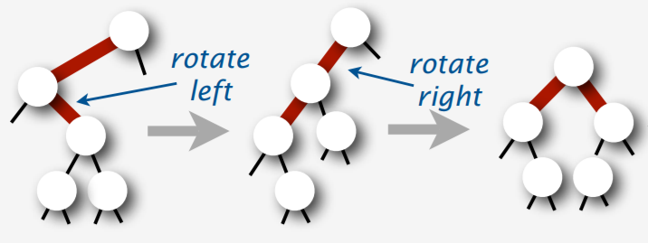
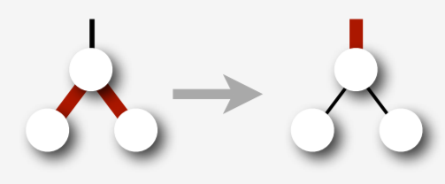

本篇将带你一步一步了解红黑树，当然大部分内容来源于算法(第4版)一书，我仅仅对一点内容总结了自己的心得。

在谈谈红黑树之前，我们先来回顾一下二叉排序树(balanced sort tree),因为红黑树是从BST的概念演化而来的。BST的定义很简单，对于一个节点来说，左树的所有节点的值都小于当前节点的值，右树所有节点的值都大于当前节点的值。但是在最坏情况下BST的高度会达到O(N),效率太差。

我们在这里引入一个抽象的2-3树，所谓的2就是指节点只有两个指针指向子树，相应的3指的是节点中有三个指针指向子树，当然3节点中就会包含2个key。

2-3保证了一点性质：**所有的空节点到达根节点的路径都是一样长的**,这条性质保证了查找的复杂度在O(logN)的水平。

## 2-3树的插入

2-3树的插入还是比较复杂的，分为插入位置在2节点还是3节点。

### 2节点位置插入

2节点位置的插入比较简单，如果在2节点的左右子树中都找不到插入位置，那么只能插入到当前2节点中，那么是插入当前2节点的左边还是右边？这就需要根据排序规则决定，这里按照自然排序的规则决定。下图演示了在2-3树中插入key为N的节点(按照字典序)。



### 3节点位置插入

3节点位置的插入比较复杂，分为一下三种情况：

- 没有父节点的3节点
- 父节点为2节点的3节点
- 父节点为3节点的3节点

**没有父节点的3节点:**

如果没有父节点，那么在3节点中再加入一个新值的话3节点就会升级为4节点，这在2-3树中是不允许的，采取的办法是为4节点构造一个父节点，将4节点降级为3节点，那么构造的父节点的值是多少？应该是4节点中3个值的中间数，如下图所示：




**父节点为2节点的3节点:**

思路是一样的，只不过这里不再需要人为构造父节点了，只需要把4节点中三个数中的中间位置数向上传递就行了，并且将当前节点分割为两个2节点，这样父节点就会由2节点升级为3节点。如下图所示：



**父节点为3节点的3节点**

操作与上面完全相同，有一点要记住：**如果3节点是通过4节点降级得到的，那么就必须把这个3节点分割为两个2节点**

经过上面讲解，可以发现有如下规律：

- 在插入节点，不管当前位置是2节点还是3节点，我们先把值加入到这个节点中，然后再慢慢调整
- 如果3节点是通过4节点降级得到的，那么必须要把这个3节点分割为两个2节点

## 红黑树

虽然2-3树的理解非常方便，但是代码实现起来比较困难，所以就产生了红黑树等价代替2-3树。但是红黑树都是2节点，怎么保存3节点呢？很简单，就是通过所谓的红或者黑来代替3节点。

我们通过红链接或者黑链接来表示2-3树。**红链接将两个2节点连接起来构成3节点，黑链接就是普通的链接**。那么这个链接是如何表示？这个颜色到底保存在哪？有如下规定：

如果a是b的子节点，且二者之间的链接是红色的，那么这个红色的信息保存在a中(也就是子节点)，也就是一个节点的颜色等于指向该节点的链接的颜色。

那么红黑树的官方定义是什么？

红黑树就是满足以下定义的二叉查找树:

- 根节点总是黑色的
- 红链接均为左连接
- 没有任何一个节点同时和两条红链接相连
- 该树是完美黑色平衡的，就是所有空节点到达根节点所经历的黑链接数量是相同的，也不难理解，因为红链接的两个节点实际在一层，因为表示的是3节点

我们如果将红黑树的红链接画平，那么就是一颗2-3树。如下图所示:




那么为了保证红黑树的3条性质，我们还需要熟悉以下几项操作。

**保证红链接均为左链接:**

为了保证以上性质，我们可以采用旋转的操作：



``` java "左旋操作"
//返回旋转后的根节点
Node rotateLeft(Node h){
    Node x=h.right;
    h.right=x.left;
    x.left=h;
    //把原来h节点的颜色赋给新的头节点
    x.color=h.color;
    h.color=red;
    x.size=h.size;
    h.size=1+size(h.left)+size(h.right);
    return x;
}
```

右旋代码是非常类似的。

``` java "右旋操作"
Node rotateRight(Node h){
    Node x=h.left;
    h.left=x.right;
    x.color=h.color;
    h.color=red;
    x.size=h.size;
    h.size=size(h.left)+size(h.right)+1;
    return x;
}
```

**保证不会出现两条连续的红链接**

这个性质的实现也是通过旋转来实现的,额外的操作是可能需要进行颜色转换，因为可能出现4节点降级为两个2节点。我们需要遵守以下三条准则：

- 如果左子链接是黑色而右子链接为红色，那么进行右旋
- 如果左子链接是红色的，并且它的左子链接也是红色的，那么进行左旋
- 如果左右链接都是红色的，那么进行颜色颜色转换，将红链接向上传递。

前两条规则如下图所示:

<div align=center></div>

最后一条规则如下所示:

<div align=center></div>

对于第一条规则我认为没有必须要求左子链接为黑色，因为不可能产生三条连续的红链接，因为都是在树底插入，在插入之前就不可能产生两条连续的红色链接，所以插入后最多产生两条连续的红链接。下面是插入节点的代码：

``` java "红黑树插入代码"
private Node put(Node x,Key key,Value val){
        if(x==null){
            return new Node(key,val,RED,1);
        }
        int cmp=key.compareTo(x.key);
        if(cmp<0){
            x.left=put(x.left,key,val);
        }else if(cmp>0){
            x.right=put(x.right,key,val);
        }else{
            x.val=val;
        }
        //修正红黑树的颜色
        //感觉第二个条件也不一定需要吧，只是减少了旋转的次数,如果加了左子树为黑的条件，则不会进行下一行的旋转，因为可以直接进行颜色转换
        //如果删去左子树为黑的条件，那么会多余执行一次下一行的转换，再进行颜色转换，本来可以直接转的，上面做了多余一步的操作
        if(isRed(x.right)&& !isRed(x.left)){
            x=rotateLeft(x);
        }
        if(isRed(x.left) && isRed(x.left.left)){
            x=rotateRight(x);
        }
        if(isRed(x.left) && isRed(x.right)){
            flipColor(x);
        }
        x.size=size(x.left)+size(x.right)+1;
        return x;
    }

```

## 参考文献

普林斯顿原始论文与代码:
(https://www.cs.princeton.edu/~rs/talks/LLRB/RedBlack.pdf)
(https://algs4.cs.princeton.edu/33balanced/RedBlackBST.java.html)

他人博客笔记:
(https://deserts.io/red-black-tree-deletion/)
(https://www.jianshu.com/p/41f092a42ec1)
(https://www.jianshu.com/p/48331a5a11f4)


## 附录

完整代码:

``` java
package tools;

public class LLRBTImpl<Key extends Comparable<Key>,Value> {

    private static final boolean RED =true;
    private static final boolean BLACK =false;

    private class Node{
        Key key;
        Value val;
        Node left;
        Node right;
        boolean color;
        int size;
        Node(Key key,Value val,boolean color,int size){
            this.key=key;
            this.val=val;
            this.color=color;
            this.size=size;
        }
    }
    private Node root;

    private int size(Node x){
        if(x==null){
            return 0;
        }
        return x.size;
    }

    private boolean isRed(Node x){
        //因为有可能需要判断不存在的叶子节点的颜色
        if(x==null){
            return BLACK;
        }
        return x.color== RED;
    }
    //左旋x的右节点必然是红色的，返回的是旋转的根节点
    private Node rotateLeft(Node h){
        Node x=h.right;
        h.right=x.left;
        x.left=h;
        x.color=h.color;
        h.color=RED;
        x.size=h.size;
        h.size=size(h.left)+size(h.right)+1;
        return x;
    }

    private Node rotateRight(Node h){
        Node x=h.left;
        h.left=x.right;
        x.right=h;
        x.color=h.color;
        h.color=RED;
        x.size=h.size;
        h.size=size(h.left)+size(h.right)+1;
        return x;
    }
    private void flipColor(Node x){
        x.left.color=!x.left.color;
        x.right.color=!x.right.color;
        x.color=!x.color;
    }
    //返回的是插入节点后红黑树新的根节点
    public void put(Key key,Value val){
        root=put(root,key,val);
        root.color=BLACK;
    }
    private Node put(Node x,Key key,Value val){
        if(x==null){
            return new Node(key,val,RED,1);
        }
        int cmp=key.compareTo(x.key);
        if(cmp<0){
            x.left=put(x.left,key,val);
        }else if(cmp>0){
            x.right=put(x.right,key,val);
        }else{
            x.val=val;
        }
        //修正红黑树的颜色
        //感觉第二个条件也不一定需要吧，只是减少了旋转的次数
        if(isRed(x.right)&& !isRed(x.left)){
            x=rotateLeft(x);
        }
        if(isRed(x.left) && isRed(x.left.left)){
            x=rotateRight(x);
        }
        if(isRed(x.left) && isRed(x.right)){
            flipColor(x);
        }
        x.size=size(x.left)+size(x.right)+1;
        return x;
    }


    //删除操作的大小修正都在balance中了
    public void deleteMin(){
        if(root==null){
            return;
        }
        //为啥要进行这步操作，仅仅是为了假装根节点为3-节点吗？？？
        //做这步操作可能是因为flipColor的写法
        //因为flipColor的操作是把当前节点和两个子节点的颜色取反，如果不把根节点的颜色设红，后面的子节点没法借
        if(!isRed(root.left)&&!isRed(root.right)){
            root.color=RED;
        }

        root=deleteMin(root);
        if(root!=null){
            root.color=BLACK;
        }
    }
    //能够进入这个函数的当前节点一定不是2节点
    private Node deleteMin(Node h){
        if(h.left==null){
            return null;
        }
        //判断当前节点的左子节点是否为3节点
        if(!isRed(h.left) && !isRed(h.left.left)){
            //左子节点为黑，且它的子节点为黑，表示左子节点是一个2-节点，需要借
            h=moveRedLeft(h);
        }
        h.left=deleteMin(h.left);
        //因为前面借节点的时候，有可能只是从父节点借了一个，
        // 这样就会导致存在right-leaning的红链接，需要修正
        return balance(h);
    }

    public void deleteMax(){
        if(root==null){
            return;
        }
        if(!isRed(root.left)&& !isRed(root.right)){
            root.color=RED;
        }
        root=deleteMax(root);
        if(root!=null){
            root.color=BLACK;
        }
    }
    private Node deleteMax(Node h){
        //如果左链接是红色，那么就需要翻转到右边，不然右子节点下面的节点没法向它们的父节点借了
        if(isRed(h.left)){
            h=rotateRight(h);
        }

        if(h.right==null){
            return null;
        }
        if(!isRed(h.right) && !isRed(h.right.left)){
            h=moveRedRight(h);
        }
        h.right=deleteMax(h.right);
        return balance(h);
    }

    public void delete(Key key){
        if(root==null){
            return;
        }
        if(!isRed(root.left) && !isRed(root.right)){
            root.color=RED;
        }
        root=delete(root,key);
        if(root!=null) {
            root.color = BLACK;
        }
    }

    private Node delete(Node h,Key key){
        int cmp=key.compareTo(h.key);
        if(cmp<0){
            if(!isRed(h.left) && !isRed(h.left.left)){
                h=moveRedLeft(h);
            }
            h.left=delete(h.left,key);
        }
        else{
            //把红链接转到右边,因为原来的红链接都是左斜的，如果最大键在3-节点中，删除会导致树的不平衡
            if(isRed(h.left)){
                h=rotateRight(h);
            }
            //目标节点在底部
            if(h.key.compareTo(key)==0 && h.right==null){
                return null;
            }
            //保证要删除的值所在节点必须不能是2-节点,
            if(!isRed(h.right) && !isRed(h.right.left)){
                h=moveRedRight(h);
            }
            //如果删除的节点不是在底部，那么就拿后继节点替换
            if(key.compareTo(h.key)==0){
                h.val=get(root,min(h.right).key);
                h.key=min(h.right).key;
                h.right=deleteMin(h.right);
            }else{
                h.right=delete(h.right,key);
            }
        }
        //balance中会调整节点大小
        return balance(h);
    }
    public Node min(){
        if(root==null){
            return null;
        }
        return min(root);

    }
    private Node min(Node h){
        if(h.left==null){
            return h;
        }
        return min(h.left);
    }
    public Value get(Key key){
        if(root==null){
            return null;
        }
        return get(root,key);
    }

    private Value get(Node h,Key key){
        if(h==null){
            return null;
        }
        int cmp=key.compareTo(h.key);
        if(cmp<0){
            return get(h.left,key);
        }else if(cmp>0){
            return get(h.right,key);
        }else{
            return h.val;
        }
    }

    //经过一系列反转，头节点必然发生变化，必须返回新的头节点
    private Node balance(Node x){
        if(isRed(x.right)){
            x=rotateLeft(x);
        }
        if(isRed(x.left) && isRed(x.left.left)){
            x=rotateRight(x);
        }
        if(isRed(x.left) && isRed(x.right)){
            flipColor(x);
        }
        x.size=size(x.left)+size(x.right)+1;
        return x;
    }
    //因为删除的节点必须是红节点，所以就必须把红节点往左侧移动
    private Node moveRedLeft(Node h){
        delFlipColor(h);
        //兄弟节点不是2-节点，可以借
        if(isRed(h.right.left)){
            h.right=rotateRight(h.right);
            h=rotateLeft(h);
            delFlipColor(h);
        }
        //经过上述一系列反转，头节点早就变化了
        return h;
    }

    private Node moveRedRight(Node h){
        delFlipColor(h);
        if(isRed(h.left.left)){
            h=rotateRight(h);
            delFlipColor(h);
        }
        return h;
    }

    //每调用一次就反转一遍当前节点及左右子节点的颜色
    private void delFlipColor(Node h){
        h.color=!h.color;
        h.left.color=!h.left.color;
        h.right.color=!h.right.color;
    }
}
```


