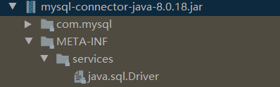
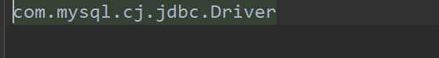

## 前言 什么是SPI

SPI机制（Service Provider Interface)简而言之，就是java规定了一组服务的接口，但是没有具体的实现类。那么具体的实现类肯定由不同的厂商实现，那么客户在使用时是仅依赖于接口的。**SPI的具体实现是靠`ServiceLoader`完成的。**
在讲解双亲委派模型时，我们知道，SPI接口是通过`bootstrap ClassLoader`加载至jvm中的。而具体的驱动实现类是通过线程上下文类加载器加载至jvm中的。下面我们就通过加载数据库驱动的例子来了解SPI的实现原理。

## 1. 获得数据库连接实例的方式

在JDBC4.0之前，还没有引入SPI，一般需要使用`Class.forName()`注册驱动，所以加载驱动的代码一般是如下所示：

``` java
Class.forName("xxxx");
Connection c=DriverManager.getConnection("url");
```

在JDBC4.0之后，我们只需要使用`DriverManager.getConnection(url)`就可以获得连接对象。这是因为在`getConnection()`内部会自己调用`Class.forName()`，这里包含了一层嵌套关系。而`DriverManager`又是由`Bootstrap ClassLoader`加载的，根据符号解析的规定，`DriverManager`内部的符号如果需要解析为类或接口，则会调用`DriverManager`的加载器。但是问题是`DriverManager`只会加载核心库。根据双亲委派模型，父类的请求无法派给子类，所以这时候就采用了线程上下文类加载器。**而在JDBC4.0之前没有这层嵌套关系。**

下面我们来看看到底是如何获得驱动的。在初次使用`DriverManager`时，首先会执行静态代码块中`loadInitialDrivers()`函数。

``` java
static {
    loadInitialDrivers();
    println("JDBC DriverManager initialized");
}
```

初始化函数如下：

``` java
private static void loadInitialDrivers() {
    String drivers;
    try {
        //查看是否设置了系统属性jdbc.drivers
        drivers = AccessController.doPrivileged(new PrivilegedAction<String>() {
            public String run() {
                return System.getProperty("jdbc.drivers");
            }
        });
    } catch (Exception ex) {
        drivers = null;
    }
    //使用ServiceLoader加载驱动
    AccessController.doPrivileged(new PrivilegedAction<Void>() {
        public Void run() {

            ServiceLoader<Driver> loadedDrivers = ServiceLoader.load(Driver.class);
            
            Iterator<Driver> driversIterator = loadedDrivers.iterator();
            try{
                while(driversIterator.hasNext()) {
                    driversIterator.next();
                }
            } catch(Throwable t) {
            // Do nothing
            }
            return null;
        }
    });

    println("DriverManager.initialize: jdbc.drivers = " + drivers);

    if (drivers == null || drivers.equals("")) {
        return;
    }
    //如果设置了系统属性jdbc.drivers,
    //那么如果SPI已经成功加载了驱动，下面的代码还是会重复注册驱动
    String[] driversList = drivers.split(":");
    println("number of Drivers:" + driversList.length);
    for (String aDriver : driversList) {
        ...
        }
    }
}
```

可以看到，`DriverManager`的初始化分分为两个版本：

- 设置系统属性`jdbc.drivers`属性
- 使用``ServiceLoader`加载，如果驱动以service provider的形式出现

## 2. SPI加载数据库驱动的原理

### 2.1 获取ServiceLoader对象

使用SPI初始化代码时首先使用`ServiceLoader`的静态方法`load`加载SPI`Driver`的class文件。源码如下所示：

``` java
public static <S> ServiceLoader<S> load(Class<S> service) {
    ClassLoader cl = Thread.currentThread().getContextClassLoader();
    return ServiceLoader.load(service, cl);
}
```

` ServiceLoader.load(service, cl)`又会通过私有构造方法返回`ServiceLoader`对象，在私有构造方法内部调用了`reload()`方法，源码如下所示：

``` java
public void reload() {
    providers.clear();
    lookupIterator = new LazyIterator(service, loader);
}
```

首先清空`providers`，这里的`providers`是一个`LinkedHashMap`，用来保存已经加载过服务实现类的实例。随后生成了`lazyIterator`对象，这个懒加载器是`ServiceLoader`的核心，它完成了查找实现类、加载实现类的动作。

那么这里的**懒**到底是指什么？我的理解是在程序启动之初，服务实现类并没有被加载至jvm中**直到我们使用时**。所以这里的懒就是在程序启动到我们使用之前的这一段时间内，不需要也没有加载服务实现类，懒就是懒在这个阶段。那非懒应该就是指在程序一启动就会加载所有的服务实现类。

### 2.2 使用ServiceLoader对象迭代器遍历实现类容器

在成功获取ServiceLoader对象`loadedDrivers`后，会继续获取`loadedDrivers`的内部迭代器：

>Iterator<Driver> driversIterator = loadedDrivers.iterator();

然后`DriverManager`会使用这个迭代器遍历ServiceLoader内部用来存储服务实现类对象的容器。具体的驱动注册就在遍历容器的时候完成。

``` java
try{
    while(driversIterator.hasNext()) {
        driversIterator.next();
}
```

我们来看看`ServiceLoader`内部迭代器的`hasNext()`方法:

``` java
public Iterator<S> iterator() {
    return new Iterator<S>() {

        Iterator<Map.Entry<String,S>> knownProviders
            = providers.entrySet().iterator();

        public boolean hasNext() {
            if (knownProviders.hasNext())
                return true;
            return lookupIterator.hasNext();
        }

        public S next() {
            if (knownProviders.hasNext())
                return knownProviders.next().getValue();
            return lookupIterator.next();
        }

        public void remove() {
            throw new UnsupportedOperationException();
        }
    };
}
```

`hasNext()`首先调用内部容器`providers`自身的迭代器。失败后才会调用懒迭代器类`LazyIterator`的`hasNext()`，其具体实现如下：

``` java
private class LazyIterator
        implements Iterator<S>
{
    ...
    public boolean hasNext() {
        //无论执行if还是else，都会最终执行hasNextService
        if (acc == null) {
            return hasNextService();
        } else {
            PrivilegedAction<Boolean> action = new PrivilegedAction<Boolean>() {
                public Boolean run() { return hasNextService(); }
            };
            return AccessController.doPrivileged(action, acc);
        }
    }
    ...
}
```

在调用`LazyIteraotr`的`hasNext()`方法后，内部会调用`hashNextService()`:

``` java
private boolean hasNextService() {
    if (nextName != null) {
        return true;
    }
    if (configs == null) {
        try {
            
            String fullName = PREFIX + service.getName();
            if (loader == null)
                configs = ClassLoader.getSystemResources(fullName);
            else
                configs = loader.getResources(fullName);
        } catch (IOException x) {
            fail(service, "Error locating configuration files", x);
        }
    }
    while ((pending == null) || !pending.hasNext()) {
        if (!configs.hasMoreElements()) {
            return false;
        }
        pending = parse(service, configs.nextElement());
    }
    nextName = pending.next();
    return true;
}
```

我们看到该方法内部有一个常量字符串`PREFIX`，其值为:

>private static final String PREFIX = "META-INF/services/";

这是因为java规定，所谓为SPI提供实现的厂商必须在jar包提供目录`META-INF/services/`，目录内的文件存放当前服务实现类的入口类名，文件名文当前服务接口的全限定名。以MySQL为例，其jar包内容如下：



其中`java.sql.Driver`就是java数据库服务接口的全限定名，其内容如下：



`com.mysql.cj.jdbc.Driver`就是具体实现类的全限定名。`hasNextService`的目标就是把具体实现类的全限定名找到。找的方法就是找到文件：`META-INF/services/+service.name`。其中`service`的名字是java规定好的。例如加载数据库时的`service`就对应`Driver`类。

在找到具体实现类的名字后，下一步当然是要把它加载进来了。调用`ServiceLoader`迭代器的`next()`方法，如下所示：

``` java

public boolean hasNext() {
    if (acc == null) {
        return hasNextService();
    } else {
        PrivilegedAction<Boolean> action = new PrivilegedAction<Boolean>() {
            public Boolean run() { return hasNextService(); }
        };
        return AccessController.doPrivileged(action, acc);
    }
}

private S nextService() {
    if (!hasNextService())
        throw new NoSuchElementException();
    String cn = nextName;
    nextName = null;
    Class<?> c = null;
    try {
        c = Class.forName(cn, false, loader);
    }
    ...

    try {
        S p = service.cast(c.newInstance());
        providers.put(cn, p);
        return p;
    }
    ...
}
```

具体的加载由`Class.forName()`完成，注意，其中传入的loader是线程上下文类加载器。在将具体实现类加载进jvm后，会实例化一个实现类对象，即调用`c.newInstance()`。在实例化的过程完成了驱动的注册。我们来看看mysql实现类的构造函数：

``` java
public class Driver extends NonRegisteringDriver implements java.sql.Driver {
    public Driver() throws SQLException {
    }

    static {
        try {
            DriverManager.registerDriver(new Driver());
        } catch (SQLException var1) {
            throw new RuntimeException("Can't register driver!");
        }
    }
}
```

非常简单，一旦进行实例化，就会执行静态构造代码块，mysql实现的`Driver`会主动向`DriverManger`提出注册请求。至此，已经完成了数据库驱动的一次注册过程。

### 2.3 获得数据库连接对象

`DriverManager`会遍历所有已经注册过的驱动，如果能成功连接目标数据库，那么就返回当前连接对象，否则继续遍历剩下的Driver实例直至结束。下面是遍历驱动的核心代码：

``` java
for(DriverInfo aDriver : registeredDrivers) {
    // If the caller does not have permission to load the driver then
    // skip it.
    if(isDriverAllowed(aDriver.driver, callerCL)) {
        try {
            println("    trying " + aDriver.driver.getClass().getName());
            Connection con = aDriver.driver.connect(url, info);
            if (con != null) {
                // Success!
                println("getConnection returning " + aDriver.driver.getClass().getName());
                return (con);
            }
        } catch (SQLException ex) {
            if (reason == null) {
                reason = ex;
            }
        }
    } else {
        println("    skipping: " + aDriver.getClass().getName());
    }

}
```

可以看到，如果在一次尝试连接中抛出异常，那么就不会尝试后续的数据库驱动，这还是有点小bug的。

### 2.4 存在的问题 

**A. ServiceLoader的providers有什么用？**

可以看到，在`DriverMangaer`初次完成注册后，并没有使用过缓存`providers`。但是这仅仅是`DriverManager`的问题，并不能说明缓存没有用。如果我们此时再次遍历当前`loadedDrivers`，那么就不会再次使用`Class.forName()`加载，而是会通过内部缓存获得具体的实现类对象。

**B. 如果有多个驱动需要注册，那么在成功注册第一个驱动后，`knownProviders.hasNext()`返回的结果不应该是`true`吗？**

其实这跟HashMap迭代器的实现有关，在每次调用`entrySet().iterator()`后，返回的迭代器都是新`new`出来的，即初始化函数`loadInitialDrivers()`中的`driversIterator`永远都是`providers`为空时生成的迭代器。所以尽管成功了加载了一个驱动，`knownProviders.hasNext()`的结果依然是`false`，依旧会调用懒迭代器`lookupIterator`的`hasNext()`方法。

## 3. 传统的驱动加载方式

传统的加载是通过`Class.forName()`完成的，而该方法会默认初始化目标类，如下所示：

``` java
@CallerSensitive
public static Class<?> forName(String className)
            throws ClassNotFoundException {
    Class<?> caller = Reflection.getCallerClass();
    return forName0(className, true, ClassLoader.getClassLoader(caller), caller);
}
```

一旦完成了实现类的初始化，数据库驱动会自己向`DriverManager`完成注册。SPI仅仅替代我们写了`Class.forName`这句话。

## 4. 小结

SPI的核心`ServiceLoader`类，而该类的核心又是内部实现的`LazyIterator`。在实现SPI时，规定实现库的jar包中必须在`META-INF/services/`目录下存放以目标SPI命名的文件，其中的内容就是厂商具体实现类的全限定名。