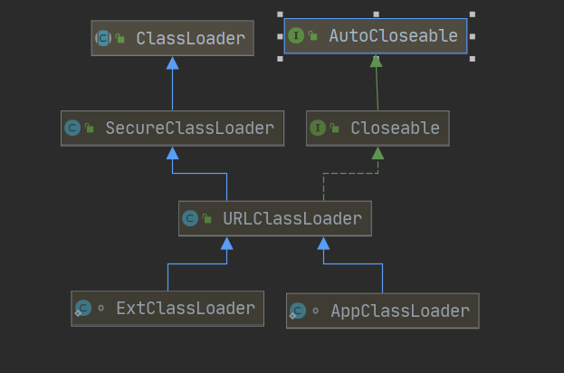

## 前言

首先在了解双亲委派模型前，我们有必要了解它的英文名字：`parents delegation model`。其实在具体的模型中，并没有所谓的“双亲”，只有一个逻辑意义上的父类，详情见下文。

## 1. 类加载器

在《深入理解java虚拟机》一书中写道：
>java团队有意将类加载阶段中的“通过一个类的全限定名来获取该类的二进制字节流”这个动作放到java虚拟机外部去实现
完成这个动作的代码就称为类加载器，以前不理解放到虚拟机外部是什么意思，现在我的理解是我们能够在编写程序时就能够编写目标类的加载过程，这也就是所谓的在虚拟机外部。这样如此，我们自定义的类加载器就能够处理我们自定义的字节码。

值得一提的是：类加载器与类共同确定了该类在虚拟机中是否唯一。也就是说，在虚拟机要比较两个类是否相同，比较的前提是**待比较的两个类是由同一个类加载器加载到虚拟机中的**，才有比较的意义。

这里的比较包括：`instanceof`、Class对象的`equals()`、`isAssignableForm()`、`isInstance()`方法。

## 2. 双亲委派模型

在了解双亲委派模型前，我们需要知道，jvm中有三类自带的类加载器：

- `bootstrap class loader`，启动类加载器
- `extension class loader`，扩展类加载器
- `Application class laoder`，应用程序类加载器

**启动类加载器**
启动类加载器由cpp编写，在java代码中无法直接引用。该加载器负责加载java的核心库，包括`<JAVA_HOME>/lib/`下的库，例如rt.jar、tools.jar；或者由`-Xbootclasspath`指定的，并且存放在lib目录下的符合规则的库，这里的规则是库的名字由jvm指定，不符合名字要求的即使由参数指定，也不会被加载。

前面说到，该加载器由cpp编写时，所以在编写代码时如果我们需要使用到该加载器，我们可以用null指代启动类加载器，这一规则由java团队约定。

**扩展类加载器**

扩展类加载器由java编写，负责加载`<JAVA_HOME>/lib/ext/`目录下的库，或者由环境变量`java.extdirs`指定目录下的库。

**应用程序加载器**

应用程序类加载器通用由java编写，在代码中可以直接引用。该加载器是我们接触最多的加载器了，默认情况下，我们编写的class都由其加载至jvm中。它负责加载由`classpath`参数指定路径下的类库。

>应用程序类加载器由`sun.misc.Launcher$AppClassLoader`实现。并且应用程序类加载器是ClassLoader中的getSystemClassLoader()方法的返回值

这三个加载器的关系如下所示：


可以看到，`BootStrap ClassLoader`作为顶层的父类，`Extension ClassLoader`作为`BootStrap ClassLoader`的子类，而`Application ClassLoader`又作为`Extension ClassLoader`的子类。我们可以看到，这里并没有所谓的双亲，只有单亲，而这么翻译可能是因为第一个翻译的人看到的是parents吧。

> 这里的父类与子类并不是传统意义上的使用extends保持的继承关系，而是通过内部包含来实现逻辑意义上的继承关系

**三类加载器的初始化过程**

下图显示了`ExtClassLoader`、`AppClassLoader`、`ClassLoader`三者真正的继承关系。


`ExtClassLoader`和`AppClassLoader`处于平级的关系，那么如何实现所谓的双亲委派？这一切都要靠抽象类`ClassLoader`中的`parent`字段来实现，如下图所示：


每生成一个新的`ClassLoader`,都会用父类加载器去初始化它。那么这三个加载器是如何初始化的呢？这一切都起源于`Launcher`类。 **该类由`Bootstrap ClassLoader`来加载。** 我们来看看它的构造函数：

``` java
public class Launcher {
    ...
    private static Launcher launcher = new Launcher();
    private static String bootClassPath = System.getProperty("sun.boot.class.path");
    private ClassLoader loader;
    public static Launcher getLauncher() {
        return launcher;
    }

    public Launcher() {
        Launcher.ExtClassLoader var1;
        try {
            //初始化ExtClassLoader
            var1 = Launcher.ExtClassLoader.getExtClassLoader();
        } catch (IOException var10) {
            throw new InternalError("Could not create extension class loader", var10);
        }

        try {
            //初始化loader字段，将其设置为AppClassLoader
            this.loader = Launcher.AppClassLoader.getAppClassLoader(var1);
        } catch (IOException var9) {
            throw new InternalError("Could not create application class loader", var9);
        }
        //设置线程上下文加载器，也就是AppClassLoader
        Thread.currentThread().setContextClassLoader(this.loader);
        ...
    }
    ...
```

在`Bootstrap ClassLoader`把`Launcher`加载进虚拟机后，`Launcher`会初始化静态字段`Launcher`，然后会调用构造方法。在构造方法中，我们目前只需关注三个部分：

1. 使用`Launcher.ExtClassLoader.getExtClassLoader()`生成扩展类加载器`ExtClassLoader`

2. 使用`Launcher.AppClassLoader.getAppClassLoader(var1)`生成应用类加载器`App ClassLoader`,其中`var1`就是第一步生成的扩展类加载器，其用来初始化`parent`字段

3. 使用`Thread.currentThread().setContextClassLoader(this.loader)`初始化线程上下文加载器，其中`loader`字段就是第二步生成的应用类加载器

此外我们还需要关注以下`App ClassLoader`的生成方法，因为其与`classpath`的设置嘻嘻相关。

``` java
public static ClassLoader getAppClassLoader(final ClassLoader var0) throws IOException {
    //读取系统属性classpath
    //这里读取的是一个整个字符串，因为在windows上由“;”将多个路径拼接成一个string
    //linux平台使用“:”拼接多个路径组成一个string
    final String var1 = System.getProperty("java.class.path");
    //将多个路径抽象为File
    final File[] var2 = var1 == null ? new File[0] : Launcher.getClassPath(var1);
    return (ClassLoader)AccessController.doPrivileged(new PrivilegedAction<Launcher.AppClassLoader>() {
        public Launcher.AppClassLoader run() {
            //将多个路径转化为URL数组
            URL[] var1x = var1 == null ? new URL[0] : Launcher.pathToURLs(var2);
            //使用URl路径和Ext ClassLoader生成新的AppClassLoader
            //具体的初始化逻辑见下
            return new Launcher.AppClassLoader(var1x, var0);
        }
    });
}

AppClassLoader(URL[] var1, ClassLoader var2) {
    //调用父类URLClassLoader的构造函数保存多个classpath路径
    super(var1, var2, Launcher.factory);
    this.ucp.initLookupCache(this);
}
//父类URLClassLoader的构造方法
public URLClassLoader(URL[] urls, ClassLoader parent,
                        URLStreamHandlerFactory factory) {
    //初始化parent字段
    super(parent);
    ...
    //实际使用ucp字符保存多个classpath路径
    ucp = new URLClassPath(urls, factory, acc);
}
```

经过上面的源码学习，我们已经非常清楚这三类加载器如何实现**双亲**的逻辑，并且还顺便搞懂了classpath的初始化过程。那么委派是什么呢？下面的加载流程很好地解释了什么是委派：

1. 在传统情况下，一个类的加载会由默认的类加载器加载，而一般情况下`Application ClassLoader`会作为默认的类加载器。类加载器首先会将请求委派给父类，而不是由自己来加载。

2. `Application ClassLoader`会将加载请求委派给父类`Extension ClassLoader`,而`Extension ClassLoader`又会将请求委派给父类`BootStrap ClassLoader`。

3. 如果`BootStrap ClassLoader`加载失败，那么具体的加载会由`Extension ClassLoader`完成。如果`Extension ClassLoader`加载失败，具体的加载会由`Extension ClassLoader`完成。如果再次不能完成，那么就会抛出异常。

可以看到，加载请求会一级一级向上传递，直到传到根加载器。然后如果不能完成，请求又会一级一级从上到下传递到底部加载器。**那么为什么要这么做呢？**

答案来自《深入理解java虚拟机》：

> 这样做的一个显而易见的好处是，被加载的类随着它的加载器一起具备了一种优先级的层次关系。

试想加载类`Object`,这个类肯定最终由`bootstrap ClassLoader`来加载。如果没有这种委派关系，我们随便写一个同名的类`Object`,虚拟机无法保证使用加载正确的`Object`类。那么最基础的核心类都无法保证正确加载，那就出大问题了。

**双亲委派模型的代码实现**

双亲委派的原理简单，代码实现也非常简单，下面的短短几十行代码就完成了操作：

``` java
protected Class<?> loadClass(String name, boolean resolve)
        throws ClassNotFoundException
{
    synchronized (getClassLoadingLock(name)) {
        // First, check if the class has already been loaded
        Class<?> c = findLoadedClass(name);
        if (c == null) {
            long t0 = System.nanoTime();
            try {
                //如果父类不为空，那么就使用父类的加载方法
                if (parent != null) {
                    c = parent.loadClass(name, false);
                } else {
                    //否则使用根加载器加载
                    c = findBootstrapClassOrNull(name);
                }
            } catch (ClassNotFoundException e) {
                // ClassNotFoundException thrown if class not found
                // from the non-null parent class loader
            }

            if (c == null) {
                // If still not found, then invoke findClass in order
                // to find the class.
                long t1 = System.nanoTime();
                c = findClass(name);
                ...
            }
        }
        if (resolve) {
            resolveClass(c);
        }
        return c;
    }
}
```

**系统类加载器的设置**

我曾在上面提到，如果没有意外发生，那么在jvm中，`AppClassLoader`会被设置为默认的系统类加载器，这也是为什么会在某些场合称其为“统类加载器”。那么这一设置是什么时候完成的呢？这一切都起源于`ClassLoader`中的方法`getSystemClassLoader`。其注释写道：

>If the system property "java.system.class.loader" is defined
when this method is first invoked then the value of that property is
taken to be the name of a class that will be returned as the system
class loader.  The class is loaded using the default system class loader
and must define a public constructor that takes a single parameter of
type ClassLoader which is used as the delegation parent.  An
instance is then created using this constructor with the default system
class loader as the parameter.  The resulting class loader is defined
to be the system class loader.

如果设置为系统属性`java.system.class.loader`，那么在第一次调用`getSystemClassLoader`时，会将该系统属性指向的类设置为系统类加载器。值得注意的是，自定义的系统类加载器必须声明一个带有一个参数的公共构造方法，并且唯一参数用来当作委派父类。下面我们来看看这一方法的源码：

``` java

@CallerSensitive
public static ClassLoader getSystemClassLoader() {
    initSystemClassLoader();
    if (scl == null) {
        return null;
    }
    SecurityManager sm = System.getSecurityManager();
    if (sm != null) {
        checkClassLoaderPermission(scl, Reflection.getCallerClass());
    }
    return scl;
}
```

我们看到，该方法内部会调用`initSystemClassLoader()`，那么这个方法又做了什么事情呢？

``` java

private static synchronized void initSystemClassLoader() {
    if (!sclSet) {//如果系统类加载器还没有被设置
        if (scl != null)
            throw new IllegalStateException("recursive invocation");
        sun.misc.Launcher l = sun.misc.Launcher.getLauncher();
        if (l != null) {
            Throwable oops = null;
            scl = l.getClassLoader();//获得ApplicationClassLoader
            try {
                scl = AccessController.doPrivileged(
                    new SystemClassLoaderAction(scl));//设置系统类加载器
            } catch (PrivilegedActionException pae) {
                oops = pae.getCause();
                if (oops instanceof InvocationTargetException) {
                    oops = oops.getCause();
                }
            }
            if (oops != null) {
                if (oops instanceof Error) {
                    throw (Error) oops;
                } else {
                    // wrap the exception
                    throw new Error(oops);
                }
            }
        }
        sclSet = true;
    }
}
```

其中`sclSet`是`ClassLoader`的属性，如果是第一次调用，那么会通过`Launcher`调用`getSystemLoader`获取`Launcher`内部字段`loader`的值。不知道大家还记不记得，`loader`字段会被设置为`AppClassLoader`。此后`scl`会被设置为`AppCLassLoader`。

然后会使用`SystemClassLoaderAction`读取系统属性`java.system.class.loader`,完成系统类加载器的设置，我们来看看其源码。

``` java
class SystemClassLoaderAction
    implements PrivilegedExceptionAction<ClassLoader> {
    private ClassLoader parent;

    SystemClassLoaderAction(ClassLoader parent) {
        this.parent = parent;
    }

    public ClassLoader run() throws Exception {
        String cls = System.getProperty("java.system.class.loader");
        if (cls == null) {
            return parent;
        }
        Constructor<?> ctor = Class.forName(cls, true, parent)
            .getDeclaredConstructor(new Class<?>[] { ClassLoader.class });
        ClassLoader sys = (ClassLoader) ctor.newInstance(
            new Object[] { parent });
        Thread.currentThread().setContextClassLoader(sys);
        return sys;
    }
}
```

我们可以很清楚的看到，如果系统属性`java.system.class.loader`为空，那么就会返回`parent`。此前`parent`已通过构造函数被设置为`AppClassLoader`。

否则，加载系统属性指向的类并获取带有一个参数的构造方法。随后创建自定义类加载器的实例`sys`并返回。

至此，已经完成了系统类加载器的设置。所以说，默认情况下，所有的类都会使用`AppClassLoader`来加载。

## 3. 破坏双亲委派模型

虽然双亲委派模型好，但它也不是万能的。到目前为止，已经出现了三次破坏行为。下面来品一哈。

### 3.1 第一次破坏

第一次破坏是由于JDK1.2之前还没有出现双亲委派模型，但是此时已经有了类加载器的概念。那么此时已经有了许多用户自定义的类加载器。那么为了兼容以前的代码，无法再以技术手段避免`loadClass()`被子类覆盖的可能性。这里所谓的无法避免是什么呢？我们再次来看看双亲委派的实现代码：

``` java
protected Class<?> loadClass(String name, boolean resolve)
        throws ClassNotFoundException
{
    synchronized (getClassLoadingLock(name)) {
        // First, check if the class has already been loaded
        Class<?> c = findLoadedClass(name);
        if (c == null) {
            long t0 = System.nanoTime();
            try {
                //如果父类不为空，那么就使用父类的加载方法
                if (parent != null) {
                    c = parent.loadClass(name, false);
                } else {
                    //否则使用根加载器加载
                    c = findBootstrapClassOrNull(name);
                }
            } catch (ClassNotFoundException e) {
                // ClassNotFoundException thrown if class not found
                // from the non-null parent class loader
            }

            if (c == null) {
                // If still not found, then invoke findClass in order
                // to find the class.
                long t1 = System.nanoTime();
                c = findClass(name);
                ...
            }
        }
        if (resolve) {
            resolveClass(c);
        }
        return c;
    }
}
```

如果此时用户代码还在覆盖`loadClass`,但是编写出的代码并没有采用双亲委派，那么就会使双亲委派失效。因为双亲委派就是靠`loadClass`来实现的。所以尽管不能避免之前的状态，但是以后要尽量避免让用户覆盖`loadClass`。

所以在JDK1.2之后，在`ClassLoader`中引入了一个`protected`方法`findClass()`。希望引导用户能够覆盖`findClass()`编写自定义类加载器。这样既不影响双亲委派，又可以按照用户自己的意愿加载类，就像上面源码中的那样，当父类加载失败，那么就会调用`findClass()`加载。

### 3.2 第二次破坏

第二次破坏是因为双亲委派这个机制存在缺陷。首先我们需要明白下面这种机制：

> 假设我们当前代码所处的类为D，如果此时要把一个从未解析的符号解析成类或接口C。如果C不是数组类型，那么**jvm会使用加载D的类加载器来加载C**。

但是在双亲委派模型中，上层的类加载器是无法指派下层的类加载器来完成加载动作的。一个典型的例子就是JNDI(The Java Naming and Directory Interface)服务。简而言之，JDNI就是java规定一组服务的接口，但是具体的实现由第三方提供，例如数据库的驱动。

那么这个破坏在哪里呢？首先JDNI肯定是由启动类加载器加载至JVM。那么调用具体的实现类时，启动类加载器是不可能将实现类加载进来的，因为这不符合启动类加载器的规定。那么怎么办呢？

开发人员又设计了一种叫进程上下文类加载器(Thread Context ClassLoader)的东西来完成这个任务。启动类加载器会调用进程上下文类加载器来加载接口的实现类。所谓的进程上下文类加载器又是什么呢？这在详解数据库驱动加载一文中由详细介绍。这里不再作解释。

### 3.3 第三次破坏

这次破坏是为了实现java应用的热部署。简单来说就是OSGi机制破坏了双亲委派模型。以下引自《深入理解java虚拟机》：

> OSGi实现模块热部署的关键是它自定义的类加载机制的实现，每一个程序模块（OSGi称其为bundle）都有属于自己的类加载器。当需要替换Bundle时，就把Bundle连同类加载器一起替换以实现代码的热替换。
>
> 在OSGi环境下，类加载机制不再是委派双亲的树模型，而是一个**网状**结构。OSGi的类加载顺序中，只有前两个步骤符合双亲委派的原则，即：
>
>1. 将以java.*开头的类，委派给父类加载器加载
>2. 否则,将委派列表名单内的类，委派给父类加载器加载

## 小结

本文详细介绍了双亲委派模型的类加载机制，解释了什么是“双亲”、什么是“委派”，三个系统自带的类加载器的初始化过程（仅限于JDK1.2-1.8）。以及历史上三次破坏双亲委派模型的事件，引出了SPI。后面我会以数据库加载驱动的案例讲解SPI到底是如何工作的。

## 遗留问题

我们在上面的源码中会经常看到` AccessController.doPrivileged()`这个方法，这又跟java的安全模型相关，谈起来不简单，后面我会专门开一篇来讲解它。


**参考文献**

https://greenhathg.github.io/2019/06/02/Java%E8%99%9A%E6%8B%9F%E6%9C%BA%E7%AC%94%E8%AE%B0-Launcher%E7%B1%BB/

https://juejin.im/post/6844903837472423944

https://segmentfault.com/a/1190000021869536