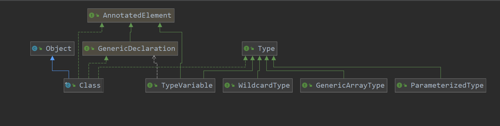

## 前言

java的类型系统在1.5之后就变的很复杂了。但是又极其重要因为java中的反射基于此。所以想要深入理解反射还需要简单地学习一下java的类型系统。首先我们简要说明一下在逻辑上java的type分类。然后再在实现层次上简要了解一下java到底是如何实现的。

首先java是一个强类型语言,其任何一个变量、任何一个表达式都有类型。在Java中,总的分为~~两类~~三类(还有一个特殊的`null type`):

- primitive types:原始类型,分类`boolean type`和`numeric type`,后者又可以分为`integral types`和`floating-point types`。
  - integral types:包括`byte`、`short`、`int`、`long`、`float`、`char`
  - floating-point type:包括`float`和`double`
- reference types:包括`class types`、`interface types`、`array type`以及`type virables`
- special type:`null type`

>在java中,对象是类的实例或者是动态创建的数组,[参考](https://docs.oracle.com/javase/specs/jls/se8/html/jls-4.html#jls-4.3)

是的,数组也是一个对象。

---

**Extension：**

这里额外说一下`null type`,关键字`null`不是一个类型而是一个特殊的值,可以简答的认为null指向一个特殊的内存区域。我们不能声明一个为`null type`的引用,也不能将`null type`声明为类型参数,例如`List<null>`([参考](https://stackoverflow.com/questions/26632104/java-kinds-of-type-and-null-reference))。但是`null`却可以强转为任何类型的引用,转换结果为目标类型的空引用,[参考](https://docs.oracle.com/javase/specs/jls/se7/html/jls-5.html#jls-5.2)

>A value of the null type (the null reference is the only such value) may be assigned to any reference type, resulting in a null reference of that type.

最后,`null type`不是一个引用类型。

---

### Reference Types

下面的一段代码使用了四种引用类型(摘自[jse8规范](https://docs.oracle.com/javase/specs/jls/se8/html/jls-4.html#jls-4.3)):

``` java
class Point<T> {
    int[] metrics;
    T variables;
}
interface Move { void move(int deltax, int deltay); }
```

其中,`Point`是一个`class type`(翻译成类类型好难受...),`int[]`是一个`array type`,`Move`是一个`interface type`,`T`是一个`type variable`。前三种都很好理解,最后一个`type variable`值得一提。

在jse8规范中,`type variable`被定义为一个唯一的符号在类、接口、方法、构造函数中作为一个type。所以这个`type variable`只能在上面四个地方使用。引入`type variable`的原因是因为在泛型类、泛型接口、泛型构造函数、泛型方法中定义了类型参数。

所以,很好理解,`type variable`就是泛型中`<T>`中的T。注意,`type`


`Type`接口是java中type信息的顶级接口。主要有五种type,分别是:

- `raw types`:原始类型,使用对应类型的Class对象表示
- `primitive types`:基本类型,使用对应类型的Class对象表示
- `parameterized types`:参数类型,基于接口`ParameterizedTypes`,对应实现类为`ParameterizedTypesImpl`
- `array types`:泛型数组类型,基于接口`GenericArrayType`,对应实现类为`GenericArrayTypeImpl`
- `type variables`:类型变量,基于接口`TypeVariable`,对应实现类为`TypeVariableImpl`
- `WildcardType`:通配符类型,基于接口`WildcardType`,对应实现类为`WildcardTypeImpl`

其中`ParameterizedTypes`、`GenericArrayType`、`TypeVariable`、`WildcardType`这四个接口是`Type`接口的子接口。继承图如下所示:



可以看到,`Class`类是`Type`接口的子类。

下面来一一解释一下四种子接口的含义。

## 0x0 ParameterizedType

`ParameterizedType`翻译过来就是参数化类型,emm。应该就是将类型参数化,这是引入泛型(Generic)的必然结果。例如我们常用的`List<Integer>`,这一个完整的带`<>`的类型就叫做参数化类型。下面解释了raw type于parameterized type之间的关系。
- parameterized type:`List<Integer>`
- raw type:`List`
- parameter:`Integer`
- genric type:`List<T>`

## 0x1 GenericArrayType


## 0x2 WildcardType


## 0x3 GenericArrayType
