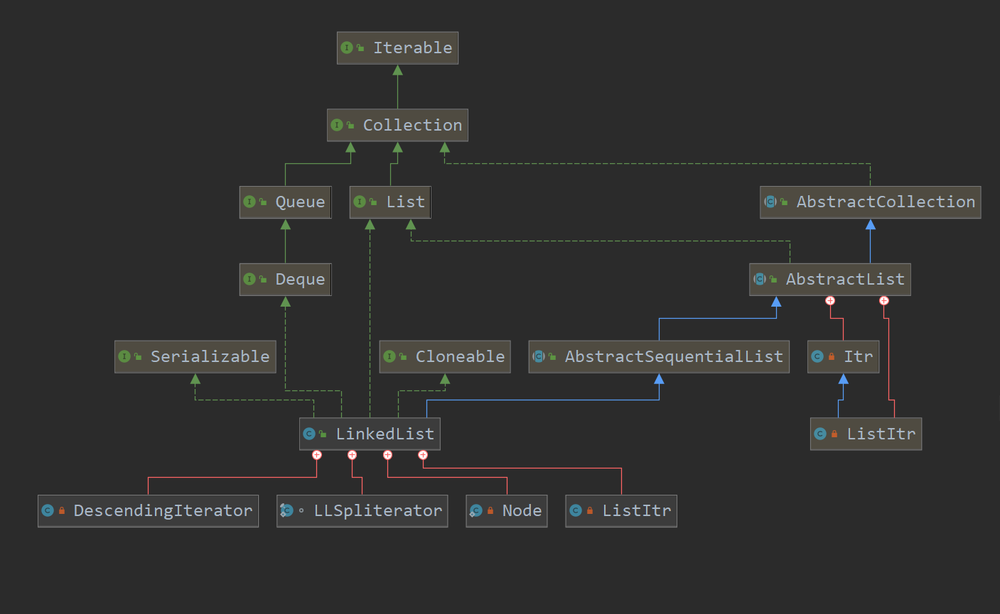

`LinkedList`弥补了`ArrayList`插入元素慢的缺点,当然也带了查找元素慢的缺点。`LinkedList`同时实现了`List`和`Queue`接口,其底层采用双向链表实现。当然`LinkedList`也有一个父类`AbstractSequentialList`用于实现一般的方法。下面是`LinkedList`的继承图:



可以看到`LinkedList`实现了`Cloneable`、`Serializable`接口,当然也是其`clone()`实现的也是shadow copy(浅拷贝)。并且`LinkedList`支持序列化。

## 0x0 LinkedList的属性

`LinkedList`的属性非常简单,就三个:

- 链表长度
- 链表头指针
- 链表尾指针

``` java
transient int size = 0;

    //双向链表的头指针
    transient Node<E> first;
    //双向链表的尾指针
    transient Node<E> last;

    //链表的节点定义
    //非常简单,前向和后向指针,再加一个数据项
    private static class Node<E> {
        E item;
        Node<E> next;
        Node<E> prev;

        Node(Node<E> prev, E element, Node<E> next) {
            this.item = element;
            this.next = next;
            this.prev = prev;
        }
    }

```

## 0x1 LinkedList的构造方法

`LinkedList`的构造方法就两,一个是不带参的构造方法,另一个是使用集合初始化的构造函数。

``` java

    public LinkedList() {
    }

    public LinkedList(Collection<? extends E> c) {
        this();
        //addAll函数应该跟ArrayList差不多
        addAll(c);
    }
```

## 0x2 LinkedList的重要方法

### 增

因为`LinkedList`同时实现了`List`和`Queue`接口,势必有一大堆`addXXX`、`offerXXX`、`removeXXX`、`pollXXX`方法。实现都非常简单,这里挑一些内部方法看看。

比如`offerLast()`方法内部调用`linkLast()`方法:

``` java
/**
     * Links e as last element.
     */
    void linkLast(E e) {
        final Node<E> l = last;
        final Node<E> newNode = new Node<>(l, e, null);
        last = newNode;
        if (l == null)
            first = newNode;
        else
            l.next = newNode;
        size++;
        modCount++;
    }
    void linkFirst(){
        ...
    }

    //在指定节点之前插入
    void linkBefore(E e, Node<E> succ) {
        ...
    }
```

这里的`modCount`和`ArrayList`中的`modCount`差不多,每当对`LinkedList`做出结构性改变时,就会改变modCount。当然`LinkedList`也是线程不安全的,也同时实现了fast-fail机制。

回到主题,`linkLast`就是把新节点链到双向链表末尾。`linkFirst`当然同理咯。

### 删

删除头尾的方法也非常简单,没有什么特别值得关注：

``` java
//移除头节点
private E unlinkFirst(Node<E> f) {
    // assert f == first && f != null;
    final E element = f.item;
    final Node<E> next = f.next;
    f.item = null;
    f.next = null; // help GC
    first = next;
    if (next == null)
        last = null;
    else
        next.prev = null;
    size--;
    modCount++;
    return element;
}

//移除尾节点
private E unlinkLast(Node<E> l) {

}

//指定移除某节点
E unlink(Node<E> x) {

}
```

### 查

在增和删的方法中我们都看到了,在指定某节点前插入、删除某个指定节点。那么这个指定是怎么获取的?

当然`LinkedList`还是贴心的实现了查找某个位置的节点:

``` java
public E get(int index) {
    //检查下标是否越界
    checkElementIndex(index);
    //获取指定位置的node的value
    return node(index).item;
}

private void checkElementIndex(int index) {
    if (!isElementIndex(index))
        throw new IndexOutOfBoundsException(outOfBoundsMsg(index));
}
private boolean isElementIndex(int index) {
    return index >= 0 && index < size;
}
//可以看出,node只在第一次找位置时使用了一次二分,
//然后使用for循环遍历一半元素,是非常慢的
Node<E> node(int index) {
    // assert isElementIndex(index);

    if (index < (size >> 1)) {
        Node<E> x = first;
        for (int i = 0; i < index; i++)
            x = x.next;
        return x;
    } else {
        Node<E> x = last;
        for (int i = size - 1; i > index; i--)
            x = x.prev;
        return x;
    }
}

```

## 0x3 小结

因为之前分析过了`ArrayList`与`ArrayDeque`,再来分析`LinkedList`就比较简单了。

- `LinkedList`虽然插入元素非常快,但是都快在头尾插入。如果在中间插入,就需要找到某一位置的节点,而插入操作又是非常慢的。
- 因为`LinkedList`没有实现`RandomAccess`接口,所以使用它实现的迭代器或者for-each遍历都比普通的for循环快。并且在遍历时不允许对`LinkedList`做出结构性改变,除非使用它自己的迭代器来改变。
- `LinkedList`是线程不安全的,支持fast-fail机制


