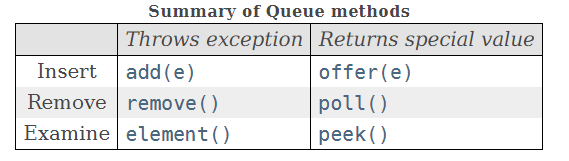

## 0x1 基本概念

`Queue`接口继承自超级接口`Collection`,其不仅实现了`Coolection`中的基本方法,而且额外增加了适用于队列的增、删、差方法。并且对应这三种操作,Queue提供了两套方法,一套在操作失败时抛出异常,另一套在操作失败时返回`null`,不过在文档中说到:
>The latter form of the insert operation is designed specifically for use with capacity-restricted Queue implementations

说是后者是专门为容量有限的队列而设计的,why?这点不是很懂。

两组方法如下图所示:



## 0x2 抽象类AbstractQueue

当然,跟`Collection`接口差不多,`Queue`也有一个抽象类用于实现一般的方法:

``` java "AbstractQueue"

public abstract class AbstractQueue<E>
    extends AbstractCollection<E>
    implements Queue<E> {
    ...
    }
```

可以看到,因为`Queue`本身就继承自`Clooection`,所以`AbstractQueue`的实现继承自`AbstractClloection`没有任何异议吧。当然为了实现了Queue的特有方法,也实现了接口`Queue`。下面简单分析一下`offer()`方法。

``` java
public boolean add(E e) {
    if (offer(e))
        return true;
    else
        throw new IllegalStateException("Queue full");
}
```
add在内部调用了offer,所以用谁不用我多说了吧。不过一开始我看到写法还是一愣,这`offer()`方法的实现在哪啊?

后来一想,抽象类不一定要实现嘛,把这个方法留到子类去实现也行奥。


## 0x3 Deque接口

Deque就是`double ended queue`,也就是所谓的双端队列,什么是双端队列我就不说了,来看看其规定的抽象方法:

``` java "Deque"
/*
 * ORACLE PROPRIETARY/CONFIDENTIAL. Use is subject to license terms.
 *
 *
 *
 *
 *
 *
 *
 *
 *
 *
 *
 *
 *
 *
 *
 *
 *
 *
 *
 *
 */

/*
 *
 *
 *
 *
 *
 * Written by Doug Lea and Josh Bloch with assistance from members of
 * JCP JSR-166 Expert Group and released to the public domain, as explained
 * at http://creativecommons.org/publicdomain/zero/1.0/
 */

package java.util;

/**
 * A linear collection that supports element insertion and removal at
 * both ends.  The name <i>deque</i> is short for "double ended queue"
 * and is usually pronounced "deck".  Most {@code Deque}
 * implementations place no fixed limits on the number of elements
 * they may contain, but this interface supports capacity-restricted
 * deques as well as those with no fixed size limit.
 *
 * <p>This interface defines methods to access the elements at both
 * ends of the deque.  Methods are provided to insert, remove, and
 * examine the element.  Each of these methods exists in two forms:
 * one throws an exception if the operation fails, the other returns a
 * special value (either {@code null} or {@code false}, depending on
 * the operation).  The latter form of the insert operation is
 * designed specifically for use with capacity-restricted
 * {@code Deque} implementations; in most implementations, insert
 * operations cannot fail.
 *
 * <p>The twelve methods described above are summarized in the
 * following table:
 *
 * <table BORDER CELLPADDING=3 CELLSPACING=1>
 * <caption>Summary of Deque methods</caption>
 *  <tr>
 *    <td></td>
 *    <td ALIGN=CENTER COLSPAN = 2> <b>First Element (Head)</b></td>
 *    <td ALIGN=CENTER COLSPAN = 2> <b>Last Element (Tail)</b></td>
 *  </tr>
 *  <tr>
 *    <td></td>
 *    <td ALIGN=CENTER><em>Throws exception</em></td>
 *    <td ALIGN=CENTER><em>Special value</em></td>
 *    <td ALIGN=CENTER><em>Throws exception</em></td>
 *    <td ALIGN=CENTER><em>Special value</em></td>
 *  </tr>
 *  <tr>
 *    <td><b>Insert</b></td>
 *    <td>{@link Deque#addFirst addFirst(e)}</td>
 *    <td>{@link Deque#offerFirst offerFirst(e)}</td>
 *    <td>{@link Deque#addLast addLast(e)}</td>
 *    <td>{@link Deque#offerLast offerLast(e)}</td>
 *  </tr>
 *  <tr>
 *    <td><b>Remove</b></td>
 *    <td>{@link Deque#removeFirst removeFirst()}</td>
 *    <td>{@link Deque#pollFirst pollFirst()}</td>
 *    <td>{@link Deque#removeLast removeLast()}</td>
 *    <td>{@link Deque#pollLast pollLast()}</td>
 *  </tr>
 *  <tr>
 *    <td><b>Examine</b></td>
 *    <td>{@link Deque#getFirst getFirst()}</td>
 *    <td>{@link Deque#peekFirst peekFirst()}</td>
 *    <td>{@link Deque#getLast getLast()}</td>
 *    <td>{@link Deque#peekLast peekLast()}</td>
 *  </tr>
 * </table>
 *
 * <p>This interface extends the {@link Queue} interface.  When a deque is
 * used as a queue, FIFO (First-In-First-Out) behavior results.  Elements are
 * added at the end of the deque and removed from the beginning.  The methods
 * inherited from the {@code Queue} interface are precisely equivalent to
 * {@code Deque} methods as indicated in the following table:
 *
 * <table BORDER CELLPADDING=3 CELLSPACING=1>
 * <caption>Comparison of Queue and Deque methods</caption>
 *  <tr>
 *    <td ALIGN=CENTER> <b>{@code Queue} Method</b></td>
 *    <td ALIGN=CENTER> <b>Equivalent {@code Deque} Method</b></td>
 *  </tr>
 *  <tr>
 *    <td>{@link java.util.Queue#add add(e)}</td>
 *    <td>{@link #addLast addLast(e)}</td>
 *  </tr>
 *  <tr>
 *    <td>{@link java.util.Queue#offer offer(e)}</td>
 *    <td>{@link #offerLast offerLast(e)}</td>
 *  </tr>
 *  <tr>
 *    <td>{@link java.util.Queue#remove remove()}</td>
 *    <td>{@link #removeFirst removeFirst()}</td>
 *  </tr>
 *  <tr>
 *    <td>{@link java.util.Queue#poll poll()}</td>
 *    <td>{@link #pollFirst pollFirst()}</td>
 *  </tr>
 *  <tr>
 *    <td>{@link java.util.Queue#element element()}</td>
 *    <td>{@link #getFirst getFirst()}</td>
 *  </tr>
 *  <tr>
 *    <td>{@link java.util.Queue#peek peek()}</td>
 *    <td>{@link #peek peekFirst()}</td>
 *  </tr>
 * </table>
 *
 * <p>Deques can also be used as LIFO (Last-In-First-Out) stacks.  This
 * interface should be used in preference to the legacy {@link Stack} class.
 * When a deque is used as a stack, elements are pushed and popped from the
 * beginning of the deque.  Stack methods are precisely equivalent to
 * {@code Deque} methods as indicated in the table below:
 *
 * <table BORDER CELLPADDING=3 CELLSPACING=1>
 * <caption>Comparison of Stack and Deque methods</caption>
 *  <tr>
 *    <td ALIGN=CENTER> <b>Stack Method</b></td>
 *    <td ALIGN=CENTER> <b>Equivalent {@code Deque} Method</b></td>
 *  </tr>
 *  <tr>
 *    <td>{@link #push push(e)}</td>
 *    <td>{@link #addFirst addFirst(e)}</td>
 *  </tr>
 *  <tr>
 *    <td>{@link #pop pop()}</td>
 *    <td>{@link #removeFirst removeFirst()}</td>
 *  </tr>
 *  <tr>
 *    <td>{@link #peek peek()}</td>
 *    <td>{@link #peekFirst peekFirst()}</td>
 *  </tr>
 * </table>
 *
 * <p>Note that the {@link #peek peek} method works equally well when
 * a deque is used as a queue or a stack; in either case, elements are
 * drawn from the beginning of the deque.
 *
 * <p>This interface provides two methods to remove interior
 * elements, {@link #removeFirstOccurrence removeFirstOccurrence} and
 * {@link #removeLastOccurrence removeLastOccurrence}.
 *
 * <p>Unlike the {@link List} interface, this interface does not
 * provide support for indexed access to elements.
 *
 * <p>While {@code Deque} implementations are not strictly required
 * to prohibit the insertion of null elements, they are strongly
 * encouraged to do so.  Users of any {@code Deque} implementations
 * that do allow null elements are strongly encouraged <i>not</i> to
 * take advantage of the ability to insert nulls.  This is so because
 * {@code null} is used as a special return value by various methods
 * to indicated that the deque is empty.
 *
 * <p>{@code Deque} implementations generally do not define
 * element-based versions of the {@code equals} and {@code hashCode}
 * methods, but instead inherit the identity-based versions from class
 * {@code Object}.
 *
 * <p>This interface is a member of the <a
 * href="{@docRoot}/../technotes/guides/collections/index.html"> Java Collections
 * Framework</a>.
 *
 * @author Doug Lea
 * @author Josh Bloch
 * @since  1.6
 * @param <E> the type of elements held in this collection
 */
public interface Deque<E> extends Queue<E> {
    
    void addFirst(E e);

  
    void addLast(E e);


    boolean offerFirst(E e);


    boolean offerLast(E e);


    E removeFirst();


    E removeLast();


    E pollFirst();

 
    E pollLast();

 
    E getFirst();


    E getLast();


    E peekFirst();

 
    E peekLast();


    boolean removeFirstOccurrence(Object o);


    boolean removeLastOccurrence(Object o);

    // *** Queue methods ***

    boolean add(E e);

 
    boolean offer(E e);

    E remove();


    E poll();


    E element();


    E peek();


    // *** Stack methods ***

 
    void push(E e);


    E pop();


    // *** Collection methods ***

  
    boolean remove(Object o);


    boolean contains(Object o);


    public int size();


    Iterator<E> iterator();


    Iterator<E> descendingIterator();

}

```