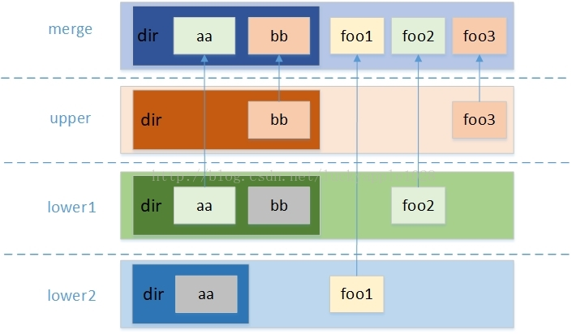
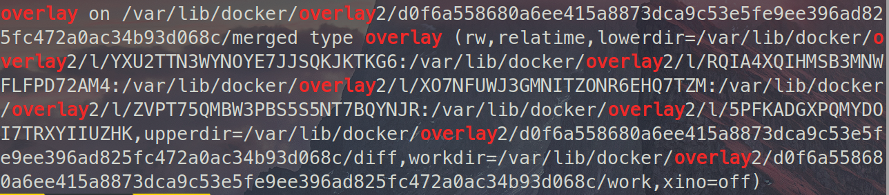

## 前言

一定要将登录用户切换为root才能查看Docker的文件架构！！！

## 0x0 基本文件布局

Docker的文件主要都存储在`/var/lib/docker`目录下,文件目录如下所示:

其中`containers`存储的是容器,`images`存储的是镜像。在深入了解Docker的原理之前,我们需要了解两个基本名词:

- overlayFS
- overlay2

## 0x1 overlayFS

其中overlayFS是一种类似于aufs的文件堆叠系统,但是比aufs更快。本质上来说,overlayFS是属于linux内核驱动的一部分。

overlayFS依赖于已有的底层文件系统,它并不实际参与硬盘的分区。而是将一些底层文件系统的文件合并,给不同的用户呈现不同的文件,实现了相同文件复用的功能,提高了空间使用率。下面一张图很好的解释了overlayFS的[基本工作原理](https://blog.csdn.net/luckyapple1028/article/details/77916194):

overlayFS分为四个部分:

- lower dir:挂载时最多支持500个lower dir
- upper dir
- merge dir
- work dir:用于存放文件系统挂载后产生的临时和简介文件,内容对用户不可见

其中的lower dir和upper dir来自底层文件系统,可以由用户自行指定。其中merge dir就是overlayFS的挂载点。并且overlayFS有如下特点:

- 如果lower和upper中有同名的目录或文件,会在merge中合并为同一个文件夹,并且upper会覆盖掉lower中的文件与目录。
- 如果有多个lower存在同名文件,那么使用层次较高的lower dir的同名文件
- lower dir是**只读**的
- upper dir是**可读可写**的
- overlayFS具有copy-up的特性。也就是如果想对lower dir中的文件进行写入,只能将文件拷贝至upper dir,然后再对拷贝后的文件进行写入。

### 0x1-1 overlayFS的挂载

overlayFS的基本用法可以参考[官网](https://wiki.archlinux.org/index.php/Overlay_filesystem)。下面是我参照[overlayFS的基本使用](https://blog.csdn.net/luckyapple1028/article/details/78075358)做的一个复现。

首先需要创建lower、upper、work、merge这四类目录,文件树如下所示:

首先对各个dir下的文件写入标记:

然后对各个foo文件写入标记:

最后执行挂载命令:

> sudo mount -t overlay overlay -o lowerdir=lower1:lower2,upperdir=upper,workdir=work merge

注意`workdir`和`merge`之间是没有`,`的。`lowerdir`后面的目录是有顺序的,排在前面的lower dir在lower这个层次中的排名就较前,也就是如开头部分的图片所示:

挂载后merge目录下的结构如下:

最后在merge目录中的`aa`文件来自`lower1`,`bb`文件来自`upper`。`foo`文件来自`lower`与`upper`。如下图所示：

可以看到确实将同名的底层文件都隐藏了起来。

### 0x1-2 overlayFS的写入操作

upper dir是一个可读可写层,而lower dir是只读层。所以如果我们想要写入的文件来自upper dir,那就是直接写入,在此就不举例说明了;如果来自lower dir,就会先将文件复制到upper再写入。这就是所谓的copy-up特性。

下图是在上述文件挂载完成后向来自`lower1/dir/`的`aa`写入文件:

可以看到,我们在挂载点向lower层的文件写入内容后,upper层直接复制了了`lower1/dir/aa`,并直接追加写入的内容。而`lower1/dir/aa`本身的内容的却没有改变。

### 0x1-3 overlayFS的删除操作

overlayFS中的删除并不是真正的删除,它只是使用了一个障眼法-**whiteout**文件来覆盖同名文件,让用户以为已经把文件删除了。

>whiteout文件并非普通文件，而是主次设备号都为0的字符设备（可以通过"mknod <name> c 0 0"命令手动创建）

>并且whiteout文件再merge层不可见。达到了隐藏文件的目的

删除操作分为三个场景：

- 要删除的文件/文件夹没有覆盖,仅来自upper层,那么直接删除就好
- 删除的文件/文件来自lower层,upper层中不存在,那么会在merge层和upper中生成同名的**whiteout**文件,用于屏蔽底层文件

&nbsp;&nbsp;&nbsp;&nbsp;&nbsp;&nbsp;&nbsp;&nbsp;如下图所示,其中upper在进行删除操作前为空目录：

- 要删除的文件来自lower层,upper中存在覆盖,那么会在merge层和upper层生成同名的**whiteout**文件,用于屏蔽底层文件。

&nbsp;&nbsp;&nbsp;&nbsp;&nbsp;&nbsp;&nbsp;&nbsp;原始文件结构如下:

&nbsp;&nbsp;&nbsp;&nbsp;&nbsp;&nbsp;&nbsp;&nbsp;删除后的upper目录如下:

这也就是docker中,虽然在container layer(upper)中删除了许多东西,但是image layer(lower)还是没有变小的原因。

这就是所谓的堆叠文件系统。详细介绍请移步:

- [overlayFS的基本介绍](https://blog.csdn.net/luckyapple1028/article/details/77916194)
- [overlayFS的基本使用](https://blog.csdn.net/luckyapple1028/article/details/78075358)

## 0x2 overlay2

docker为overlayFS提供了了两个存储驱动,一个是原始的overlay,另外一个就是现在新版的overlay2。所以docker自然也采用了堆叠的方式存储镜像。

这里以拉取最新的ubuntu images为例,可以看到,拉取的镜像为4层:

在overlay2目录下出现了五个目录,其中四个为拉取的镜像,额外的目录为`l`。它存放的是对应镜像的软符号链接。为什么需要设置软符号链接?

>因为虽然在overlayFS中用户指定的lowerdir最多可以支持500层。但是由于mount的挂载选项最多支持1个内存page的输入（默认大小为4KB），所以如果指定的lowerdir数量较多且长度较长，会有溢出而导致挂载失败的风险（目前内核的-o挂载选项不支持超过1个内存页，即4KB大小）。

所以设置软符号链接就是防止挂载失败,并且还能多挂载几个lower dir。每个软符号链接下的都会存在一个`diff`目录。接来看看看各个image layer中的内容:

其中每个image layer中的**diff文件夹存放了当前image layer的内容**, link文件的内容是当前层对应的短符号链接,lower文件夹存放了当前层的所有下层`lower dir`的id。可以看到,id为`9045`的image layer没有`lower`,即`9045`就是最底层的image layer(这会在后面验证)。work目录用于挂载时的工作目录。

那么这些这些目录是怎么和镜像关联起来的呢？答案是通过元数据进行关联。元数据又分为image元数据和layer数据。

### 0x2-1 image元数据

image元数据存储在`/var/lib/docker/image/<storage_driver>/imagedb/content/sha256/`目录,文件名称是对应的iamge id,如下所示:

该文件以json格式保存了该image的重要信息,其中`rootfs`值得关注,因为它指定了各个image layer的工作顺序。查看文件内容时可以将其格式化为json:(`使用vim :%!python -m json.tool格式化成json`),其中`rootfs`的内容如下:

其中的diff_ids是有严格顺序的,从上到下,表示image layer的最底层到最高层id。顺序是反的是因为如果产生了新的image layer直接在最后面追加即可,非常方便。

那么image是又如何关联到layer的呢？docker是通过image元数据中的diff_id与一些历史信息计算出chainID关联到layer元数据,layer元数据再关联到对应的image layer。

### 0x2-2 layer元数据

在`/var/docker/<storage_driver>/image/layerdb/sha256`中,有四个目录,其中每个目录的数字就是每个diff_id对应的chainID。可以看到,只有最底层的`ce30`能在layerdb中找到对应的chainID,那是因为最底层的diff_id和chainID是相同的。所以除去最底层,剩下的chainID需要计算,这里不做演示。

每个chainID目录都有三个共同的文件`cache-id`、`diff`、`size`,而有的没有`parent`。下面一一解析下各个文件的内容。

### cache-id

刚才说到layerdb保存的毕竟是元数据,那么这些元数据到底是怎么和具体数据链接起来呢?其中的`cache-id`是关键。

我们查看`ce30`的`cache-id`文件内容:

docker随机生成的uuid，内容是保存image layer的目录索引。其中的id为`9045`就是刚才拉取的`ubuntu`镜像中的最底层image layer。说明没有`lower`目录的image layer就是在最底层。

####size

size文件表示当前chainID对应的image layer的大小。

#### diff

保存了当前chainID对应的diff_id。

#### parent

这里的parent保存的是在`rootfs`中:位置较下的diff_id的上一个diff_id的chainID。

比如说chainID为`2515`的image layer。我们首先在diff中查看其对应的diff_id。

其对应的diff_id为`8eeb`。再来查看其`parent`文件:

而在`rootfs`中,`8eeb`的上一个diff_id对应的chainID就是`ce30`(因为第一个位置的diff_id与chainID相同)。

### 0x2-3 overlay2的挂载

挂载的信息存储在`/var/lib/docker/image/layerdb/mounts`目录下,每个目录名称就是对应的容器ID,如下图所示:

`mounts`只有一个目录,对应于一个正在运行的容器。每个容器ID目录下存在三个文件。init-id对应当前挂载的容器的init层,mount-id就是对应的容器层(merge目录)。而parent文件还是存储位置在当前layer在`rootfs`上一个的diff_id的chainID。

三个文件的内容如下:

可以看到,`parent`中的内容为`sha256:7515`,而该chainID对应的diff_id就是`0956`。

最后查看以下`/var/lib/docker/overlays/`目录:

看到多了init层与container层。

关于init layer的[作用](https://stackoverflow.com/questions/33697774/init-layer-in-docker):

>Each containers has two layers, one (called the init layer), which is based on an image layer and a child of that which contains the actual container content. The init layer contains a few files that must always exist in Docker containers (e.g. /.dockerinit). Supported Filesystems

简单来说就是帮我们对容器进行必要的初始化,避免我们自己初始化错误或者根本就忘掉。初始化的目录或文件如下:

>The containerID-init layer is the init layer of a container which is based on an image. It add some file into current container,include:
    "/dev/pts":         "dir",
    "/dev/shm":         "dir",
    "/proc":            "dir",
    "/sys":             "dir",
    "/.dockerenv":      "file",
    "/etc/resolv.conf": "file",
    "/etc/hosts":       "file",
    "/etc/hostname":    "file",
    "/dev/console":     "file",
    "/etc/mtab":        "/proc/mounts",

**注意:init layer是一个只读层。**

最后以上述的四层ubuntu image为例,将iamgedb、layerdb、image layer、init layer、contain layer联合到一起。

可以看到和挂载命令基本一致:

其中挂载都是使用的符号链接,upper就是diff目录,work目录与diff目录同级。

### 0x2-4 overlay2的删除操作

删除分为删除image与删除container。

- 删除container:首先需要停止想要删除的容器:`docker stop [container ID]`,然后删除容器:`docker rm [container ID]`
- 删除image:在删除image前,一定要删除container,完成上述步骤后,直接`docker rmi [image id]`即可。

## 0x3 小结

1. docker在每次创建容器时都会自动添加一个init layer对容器进行初始化,添加contain layer面向用户。并且每次默认启动的容器都是不相同的。

2. docker对于每种文件驱动,都会在`docker/image`下创建同名文件以保存元数据。docker通过imagedb、layerdb、关联到具体的image layer。

## 参考文献

1. [docker 存储驱之overlayFS](https://blog.51cto.com/haoyonghui/2457915)

2. [深入理解overlayfs（一）：初识](https://blog.csdn.net/luckyapple1028/article/details/77916194)

3. [深入理解overlayfs（二）：使用与原理分析](https://blog.csdn.net/luckyapple1028/article/details/78075358)

4. [Docker镜像存储-overlayfs](https://www.cnblogs.com/sammyliu/p/5877964.html)

5. [docker一站式学习](https://www.cnblogs.com/sammyliu/p/5877964.html)

